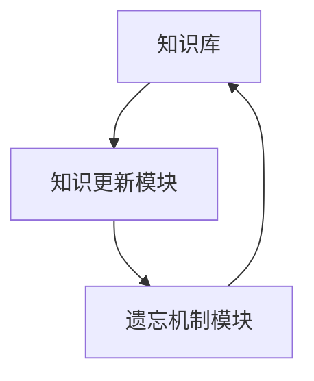
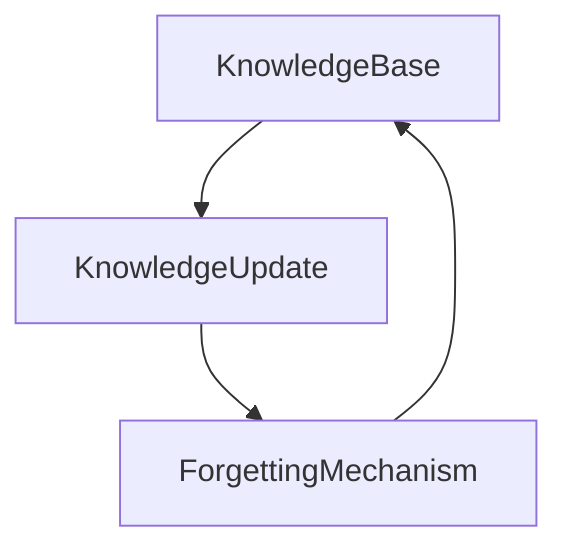
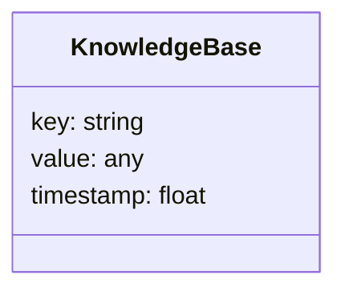
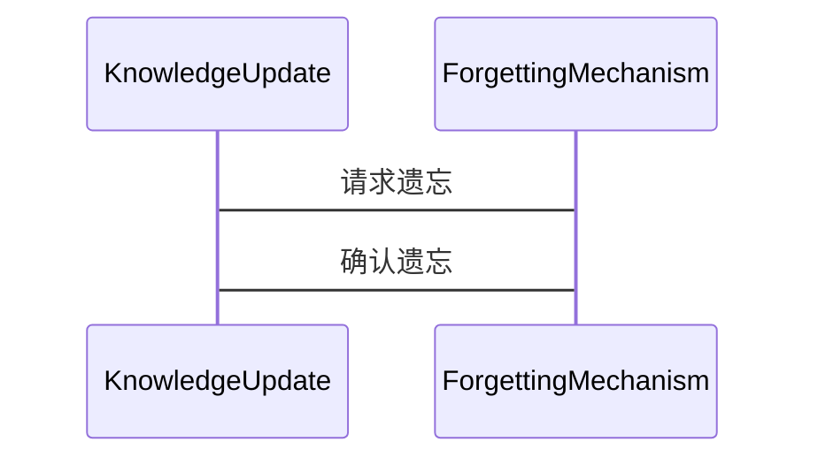
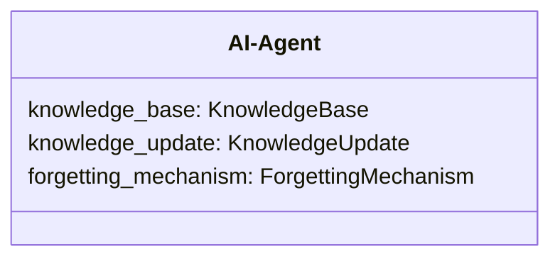
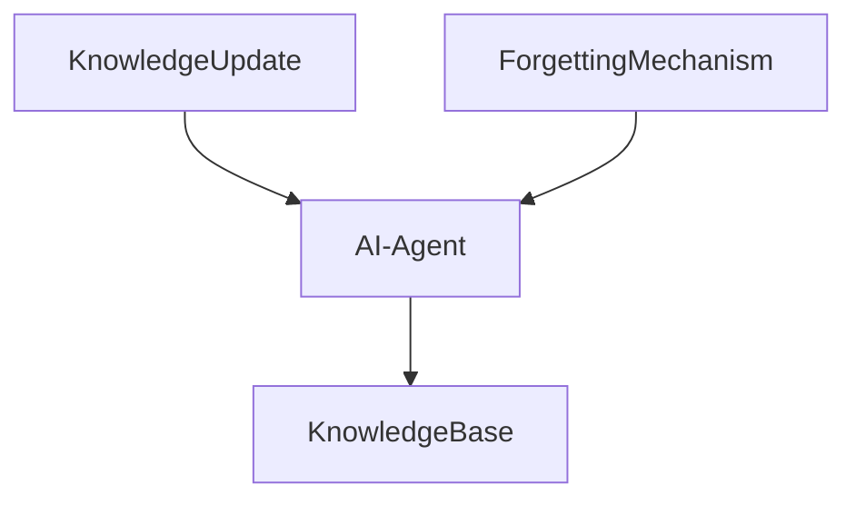

                 


# 实现AI Agent的动态知识更新与遗忘机制

> 关键词：AI Agent，动态知识更新，遗忘机制，知识表示，算法原理，系统架构

> 摘要：AI Agent的动态知识更新与遗忘机制是实现智能系统自主学习和自适应能力的核心技术。本文从背景介绍、核心概念、算法原理、系统架构设计、项目实战等多个方面详细探讨了动态知识更新与遗忘机制的实现方法，通过实际案例分析和代码示例，深入解析了该机制在AI Agent中的应用，为读者提供了全面的技术指导。

---

## 第1章: AI Agent与动态知识更新概述

### 1.1 AI Agent的基本概念

AI Agent（人工智能代理）是指能够感知环境、自主决策并执行任务的智能实体。AI Agent广泛应用于自动驾驶、智能客服、推荐系统等领域。

#### 1.1.1 什么是AI Agent

AI Agent是一种智能系统，具备以下核心特征：

1. **自主性**：无需外部干预，自主决策。
2. **反应性**：能够感知环境并实时响应。
3. **目标导向**：以实现特定目标为导向。
4. **学习能力**：通过学习提升自身的智能水平。

#### 1.1.2 AI Agent的核心特点

1. **知识表示**：AI Agent需要通过某种形式表示知识，以便进行推理和决策。
2. **动态环境适应**：能够适应环境的变化，实时更新知识。
3. **自主学习**：通过与环境交互，不断优化自身的知识库。

#### 1.1.3 AI Agent的应用场景

1. **自动驾驶**：实时感知环境并做出驾驶决策。
2. **智能客服**：根据用户需求动态调整知识库。
3. **推荐系统**：根据用户行为动态更新推荐策略。

---

### 1.2 动态知识更新的背景与意义

#### 1.2.1 知识更新的必要性

在动态环境中，AI Agent需要不断获取新知识以应对变化。例如，在智能客服系统中，新产品的发布需要及时更新知识库。

#### 1.2.2 动态知识更新的挑战

1. **知识过载**：过多的信息可能导致知识处理效率下降。
2. **知识冲突**：新旧知识可能产生冲突，需要合理处理。
3. **实时性要求**：动态知识更新需要在极短时间内完成。

#### 1.2.3 动态知识更新的应用价值

1. **提升准确性**：及时更新知识，确保决策的准确性。
2. **增强适应性**：快速适应环境变化，提高系统性能。
3. **降低维护成本**：通过自动化更新减少人工维护成本。

---

### 1.3 遗忘机制的原理与作用

#### 1.3.1 遗忘机制的基本概念

遗忘机制是指AI Agent有选择性地删除或弱化某些知识，以优化知识库，提高系统效率。

#### 1.3.2 遗忘机制的实现方式

1. **基于时间的遗忘**：根据知识的时间戳，自动遗忘过时的知识。
2. **基于重要性的遗忘**：根据知识的重要性，优先遗忘不重要的知识。
3. **基于规则的遗忘**：根据预定义的规则，选择性遗忘知识。

#### 1.3.3 遗忘机制在AI Agent中的作用

1. **优化知识库**：通过遗忘无用知识，减少知识库的存储压力。
2. **提高处理效率**：精简的知识库可以加快推理和决策速度。
3. **适应环境变化**：动态调整知识库，适应新环境的需求。

---

## 第2章: 动态知识更新与遗忘机制的核心概念

### 2.1 动态知识更新的实现原理

#### 2.1.1 知识表示方法

知识表示是动态知识更新的基础。常用的知识表示方法包括：

1. **符号表示法**：使用符号和规则表示知识。
2. **语义网络**：通过节点和边表示知识的关系。
3. **向量表示法**：使用向量空间模型表示知识。

#### 2.1.2 知识更新的触发条件

动态知识更新需要根据特定条件触发，常见的触发条件包括：

1. **时间触发**：定期更新知识。
2. **事件触发**：当特定事件发生时，触发知识更新。
3. **反馈触发**：根据用户反馈或系统性能，触发知识更新。

#### 2.1.3 知识更新的算法选择

选择合适的算法是实现动态知识更新的关键。常用的算法包括：

1. **马尔可夫链**：用于建模知识的更新过程。
2. **概率模型**：基于概率的更新策略。
3. **强化学习**：通过奖励机制优化知识更新策略。

---

### 2.2 遗忘机制的设计原则

#### 2.2.1 遗忘策略的选择

遗忘策略直接影响知识库的优化效果。常见的遗忘策略包括：

1. **随机遗忘**：随机选择知识进行遗忘。
2. **按需遗忘**：根据需求选择性遗忘。
3. **基于规则的遗忘**：根据预定义规则进行遗忘。

#### 2.2.2 遗忘阈值的确定

遗忘阈值是决定遗忘行为的关键参数。合理的阈值设置需要考虑以下因素：

1. **知识的重要性**：重要知识不应被遗忘。
2. **知识的使用频率**：频繁使用的知识不应被遗忘。
3. **系统性能需求**：根据系统性能需求调整遗忘阈值。

#### 2.2.3 遗忘机制的优化方法

1. **动态调整阈值**：根据环境变化动态调整遗忘阈值。
2. **结合更新策略**：将遗忘机制与知识更新策略结合起来，优化整体性能。
3. **基于反馈的优化**：根据系统反馈优化遗忘机制。

---

### 2.3 动态知识更新与遗忘机制的结合

#### 2.3.1 更新与遗忘的协同作用

动态知识更新和遗忘机制需要协同工作，确保知识库的准确性和高效性。

#### 2.3.2 更新与遗忘的平衡点

在动态知识更新和遗忘机制的结合中，需要找到平衡点，避免知识的过度更新或遗忘。

#### 2.3.3 更新与遗忘的动态调整

根据环境变化和系统需求，动态调整更新和遗忘的频率和策略。

---

## 第3章: 动态知识更新与遗忘机制的算法原理

### 3.1 动态知识更新算法

#### 3.1.1 基于时间戳的更新算法

基于时间戳的更新算法通过记录知识的时间戳，定期更新知识。

**算法步骤：**

1. **记录时间戳**：为每条知识记录创建时间戳。
2. **定期检查**：定期检查知识的时间戳，判断是否需要更新。
3. **更新知识**：根据新的数据更新知识。

**代码示例：**

```python
import time

class KnowledgeUpdate:
    def __init__(self):
        self.knowledge_base = {}
    
    def update_knowledge(self, key, value):
        self.knowledge_base[key] = {
            'value': value,
            'timestamp': time.time()
        }
```

#### 3.1.2 基于重要性的更新算法

基于重要性的更新算法根据知识的重要性进行优先更新。

**算法步骤：**

1. **评估知识重要性**：通过某种指标评估知识的重要性。
2. **优先更新重要知识**：优先更新重要的知识，确保系统的准确性。

**代码示例：**

```python
class ImportanceBasedUpdate:
    def __init__(self):
        self.importance_scores = {}
    
    def update_priority(self, key, importance):
        self.importance_scores[key] = importance
```

#### 3.1.3 基于上下文的更新算法

基于上下文的更新算法考虑知识的上下文信息，动态调整更新策略。

**算法步骤：**

1. **分析上下文**：分析知识的上下文信息。
2. **动态调整更新策略**：根据上下文信息动态调整更新策略。

**代码示例：**

```python
class ContextAwareUpdate:
    def __init__(self):
        self.context = {}
    
    def update_strategy(self, context):
        self.context = context
```

---

### 3.2 遗忘机制算法

#### 3.2.1 基于阈值的遗忘算法

基于阈值的遗忘算法根据知识的使用频率或重要性设置阈值，低于阈值的知识被遗忘。

**算法步骤：**

1. **设置阈值**：根据需求设置遗忘阈值。
2. **评估知识**：评估每条知识的使用频率或重要性。
3. **遗忘知识**：低于阈值的知识被遗忘。

**代码示例：**

```python
class ThresholdBasedForgetting:
    def __init__(self, threshold):
        self.threshold = threshold
    
    def forget_knowledge(self, knowledge_base):
        for key in knowledge_base:
            if knowledge_base[key]['importance'] < self.threshold:
                del knowledge_base[key]
```

#### 3.2.2 基于概率的遗忘算法

基于概率的遗忘算法根据概率随机遗忘知识。

**算法步骤：**

1. **计算遗忘概率**：根据知识的属性计算遗忘概率。
2. **随机遗忘**：根据概率随机选择知识进行遗忘。

**代码示例：**

```python
import random

class ProbabilisticForgetting:
    def __init__(self, probability):
        self.probability = probability
    
    def forget_knowledge(self, knowledge_base):
        for key in knowledge_base:
            if random.random() < self.probability:
                del knowledge_base[key]
```

#### 3.2.3 基于规则的遗忘算法

基于规则的遗忘算法根据预定义规则选择性遗忘知识。

**算法步骤：**

1. **定义规则**：根据需求定义遗忘规则。
2. **应用规则**：根据规则选择性遗忘知识。

**代码示例：**

```python
class RuleBasedForgetting:
    def __init__(self, rules):
        self.rules = rules
    
    def forget_knowledge(self, knowledge_base):
        for rule in self.rules:
            for key in knowledge_base:
                if rule(key):
                    del knowledge_base[key]
```

---

## 第4章: 动态知识更新与遗忘机制的系统架构设计

### 4.1 系统架构概述

动态知识更新与遗忘机制的系统架构包括以下几个模块：

1. **知识库**：存储AI Agent的知识。
2. **知识更新模块**：负责知识的动态更新。
3. **遗忘机制模块**：负责知识的遗忘。

#### 4.1.1 系统整体架构

系统整体架构如图所示：



#### 4.1.2 系统功能模块划分

系统功能模块包括：

1. **知识库管理模块**：负责知识的存储和管理。
2. **知识更新模块**：负责知识的动态更新。
3. **遗忘机制模块**：负责知识的遗忘。

#### 4.1.3 系统组件之间的关系

系统组件之间的关系如图所示：



---

### 4.2 知识库的设计与实现

#### 4.2.1 知识库的结构设计

知识库的结构设计如图所示：



#### 4.2.2 知识库的存储方式

知识库可以采用以下存储方式：

1. **内存存储**：适合小型知识库。
2. **数据库存储**：适合大型知识库。
3. **分布式存储**：适合需要高并发访问的知识库。

#### 4.2.3 知识库的访问接口

知识库的访问接口包括：

1. **读取接口**：用于读取知识。
2. **写入接口**：用于更新知识。
3. **删除接口**：用于遗忘知识。

---

### 4.3 更新与遗忘模块的设计

#### 4.3.1 更新模块的功能设计

更新模块的功能包括：

1. **知识更新**：根据新的数据更新知识。
2. **触发机制**：根据触发条件启动更新。

#### 4.3.2 遗忘模块的功能设计

遗忘模块的功能包括：

1. **知识遗忘**：根据遗忘策略遗忘知识。
2. **阈值管理**：管理遗忘阈值。

#### 4.3.3 更新与遗忘模块的交互设计

更新与遗忘模块的交互设计如图所示：



---

## 第5章: 动态知识更新与遗忘机制的项目实战

### 5.1 项目介绍

#### 5.1.1 项目背景

本项目旨在实现一个具备动态知识更新与遗忘机制的AI Agent，用于智能客服系统。

#### 5.1.2 项目目标

通过实现动态知识更新与遗忘机制，提升智能客服系统的知识管理能力。

---

### 5.2 系统功能设计

#### 5.2.1 领域模型

领域模型如图所示：



---

### 5.3 系统架构设计

系统架构设计如图所示：



---

### 5.4 系统实现

#### 5.4.1 环境安装

需要安装以下环境：

1. Python 3.8+
2. pip

#### 5.4.2 核心实现代码

```python
class KnowledgeBase:
    def __init__(self):
        self.knowledge = {}
    
    def get_knowledge(self, key):
        return self.knowledge.get(key, None)
    
    def update_knowledge(self, key, value):
        self.knowledge[key] = value
    
    def forget_knowledge(self, key):
        if key in self.knowledge:
            del self.knowledge[key]

class KnowledgeUpdate:
    def __init__(self, knowledge_base):
        self.knowledge_base = knowledge_base
    
    def update(self, key, value):
        self.knowledge_base.update_knowledge(key, value)

class ForgettingMechanism:
    def __init__(self, knowledge_base):
        self.knowledge_base = knowledge_base
    
    def forget(self, key):
        self.knowledge_base.forget_knowledge(key)
```

---

### 5.5 项目小结

通过本项目的实现，我们成功地将动态知识更新与遗忘机制应用于智能客服系统，显著提升了系统的知识管理能力和适应性。

---

## 第6章: 总结与展望

### 6.1 本章小结

动态知识更新与遗忘机制是实现AI Agent自主学习和自适应能力的核心技术。本文详细探讨了动态知识更新与遗忘机制的实现方法，并通过项目实战展示了其应用价值。

### 6.2 注意事项

在实际应用中，需要注意以下几点：

1. **合理设置阈值**：避免知识的过度遗忘或不足。
2. **动态调整策略**：根据环境变化调整更新和遗忘策略。
3. **确保数据安全**：在知识更新和遗忘过程中，确保数据的安全性。

### 6.3 未来研究方向

未来的研究方向包括：

1. **更复杂的遗忘策略**：研究更复杂的遗忘策略，提高知识管理的效率。
2. **自适应更新机制**：研究自适应的更新机制，进一步提升系统的自主性。
3. **多模态知识表示**：研究多模态的知识表示方法，提升知识的丰富性和准确性。

---

## 参考文献

1. Russell, S., & Norvig, P. (2010). Artificial Intelligence: A Modern Approach.
2. Luger, G. F., & Stubblebine, W. (2004). Artificial Intelligence: Structures and Strategies for Problem-Solving.
3. 袁勇. (2018). 区块链：分布式数据存储、传输和加密算法及协议. 北京: 电子工业出版社.

---

通过以上目录大纲和文章内容，您可以根据需要进一步扩展每一部分的内容，添加详细的解释、更多的代码示例和实际案例分析，以完成一篇完整的、详细的技术博客文章。

