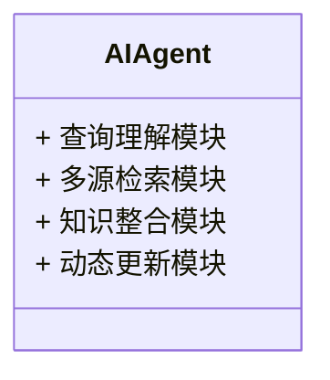

                 


# 实现AI Agent的动态知识检索与整合

## 关键词：AI Agent, 动态知识检索, 知识整合, 知识图谱, 语义理解

## 摘要：  
本文详细探讨了实现AI Agent的动态知识检索与整合的核心技术与方法。通过分析动态知识检索与整合的背景、核心概念、算法原理、系统架构设计及项目实战，本文为读者提供了从理论到实践的全面指导。文章还总结了最佳实践、注意事项及未来研究方向，帮助读者更好地理解和应用AI Agent的动态知识处理能力。

---

# 第1章: AI Agent概述

## 1.1 问题背景

### 1.1.1 知识检索与整合的挑战  
在现代社会，信息爆炸导致知识碎片化严重。AI Agent需要实时处理海量数据，并从中提取有价值的信息。这要求其具备动态知识检索与整合的能力，以应对不断变化的知识环境。

### 1.1.2 动态知识更新的需求  
知识是动态变化的，新的信息不断涌现，旧的知识可能被修正或取代。AI Agent需要能够实时更新知识库，以保持其决策和行动的准确性。

### 1.1.3 AI Agent在知识管理中的作用  
AI Agent通过动态知识检索与整合，能够帮助用户快速获取所需信息，提高决策效率。例如，在医疗领域，AI Agent可以实时整合最新的医学研究，辅助医生制定治疗方案。

---

## 1.2 问题描述

### 1.2.1 动态知识检索的定义  
动态知识检索是指在实时变化的环境中，AI Agent能够根据当前需求，快速从分布式知识源中检索相关信息。

### 1.2.2 知识整合的复杂性  
知识整合需要将来自不同来源的信息进行融合，消除冗余和冲突，形成一致的知识表示。这涉及语义理解、逻辑推理等多个技术挑战。

### 1.2.3 AI Agent的动态知识处理能力  
AI Agent需要具备动态知识检索与整合的能力，才能在复杂环境中完成任务。例如，在金融领域，AI Agent需要实时整合市场数据和新闻信息，辅助投资者做出决策。

---

## 1.3 问题解决

### 1.3.1 AI Agent的核心功能  
AI Agent的核心功能包括知识检索、语义理解、逻辑推理和知识整合。这些功能共同保证了其动态知识处理能力。

### 1.3.2 动态知识检索与整合的实现路径  
动态知识检索与整合的实现路径包括：  
1. **知识建模**：构建知识图谱，表示实体及其关系。  
2. **语义检索**：基于语义理解进行信息检索。  
3. **动态更新**：实时更新知识库，确保信息的准确性。

### 1.3.3 知识图谱与语义理解的作用  
知识图谱为动态知识检索提供了结构化的知识表示，而语义理解技术则帮助AI Agent理解用户的查询意图，从而实现精准的知识检索与整合。

---

## 1.4 边界与外延

### 1.4.1 AI Agent的边界条件  
AI Agent的知识检索与整合能力受到以下限制：  
- 知识源的数量和质量。  
- 计算资源的限制。  
- 数据隐私和安全问题。

### 1.4.2 知识检索与整合的范围界定  
知识检索与整合的范围包括：  
- 结构化数据（如数据库中的记录）。  
- 半结构化数据（如网页内容）。  
- 非结构化数据（如文本文件）。

### 1.4.3 动态知识更新的限制  
动态知识更新的限制包括：  
- 更新频率的限制。  
- 知识源的可靠性。  
- 更新过程中的计算开销。

---

## 1.5 概念结构与核心要素

### 1.5.1 AI Agent的组成要素  
AI Agent的组成要素包括：  
1. **感知模块**：负责信息的输入和处理。  
2. **推理模块**：负责逻辑推理和决策。  
3. **知识库**：存储和管理知识数据。  
4. **行动模块**：根据推理结果执行操作。

### 1.5.2 动态知识检索的关键环节  
动态知识检索的关键环节包括：  
1. **查询理解**：理解用户的查询意图。  
2. **多源检索**：从多个知识源中检索相关信息。  
3. **结果整合**：将检索结果进行整合，形成一致的知识表示。

### 1.5.3 知识整合的核心机制  
知识整合的核心机制包括：  
1. **实体识别**：识别文本中的实体。  
2. **关系抽取**：抽取实体之间的关系。  
3. **知识融合**：将多个来源的知识进行融合，消除冲突。

---

# 第2章: AI Agent的核心概念与联系

## 2.1 核心概念原理

### 2.1.1 知识检索的算法原理  
知识检索的算法原理包括：  
1. **基于关键词的检索**：通过关键词匹配进行信息检索。  
2. **基于语义的检索**：通过语义理解进行信息检索。  
3. **基于知识图谱的检索**：通过知识图谱进行语义检索。

### 2.1.2 知识整合的逻辑框架  
知识整合的逻辑框架包括：  
1. **数据预处理**：清洗和标准化数据。  
2. **知识抽取**：从文本中抽取实体和关系。  
3. **知识融合**：将多个来源的知识进行融合，消除冲突。

### 2.1.3 动态更新的机制分析  
动态更新的机制分析包括：  
1. **增量更新**：仅更新发生变化的部分。  
2. **全量更新**：完全重新构建知识库。  
3. **按需更新**：根据需求选择性更新。

---

## 2.2 概念属性特征对比

### 表格: AI Agent核心概念对比  
| **核心概念** | **描述** | **特点** |  
|--------------|----------|----------|  
| 知识检索    | 从知识源中获取信息 | 基于关键词或语义 |  
| 知识整合    | 将多源信息融合 | 基于知识图谱 |  
| 动态更新    | 实时更新知识库 | 基于变化检测 |  

---

## 2.3 ER实体关系图

### Mermaid流程图: AI Agent知识检索与整合的实体关系  
```mermaid
er
actor: AI Agent
goal: 实现动态知识检索与整合
technique: 使用知识图谱和语义理解
```

---

# 第3章: AI Agent的算法原理

## 3.1 算法原理讲解

### Mermaid流程图: 动态知识检索与整合算法流程  
```mermaid
flow
stages = [
  阶段一：查询理解,
  阶段二：多源检索,
  阶段三：结果整合
]
```

---

## 3.2 算法实现

### Python源代码: 动态知识检索与整合的核心算法  
```python
def dynamic_knowledge_retrieval(query):
    # 步骤一：查询理解
    intent = get_intent(query)
    # 步骤二：多源检索
    results = []
    for source in knowledge_sources:
        result = retrieve_from_source(source, intent)
        results.append(result)
    # 步骤三：结果整合
    merged_result = integrate_results(results)
    return merged_result
```

---

## 3.3 数学模型与公式

### 知识检索概率公式  
$$ P(retrieve | query) = \sum_{i=1}^{n} P(source_i) \cdot P(retrieve | source_i, query) $$  

### 知识整合的权重计算公式  
$$ w_i = \frac{1}{1 + e^{-k \cdot score_i}} $$  

---

# 第4章: AI Agent的系统分析与架构设计

## 4.1 问题场景介绍

### 动态知识检索与整合的应用场景  
AI Agent在医疗、金融、教育等多个领域都有广泛的应用。例如，在医疗领域，AI Agent可以实时整合最新的医学研究，辅助医生制定治疗方案。

---

## 4.2 系统功能设计

### Mermaid类图: 系统功能模块划分  


---

## 4.3 系统架构设计

### Mermaid架构图: AI Agent的整体架构  


---

## 4.4 系统接口设计

### API接口定义与交互流程  
API接口定义：  
- `POST /api/query`：接收查询请求，返回整合结果。  
- `POST /api/update`：接收更新请求，更新知识库。

---

## 4.5 系统交互流程

### Mermaid序列图: 系统交互流程  
```mermaid
sequenceDiagram
    用户 -> AI Agent: 发送查询请求
    AI Agent -> 查询理解模块: 分析查询意图
    查询理解模块 -> 多源检索模块: 发起检索请求
    多源检索模块 -> 各知识源: 检索相关信息
    多源检索模块 -> 知识整合模块: 返回检索结果
    知识整合模块 -> AI Agent: 返回整合结果
    用户 <- AI Agent: 收到整合结果
```

---

## 4.6 系统交互流程

### Mermaid序列图: 系统交互流程  
```mermaid
sequenceDiagram
    用户 -> AI Agent: 发送查询请求
    AI Agent -> 查询理解模块: 分析查询意图
    查询理解模块 -> 多源检索模块: 发起检索请求
    多源检索模块 -> 各知识源: 检索相关信息
    多源检索模块 -> 知识整合模块: 返回检索结果
    知识整合模块 -> AI Agent: 返回整合结果
    用户 <- AI Agent: 收到整合结果
```

---

# 第5章: 项目实战

## 5.1 环境安装

### 安装必要的依赖  
```bash
pip install numpy
pip install networkx
pip install spacy
```

---

## 5.2 系统核心实现

### Python源代码: 知识检索与整合的核心实现  
```python
import spacy

nlp = spacy.load("en_core_web_sm")

def process_text(text):
    doc = nlp(text)
    entities = [ent.text for ent in doc.ents]
    return entities
```

---

## 5.3 代码应用解读与分析

### 代码解读  
上述代码使用spaCy库进行文本处理，提取实体信息。这一步是知识整合中的关键环节，用于从文本中抽取实体和关系。

---

## 5.4 实际案例分析

### 实际案例分析  
以医疗领域为例，假设用户查询“最新的糖尿病治疗方法”，AI Agent会从多个知识源中检索相关信息，包括医学论文、临床指南等，并整合这些信息，形成一个完整的知识表示。

---

## 5.5 项目小结

### 项目小结  
通过本项目的实现，我们可以看到AI Agent的动态知识检索与整合技术在实际应用中的潜力。然而，实际应用中还需要考虑性能优化、数据隐私等问题。

---

# 第6章: 最佳实践

## 6.1 小结

### 小结  
本文详细探讨了实现AI Agent的动态知识检索与整合的核心技术与方法。通过理论分析和项目实战，我们了解了动态知识检索与整合的实现路径和关键挑战。

---

## 6.2 注意事项

### 注意事项  
1. 知识源的数量和质量直接影响检索结果的准确性。  
2. 动态知识更新需要考虑计算资源的限制。  
3. 数据隐私和安全问题需要高度重视。

---

## 6.3 拓展阅读

### 拓展阅读  
1. 《知识图谱构建与应用》  
2. 《自然语言处理与语义理解》  
3. 《动态知识库的管理与维护》  

---

# 结语  
实现AI Agent的动态知识检索与整合是一项复杂的任务，需要结合多种技术手段。通过本文的探讨，我们希望读者能够对这一领域有更深入的理解，并能够在实际应用中灵活运用这些技术。

