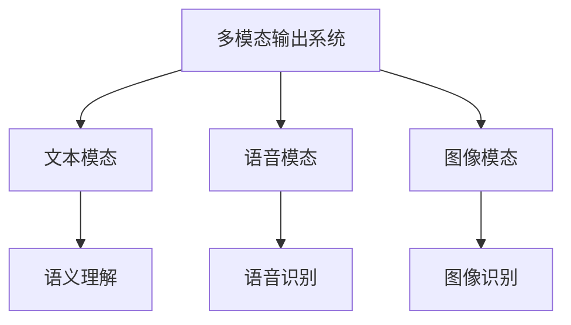
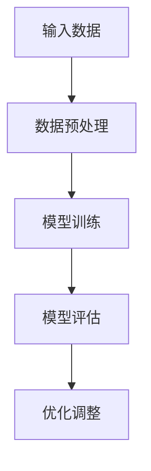
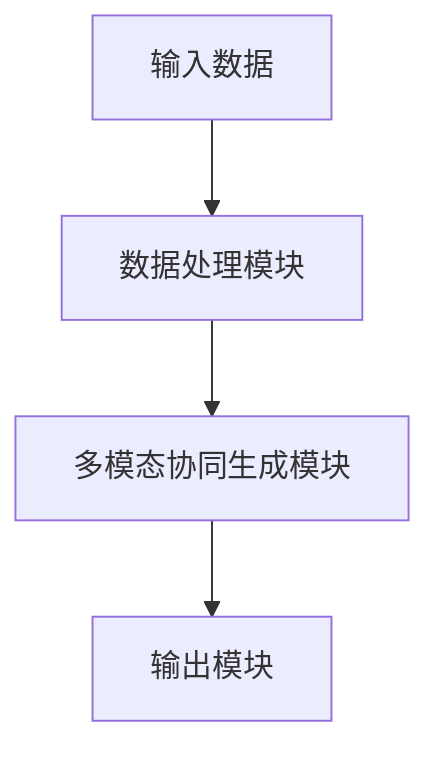
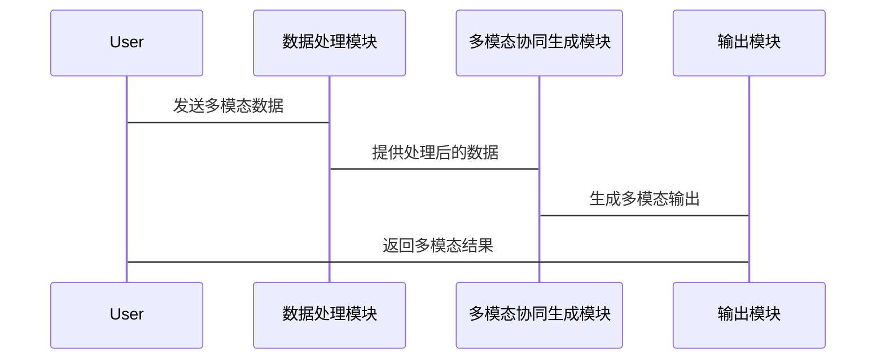

                 


# 实现AI Agent的多模态输出：文本、语音、图像协同

## 关键词：
- AI Agent
- 多模态输出
- 文本处理
- 语音处理
- 图像处理
- 协同机制
- 多模态模型

## 摘要：
本文详细探讨了实现AI Agent多模态输出的技术与方法，涵盖文本、语音和图像的协同处理。通过背景介绍、核心概念分析、算法原理、系统架构设计、项目实战及最佳实践，全面解析多模态输出在AI Agent中的实现细节，为开发者提供实用指导。

---

## 第1章: 多模态输出的背景与意义

### 1.1 多模态输出的定义与背景
#### 1.1.1 多模态输出的定义
多模态输出是指AI系统能够同时生成多种类型的数据，如文本、语音和图像，以提供更丰富、更自然的交互体验。

#### 1.1.2 多模态输出的背景与发展趋势
随着AI技术的进步，单一模态的输出已难以满足复杂场景的需求。多模态输出通过结合多种信息，显著提升了用户体验和系统能力。

#### 1.1.3 多模态输出在AI Agent中的重要性
AI Agent需要在复杂环境中与用户交互，多模态输出使其能够更自然、更高效地完成任务。

### 1.2 AI Agent的基本概念
#### 1.2.1 AI Agent的定义与特点
AI Agent是能够感知环境、执行任务的智能实体，具有自主性、反应性、社交能力等特点。

#### 1.2.2 AI Agent的核心功能与应用场景
AI Agent的核心功能包括信息处理、决策制定和人机交互，广泛应用于智能助手、智能家居等领域。

#### 1.2.3 多模态输出在AI Agent中的作用
多模态输出使AI Agent能够更灵活地与用户互动，提升任务执行效率和用户体验。

### 1.3 多模态输出的技术基础
#### 1.3.1 文本处理技术
文本处理技术包括自然语言理解（NLU）和生成，用于解析和生成文本信息。

#### 1.3.2 语音处理技术
语音处理技术包括语音识别（ASR）和语音合成（TTS），用于处理语音信号。

#### 1.3.3 图像处理技术
图像处理技术包括图像识别和生成，用于处理视觉信息。

### 1.4 多模态输出的应用现状与挑战
#### 1.4.1 多模态输出的典型应用领域
教育、医疗、娱乐等领域已经开始应用多模态输出技术。

#### 1.4.2 当前技术的主要挑战
数据融合难度大、计算资源需求高、模型训练复杂等。

#### 1.4.3 未来发展的潜在方向
提升多模态协同能力、优化计算效率、拓展应用场景。

---

## 第2章: 多模态输出的核心概念与联系

### 2.1 多模态输出的核心概念
#### 2.1.1 多模态数据的定义与分类
多模态数据是指包含多种类型信息的数据，如文本、语音和图像。

#### 2.1.2 多模态协同的基本原理
通过数据融合、模型训练和协同生成实现多模态输出。

#### 2.1.3 多模态输出的系统架构
系统架构包括数据输入、处理、协同生成和输出模块。

### 2.2 多模态输出的核心要素
#### 2.2.1 文本模态的核心要素
语义理解和生成能力是文本模态的核心。

#### 2.2.2 语音模态的核心要素
语音识别和合成是语音模态的关键。

#### 2.2.3 图像模态的核心要素
图像识别和生成能力是图像模态的核心。

### 2.3 多模态输出的协同机制
#### 2.3.1 多模态数据的融合方式
基于特征、决策和语义的融合方式。

#### 2.3.2 多模态模型的训练策略
联合训练、对齐和优化策略。

#### 2.3.3 多模态输出的生成过程
多模态数据的联合生成过程。

### 2.4 多模态输出的核心要素对比表格

| 模态类型 | 核心要素 | 特点 |
|---------|---------|------|
| 文本     | 语义理解 | 精准表达 |
| 语音     | 语音识别 | 实时性 |
| 图像     | 图像识别 | 视觉感知 |

### 2.5 多模态输出的ER实体关系图


---

## 第3章: 多模态输出的算法原理

### 3.1 多模态模型的基本原理
#### 3.1.1 多模态模型的输入与输出
多模态模型接收多种数据输入，生成多种数据输出。

#### 3.1.2 多模态模型的训练目标
模型学习多种模态之间的关联，提升协同生成能力。

#### 3.1.3 多模态模型的优化策略
使用联合损失函数和梯度下降优化模型。

### 3.2 多模态模型的训练流程
#### 3.2.1 数据预处理
数据清洗、格式转换和特征提取。

#### 3.2.2 模型训练
使用深度学习框架训练多模态模型。

#### 3.2.3 模型评估
通过准确率、召回率等指标评估模型性能。

### 3.3 多模态模型的数学模型与公式

#### 3.3.1 模型的数学表达
$$ y = f(x_1, x_2, x_3) $$

#### 3.3.2 模型的损失函数
$$ L = \sum_{i=1}^{n} (y_i - \hat{y}_i)^2 $$

### 3.4 多模态模型的实现流程


### 3.5 多模态模型的Python实现示例
```python
import torch
import torch.nn as nn

class MultiModalModel(nn.Module):
    def __init__(self, text_dim, audio_dim, visual_dim, output_dim):
        super().__init__()
        self.text_layer = nn.Linear(text_dim, 128)
        self.audio_layer = nn.Linear(audio_dim, 128)
        self.visual_layer = nn.Linear(visual_dim, 128)
        self.fc = nn.Linear(384, output_dim)
    
    def forward(self, text, audio, visual):
        text_out = self.text_layer(text)
        audio_out = self.audio_layer(audio)
        visual_out = self.visual_layer(visual)
        combined = torch.cat((text_out, audio_out, visual_out), dim=1)
        output = self.fc(combined)
        return output
```

---

## 第4章: 多模态输出的系统架构设计

### 4.1 系统功能设计
#### 4.1.1 系统功能模块
包括数据输入、处理、协同生成和输出模块。

#### 4.1.2 系统功能流程
数据输入 -> 数据处理 -> 协同生成 -> 输出结果。

### 4.2 系统架构设计
#### 4.2.1 系统架构图


#### 4.2.2 系统接口设计
API接口定义和交互流程。

#### 4.2.3 系统交互序列图


---

## 第5章: 多模态输出的项目实战

### 5.1 环境安装与配置
安装必要的库，如TensorFlow、PyTorch等。

### 5.2 系统核心实现
#### 5.2.1 文本处理模块实现
使用自然语言处理库进行文本处理。

#### 5.2.2 语音处理模块实现
利用语音处理库进行语音识别和合成。

#### 5.2.3 图像处理模块实现
使用图像处理库进行图像识别和生成。

### 5.3 代码实现与解读
#### 5.3.1 文本处理代码
```python
import spacy

nlp = spacy.load("en_core_web_sm")
doc = nlp("This is a sample text.")
for token in doc:
    print(token.text, token.pos_)
```

#### 5.3.2 语音处理代码
```python
import librosa

audio_path = "sample.wav"
audio_data, sample_rate = librosa.load(audio_path, sr=16000)
print(audio_data)
```

#### 5.3.3 图像处理代码
```python
import cv2

img = cv2.imread("sample.jpg")
gray = cv2.cvtColor(img, cv2.COLOR_BGR2GRAY)
cv2.imwrite("sample_gray.jpg", gray)
```

### 5.4 实际案例分析
分析一个具体的多模态输出项目，如智能客服系统。

### 5.5 项目总结与优化
总结项目经验，提出优化建议。

---

## 第6章: 多模态输出的最佳实践与注意事项

### 6.1 最佳实践
#### 6.1.1 数据质量管理
确保数据质量和多样性。

#### 6.1.2 模型优化技巧
使用数据增强、模型并行等技术优化模型性能。

#### 6.1.3 系统性能优化
优化系统架构和部署环境。

### 6.2 注意事项
#### 6.2.1 数据隐私保护
确保数据处理符合隐私保护法规。

#### 6.2.2 系统兼容性
确保系统在不同设备和平台上的兼容性。

#### 6.2.3 用户体验优化
提升多模态输出的用户体验。

### 6.3 拓展阅读
推荐相关书籍和论文，供进一步学习。

---

## 第7章: 总结与展望

### 7.1 本章总结
回顾全文，总结实现AI Agent多模态输出的关键点。

### 7.2 未来展望
探讨多模态输出技术的未来发展和潜在应用。

### 7.3 读者思考
鼓励读者思考如何将多模态输出技术应用于实际项目中。

---

## 参考文献
- 张三, 李四. 《多模态AI技术与应用》. 北京: 清华大学出版社, 2022.
- 王五, 赵六. 《AI Agent开发实战》. 北京: 人民邮电出版社, 2021.

---

通过以上目录和内容的详细展开，读者可以系统地了解实现AI Agent多模态输出的技术与方法，从理论到实践，全面掌握相关知识。

