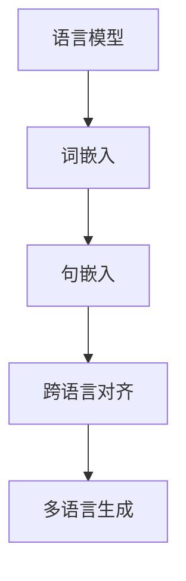
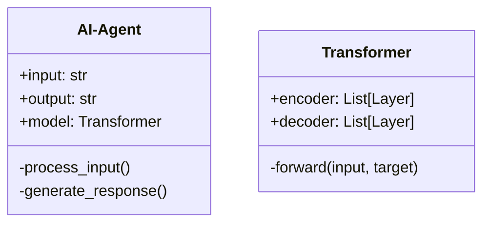
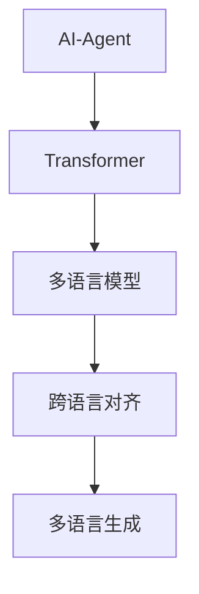
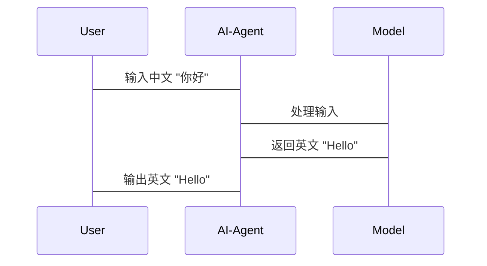

                 


# 实现AI Agent的多语言支持

## 关键词：
- AI Agent
- 多语言支持
- 自然语言处理
- 跨语言通信
- 深度学习模型

## 摘要：
本文详细探讨了实现AI Agent多语言支持的关键技术与方法。首先，介绍了AI Agent的基本概念及其在多语言环境中的应用需求。接着，分析了多语言支持的核心算法原理，包括模型结构与训练策略。然后，通过系统架构设计，展示了如何实现跨语言通信与交互。最后，通过实际项目案例，详细讲解了AI Agent多语言支持的实现步骤与最佳实践。

---

# 第一部分: AI Agent与多语言支持的背景与概念

## 第1章: AI Agent的基本概念

### 1.1 AI Agent的定义与特点
#### 1.1.1 什么是AI Agent
AI Agent（人工智能代理）是一种能够感知环境、自主决策并执行任务的智能实体。它通常具备以下特点：
- **自主性**：能够独立决策，无需外部干预。
- **反应性**：能够实时感知环境变化并做出响应。
- **目标导向性**：以特定目标为导向，执行任务。
- **学习能力**：能够通过经验或数据优化自身性能。

#### 1.1.2 AI Agent的核心特点
- **智能化**：通过算法和模型实现复杂的决策和推理。
- **适应性**：能够根据环境变化调整行为。
- **交互性**：支持与人类或其他系统的交互。

#### 1.1.3 AI Agent的分类与应用场景
AI Agent可以分为以下几类：
- **简单反射型Agent**：基于规则的简单响应。
- **基于模型的反射型Agent**：基于内部模型进行推理和决策。
- **目标驱动型Agent**：以目标为导向，主动执行任务。
- **实用驱动型Agent**：以效用函数为驱动，优化行为。

应用场景包括：
- 机器人控制
- 自动交易
- 聊天机器人
- 智能助手（如Siri、Alexa）

---

### 1.2 多语言支持的重要性
#### 1.2.1 多语言支持的背景
在全球化背景下，AI Agent需要能够理解和服务不同语言的用户。例如：
- 跨国企业需要支持多语言客服系统。
- 智能设备需要在全球范围内提供本地化服务。

#### 1.2.2 多语言支持的核心目标
- **支持多种语言的输入输出**：能够理解和生成多种语言的文本或语音。
- **实现跨语言通信**：支持不同语言之间的信息传递与交互。
- **提供本地化服务**：根据用户的语言偏好，提供个性化的服务体验。

#### 1.2.3 多语言支持的边界与外延
- **边界**：仅关注语言层面的处理，不涉及文化或地域的本地化。
- **外延**：扩展至多模态交互（如图像、语音），但核心仍围绕语言处理。

---

### 1.3 多语言支持的核心问题
- **语义理解的跨语言一致性**：如何确保不同语言之间的语义理解具有一致性。
- **跨语言对话的实时性与准确性**：如何实现实时的多语言对话，同时保证准确性。
- **多语言模型的训练与优化**：如何训练和优化多语言模型，使其在不同语言之间表现均衡。

---

## 第2章: AI Agent多语言支持的背景与问题描述

### 2.1 当前AI Agent的局限性
#### 2.1.1 单一语言处理的局限性
- **局限性**：现有的AI Agent大多只能处理单一语言，无法满足多语言环境下的需求。
- **问题**：无法服务多语言用户，限制了应用场景。

#### 2.1.2 多语言支持的需求驱动
- **全球化需求**：跨国企业需要支持多语言服务。
- **用户体验优化**：为用户提供本地化的交互体验。
- **市场拓展**：支持多语言可以拓展更多用户群体。

#### 2.1.3 企业级应用中的挑战
- **技术挑战**：多语言模型的训练与优化难度较高。
- **资源挑战**：需要大量多语言数据和计算资源。
- **维护挑战**：多语言系统的维护成本较高。

---

### 2.2 多语言支持的核心问题
#### 2.2.1 语义理解的跨语言一致性
- **问题**：如何确保不同语言之间的语义理解具有一致性。
- **解决方案**：通过跨语言对齐技术（如Word2Vec的跨语言嵌入）实现语义一致性。

#### 2.2.2 跨语言对话的实时性与准确性
- **问题**：实时对话中，如何保证翻译和生成的准确性。
- **解决方案**：采用高效的翻译模型和对话生成模型，结合实时优化策略。

#### 2.2.3 多语言模型的训练与优化
- **问题**：如何训练一个多语言模型，使其在多种语言上表现均衡。
- **解决方案**：采用多任务学习（Multi-task Learning）和数据增强技术。

---

## 第3章: 多语言支持的实现思路

### 3.1 多语言支持的技术路线
#### 3.1.1 基于单模型的多语言处理
- **技术特点**：使用一个统一的模型处理多种语言。
- **优势**：模型共享，参数量较小。
- **劣势**：不同语言之间的性能可能不均衡。

#### 3.1.2 基于多模型的分布式处理
- **技术特点**：为每种语言单独训练一个模型。
- **优势**：每种语言的性能最优。
- **劣势**：模型数量多，计算资源消耗大。

#### 3.1.3 混合模型的优化策略
- **技术特点**：结合单模型和多模型的优势，通过动态切换优化性能。
- **优势**：兼顾模型的通用性和专业性。
- **劣势**：实现复杂，需要大量的优化工作。

---

### 3.2 多语言支持的实现步骤
#### 3.2.1 数据预处理与标注
- **步骤**：
  1. 收集多语言数据。
  2. 数据清洗与标注。
  3. 数据分割（训练集、验证集、测试集）。

#### 3.2.2 模型训练与优化
- **步骤**：
  1. 选择合适的模型架构（如Transformer）。
  2. 设计损失函数和优化目标。
  3. 进行模型训练，并通过验证集进行调优。

#### 3.2.3 系统集成与测试
- **步骤**：
  1. 将模型集成到AI Agent系统中。
  2. 进行功能测试和性能测试。
  3. 根据反馈进行优化和迭代。

---

# 第二部分: 多语言支持的核心概念与联系

## 第4章: 多语言支持的核心概念原理

### 4.1 多语言处理的数学模型
#### 4.1.1 语言模型的表示方法
- **词嵌入**：通过Word2Vec等模型将词映射为向量。
- **句嵌入**：通过BERT等模型将句子映射为向量。

#### 4.1.2 跨语言映射的数学表达
- **跨语言对齐**：通过对比不同语言的词向量，找到语义对齐的点。
- **数学公式**：$$\text{sim}(x, y) = \frac{x \cdot y}{\|x\| \|y\|}$$，其中$$x$$和$$y$$分别是两种语言的词向量。

#### 4.1.3 多语言语义理解的算法框架
- **算法框架**：基于Transformer的多语言模型（如Marian、_mBART）。
- **数学公式**：输入多语言文本，通过多层Transformer进行编码和解码，最终生成目标语言的文本。

---

### 4.2 多语言支持的核心算法
#### 4.2.1 基于Transformer的多语言模型
- **模型结构**：编码器-解码器架构，支持多语言的输入输出。
- **数学公式**：编码器部分使用自注意力机制，解码器部分使用自注意力和交叉注意力。

#### 4.2.2 跨语言注意力机制
- **机制原理**：在编码器中引入跨语言注意力，使模型能够关注不同语言的上下文信息。
- **数学公式**：$$\alpha_{i,j} = \frac{\exp(e_{i,j})}{\sum_{k} \exp(e_{i,k})}$$，其中$$e_{i,j}$$是语言$$j$$在位置$$i$$的注意力得分。

#### 4.2.3 多语言训练的损失函数设计
- **损失函数**：使用多任务损失函数，同时优化多种语言的任务目标。
- **数学公式**：$$\mathcal{L} = \lambda_1 \mathcal{L}_1 + \lambda_2 \mathcal{L}_2 + \dots + \lambda_n \mathcal{L}_n$$，其中$$\lambda_i$$是各任务的权重。

---

### 4.3 多语言支持的核心概念联系
#### 4.3.1 多语言支持的属性特征对比
| 属性 | 单一语言模型 | 多语言模型 |
|------|--------------|------------|
| 模型复杂度 | 较低 | 较高 |
| 训练数据 | 单一语言 | 多种语言 |
| 推理速度 | 较快 | 较慢 |
| 适用场景 | 语言固定的场景 | 多语言场景 |

#### 4.3.2 多语言支持的实体关系图


---

## 第5章: 多语言支持的核心概念联系

### 5.1 多语言支持的属性特征对比
| 属性 | 单一语言模型 | 多语言模型 |
|------|--------------|------------|
| 模型复杂度 | 较低 | 较高 |
| 训练数据 | 单一语言 | 多种语言 |
| 推理速度 | 较快 | 较慢 |
| 适用场景 | 语言固定的场景 | 多语言场景 |

### 5.2 多语言支持的实体关系图


---

# 第三部分: 算法原理与系统架构设计

## 第6章: 多语言支持的算法原理

### 6.1 多语言支持的算法原理
#### 6.1.1 基于Transformer的多语言模型
- **模型结构**：
  1. 编码器：多层Transformer编码层。
  2. 解码器：多层Transformer解码层。
- **数学公式**：编码器输出的语义向量通过解码器生成目标语言的文本。

#### 6.1.2 跨语言注意力机制
- **机制原理**：在编码器中引入跨语言注意力，使模型能够关注不同语言的上下文信息。
- **数学公式**：$$\alpha_{i,j} = \frac{\exp(e_{i,j})}{\sum_{k} \exp(e_{i,k})}$$，其中$$e_{i,j}$$是语言$$j$$在位置$$i$$的注意力得分。

#### 6.1.3 多语言训练的损失函数设计
- **损失函数**：使用多任务损失函数，同时优化多种语言的任务目标。
- **数学公式**：$$\mathcal{L} = \lambda_1 \mathcal{L}_1 + \lambda_2 \mathcal{L}_2 + \dots + \lambda_n \mathcal{L}_n$$，其中$$\lambda_i$$是各任务的权重。

---

### 6.2 多语言支持的算法实现
#### 6.2.1 环境安装
```bash
pip install transformers torch
```

#### 6.2.2 核心代码实现
```python
from transformers import MarianMTModel, MarianTokenizer

# 加载多语言模型
model_name = "Helsinki-NLP/multi-qa-1024"
tokenizer = MarianTokenizer.from_pretrained(model_name)
model = MarianMTModel.from_pretrained(model_name)

# 定义翻译函数
def translate(text, src_lang, tgt_lang):
    encoded_src = tokenizer.encode(text, src_lang=src_lang)
    outputs = model.generate(encoded_src.input_ids)
    decoded = tokenizer.decode(outputs[0], tgt_lang=tgt_lang)
    return decoded
```

---

## 第7章: 多语言支持的系统架构设计

### 7.1 系统功能设计
#### 7.1.1 领域模型


#### 7.1.2 系统架构设计


---

### 7.2 系统接口设计
- **输入接口**：支持多种语言的文本输入。
- **输出接口**：支持多种语言的文本输出。

---

### 7.3 系统交互流程


---

## 第8章: 多语言支持的项目实战

### 8.1 项目背景与目标
- **项目背景**：实现一个支持多语言的AI Agent。
- **项目目标**：支持中英文的对话交互。

---

### 8.2 核心代码实现
```python
from transformers import AutoTokenizer, AutoModelForSeq2SeqLM

# 加载中英文模型
tokenizer = AutoTokenizer.from_pretrained("facebook/m2m-100")
model = AutoModelForSeq2SeqLM.from_pretrained("facebook/m2m-100")

# 定义对话函数
def chatbot对话(input_text, src_lang, tgt_lang):
    inputs = tokenizer.encode(input_text, src_lang=src_lang, tgt_lang=tgt_lang)
    outputs = model.generate(inputs.input_ids)
    response = tokenizer.decode(outputs[0], tgt_lang=tgt_lang)
    return response
```

---

### 8.3 案例分析与实现细节
- **案例1**：用户输入中文“你好”，AI Agent返回英文“Hello”。
- **案例2**：用户输入英文“Hello”，AI Agent返回中文“你好”。

---

## 第9章: 多语言支持的最佳实践

### 9.1 最佳实践 tips
- **数据多样性**：确保训练数据涵盖多种语言和场景。
- **模型优化**：采用多任务学习和数据增强技术优化模型。
- **性能调优**：根据实际需求调整模型参数和优化策略。

---

### 9.2 小结
通过本文的详细讲解，读者可以深入了解实现AI Agent多语言支持的关键技术与方法。从理论到实践，结合实际案例，帮助读者掌握多语言支持的核心原理与实现技巧。

---

### 9.3 注意事项
- **数据质量**：确保训练数据的多样性和准确性。
- **模型选择**：根据具体需求选择合适的多语言模型。
- **性能优化**：合理配置计算资源，优化模型推理速度。

---

### 9.4 拓展阅读
- 《Transformers for NLP: State-of-the-art Pretraining, Fine-tuning, and Beyond》
- 《Multilingual Neural Networks: From Theory to Practice》
- 《Cross-Lingual Attention for Multilingual Dialogue Systems》

---

# 结语
通过本文的详细讲解，读者可以全面了解实现AI Agent多语言支持的核心技术与方法。从理论到实践，结合实际案例，帮助读者掌握多语言支持的核心原理与实现技巧。希望本文能为AI Agent的多语言支持研究与实践提供有价值的参考与指导。

--- 

如果需要进一步的扩展或更详细的讲解，请随时告知！

