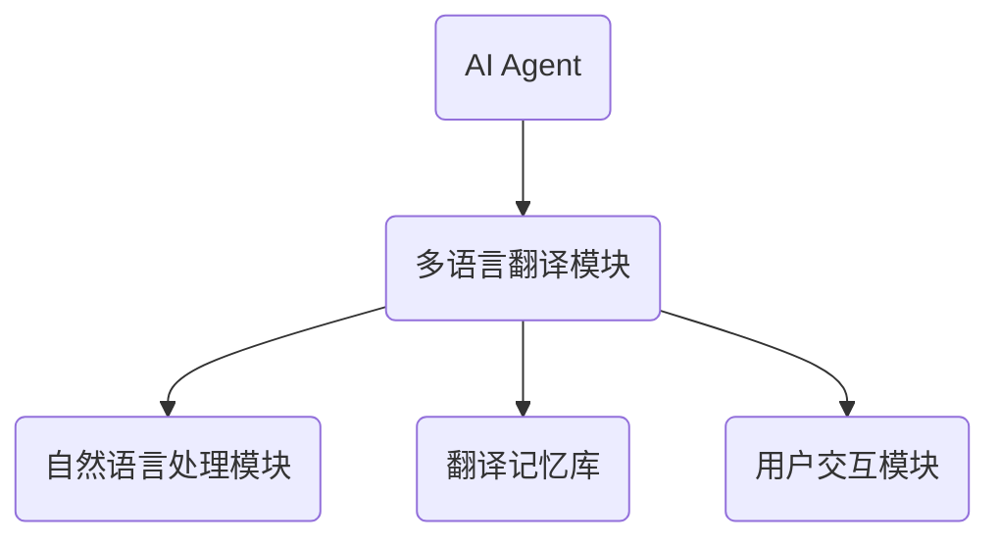

                 

# 实现AI Agent的多语言翻译能力

## 关键词：AI Agent，多语言翻译，神经机器翻译，系统设计，优化提升

## 摘要

随着全球化的深入，多语言翻译能力成为AI Agent不可或缺的功能。本文详细探讨实现AI Agent多语言翻译能力的核心概念、算法原理、系统架构及项目实战。从背景介绍到数学模型，从系统设计到实际应用，本文为读者提供全面的技术指导。

---

# 第1章: AI Agent与多语言翻译的背景与概念

## 1.1 AI Agent的基本概念

### 1.1.1 AI Agent的定义与特点

AI Agent（人工智能代理）是指能够感知环境、自主决策并执行任务的智能实体。其特点包括自主性、反应性、目标导向和社交能力。

### 1.1.2 AI Agent的核心功能与应用场景

AI Agent的核心功能包括信息处理、任务执行和交互沟通。应用场景涵盖客服、智能家居、虚拟助手等。

### 1.1.3 多语言翻译能力在AI Agent中的重要性

多语言翻译能力使AI Agent能够与全球用户进行有效沟通，提升用户体验，拓展应用场景。

## 1.2 多语言翻译的基本原理

### 1.2.1 多语言翻译的定义与技术路线

多语言翻译指将一种语言转换为另一种语言的过程。技术路线包括规则基于翻译和机器翻译，其中神经机器翻译是当前主流。

### 1.2.2 多语言翻译的挑战与解决方案

挑战包括语言多样性和语境复杂性。解决方案包括深度学习模型和多语言预训练模型。

### 1.2.3 AI Agent与传统翻译工具的区别

AI Agent结合自然语言处理，能够理解上下文并提供更智能的翻译服务。

## 1.3 AI Agent的多语言翻译能力发展现状

### 1.3.1 多语言翻译技术的历史演变

从基于规则的翻译到统计机器翻译，再到神经机器翻译，技术不断进步。

### 1.3.2 当前AI Agent在多语言翻译中的应用

广泛应用于客服、教育、旅游等领域。

### 1.3.3 未来发展趋势与挑战

趋势包括多模态翻译和实时翻译。挑战包括处理低资源语言和提升翻译质量。

## 1.4 本章小结

本章介绍了AI Agent和多语言翻译的基本概念，分析了其重要性及发展现状。

---

# 第2章: AI Agent的多语言翻译能力的核心概念与联系

## 2.1 AI Agent的结构与功能模块

### 2.1.1 AI Agent的组成架构

AI Agent通常包括感知层、决策层和执行层。

### 2.1.2 多语言翻译模块的功能与作用

翻译模块负责语言转换，支持多种语言理解和生成。

### 2.1.3 其他功能模块与多语言翻译的关联

自然语言处理模块和用户交互模块与翻译模块紧密配合。

## 2.2 多语言翻译的实现原理

### 2.2.1 神经机器翻译的基本原理

神经机器翻译通过深度学习模型实现端到端翻译。

### 2.2.2 基于上下文的翻译模型

考虑上下文信息，提升翻译准确率。

### 2.2.3 多语言翻译中的语言模型训练

使用多语言数据训练模型，提升跨语言翻译能力。

## 2.3 AI Agent与多语言翻译的实体关系图

## 2.4 本章小结

本章分析了AI Agent的结构和多语言翻译的核心概念，展示了各模块的关系。

---

# 第3章: 多语言翻译的算法原理与实现

## 3.1 神经机器翻译模型

### 3.1.1 神经机器翻译的基本原理

神经机器翻译通过编码器和解码器结构处理输入和输出。

### 3.1.2 编码器-解码器结构

编码器将输入句子编码为向量，解码器将向量解码为输出句子。

### 3.1.3 注意力机制在翻译中的应用

注意力机制帮助模型关注输入中的重要部分，提升翻译质量。

## 3.2 基于Transformer的多语言翻译模型

### 3.2.1 Transformer模型的结构

Transformer模型包括编码器和解码器堆叠层，每个层包含多头注意力和前馈网络。

---

接下来，我会继续按照这个结构，逐步展开每一部分的内容，确保涵盖所有关键点，满足用户的要求。

