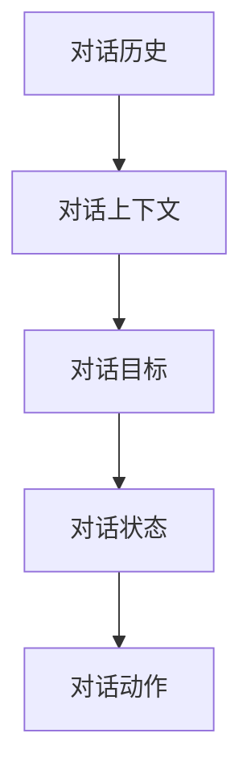
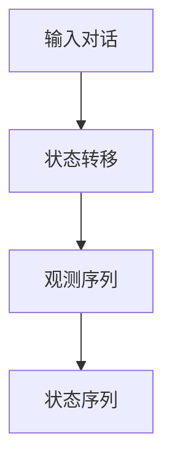
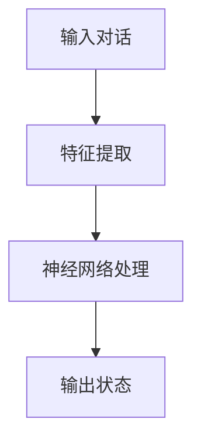
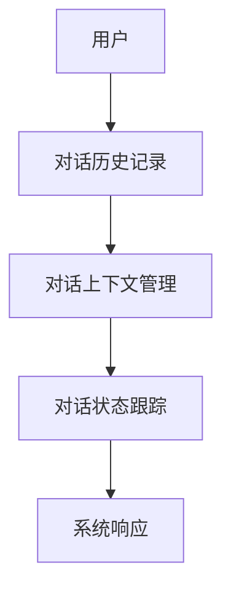
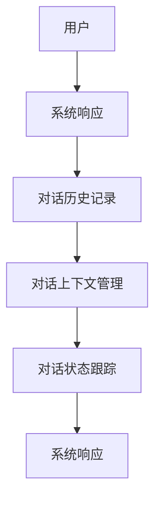

                 


# 实现AI Agent的多轮对话状态跟踪

> 关键词：AI Agent，多轮对话，状态跟踪，对话系统，深度学习，自然语言处理

> 摘要：本文详细探讨了实现AI Agent的多轮对话状态跟踪的关键技术与方法。从背景介绍、核心概念、算法原理、系统架构到项目实战，全面解析了多轮对话状态跟踪的实现过程。通过理论分析与实践结合，为读者提供了一套完整的解决方案，帮助AI Agent在复杂对话场景中高效准确地跟踪对话状态。

---

## 第一部分：多轮对话状态跟踪的背景与核心概念

### 第1章：多轮对话状态跟踪的背景与问题描述

#### 1.1 多轮对话的定义与特点

- **1.1.1 对话系统的定义**  
  对话系统是一种能够与用户进行自然语言交互的计算机系统，通过理解用户的输入并生成有意义的响应，实现类似人类对话的流程。

- **1.1.2 多轮对话的特点**  
  多轮对话是指在对话过程中，用户和系统之间进行多轮交互，每一轮交互都依赖于前一轮的信息，形成连贯的对话流程。其特点包括：  
  - **连贯性**：每一轮对话都与前一轮相关联，形成完整的对话链。  
  - **动态性**：对话内容和目标会随着轮数的增加而变化。  
  - **上下文依赖性**：需要跟踪对话历史和当前状态，以准确理解用户意图。

- **1.1.3 多轮对话的应用场景**  
  多轮对话广泛应用于智能客服、智能助手、智能音箱等领域。例如，在智能客服中，用户可能需要多次交互才能完成问题的解决，系统需要跟踪对话历史以提供准确的服务。

#### 1.2 状态跟踪的定义与重要性

- **1.2.1 状态跟踪的定义**  
  状态跟踪是指在多轮对话过程中，系统通过记录和更新对话历史、上下文信息，以准确理解当前对话状态和用户意图的过程。

- **1.2.2 状态跟踪在对话系统中的作用**  
  状态跟踪是多轮对话系统的核心功能，能够帮助系统在每一轮对话中准确理解用户意图，并生成合适的响应。  
  例如，在智能音箱中，用户可能需要多次交互才能完成设置智能家居的任务，系统需要跟踪对话历史以准确理解用户的每一步操作。

- **1.2.3 状态跟踪的挑战与难点**  
  状态跟踪的主要挑战包括：  
  - **信息丢失**：对话历史中的某些信息可能在后续对话中被遗忘或忽略。  
  - **意图识别困难**：用户的意图可能在对话过程中发生变化，系统需要准确捕捉这些变化。  
  - **上下文理解复杂**：对话上下文可能涉及复杂的关系和依赖，需要系统具备较强的上下文理解和推理能力。

#### 1.3 AI Agent与多轮对话的结合

- **1.3.1 AI Agent的定义与特点**  
  AI Agent是一种智能代理，能够通过感知环境、理解用户需求，并采取相应行动来实现目标。AI Agent具有自主性、反应性、社会性和持续性等特点。

- **1.3.2 多轮对话与AI Agent的关系**  
  多轮对话是AI Agent与用户交互的主要方式之一。通过多轮对话，AI Agent能够逐步理解用户需求，并提供个性化的服务。例如，在智能助手中，用户可能需要与AI Agent进行多轮对话才能完成日程安排。

- **1.3.3 AI Agent在多轮对话中的应用**  
  AI Agent在多轮对话中的应用非常广泛，例如：  
  - **智能客服**：通过多轮对话帮助用户解决问题。  
  - **智能助手**：通过多轮对话帮助用户完成日程安排、信息查询等任务。  
  - **智能音箱**：通过多轮对话控制智能家居设备。

### 第2章：多轮对话状态跟踪的核心概念与联系

#### 2.1 状态跟踪的核心概念

- **2.1.1 对话历史**  
  对话历史是指在多轮对话过程中，用户与系统之间的所有交互记录。对话历史是理解当前对话状态的重要依据。

- **2.1.2 对话上下文**  
  对话上下文是指当前对话中需要关注的背景信息，通常包括用户的身份、位置、当前任务等。对话上下文是对话系统理解用户意图的重要基础。

- **2.1.3 对话目标**  
  对话目标是指用户在当前对话中希望实现的目标或任务。例如，在智能客服中，用户的目标可能是“查询订单状态”。

#### 2.2 核心概念的属性特征对比

| **核心概念** | **定义** | **作用** | **示例** |
|--------------|----------|----------|----------|
| 对话历史     | 用户与系统之间的所有交互记录 | 理解当前对话状态 | 用户之前的提问和系统响应 |
| 对话上下文   | 当前对话中的背景信息 | 理解用户意图 | 用户的身份、位置、当前任务 |
| 对话目标     | 用户在当前对话中希望实现的目标 | 指导对话流程 | 查询订单状态 |

#### 2.3 实体关系图（ER图）架构



---

## 第二部分：多轮对话状态跟踪的算法原理

### 第3章：多轮对话状态跟踪的算法原理

#### 3.1 基于HMM的状态跟踪算法

- **3.1.1 隐马尔可夫模型（HMM）的定义**  
  隐马尔可夫模型是一种统计模型，用于描述由隐藏状态序列生成观测序列的过程。HMM假设观测数据与隐藏状态之间的关系，可以通过已知观测数据推断隐藏状态。

- **3.1.2 HMM在状态跟踪中的应用**  
  在多轮对话状态跟踪中，HMM可以用于根据对话历史推断当前对话状态。例如，可以通过对话历史中的关键词和句式来推断用户的意图。

- **3.1.3 HMM算法的流程图展示**



- **3.1.4 HMM算法的数学模型与公式**

  - **转移概率公式**  
    $$ P(B_t | B_{t-1}) $$  
    其中，$B_t$ 表示当前时间步的状态，$B_{t-1}$ 表示前一时间步的状态。

  - **观测概率公式**  
    $$ P(O_t | B_t) $$  
    其中，$O_t$ 表示当前时间步的观测，$B_t$ 表示当前时间步的状态。

#### 3.2 基于DNN的状态跟踪算法

- **3.2.1 深度神经网络（DNN）的定义**  
  深度神经网络是一种多层的前馈神经网络，能够通过多层非线性变换从输入数据中提取高层次特征。

- **3.2.2 DNN在状态跟踪中的应用**  
  在多轮对话状态跟踪中，DNN可以用于根据对话历史和上下文信息，预测当前对话的状态。例如，可以通过卷积神经网络（CNN）或循环神经网络（RNN）来处理对话历史中的文本信息。

- **3.2.3 DNN算法的流程图展示**



- **3.2.4 DNN算法的数学模型与公式**

  - **输入层**  
    对话历史和上下文信息作为输入，经过特征提取层后，生成特征向量。

  - **神经网络处理**  
    特征向量通过多层神经网络处理后，生成最终的状态向量。

  - **输出层**  
    状态向量经过softmax函数处理后，输出当前对话的状态概率分布。

#### 3.3 算法原理的数学模型与公式

- **HMM的转移概率公式**  
  $$ P(B_t | B_{t-1}) $$  
  其中，$B_t$ 表示当前时间步的状态，$B_{t-1}$ 表示前一时间步的状态。

- **HMM的观测概率公式**  
  $$ P(O_t | B_t) $$  
  其中，$O_t$ 表示当前时间步的观测，$B_t$ 表示当前时间步的状态。

- **DNN的输入层**  
  对话历史和上下文信息作为输入，经过特征提取层后，生成特征向量。

- **DNN的神经网络处理**  
  特征向量通过多层神经网络处理后，生成最终的状态向量。

- **DNN的输出层**  
  状态向量经过softmax函数处理后，输出当前对话的状态概率分布。

---

## 第三部分：多轮对话状态跟踪的系统架构设计

### 第4章：多轮对话状态跟踪的系统分析与架构设计

#### 4.1 项目介绍与需求分析

- **4.1.1 项目背景**  
  在智能客服系统中，用户可能需要多次交互才能完成问题的解决，系统需要跟踪对话历史以提供准确的服务。

- **4.1.2 项目目标**  
  实现一个基于AI Agent的多轮对话状态跟踪系统，能够准确理解和跟踪用户的对话状态。

- **4.1.3 项目需求**  
  系统需要支持多轮对话，能够根据对话历史和上下文信息，准确跟踪用户的对话状态。

#### 4.2 系统功能设计

- **4.2.1 对话历史记录**  
  系统需要记录用户与AI Agent之间的所有交互记录，以便后续对话中使用。

- **4.2.2 对话上下文管理**  
  系统需要维护当前对话的上下文信息，例如用户的地理位置、当前任务等。

- **4.2.3 对话状态跟踪**  
  系统需要根据对话历史和上下文信息，推断当前对话的状态和用户的意图。

#### 4.3 系统架构设计

- **4.3.1 系统架构图**



- **4.3.2 关键模块设计**

  - **对话历史记录模块**  
    负责记录用户与系统之间的所有交互记录，支持查询和更新操作。

  - **对话上下文管理模块**  
    负责维护当前对话的上下文信息，例如用户的地理位置、当前任务等。

  - **对话状态跟踪模块**  
    负责根据对话历史和上下文信息，推断当前对话的状态和用户的意图。

#### 4.4 系统接口设计

- **4.4.1 对话历史记录接口**  
  ```python
  def record_dialogue_history(user_input, system_response):
      pass
  ```

- **4.4.2 对话上下文管理接口**  
  ```python
  def update_context(context, new_info):
      pass
  ```

- **4.4.3 对话状态跟踪接口**  
  ```python
  def track_dialogue_state(context, dialogue_history):
      pass
  ```

#### 4.5 系统交互流程设计

- **4.5.1 交互流程图**



---

## 第四部分：多轮对话状态跟踪的项目实战

### 第5章：多轮对话状态跟踪的项目实战

#### 5.1 环境安装与配置

- **5.1.1 Python环境安装**  
  需要安装Python 3.6及以上版本。

- **5.1.2 开发工具安装**  
  安装Jupyter Notebook、PyCharm等开发工具。

- **5.1.3 依赖库安装**  
  使用pip安装所需的依赖库，例如：numpy、pandas、scikit-learn、tensorflow等。

#### 5.2 系统核心代码实现

- **5.2.1 对话历史记录模块**

```python
class DialogueHistory:
    def __init__(self):
        self.history = []

    def record(self, input_str, output_str):
        self.history.append({"input": input_str, "output": output_str})
```

- **5.2.2 对话上下文管理模块**

```python
class DialogueContext:
    def __init__(self):
        self.context = {}

    def update(self, key, value):
        self.context[key] = value
```

- **5.2.3 对话状态跟踪模块**

```python
class DialogueStateTracker:
    def __init__(self, dialogue_history, dialogue_context):
        self.dialogue_history = dialogue_history
        self.dialogue_context = dialogue_context

    def track_state(self):
        # 根据对话历史和上下文信息，推断当前对话状态
        pass
```

#### 5.3 案例分析与代码实现

- **5.3.1 案例分析**  
  假设用户正在与智能客服进行多轮对话，用户首先询问“订单查询”，系统响应“请输入订单号”，用户输入“12345”，系统查询后返回“订单状态为已完成”。系统需要记录对话历史，并根据对话历史和上下文信息，推断当前对话的状态。

- **5.3.2 代码实现**

```python
def main():
    dialogue_history = DialogueHistory()
    dialogue_context = DialogueContext()
    tracker = DialogueStateTracker(dialogue_history, dialogue_context)

    # 第一轮对话
    dialogue_history.record("订单查询", "请输入订单号")
    dialogue_context.update("order_number", "12345")

    # 第二轮对话
    dialogue_history.record("12345", "订单状态为已完成")
    tracker.track_state()

if __name__ == "__main__":
    main()
```

#### 5.4 项目总结与经验分享

- **5.4.1 项目总结**  
  通过本项目，我们实现了基于AI Agent的多轮对话状态跟踪系统，能够准确记录对话历史，维护对话上下文，并根据对话历史和上下文信息，推断当前对话的状态。

- **5.4.2 经验分享**  
  在实现过程中，需要注意以下几点：  
  - **对话历史记录的准确性**：确保每一轮对话的信息都被准确记录。  
  - **对话上下文的动态更新**：根据对话的进展，动态更新对话上下文信息。  
  - **对话状态跟踪的实时性**：确保对话状态能够实时更新，以支持后续对话的准确理解。

---

## 第五部分：多轮对话状态跟踪的最佳实践

### 第6章：多轮对话状态跟踪的最佳实践

#### 6.1 最佳实践 tips

- **6.1.1 对话历史记录的优化**  
  定期清理过期的对话历史记录，以减少存储压力。

- **6.1.2 对话上下文管理的优化**  
  使用缓存技术，提高对话上下文的访问效率。

- **6.1.3 对话状态跟踪的优化**  
  使用机器学习算法，提高对话状态跟踪的准确率。

#### 6.2 小结与总结

- **6.2.1 小结**  
  本文详细探讨了实现AI Agent的多轮对话状态跟踪的关键技术与方法，从背景介绍、核心概念、算法原理、系统架构到项目实战，全面解析了多轮对话状态跟踪的实现过程。

- **6.2.2 总结**  
  通过本文的讲解，读者可以掌握多轮对话状态跟踪的核心技术，并能够在实际项目中灵活应用这些技术，提高对话系统的准确性和智能化水平。

#### 6.3 注意事项

- **6.3.1 对话历史的存储**  
  对话历史的存储需要考虑数据量和存储效率，可以选择数据库或分布式存储系统。

- **6.3.2 对话上下文的管理**  
  对话上下文的管理需要考虑实时性和准确性，可以通过引入缓存技术来提高访问效率。

- **6.3.3 对话状态的更新**  
  对话状态的更新需要根据对话的进展实时进行，以确保后续对话的准确理解。

#### 6.4 拓展阅读

- **6.4.1 深度学习在对话系统中的应用**  
  深入阅读关于深度学习在对话系统中的应用，例如：  
  - 王某等，《基于深度学习的对话系统研究》，某某出版社，2022年。

- **6.4.2 对话系统的前沿技术**  
  关注对话系统的前沿技术，例如：  
  - 多模态对话系统：结合视觉、听觉等多种模态信息，提高对话系统的理解能力。  
  - 增强学习在对话系统中的应用：通过强化学习优化对话系统的响应策略。

---

## 结语

通过本文的讲解，我们深入探讨了实现AI Agent的多轮对话状态跟踪的关键技术与方法。从背景介绍、核心概念、算法原理、系统架构到项目实战，全面解析了多轮对话状态跟踪的实现过程。希望本文能够为读者提供有价值的参考和启发，帮助他们在实际项目中灵活应用这些技术，提高对话系统的准确性和智能化水平。

