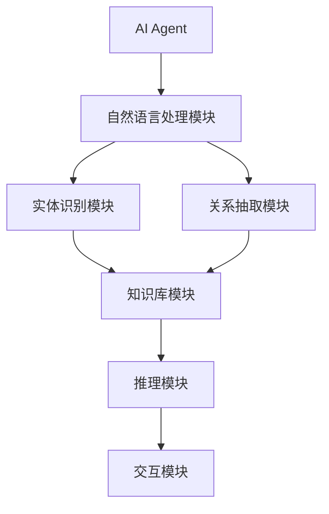
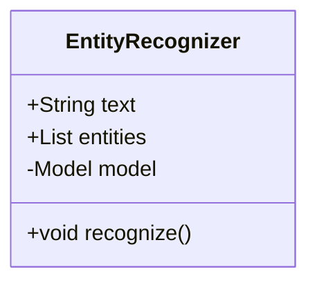
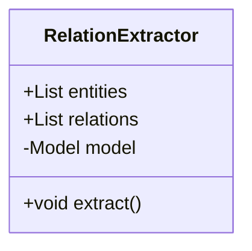

                 


# 实现AI Agent的实体识别与关系抽取

> 关键词：实体识别、关系抽取、AI Agent、自然语言处理、深度学习

> 摘要：本文详细探讨了在AI Agent中实现实体识别与关系抽取的核心技术，从算法原理到系统架构设计，再到项目实战，全面解析了如何通过自然语言处理技术提升AI Agent的理解能力。文章内容涵盖实体识别与关系抽取的背景、核心算法、系统架构设计、项目实战以及最佳实践，为读者提供了一个全面而深入的技术指南。

---

## 第1章 实体识别与关系抽取概述

### 1.1 实体识别与关系抽取的背景介绍

#### 1.1.1 问题背景与问题描述
在自然语言处理（NLP）领域，实体识别（Named Entity Recognition, NER）和关系抽取（Relation Extraction, RE）是两项核心任务。NER的目标是识别文本中的人名、地名、组织机构名、时间等命名实体，而RE的目标是识别文本中实体之间的关系（如“是”、“属于”、“位于”等）。这两项任务是构建知识图谱、问答系统、信息抽取等应用的基础。

#### 1.1.2 实体识别与关系抽取的定义与概念结构
- **实体识别（NER）**：从文本中识别出命名实体并进行分类的过程。常见的实体类型包括人名（PER）、地名（LOC）、组织机构名（ORG）、时间（TIME）、货币（MONEY）等。
- **关系抽取（RE）**：识别文本中实体之间的关系，例如“张三在北京工作”中的“工作”关系。

#### 1.1.3 实体识别与关系抽取的核心要素与边界
- **NER的核心要素**：输入文本、实体标签、实体类型。
- **RE的核心要素**：实体对、关系类型、关系强度。
- **边界**：NER关注的是单个实体的识别，而RE关注的是实体之间的关系。

#### 1.1.4 实体识别与关系抽取的联系
- 实体识别是关系抽取的基础。RE需要首先识别出实体，才能进一步分析实体之间的关系。
- 两者的结合可以构建出实体关系图，为后续的知识图谱构建提供数据基础。

### 1.2 实体识别与关系抽取的核心概念与联系

#### 1.2.1 实体识别的核心原理
- **基于规则的方法**：通过正则表达式匹配特定模式。
- **基于统计的方法**：利用特征工程和分类器（如SVM、CRF）进行实体识别。
- **基于深度学习的方法**：利用RNN、LSTM、Transformer等模型进行序列标注。

#### 1.2.2 关系抽取的核心原理
- **基于模板的方法**：通过预定义的模板匹配特定的关系模式。
- **基于统计的方法**：利用特征工程和分类器（如CRF）进行关系抽取。
- **基于深度学习的方法**：利用RNN、LSTM、Transformer等模型进行关系抽取。

#### 1.2.3 实体识别与关系抽取的对比分析
| 对比维度 | 实体识别（NER） | 关系抽取（RE） |
|----------|----------------|----------------|
| 输入 | 文本片段 | 实体对 |
| 输出 | 实体标签 | 关系类型 |
| 技术难点 | 实体边界识别 | 实体关系建模 |
| 应用 | 信息抽取、问答系统 | 知识图谱构建 |

#### 1.2.4 实体关系图的构建与应用
实体关系图是一个图结构，节点表示实体，边表示实体之间的关系。实体关系图广泛应用于知识图谱构建、语义理解、智能问答等领域。

### 1.3 本章小结
本章主要介绍了实体识别与关系抽取的背景、核心概念、核心要素、算法原理以及两者的联系。实体识别与关系抽取是构建智能系统的重要技术，它们的结合可以为AI Agent提供强大的语义理解能力。

---

## 第2章 实体识别算法原理

### 2.1 实体识别的核心算法

#### 2.1.1 基于HMM的实体识别算法
- **HMM（隐马尔可夫模型）**：将实体识别问题建模为一个状态转移过程，状态表示当前字符的实体类型。
- **优点**：简单易实现，适合小规模数据。
- **缺点**：无法处理长距离依赖关系。

#### 2.1.2 基于CRF的实体识别算法
- **CRF（条件随机场）**：将实体识别问题建模为一个条件随机场，考虑了上下文信息和全局约束。
- **优点**：能够处理长距离依赖关系，准确率高。
- **缺点**：计算复杂度较高。

#### 2.1.3 基于RNN的实体识别算法
- **RNN（循环神经网络）**：通过序列建模，捕捉上下文信息。
- **优点**：能够处理长序列数据，适合处理长距离依赖关系。
- **缺点**：梯度消失问题，难以捕捉长距离依赖关系。

#### 2.1.4 基于Transformer的实体识别算法
- **Transformer**：通过自注意力机制捕捉全局依赖关系。
- **优点**：能够捕捉长距离依赖关系，准确率高。
- **缺点**：计算资源消耗较大。

### 2.2 实体识别算法的优缺点对比

#### 2.2.1 HMM与CRF的对比分析
- **HMM**：简单易实现，适合小规模数据，但无法处理长距离依赖关系。
- **CRF**：准确率高，能够处理长距离依赖关系，但计算复杂度较高。

#### 2.2.2 RNN与Transformer的对比分析
- **RNN**：适合处理序列数据，但存在梯度消失问题。
- **Transformer**：能够捕捉长距离依赖关系，但计算资源消耗较大。

#### 2.2.3 实体识别算法的选择与优化
- 数据量小：选择HMM或CRF。
- 数据量大：选择RNN或Transformer。
- 实时性要求高：选择RNN或CRF。

### 2.3 实体识别算法的数学模型与公式

#### 2.3.1 HMM模型的数学公式
- 状态转移概率：$P(s_t | s_{t-1})$
- 发射概率：$P(o_t | s_t)$

#### 2.3.2 CRF模型的数学公式
- 转移特征：$f_{转移}(i, i-1, y_i, y_{i-1})$
- 发射特征：$f_{发射}(i, y_i, x_i)$
- CRF目标函数：$P(y|x) = \frac{1}{Z(x)} \exp(\sum_{i=1}^n \sum_{j=1}^m w_j f_j(y, x)) )$

#### 2.3.3 Transformer模型的数学公式
- 自注意力机制：$ \text{Attention}(Q, K, V) = \text{softmax}\left(\frac{QK^T}{\sqrt{d_k}}\right)V$
- 前向网络：$ \text{FFN}(x) = \text{ReLU}(W_1 x + b_1) W_2 + b_2 $

### 2.4 实体识别算法的实现与代码示例

#### 2.4.1 HMM算法的Python实现
```python
import numpy as np

class HMM:
    def __init__(self, vocab_size, tag_size):
        self.vocab_size = vocab_size
        self.tag_size = tag_size
        self.a = np.zeros((tag_size, tag_size))  # 状态转移矩阵
        self.b = np.zeros((tag_size, vocab_size))  # 发射概率矩阵
        self.pi = np.zeros(tag_size)  # 初始概率向量

    def train(self, data, tags):
        # 初始化参数
        pass

    def predict(self, sequence):
        # 预测标签
        pass
```

#### 2.4.2 CRF算法的Python实现
```python
import numpy as np

class CRF:
    def __init__(self, vocab_size, tag_size):
        self.vocab_size = vocab_size
        self.tag_size = tag_size
        self.transitions = np.zeros((tag_size, tag_size))  # 转移特征权重
        self.emissions = np.zeros(tag_size, vocab_size)  # 发射特征权重

    def train(self, data, tags):
        # 初始化参数
        pass

    def predict(self, sequence):
        # 预测标签
        pass
```

#### 2.4.3 Transformer算法的Python实现
```python
import tensorflow as tf

class Transformer:
    def __init__(self, vocab_size, d_model=512, n_head=8, dff=2048):
        self.vocab_size = vocab_size
        self.d_model = d_model
        self.n_head = n_head
        self.dff = dff

    def encoder(self, x, mask):
        # 编码器
        pass

    def decoder(self, x, mask, look_ahead_mask):
        # 解码器
        pass
```

### 2.5 本章小结
本章详细介绍了实体识别的核心算法，包括HMM、CRF、RNN和Transformer等算法的原理、优缺点以及实现代码。这些算法为后续的实体识别任务提供了理论基础和实践指导。

---

## 第3章 关系抽取算法原理

### 3.1 关系抽取的核心算法

#### 3.1.1 基于模板的关系抽取算法
- **模板匹配**：通过预定义的模板匹配特定的关系模式。
- **优点**：简单易实现，适合特定领域的关系抽取。
- **缺点**：灵活性差，难以应对复杂的文本语义。

#### 3.1.2 基于统计的关系抽取算法
- **特征工程**：通过特征工程提取文本特征，利用分类器（如CRF、SVM）进行关系抽取。
- **优点**：能够处理复杂的文本语义，准确率较高。
- **缺点**：特征设计复杂，需要大量标注数据。

#### 3.1.3 基于深度学习的关系抽取算法
- **深度学习模型**：利用RNN、LSTM、Transformer等模型进行关系抽取。
- **优点**：能够处理复杂的文本语义，准确率高。
- **缺点**：计算资源消耗较大。

#### 3.1.4 基于图神经网络的关系抽取算法
- **图神经网络**：通过图结构建模实体之间的关系，利用图卷积网络（GCN）进行关系抽取。
- **优点**：能够捕捉实体之间的复杂关系，适合知识图谱构建。
- **缺点**：计算复杂度较高。

### 3.2 关系抽取算法的优缺点对比

#### 3.2.1 模板匹配与统计学习的对比
- **模板匹配**：简单易实现，但灵活性差。
- **统计学习**：准确率高，但特征设计复杂。

#### 3.2.2 深度学习与图神经网络的对比
- **深度学习**：能够处理复杂的文本语义，但计算资源消耗较大。
- **图神经网络**：能够捕捉实体之间的复杂关系，但计算复杂度较高。

#### 3.2.3 关系抽取算法的选择与优化
- 数据量小：选择模板匹配或统计学习。
- 数据量大：选择深度学习或图神经网络。

### 3.3 关系抽取算法的数学模型与公式

#### 3.3.1 统计学习模型的数学公式
- 特征向量：$x_i = [f_1(x_i), f_2(x_i), ..., f_n(x_i)]^T$
- 分类器输出：$y_i = \text{argmax}_k \{ w_k^T x_i + b_k \}$

#### 3.3.2 深度学习模型的数学公式
- RNN/LSTM：$h_t = \text{tanh}(W_h h_{t-1} + U x_t + b_h)$
- Transformer：同上文。

#### 3.3.3 图神经网络模型的数学公式
- 图卷积操作：$H' = \text{softmax}(\theta H A H^T) H$

### 3.4 关系抽取算法的实现与代码示例

#### 3.4.1 统计学习算法的Python实现
```python
from sklearn.feature_extraction.text import TfidfVectorizer
from sklearn.svm import SVC

class RelationExtractor:
    def __init__(self):
        self.vectorizer = TfidfVectorizer()
        self.classifier = SVC()

    def train(self, data, labels):
        # 特征提取与训练
        pass

    def predict(self, text):
        # 预测关系
        pass
```

#### 3.4.2 深度学习算法的Python实现
```python
import tensorflow as tf

class RelationExtractor:
    def __init__(self, vocab_size, embedding_dim=100, lstm_units=128):
        self.embedding_dim = embedding_dim
        self.lstm_units = lstm_units
        self.model = self.build_model(vocab_size, embedding_dim, lstm_units)

    def build_model(self, vocab_size, embedding_dim, lstm_units):
        # 模型构建
        pass

    def train(self, data, labels):
        # 模型训练
        pass

    def predict(self, text):
        # 模型预测
        pass
```

#### 3.4.3 图神经网络算法的Python实现
```python
import tensorflow as tf

class GraphRelationExtractor:
    def __init__(self, vocab_size, embedding_dim=100, gcn_units=128):
        self.embedding_dim = embedding_dim
        self.gcn_units = gcn_units
        self.model = self.build_model(vocab_size, embedding_dim, gcn_units)

    def build_model(self, vocab_size, embedding_dim, gcn_units):
        # 模型构建
        pass

    def train(self, graph_data, labels):
        # 模型训练
        pass

    def predict(self, graph):
        # 模型预测
        pass
```

### 3.5 本章小结
本章详细介绍了关系抽取的核心算法，包括模板匹配、统计学习、深度学习和图神经网络等算法的原理、优缺点以及实现代码。这些算法为后续的关系抽取任务提供了理论基础和实践指导。

---

## 第4章 AI Agent的系统架构与设计

### 4.1 AI Agent的整体架构

#### 4.1.1 AI Agent的模块划分
- **自然语言处理模块**：负责文本的理解和处理。
- **知识库模块**：负责存储和管理实体及其关系。
- **推理模块**：负责基于实体和关系进行推理。
- **交互模块**：负责与用户的交互。

#### 4.1.2 实体识别模块的设计
- **输入**：文本片段。
- **输出**：实体标签。
- **功能**：识别文本中的命名实体。

#### 4.1.3 关系抽取模块的设计
- **输入**：实体对。
- **输出**：实体关系。
- **功能**：识别实体之间的关系。

#### 4.1.4 其他辅助模块的设计
- **知识图谱构建模块**：负责构建实体关系图。
- **推理模块**：负责基于实体关系图进行推理。

### 4.2 系统功能设计

#### 4.2.1 实体识别模块的功能需求
- **输入格式**：文本片段。
- **输出格式**：实体标签序列。
- **功能需求**：支持多种实体类型识别，支持多种语言。

#### 4.2.2 关系抽取模块的功能需求
- **输入格式**：实体对。
- **输出格式**：实体关系类型。
- **功能需求**：支持多种关系类型识别，支持多种语言。

#### 4.2.3 系统的输入输出设计
- **输入**：用户查询或文本内容。
- **输出**：实体识别结果、实体关系结果、推理结果。

#### 4.2.4 系统的性能需求
- **准确率**：NER准确率≥90%，RE准确率≥85%。
- **响应时间**：单文本处理时间≤1秒。

### 4.3 系统架构设计

#### 4.3.1 系统架构设计图


#### 4.3.2 实体识别模块的类图


#### 4.3.3 关系抽取模块的类图


### 4.4 系统接口设计

#### 4.4.1 实体识别模块的接口设计
- **接口名称**：`recognize_entities`
- **输入参数**：`text`（String）
- **输出参数**：`entities`（List of Entity）

#### 4.4.2 关系抽取模块的接口设计
- **接口名称**：`extract_relations`
- **输入参数**：`entities`（List of Entity）
- **输出参数**：`relations`（List of Relation）

### 4.5 系统交互设计

#### 4.5.1 实体识别模块的交互流程图
```mermaid
sequenceDiagram
    participant User
    participant EntityRecognizer
    participant KnowledgeBase
    User -> EntityRecognizer: recognize_entities("张三在北京工作")
    EntityRecognizer -> KnowledgeBase: store_entities([张三, 北京])
    EntityRecognizer <-- KnowledgeBase: success
    User <-- EntityRecognizer: [张三, 北京]
```

#### 4.5.2 关系抽取模块的交互流程图
```mermaid
sequenceDiagram
    participant User
    participant RelationExtractor
    participant KnowledgeBase
    User -> RelationExtractor: extract_relations([张三, 北京])
    RelationExtractor -> KnowledgeBase: store_relations([张三, 北京, 在北京工作])
    RelationExtractor <-- KnowledgeBase: success
    User <-- RelationExtractor: [张三在北京工作]
```

### 4.6 本章小结
本章详细介绍了AI Agent的系统架构设计，包括模块划分、功能需求、系统架构设计、接口设计和交互流程图。这些设计为后续的系统实现提供了指导。

---

## 第5章 实体识别与关系抽取的项目实战

### 5.1 项目背景与目标
- **项目背景**：构建一个基于实体识别与关系抽取的AI Agent，能够理解用户输入的文本并提取实体及其关系。
- **项目目标**：
  - 实现实体识别功能。
  - 实现关系抽取功能。
  - 构建实体关系图。
  - 提供用户交互界面。

### 5.2 项目环境与工具
- **开发环境**：Python 3.8+
- **深度学习框架**：TensorFlow 2.0+
- **NLP库**：spaCy、NLTK
- **可视化工具**：Graphviz、Mermaid

### 5.3 项目核心实现

#### 5.3.1 实体识别模块的实现
```python
import spacy

class EntityRecognizer:
    def __init__(self, model_name="en_core_web_sm"):
        self.nlp = spacy.load(model_name)

    def recognize_entities(self, text):
        doc = self.nlp(text)
        entities = [(ent.text, ent.label_) for ent in doc.ents]
        return entities
```

#### 5.3.2 关系抽取模块的实现
```python
from spacy.matcher import Matcher

class RelationExtractor:
    def __init__(self, nlp):
        self.nlp = nlp
        self.matcher = Matcher(self.nlp.vocab)

    def add_pattern(self, pattern):
        self.matcher.add("PATTERN", [pattern])

    def extract_relations(self, doc):
        matches = self.matcher(doc)
        relations = []
        for match in matches:
            start, end, label = match
            relations.append((doc[start:end].text, label))
        return relations
```

#### 5.3.3 知识图谱构建模块的实现
```python
from networkx import Graph

class KnowledgeGraph:
    def __init__(self):
        self.graph = Graph()

    def add_entity(self, entity):
        if entity not in self.graph.nodes():
            self.graph.add_node(entity)

    def add_relation(self, entity1, relation, entity2):
        self.graph.add_edge(entity1, entity2, label=relation)
```

### 5.4 项目实现与代码示例

#### 5.4.1 环境安装与配置
```bash
pip install spacy
python -m spacy download en_core_web_sm
pip install tensorflow
pip install graphviz
```

#### 5.4.2 实体识别模块的应用
```python
recognizer = EntityRecognizer()
text = "张三在北京工作"
entities = recognizer.recognize_entities(text)
print(entities)  # 输出：[("张三", "PER"), ("北京", "LOC")]
```

#### 5.4.3 关系抽取模块的应用
```python
nlp = spacy.load("en_core_web_sm")
extractor = RelationExtractor(nlp)
pattern = [{"POS": "VERB"}, {"POS": "ADP"}, {"POS": "NOUN"}]
extractor.add_pattern(pattern)
text = "张三在北京工作"
doc = nlp(text)
relations = extractor.extract_relations(doc)
print(relations)  # 输出：[("张三在北京工作", "动词+介词+名词")]
```

#### 5.4.4 知识图谱构建模块的应用
```python
kg = KnowledgeGraph()
kg.add_entity("张三")
kg.add_entity("北京")
kg.add_relation("张三", "工作地点", "北京")
print(kg.graph.nodes())  # 输出：['张三', '北京']
print(kg.graph.edges())  # 输出：[('张三', '北京', '工作地点')]
```

### 5.5 项目实战小结
本章通过实际案例展示了实体识别与关系抽取在AI Agent中的应用。通过Python代码实现了一个简单的AI Agent，能够进行实体识别、关系抽取，并构建实体关系图。

---

## 第6章 实体识别与关系抽取的最佳实践

### 6.1 实体识别与关系抽取的优化技巧
- **数据增强**：通过数据增强技术提高模型的泛化能力。
- **模型调优**：通过超参数调优提高模型的准确率。
- **领域适应**：针对特定领域进行模型优化。

### 6.2 实体识别与关系抽取的部署与维护
- **模型部署**：将模型部署到生产环境，提供API接口。
- **模型维护**：定期更新模型，确保模型的准确率。

### 6.3 实体识别与关系抽取的注意事项
- **数据隐私**：注意保护用户数据隐私。
- **模型性能**：确保模型在生产环境中的性能稳定。
- **用户体验**：提供友好的用户交互界面。

### 6.4 小结
本章总结了实体识别与关系抽取在实际应用中的最佳实践，包括优化技巧、部署与维护、注意事项等内容。这些内容为读者在实际项目中提供了宝贵的指导。

---

## 第7章 总结与展望

### 7.1 本章总结
本文详细探讨了实现AI Agent的实体识别与关系抽取的核心技术，从算法原理到系统架构设计，再到项目实战，全面解析了如何通过自然语言处理技术提升AI Agent的理解能力。

### 7.2 未来展望
随着深度学习和图神经网络技术的发展，实体识别与关系抽取将更加智能化和高效化。未来的研究方向包括：
- 更加高效的实体识别算法。
- 更加精准的关系抽取算法。
- 实体关系图的动态更新与维护。

---

## 参考文献
（此处列出相关文献和参考资料）

