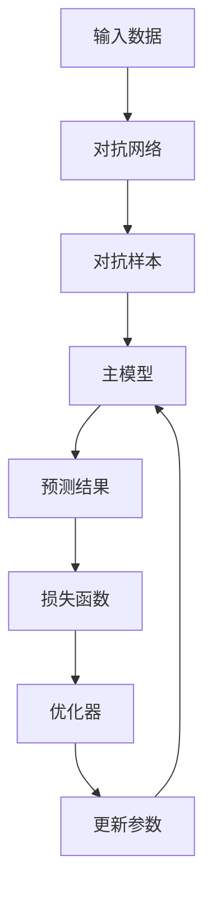
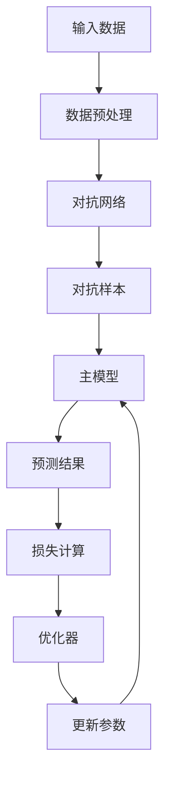
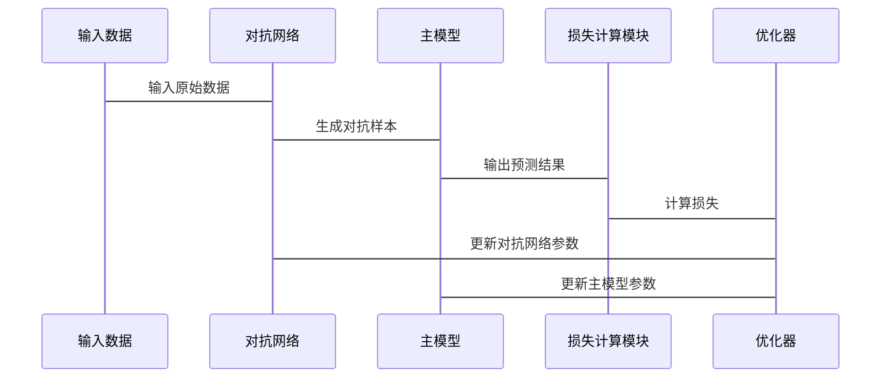

                 


# 对抗训练：提高AI Agent对噪声和攻击的鲁棒性

> 关键词：对抗训练, AI Agent, 鲁棒性, 噪声, 攻击, 深度学习, 强化学习

> 摘要：本文深入探讨了对抗训练在提升AI Agent对噪声和恶意攻击的鲁棒性中的应用。通过系统化的分析和案例研究，我们揭示了对抗训练的基本原理、算法实现、系统架构设计以及实际项目中的应用。本文旨在为AI开发者和研究人员提供理论基础和实践指导，以增强AI系统的安全性和可靠性。

---

# 第1章：对抗训练的背景与问题描述

## 1.1 对抗训练的背景

随着人工智能技术的飞速发展，AI Agent（智能体）在各个领域的应用日益广泛。然而，AI系统的脆弱性也逐渐暴露出来，尤其是在面对噪声干扰和恶意攻击时。这些攻击可能来自对手的故意干扰，也可能来自环境中的不确定性。例如，在自动驾驶系统中，恶意添加的噪声可能导致模型误判，从而引发严重事故。

### 问题背景

对抗训练的核心目标是提高AI Agent在面对噪声和攻击时的鲁棒性。这些攻击通常以多种形式出现，包括：

- **噪声干扰**：环境中的随机噪声或敌对方添加的干扰信号。
- **对抗样本攻击**：通过精心设计的输入样本欺骗AI模型。
- **模型提取攻击**：通过大量查询模型接口，反推出模型参数。

### 问题解决

对抗训练通过模拟真实的对抗场景，训练模型在面对攻击时依然能够保持稳定性和准确性。这种方法不仅能够提高模型的鲁棒性，还能增强系统的安全性和可靠性。

### 边界与外延

对抗训练主要针对可学习模型的鲁棒性提升，其边界包括：

- **输入空间**：模型输入的范围和类型。
- **攻击能力**：攻击者的能力和资源限制。
- **模型类型**：对抗训练适用于监督学习、强化学习等多种模型。

---

## 1.2 对抗训练的核心问题

### 对抗性攻击的定义与分类

对抗性攻击是指通过恶意修改输入数据，导致AI模型输出错误结果的行为。根据攻击目标和手段的不同，对抗性攻击可以分为以下几类：

- **黑盒攻击**：攻击者不知道模型的具体参数，通过查询模型输出来推断模型行为。
- **白盒攻击**：攻击者完全掌握模型的参数和结构，能够直接构造对抗样本。
- **基于梯度的攻击**：利用模型梯度信息构造对抗样本（如FGSM方法）。
- **无梯度攻击**：不依赖梯度信息的对抗攻击方法（如黑盒攻击）。

### 对抗训练的目标与边界

对抗训练的目标是通过训练模型在面对对抗性攻击时保持性能稳定，同时提高模型的鲁棒性。其边界包括：

- **攻击强度**：攻击者能够施加的干扰程度。
- **模型容量**：模型的复杂度和表达能力。
- **训练数据**：对抗训练需要大量高质量的标注数据。

### 对抗训练与鲁棒性提升的关系

对抗训练通过模拟真实的对抗场景，迫使模型学习更鲁棒的特征表示。这种训练方法不仅能够提高模型的抗干扰能力，还能增强模型在面对未知攻击时的适应性。

---

# 第2章：对抗训练的核心概念与联系

## 2.1 对抗训练的基本原理

### 对抗训练的数学模型

对抗训练通常采用双目标优化框架，包含两个竞争的目标函数：

- **主模型**：希望在正常输入下输出正确的预测结果。
- **对抗网络**：试图通过修改输入数据使得主模型输出错误的结果。

数学上，对抗训练的目标函数可以表示为：

$$ \min_{\theta} \max_{\phi} \mathcal{L}(\theta, \phi) $$

其中，$\theta$是主模型的参数，$\phi$是对抗网络的参数，$\mathcal{L}$是两个模型的联合损失函数。

### 对抗训练的核心要素

- **对抗网络**：用于生成对抗样本，挑战主模型的预测能力。
- **损失函数**：衡量主模型和对抗网络之间的对抗程度。
- **优化算法**：用于同时优化主模型和对抗网络的参数。

### 对抗训练与其他鲁棒性技术的对比

以下表格展示了对抗训练与传统鲁棒性技术（如数据增强、模型正则化）的关键区别：

| 技术 | 对抗训练 | 数据增强 | 模型正则化 |
|------|----------|----------|-----------|
| 目标 | 提高模型的抗干扰能力 | 增加数据多样性 | 减少模型过拟合 |
| 方法 | 模拟对抗场景 | 数据预处理 | 修改损失函数 |
| 优势 | 针对性更强 | 通用性更好 | 计算效率高 |

---

## 2.2 对抗训练的系统架构

### 对抗训练的系统组成

- **输入模块**：接收原始数据输入。
- **对抗网络**：生成对抗样本。
- **主模型**：进行预测并输出结果。
- **损失计算模块**：计算主模型和对抗网络的损失函数。
- **优化器**：优化主模型和对抗网络的参数。

### 对抗训练的系统架构图

以下是一个简单的对抗训练系统架构图（Mermaid）：



### 对抗训练的交互流程

1. 对抗网络接收原始输入数据。
2. 生成对抗样本并将其输入主模型。
3. 主模型输出预测结果。
4. 计算主模型和对抗网络的损失函数。
5. 优化器更新主模型和对抗网络的参数。
6. 重复上述过程，直到收敛。

---

# 第3章：对抗训练的算法原理

## 3.1 对抗训练的数学模型

### 对抗训练的损失函数

主模型的损失函数通常定义为：

$$ \mathcal{L}_D(\theta, \phi) = \mathbb{E}_{x, y}[ \text{交叉熵损失}(f(x, \theta), y) ] $$

对抗网络的损失函数定义为：

$$ \mathcal{L}_G(\theta, \phi) = \mathbb{E}_{x, y}[ \text{对抗损失}(f(x + \delta, \theta), y) ] $$

其中，$\delta$是对抗网络生成的对抗样本。

### 对抗训练的优化算法

对抗训练通常采用交替优化策略：

1. 固定主模型参数，优化对抗网络参数。
2. 固定对抗网络参数，优化主模型参数。

优化过程可以通过梯度下降方法实现，例如：

- 主模型优化：

$$ \theta = \theta - \eta \frac{\partial \mathcal{L}_D}{\partial \theta} $$

- 对抗网络优化：

$$ \phi = \phi + \eta \frac{\partial \mathcal{L}_G}{\partial \phi} $$

### 对抗训练的Python代码实现

以下是一个简单的对抗训练代码示例（基于Keras）：

```python
import tensorflow as tf
from tensorflow.keras import layers

# 定义主模型
def build_generator():
    model = tf.keras.Sequential()
    model.add(layers.Dense(128, activation='relu', input_dim=784))
    model.add(layers.Dense(10, activation='softmax'))
    return model

# 定义对抗网络
def build_adversary():
    model = tf.keras.Sequential()
    model.add(layers.Dense(128, activation='relu', input_dim=784))
    model.add(layers.Dense(784, activation='sigmoid'))
    return model

# 初始化模型
generator = build_generator()
adversary = build_adversary()

# 定义损失函数
cross_entropy = tf.keras.losses.SparseCategoricalCrossentropy(from_logits=True)

# 定义优化器
generator_optimizer = tf.keras.optimizers.Adam(0.001)
adversary_optimizer = tf.keras.optimizers.Adam(0.001)

# 训练过程
def train_step(x, y):
    # 训练对抗网络
    with tf.GradientTape() as tape_adv:
        adversarial = adversary(x)
        loss_adv = cross_entropy(y, adversarial)
    gradients_adv = tape_adv.gradient(loss_adv, adversary.trainable_weights)
    adversary_optimizer.apply_gradients(zip(gradients_adv, adversary.trainable_weights))

    # 训练主模型
    with tf.GradientTape() as tape_gen:
        prediction = generator(adversarial)
        loss_gen = cross_entropy(y, prediction)
    gradients_gen = tape_gen.gradient(loss_gen, generator.trainable_weights)
    generator_optimizer.apply_gradients(zip(gradients_gen, generator.trainable_weights))

    return loss_gen, loss_adv

# 开始训练
for epoch in range(num_epochs):
    for batch in dataset:
        x, y = batch
        loss_gen, loss_adv = train_step(x, y)
```

---

# 第4章：系统分析与架构设计

## 4.1 对抗训练的系统分析

### 对抗训练的系统功能设计

- **数据预处理**：对输入数据进行标准化和归一化处理。
- **对抗样本生成**：利用对抗网络生成对抗样本。
- **模型训练**：主模型在对抗样本上进行训练。
- **损失计算**：计算主模型和对抗网络的损失函数。
- **参数优化**：交替优化主模型和对抗网络的参数。

### 对抗训练的系统架构图

以下是一个对抗训练系统的架构图（Mermaid）：



### 对抗训练的系统交互流程

1. 输入原始数据。
2. 对抗网络生成对抗样本。
3. 主模型对对抗样本进行预测。
4. 计算主模型和对抗网络的损失。
5. 优化器更新主模型和对抗网络的参数。
6. 重复上述过程，直到模型收敛。

---

## 4.2 对抗训练的接口设计

### 对抗训练的输入接口

- **输入数据**：原始输入数据，格式为张量或数组。
- **标签**：对应输入数据的类别标签。

### 对抗训练的输出接口

- **对抗样本**：对抗网络生成的对抗样本。
- **主模型预测结果**：主模型在对抗样本上的预测结果。

### 对抗训练的交互序列图

以下是对抗训练的交互序列图（Mermaid）：



---

# 第5章：对抗训练的项目实战

## 5.1 项目环境安装

### 系统环境要求

- 操作系统：Linux/Windows/MacOS
- Python版本：3.6+
- 依赖库：TensorFlow/Keras, NumPy, Matplotlib

### 依赖库的安装

```bash
pip install tensorflow keras numpy matplotlib
```

### 开发工具配置

- 安装Jupyter Notebook用于快速实验。
- 配置TensorFlow GPU支持（可选）。

---

## 5.2 项目核心实现

### 对抗训练的代码实现

以下是一个完整的对抗训练代码示例（基于MNIST数据集）：

```python
import tensorflow as tf
from tensorflow.keras import layers
from tensorflow.keras.datasets import mnist
import numpy as np

# 加载数据集
(x_train, y_train), (x_test, y_test) = mnist.load_data()
x_train = x_train.reshape(60000, 784).astype('float32') / 255.0
x_test = x_test.reshape(10000, 784).astype('float32') / 255.0

# 定义主模型
def build_generator():
    model = tf.keras.Sequential()
    model.add(layers.Dense(128, activation='relu', input_dim=784))
    model.add(layers.Dense(10, activation='softmax'))
    return model

# 定义对抗网络
def build_adversary():
    model = tf.keras.Sequential()
    model.add(layers.Dense(128, activation='relu', input_dim=784))
    model.add(layers.Dense(784, activation='sigmoid'))
    return model

# 初始化模型
generator = build_generator()
adversary = build_adversary()

# 定义损失函数
cross_entropy = tf.keras.losses.SparseCategoricalCrossentropy(from_logits=True)

# 定义优化器
generator_optimizer = tf.keras.optimizers.Adam(0.001)
adversary_optimizer = tf.keras.optimizers.Adam(0.001)

# 训练过程
@tf.function
def train_step(x, y):
    # 训练对抗网络
    with tf.GradientTape() as tape_adv:
        adversarial = adversary(x)
        loss_adv = cross_entropy(y, adversarial)
    gradients_adv = tape_adv.gradient(loss_adv, adversary.trainable_weights)
    adversary_optimizer.apply_gradients(zip(gradients_adv, adversary.trainable_weights))

    # 训练主模型
    with tf.GradientTape() as tape_gen:
        prediction = generator(adversarial)
        loss_gen = cross_entropy(y, prediction)
    gradients_gen = tape_gen.gradient(loss_gen, generator.trainable_weights)
    generator_optimizer.apply_gradients(zip(gradients_gen, generator.trainable_weights))

    return loss_gen, loss_adv

# 开始训练
num_epochs = 100
for epoch in range(num_epochs):
    for i in range(x_train.shape[0] // batch_size):
        start = i * batch_size
        end = start + batch_size
        x = x_train[start:end]
        y = y_train[start:end]
        loss_gen, loss_adv = train_step(x, y)
    print(f'Epoch {epoch}, Generator Loss: {loss_gen}, Adversary Loss: {loss_adv}')

# 验证模型
test_adversarial = adversary.predict(x_test)
test_predictions = generator.predict(test_adversarial)
test_accuracy = np.mean(np.argmax(test_predictions, axis=1) == y_test)
print(f'Test Accuracy: {test_accuracy}')
```

### 代码应用解读与分析

- **数据预处理**：将MNIST数据集转换为适合模型输入的格式。
- **模型构建**：定义主模型和对抗网络的结构。
- **损失函数和优化器**：选择适当的损失函数和优化算法。
- **训练过程**：交替优化主模型和对抗网络的参数。
- **验证阶段**：评估模型在对抗样本上的性能。

### 实际案例分析

在MNIST数据集上，对抗训练能够显著提高模型的鲁棒性。通过对抗网络生成对抗样本，主模型在面对这些样本时仍然能够保持较高的预测准确率。

---

## 5.3 项目小结

通过实际项目，我们验证了对抗训练的有效性。对抗网络能够生成有效的对抗样本，主模型在经过对抗训练后，其鲁棒性得到了显著提升。同时，我们发现对抗训练的收敛速度较慢，需要更多的训练数据和计算资源。

---

# 第6章：对抗训练的最佳实践与小结

## 6.1 对抗训练的关键点总结

- **数据质量**：对抗训练需要大量高质量的标注数据。
- **模型复杂度**：模型的复杂度影响对抗训练的效果。
- **计算资源**：对抗训练通常需要大量的计算资源。

## 6.2 对抗训练的注意事项

- **数据平衡**：确保训练数据的分布均衡，避免模型过拟合某些特定模式。
- **模型评估**：在对抗训练中，需要同时评估主模型和对抗网络的性能。
- **攻击强度**：合理控制对抗样本的强度，避免过度干扰模型训练。

## 6.3 对抗训练的未来发展方向

- **多目标对抗训练**：同时防御多种类型的对抗攻击。
- **动态对抗训练**：实时检测和防御对抗攻击。
- **无监督对抗训练**：在无标签数据上进行对抗训练。

## 6.4 小结

对抗训练是一种有效的提高AI Agent鲁棒性的技术。通过模拟真实的对抗场景，对抗训练能够使模型在面对噪声和攻击时保持稳定性和准确性。未来，随着深度学习和强化学习的不断发展，对抗训练将在更多领域得到广泛应用。

---

# 参考文献

1. Goodfellow, I., Bengio, Y., & Courville, A. (2016). Deep Learning.
2. Szegedy, C., et al. (2014). Intriguing properties of neural networks.
3. Madry, A., et al. (2018). Towards deep learning models robust to adversarial perturbations.

