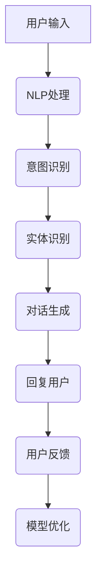

                 

# 对话式AI在客户服务中的应用与优化

> 关键词：对话式AI、客户服务、自然语言处理、机器学习、深度学习、系统优化

> 摘要：随着人工智能技术的快速发展，对话式AI在客户服务中的应用越来越广泛。本文从对话式AI的核心技术、系统架构、应用场景、优化策略等方面进行详细分析，探讨如何通过对话式AI提升客户服务的效率和质量。文章结合实际案例，详细讲解了对话式AI的实现过程，并提出了优化建议。

---

## 引言

对话式AI（Conversational AI）是一种能够通过自然语言与人类进行交互的智能系统。随着人工智能技术的快速发展，对话式AI在客户服务中的应用越来越广泛。传统的客户服务模式依赖于人工客服，存在效率低、成本高等问题。而对话式AI可以通过自动化的方式，快速响应客户需求，提升客户满意度，同时降低企业的运营成本。

本文将从对话式AI的核心技术、系统架构、应用场景、优化策略等方面进行详细分析，探讨如何通过对话式AI提升客户服务的效率和质量。

---

## 第1章：对话式AI的核心技术

### 1.1 自然语言处理（NLP）

自然语言处理是对话式AI的核心技术之一，主要用于理解和生成人类语言。以下是NLP在对话式AI中的关键步骤：

1. **文本预处理**：
   - 分词：将文本分割成词语或短语。
   - 停用词去除：移除无意义的词语（如“的”、“是”）。
   - 词干提取：将词语转换为基本形式（如“running”转换为“run”）。

2. **意图识别**：
   - 通过分析用户的输入文本，确定用户的意图（如“查询订单状态”或“投诉产品问题”）。

3. **实体识别**：
   - 从文本中提取关键信息（如订单号、客户姓名、日期等）。

4. **文本生成**：
   - 根据用户输入生成回复文本。

### 1.2 机器学习与深度学习

机器学习和深度学习是对话式AI的两大核心技术：

1. **机器学习**：
   - 基于特征的分类算法（如SVM、随机森林）用于意图识别和实体识别。
   - 通过训练数据，模型可以学习到输入文本与目标输出之间的关系。

2. **深度学习**：
   - 基于神经网络的模型（如RNN、LSTM、Transformer）在对话式AI中表现优异。
   - Transformer模型（如BERT、GPT）通过预训练和微调，能够生成高质量的回复。

### 1.3 对话式AI的核心算法

对话式AI的实现通常基于以下算法：

1. **序列到序列模型（Sequence-to-Sequence）**：
   - 通过编码器将输入文本编码为向量，再通过解码器生成回复文本。
   - 示例：使用LSTM或Transformer实现对话生成。

2. **预训练语言模型（Pre-trained LM）**：
   - 使用大规模语料库预训练语言模型，再在特定任务上进行微调。
   - 示例：基于GPT-3的对话生成模型。

---

## 第2章：对话式AI的系统架构与实现

### 2.1 系统架构设计

对话式AI系统的架构通常包括以下几个部分：

1. **前端交互界面**：
   - 提供用户输入的界面（如网页、移动应用、聊天窗口）。
   - 支持多模态输入（如文本、语音）。

2. **后端处理模块**：
   - NLP处理模块：负责文本解析和意图识别。
   - 对话管理模块：根据用户输入生成回复。
   - 数据存储模块：存储对话历史和用户信息。

3. **模型服务模块**：
   - 预训练语言模型服务：提供对话生成能力。
   - 实时推理服务：处理用户的输入并返回回复。

### 2.2 系统实现流程

以下是对话式AI系统的实现流程：

1. **用户输入**：
   - 用户通过前端界面输入文本或语音。

2. **文本解析**：
   - 对输入文本进行分词、停用词去除和词干提取。
   - 识别用户的意图和实体信息。

3. **对话生成**：
   - 基于意图和实体信息，生成回复文本。
   - 使用预训练语言模型进行微调，提升回复质量。

4. **反馈与优化**：
   - 收集用户的反馈，用于模型优化。
   - 根据用户反馈调整对话策略。

### 2.3 系统交互流程

以下是对话式AI系统的交互流程图：

---

## 第3章：对话式AI在客户服务中的应用场景

### 3.1 客户咨询与问题解答

对话式AI在客户咨询中的应用非常广泛，例如：

1. **常见问题解答**：
   - 用户通过对话式AI查询产品信息、服务政策等。
   - 对话式AI通过预训练的知识库提供准确的回复。

2. **复杂问题处理**：
   - 对话式AI能够理解用户的意图，并引导用户解决问题。
   - 例如，帮助用户完成订单查询、退换货流程等。

### 3.2 客户投诉与情绪分析

对话式AI在客户投诉处理中的应用：

1. **情绪识别**：
   - 通过NLP技术分析用户的文本，识别用户的情绪（如愤怒、悲伤、快乐）。
   - 帮助客服人员快速理解用户的情绪状态。

2. **自动回复与安抚**：
   - 对话式AI可以根据用户情绪生成相应的回复，安抚用户情绪。
   - 例如，当用户情绪激动时，系统可以自动发送安抚信息。

### 3.3 客户满意度提升

对话式AI可以通过以下方式提升客户满意度：

1. **个性化服务**：
   - 根据用户的历史行为和偏好，提供个性化的服务建议。
   - 例如，推荐用户可能感兴趣的产品或服务。

2. **24/7实时支持**：
   - 对话式AI可以全天候为用户提供服务，满足用户在任何时间的需求。
   - 例如，用户可以在深夜通过对话式AI查询订单状态。

---

## 第4章：对话式AI的优化策略

### 4.1 数据优化

对话式AI的性能依赖于高质量的数据，因此数据优化是关键：

1. **数据清洗**：
   - 移除噪声数据（如无关文本、重复记录）。
   - 处理拼写错误和语法错误。

2. **数据增强**：
   - 通过数据增强技术（如同义词替换、句式转换）扩展训练数据。
   - 提高模型的泛化能力。

3. **数据标注**：
   - 对对话数据进行标注，标记用户的意图和实体信息。
   - 例如，标注用户的输入文本是否属于“订单查询”或“投诉反馈”。

### 4.2 模型优化

模型优化是提升对话式AI性能的重要手段：

1. **模型调优**：
   - 调整模型的超参数（如学习率、批量大小）。
   - 使用早停法（Early Stopping）防止过拟合。

2. **模型融合**：
   - 将多个模型的输出结果进行融合，提高准确率。
   - 例如，结合规则引擎和深度学习模型的输出。

3. **持续学习**：
   - 在线更新模型，适应新的对话模式和用户需求。
   - 例如，基于用户反馈实时优化模型。

### 4.3 系统优化

系统优化是确保对话式AI稳定运行的关键：

1. **性能优化**：
   - 优化系统的响应时间，确保低延迟。
   - 使用缓存技术减少重复计算。

2. **容错设计**：
   - 设计容错机制，确保系统在部分节点故障时仍能正常运行。
   - 例如，使用分布式架构和负载均衡。

3. **日志与监控**：
   - 实施日志记录和监控，及时发现和解决问题。
   - 例如，监控对话式AI的准确率和用户满意度。

---

## 第5章：对话式AI的未来展望

### 5.1 技术发展趋势

1. **多模态交互**：
   - 结合语音、视觉等多种模态信息，提升对话式AI的交互能力。
   - 例如，用户可以通过语音输入与对话式AI交互。

2. **边缘计算**：
   - 将对话式AI部署在边缘设备上，减少数据传输延迟。
   - 例如，智能音箱可以直接通过本地计算处理用户的语音指令。

3. **人机协作**：
   - 对话式AI与人类客服协同工作，实现人机协作。
   - 例如，对话式AI处理简单问题，人类客服处理复杂问题。

### 5.2 应用场景扩展

1. **智能助手**：
   - 对话式AI作为个人助手，帮助用户完成日程管理、信息查询等任务。

2. **企业服务**：
   - 对话式AI在企业内部的应用，例如员工咨询、内部流程自动化。

3. **教育与培训**：
   - 对话式AI用于教育领域，例如在线辅导、学生答疑。

---

## 结论

对话式AI在客户服务中的应用正在改变传统的客服模式。通过自然语言处理、机器学习和深度学习等技术，对话式AI能够高效地处理客户需求，提升客户满意度。然而，对话式AI的优化和应用仍然面临诸多挑战，例如数据质量、模型性能和系统稳定性等。未来，随着技术的不断发展，对话式AI将在更多领域发挥重要作用，为企业和客户带来更大的价值。

---

通过本文的分析，读者可以深入了解对话式AI的核心技术、系统架构、应用场景和优化策略。希望本文能够为读者在实际应用中提供有价值的参考和启发。

