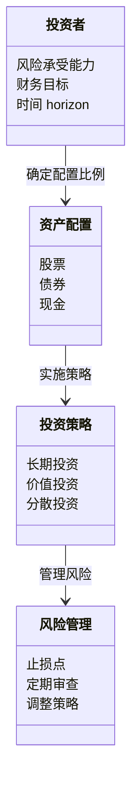
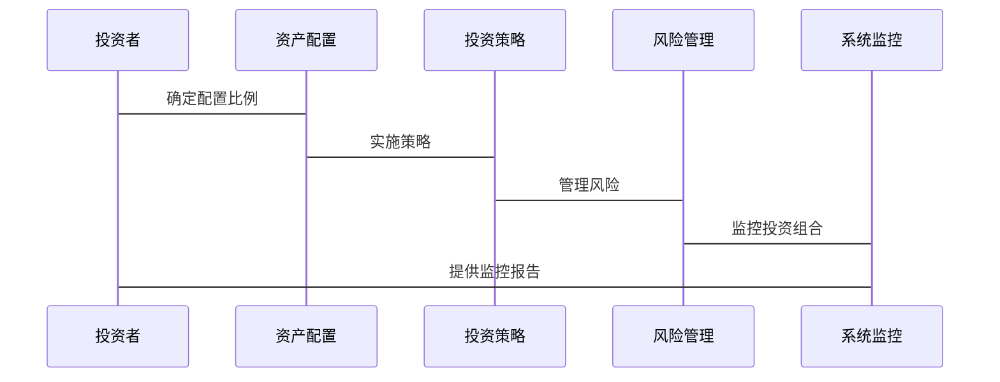

                 


# 巴菲特如何看待市场波动和长期投资

## 关键词

- 巴菲特
- 市场波动
- 长期投资
- 价值投资
- 投资策略
- 股票估值

## 摘要

本文深入探讨了巴菲特的投资理念，特别是他在面对市场波动时的长期投资策略。通过分析巴菲特的核心思想，本文为投资者提供了在波动市场中保持冷静并制定有效投资策略的见解。文章结合理论与实践，帮助读者理解如何在长期投资中抓住价值，避免短期波动的影响。

---

## 第1章：巴菲特的投资哲学

### 1.1 巴菲特的生平简介

沃伦·巴菲特，生于1930年，被誉为“股神”，是全球最成功的投资者之一。他通过长期投资和价值投资的理念积累了巨额财富。巴菲特的投资哲学强调基本面分析和安全边际，主张以合理价格购买优质资产。

### 1.2 市场波动的定义与影响

市场波动是价格在短时间内剧烈变化的现象，通常由市场情绪、经济数据和外部事件驱动。波动可能导致投资者恐慌，从而做出非理性决策。巴菲特认为，波动是市场的特征，而非投资的敌人。

### 1.3 长期投资的意义

长期投资意味着投资者关注资产的长期表现，而非短期价格波动。巴菲特强调，长期投资能够分散风险，降低交易成本，并利用复利效应实现财富增长。

---

## 第2章：巴菲特的选股策略

### 2.1 选股的基本原则

巴菲特选股注重企业的财务健康、竞争优势和管理层诚信。他偏好具有持续盈利能力、低负债和稳定现金流的企业。

### 2.2 股票估值方法

#### 2.2.1 股息折扣模型（DDM）

股息折扣模型用于估算股票的内在价值。公式为：

$$ V = \frac{D_1}{r - g} $$

其中，\( D_1 \) 是第一年的股息，\( r \) 是折现率，\( g \) 是股息增长率。

```python
def ddm_model(dividend, discount_rate, growth_rate):
    return dividend / (discount_rate - growth_rate)
```

#### 2.2.2 资本资产定价模型（CAPM）

CAPM用于确定资产的预期收益：

$$ E(r) = r_f + \beta (r_m - r_f) $$

其中，\( r_f \) 是无风险利率，\( \beta \) 是贝塔系数，\( r_m \) 是市场预期收益率。

```python
def capm( risk_free_rate, beta, market_rate ):
    return risk_free_rate + beta * (market_rate - risk_free_rate)
```

---

## 第3章：市场波动中的投资策略

### 3.1 应对市场波动的策略

#### 3.1.1 保持投资纪律

巴菲特强调在市场波动时保持冷静，避免情绪化决策。投资者应坚持长期策略，避免频繁交易。

#### 3.1.2 寻找投资机会

波动时期可能是买入优质资产的好时机，尤其是当价格低于内在价值时。

#### 3.1.3 分散投资

通过分散投资降低风险，避免过度集中于单一资产或行业。

### 3.2 风险管理与调整

#### 3.2.1 风险调整后的收益评估

使用夏普比率衡量风险调整后的收益：

$$ \text{夏普比率} = \frac{E(r_i) - r_f}{\sigma_i} $$

其中，\( E(r_i) \) 是资产的预期收益，\( r_f \) 是无风险利率，\( \sigma_i \) 是资产收益的标准差。

#### 3.2.2 定期审视与调整

定期检查投资组合，根据市场变化和企业基本面进行调整，确保投资策略与目标一致。

---

## 第4章：投资心理与行为分析

### 4.1 投资者心理偏差

#### 4.1.1 过度自信

投资者可能过高估计自己的判断能力，导致决策失误。

#### 4.1.2 情绪化决策

市场波动常引发恐慌或贪婪，导致非理性决策。

#### 4.1.3 羊群效应

投资者盲目跟随市场潮流，忽视个体分析。

### 4.2 理性决策的重要性

#### 4.2.1 克服心理偏差

通过持续学习和自我反思，减少心理偏差的影响。

#### 4.2.2 建立理性的投资框架

制定明确的投资计划，避免情绪干扰。

---

## 第5章：长期投资的实践指南

### 5.1 制定投资计划

#### 5.1.1 设定明确目标

根据风险承受能力和财务目标制定投资计划。

#### 5.1.2 制定详细策略

包括资产配置、投资品种和时间安排。

#### 5.1.3 风险控制计划

设定止损点和定期审查机制。

### 5.2 实施与监控

#### 5.2.1 定期审视

每年至少审查一次投资组合，根据市场变化进行调整。

#### 5.2.2 调整策略

根据经济环境和个人情况变化，适时调整投资策略。

---

## 第6章：系统架构与投资决策支持

### 6.1 系统架构设计

#### 6.1.1 领域模型类图



#### 6.1.2 系统架构图

```mermaid
architecturalDiagram

    部件 投资者
    部件 资产配置
    部件 投资策略
    部件 风险管理
    部件 系统监控

    投资者 --> 资产配置
    资产配置 --> 投资策略
    投资策略 --> 风险管理
    风险管理 --> 系统监控
```

#### 6.1.3 系统交互序列图



---

## 第7章：项目实战与最佳实践

### 7.1 项目实战

#### 7.1.1 环境安装

安装Python和相关库（如pandas、numpy、matplotlib）。

#### 7.1.2 核心实现

```python
import pandas as pd
import numpy as np
import matplotlib.pyplot as plt

# 示例数据：股票价格和市场指数
data = pd.DataFrame({
    '日期': ['2020-01', '2020-02', '2020-03', '2020-04'],
    '股票价格': [100, 90, 110, 120],
    '市场指数': [1000, 950, 1000, 1050]
})

# 绘制股价与市场指数的散点图
plt.scatter(data['市场指数'], data['股票价格'])
plt.xlabel('市场指数')
plt.ylabel('股票价格')
plt.title('股价与市场指数关系')
plt.show()
```

### 7.2 最佳实践

#### 7.2.1 小结

长期投资需要耐心和纪律，巴菲特的理念强调基本面分析和价值投资。

#### 7.2.2 注意事项

避免短期波动影响，选择优质企业长期持有。

#### 7.2.3 拓展阅读

推荐阅读巴菲特的著作《聪明的投资者》和《巴菲特致股东的信》。

---

## 结语

巴菲特的长期投资理念为投资者提供了宝贵的指导。通过理解和应用他的策略，投资者可以在波动的市场中保持冷静，抓住长期价值。投资不仅是关于数字，更是关于纪律、耐心和持续学习的过程。

