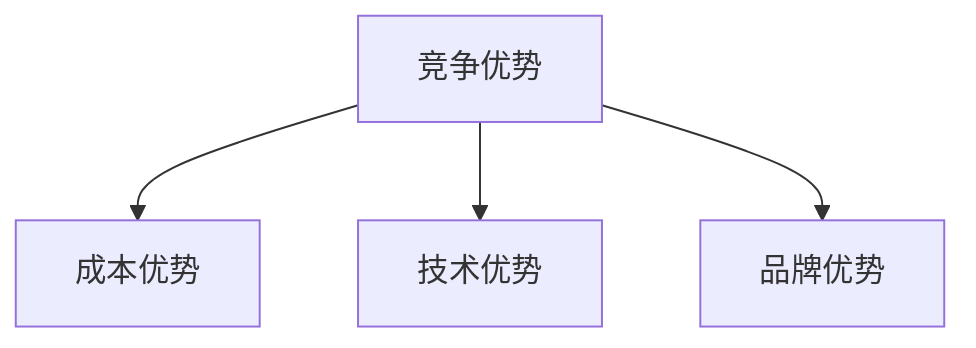

                 

# 巴菲特的'四个过滤器'：选股的科学方法

## 关键词：巴菲特，价值投资，选股方法，财务分析，投资策略

## 摘要：  
巴菲特的“四个过滤器”是一种科学的选股方法，通过评估管理层的品格与能力、企业的财务健康状况、竞争优势以及估值与安全边际，帮助投资者筛选出具有长期投资价值的优质股票。本文将详细解析这四个过滤器的核心概念、评估方法和实际应用，为投资者提供一套系统化的选股框架。

---

# 第一部分：投资的基础与巴菲特的价值投资理念

## 第1章：投资的基本概念与价值投资的起源

### 1.1 投资的基本概念  
投资是通过将资金投入到资产中，以期获得未来收益或资本增值的行为。投资的目的是实现财富的保值与增值，主要分为股票、债券、房地产等多种形式。投资的核心在于识别优质资产，降低风险，实现收益最大化。

### 1.2 价值投资的起源与发展  
价值投资是一种以基本面分析为基础的投资策略，起源于20世纪初。其核心思想是寻找市场价格低于其内在价值的股票进行投资。巴菲特是价值投资的代表人物，他将这一理念发扬光大，强调长期持有优质资产，避免短期市场的波动干扰。

### 1.3 巴菲特投资哲学的核心思想  
巴菲特的价值投资理念强调以下几点：  
1. **长期投资**：避免短期市场的波动，专注于企业的长期价值。  
2. **安全边际**：以低于内在价值的价格买入股票，确保投资的安全性。  
3. **竞争优势**：选择具有独特竞争优势的企业，这些企业能够在行业中长期保持领先地位。  
4. **管理层品质**：信任且选择具有良好品格和能力的管理层。  

---

# 第二部分：巴菲特的“四个过滤器”选股方法

## 第2章：第一个过滤器——管理层的品格与能力

### 2.1 管理层的品格  
管理层的品格是企业成功的关键因素之一。一个优秀的管理层必须具备以下品质：  
- **诚信**：管理层必须诚实守信，避免财务造假或其他不当行为。  
- **责任感**：管理层应以企业利益为重，努力为股东创造价值。  
- **决策能力**：在面对复杂问题时，管理层能够做出明智的决策。  

### 2.2 管理层的能力  
除了品格，管理层的能力同样重要：  
- **专业性**：管理层应具备行业相关的专业知识和经验。  
- **战略眼光**：能够制定长远的发展战略，带领企业持续成长。  
- **执行力**：管理层需要具备将战略转化为实际成果的能力。  

### 2.3 如何评估管理层的品格与能力  
评估管理层的品格与能力，可以通过以下方式：  
1. **公司治理结构**：查看公司治理是否透明，是否存在关联交易等问题。  
2. **历史表现**：分析管理层过去的表现，是否有良好的业绩记录。  
3. **市场口碑**：通过行业内的评价和媒体报道，了解管理层的声誉。  

---

## 第3章：第二个过滤器——企业的财务健康状况

### 3.1 财务健康状况的定义与评估标准  
企业的财务健康状况是衡量其经营稳健性的关键指标。主要的评估标准包括：  
- **盈利能力**：通过ROE（净资产收益率）和ROA（资产净利率）等指标衡量。  
- **偿债能力**：通过资产负债率、流动比率等指标衡量。  
- **运营效率**：通过存货周转率、应收账款周转率等指标衡量。  

### 3.2 财务健康状况的数学模型  
以下是常用的财务指标公式：  
- **ROE（净资产收益率）**：$$ROE = \frac{\text{净利润}}{\text{所有者权益}}$$  
- **ROA（资产净利率）**：$$ROA = \frac{\text{净利润}}{\text{总资产}}$$  
- **流动比率**：$$\text{流动比率} = \frac{\text{流动资产}}{\text{流动负债}}$$  

通过这些公式，可以量化企业的财务状况，并进行综合评估。

### 3.3 实例分析  
以某公司为例，假设其净利润为1000万元，所有者权益为5000万元，总资产为1亿元。  
- **ROE**：$$ROE = \frac{1000}{5000} = 20\%$$  
- **ROA**：$$ROA = \frac{1000}{10000} = 10\%$$  
通过这些数据，可以初步判断该公司的财务状况较为稳健。  

---

## 第4章：第三个过滤器——企业的竞争优势

### 4.1 企业竞争优势的定义  
企业的竞争优势是指公司在市场上与竞争对手相比的独特优势，包括成本优势、技术优势、品牌优势等。

### 4.2 企业竞争优势的系统分析  
通过领域模型和架构图，可以系统分析企业的竞争优势。例如，使用Mermaid图展示企业的竞争优势结构：  

### 4.3 实例分析  
以某公司为例，假设其具有以下竞争优势：  
- 成本优势：公司通过规模化生产降低成本，产品价格更具竞争力。  
- 技术优势：公司拥有自主专利技术，产品创新能力强。  
- 品牌优势：公司在市场上具有较高的品牌知名度，客户忠诚度高。  

---

## 第5章：第四个过滤器——企业的估值与安全边际

### 5.1 企业估值  
企业估值是确定其内在价值的过程，常用的估值方法包括：  
- **市盈率法**：$$\text{市盈率} = \frac{\text{股价}}{\text{每股收益}}$$  
- **市净率法**：$$\text{市净率} = \frac{\text{股价}}{\text{每股净资产}}$$  

### 5.2 安全边际  
安全边际是指股票市场价格低于其内在价值的部分。巴菲特强调，以低于内在价值的价格买入股票，可以确保投资的安全性。例如，假设某股票的内在价值为50元，如果市场价格为40元，安全边际为10元。  

---

# 第三部分：数学模型与财务指标分析

## 第3章：第二个过滤器——企业的财务健康状况

通过上述的数学模型和实例分析，可以量化企业的财务状况，帮助投资者做出更明智的决策。例如，通过ROE和ROA的计算，可以评估企业的盈利能力，从而判断其财务健康状况。

---

# 第四部分：系统架构与项目实战

## 第5章：第四个过滤器——企业的估值与安全边际

通过构建一个简单的选股模型，可以将巴菲特的四个过滤器整合起来，帮助投资者筛选出优质股票。例如，使用Python编写代码，计算各项指标并筛选符合条件的股票。

---

# 总结与展望

巴菲特的“四个过滤器”是一种科学的选股方法，通过系统的分析和评估，可以帮助投资者筛选出具有长期投资价值的优质股票。未来，结合人工智能和大数据技术，可以进一步优化选股模型，提升投资效率和准确性。

---

通过以上内容，读者可以系统地学习巴菲特的四个过滤器选股方法，并将其应用到实际投资中，实现财富的长期增长。

