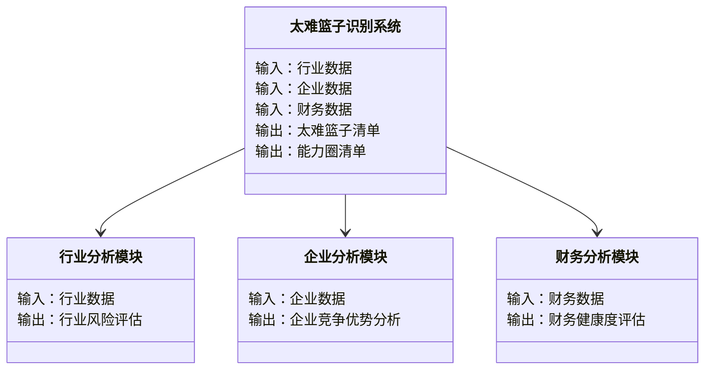
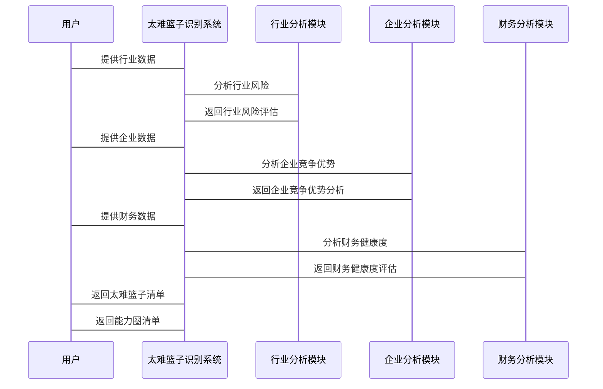

                 


# 《巴菲特的“太难”篮子：知道自己不知道什么》

## 关键词：
巴菲特，投资哲学，能力圈，太难篮子，投资决策，价值投资

## 摘要：
本文深入探讨了巴菲特“太难”篮子的概念，分析了其在投资决策中的重要性。通过系统化的分析，结合巴菲特的投资哲学，文章详细阐述了如何识别“太难”篮子、设定投资边界以及在实际投资中应用这些原则。文章不仅从理论层面进行了探讨，还结合实际案例，提供了系统的解决方案，帮助投资者更好地理解和应用这一概念。

---

## 第一章：巴菲特“太难”篮子的概述

### 1.1 投资哲学与“太难”篮子的背景

#### 1.1.1 巴菲特投资哲学的核心理念
- 巴菲特的投资哲学以价值投资为核心，强调长期、安全、确定性的投资原则。
- 他强调投资的本质是寻找具有持续竞争优势的企业，并以合理的价格买入。

#### 1.1.2 “太难”篮子的定义与背景
- “太难”篮子是指巴菲特认为自己无法理解和评估的行业或企业。
- 这些企业或行业的复杂性、不确定性或模糊性使得巴菲特选择避开，而不是尝试投资。

#### 1.1.3 “太难”篮子的哲学意义
- “太难”篮子体现了巴菲特对自身认知局限性的深刻理解。
- 他意识到，只有在自己熟悉和理解的领域进行投资，才能最大限度地降低风险并实现长期收益。

### 1.2 “太难”篮子的核心概念

#### 1.2.1 “太难”篮子的定义与特征
- **定义**：指那些巴菲特认为自己无法准确评估或预测的企业或行业。
- **特征**：
  1. 高度依赖外部因素（如政策、技术变化）。
  2. 业务模式复杂，难以预测。
  3. 缺乏明确的财务指标或竞争优势。

#### 1.2.2 “太难”篮子与“能力圈”的关系
- **能力圈**：指巴菲特认为自己能够理解和评估的企业或行业。
- **太难”篮子与能力圈的关系**：
  - “太难”篮子是能力圈的边界，是能力圈之外的领域。
  - 巴菲特通过不断扩大能力圈，逐渐缩小“太难”篮子的范围。

#### 1.2.3 “太难”篮子在投资决策中的作用
- 通过识别“太难”篮子，巴菲特避免了投资中的盲目决策。
- 这种方法帮助他在长期投资中保持了较高的成功率。

---

## 第二章：投资决策的边界与筛选方法

### 2.1 投资决策的边界

#### 2.1.1 巴菲特的边界意识
- **边界**：指投资者在投资决策中能够理解和评估的范围。
- **巴菲特如何设定投资边界**：
  1. 通过长期学习和实践，不断扩展能力圈。
  2. 通过深入研究特定行业或企业，明确自己的知识边界。

#### 2.1.2 边界评估与调整
- **评估边界的有效性**：
  - 通过历史投资表现和市场反馈进行评估。
  - 定期回顾和分析，确保边界的有效性。
- **边界的动态调整**：
  - 随着市场变化和个人知识的积累，逐步调整边界范围。

### 2.2 “太难”篮子的筛选方法

#### 2.2.1 基于基本面的筛选
- **基本面分析的核心要素**：
  - 财务状况：收入、利润、现金流等。
  - 行业地位：市场占有率、竞争格局。
  - 管理团队：管理层的能力和稳定性。
- **“太难”篮子的筛选标准**：
  - 行业复杂性高，难以预测。
  - 业务模式不清晰，缺乏竞争优势。
  - 财务数据不稳定，难以评估长期价值。

#### 2.2.2 基于竞争优势的筛选
- **竞争优势的定义与分类**：
  - **成本优势**：企业能够以更低的成本生产产品。
  - **技术优势**：拥有独特的技术或专利。
  - **品牌优势**：强大的品牌影响力。
- **竞争优势与“太难”篮子的关系**：
  - 拥有强大竞争优势的企业通常不属于“太难”篮子。
  - 缺乏竞争优势的企业可能属于“太难”篮子。

---

## 第三章：实际案例分析与投资心态

### 3.1 实际案例分析

#### 3.1.1 巴菲特的经典投资案例
- **可口可乐**：
  - 业务模式简单，品牌影响力强，属于巴菲特的能力圈。
  - 长期投资可口可乐取得了巨大的成功。
- **IBM**：
  - 技术行业复杂，难以预测，属于“太难”篮子。
  - 巴菲特曾投资IBM，但后来因技术变化退出。

#### 3.1.2 投资者如何应用“太难”篮子概念
- **识别自己的能力圈**：
  - 通过长期学习和实践，明确自己的知识和能力边界。
  - 避免投资自己看不懂的领域。

### 3.2 投资心态的培养

#### 3.2.1 认知局限与谦逊
- **认知局限**：每个人都有自己的知识盲区，认识到这一点是投资的第一步。
- **谦逊**：面对不确定性和复杂性时，保持谦逊，避免过度自信。

#### 3.2.2 长期思维与耐心
- **长期思维**：投资是一项长期的事业，需要耐心等待合适的机会。
- **耐心**：在市场波动中保持冷静，避免短期决策。

#### 3.2.3 风险管理与纪律
- **风险管理**：
  - 设定止损点，避免重大损失。
  - 分散投资，降低单一投资的风险。
- **纪律**：
  - 遵循自己的投资策略，避免被市场情绪左右。

---

## 第四章：系统分析与架构设计方案

### 4.1 系统分析

#### 4.1.1 问题场景介绍
- **问题**：如何系统化地识别“太难”篮子。
- **目标**：构建一个系统化的筛选框架，帮助投资者识别和管理“太难”篮子。

#### 4.1.2 项目介绍
- **项目目标**：构建一个基于巴菲特“太难”篮子理念的系统化筛选框架。
- **项目范围**：涵盖行业分析、企业分析、财务分析等多个维度。

### 4.2 系统架构设计

#### 4.2.1 领域模型（Mermaid 类图）


#### 4.2.2 系统架构设计（Mermaid 架构图）
```mermaid

```

#### 4.2.3 系统接口设计
- **输入接口**：
  - 行业数据接口。
  - 企业数据接口。
  - 财务数据接口。
- **输出接口**：
  - 太难篮子清单接口。
  - 能力圈清单接口。

#### 4.2.4 系统交互设计（Mermaid 序列图）


---

## 第五章：项目实战与数学模型

### 5.1 项目实战

#### 5.1.1 环境安装
- **工具**：Python、数据分析库（Pandas、NumPy）、可视化库（Matplotlib、Seaborn）。
- **数据源**：行业数据、企业数据、财务数据。

#### 5.1.2 核心实现源代码
```python
import pandas as pd
import numpy as np
import matplotlib.pyplot as plt
import seaborn as sns

# 示例数据：行业风险评估
industry_data = pd.DataFrame({
    '行业': ['科技', '金融', '制造业', '能源'],
    '风险评分': [85, 60, 70, 90]
})

# 示例数据：企业竞争优势分析
company_data = pd.DataFrame({
    '公司': ['A公司', 'B公司', 'C公司', 'D公司'],
    '竞争优势评分': [70, 85, 60, 90]
})

# 示例数据：财务健康度评估
financial_data = pd.DataFrame({
    '公司': ['A公司', 'B公司', 'C公司', 'D公司'],
    'ROE': [15, 20, 10, 25]
})

# 绘制行业风险评估图
plt.figure(figsize=(10, 6))
sns.barplot(x='行业', y='风险评分', data=industry_data)
plt.title('行业风险评分')
plt.show()

# 绘制企业竞争优势分析图
plt.figure(figsize=(10, 6))
sns.barplot(x='公司', y='竞争优势评分', data=company_data)
plt.title('企业竞争优势评分')
plt.show()

# 绘制财务健康度评估图
plt.figure(figsize=(10, 6))
sns.barplot(x='公司', y='ROE', data=financial_data)
plt.title('财务健康度（ROE）')
plt.show()
```

#### 5.1.3 代码应用解读与分析
- **行业风险评估图**：展示了不同行业的风险评分，评分越高，风险越大。
- **企业竞争优势分析图**：展示了不同公司的竞争优势评分，评分越高，竞争优势越强。
- **财务健康度评估图**：展示了不同公司的ROE（净资产收益率），ROE越高，财务健康度越好。

#### 5.1.4 实际案例分析
- **案例分析**：以某公司为例，分析其是否属于“太难”篮子。
  1. 行业分析：该行业风险评分为85，属于高风险行业。
  2. 企业分析：该公司竞争优势评分为70，属于中等竞争优势。
  3. 财务分析：该公司ROE为15%，财务健康度一般。
  4. 结论：该公司可能属于“太难”篮子，建议投资者谨慎考虑。

---

## 第六章：最佳实践与总结

### 6.1 最佳实践 tips
- **明确自己的能力圈**：投资者需要清楚自己的知识和能力边界。
- **避免盲目投资**：在不确定的领域，保持谦逊，避免投资。
- **持续学习与扩展能力圈**：通过不断学习，扩展自己的能力圈，缩小“太难”篮子的范围。

### 6.2 小结
- 巴菲特的“太难”篮子理念是价值投资的重要组成部分。
- 通过识别和管理“太难”篮子，投资者可以避免盲目投资，降低风险，实现长期稳定的收益。

### 6.3 注意事项
- **避免过度自信**：投资者容易低估自己的认知局限，导致错误决策。
- **保持耐心与纪律**：在市场波动中，投资者需要保持冷静，遵循自己的投资策略。

### 6.4 拓展阅读
- 《巴菲特传》：了解巴菲特的投资哲学和成功经验。
- 《投资的智慧》：深入探讨投资的原理和策略。

---

## 结语
通过本文的系统化分析，我们可以看到，巴菲特的“太难”篮子理念不仅是一种投资策略，更是一种认知管理的方法。投资者通过识别和管理“太难”篮子，可以更好地理解自己的能力圈，避免盲目投资，从而在长期的投资中实现稳健的收益。希望本文能够为投资者提供有价值的参考和启发。

