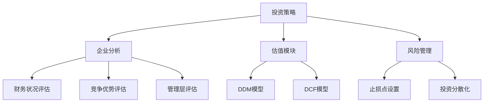
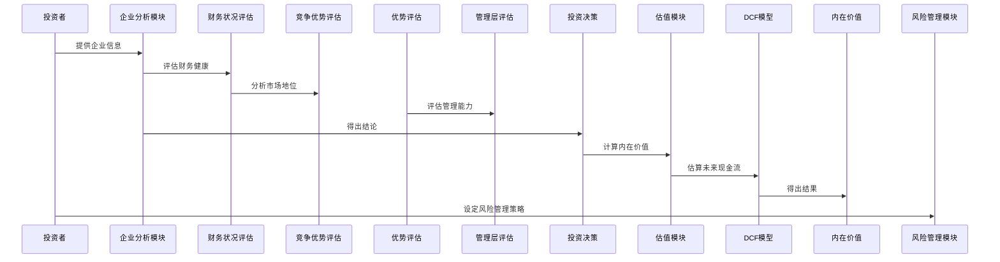

                 


```markdown
# 巴菲特的'股票就是企业'理念：投资者vs投机者

## 关键词：巴菲特, 投资者, 投机者, 价值投资, 股票, 企业

## 摘要：本文深入探讨了巴菲特的核心投资理念，即“股票就是企业”，并对比了投资者和投机者的不同策略和心理。通过详细分析巴菲特的背景、投资哲学、价值投资与成长投资的区别，以及风险管理策略，本文帮助读者理解如何在投资中避免短期波动，注重长期价值，从而做出明智的投资决策。

---

## 第一部分：巴菲特投资理念的背景与核心观点

### 第1章：巴菲特的生平与投资哲学

#### 1.1 巴菲特的生平简介
- 1.1.1 早年经历与教育背景
  - 巴菲特出生于1934年，童年时期展现出对投资的兴趣。
  - 在哥伦比亚大学获得经济学学位，师从本杰明·格雷厄姆。
- 1.1.2 投资生涯的起点
  - 初中时期开始投资，16岁时购买第一桶可口可乐。
  - 与合伙人创建巴菲特合伙公司，开始职业投资生涯。
- 1.1.3 投资哲学的演变
  - 从格雷厄姆的价值投资转向基本面分析和长期持有。

#### 1.2 巴菲特的核心投资理念
- 股票是企业的部分所有权，而非市场波动的产物。
- 长期持有优秀企业，追求内在价值的增长。

---

### 第2章：价值投资与成长投资的对比

#### 2.1 价值投资的定义与特点
- 核心理念：寻找市场价格低于内在价值的企业。
- 关键要素：关注企业的财务状况、竞争优势和管理层。
- 长期收益表现：稳定且高于市场平均水平。

#### 2.2 成长投资的定义与特点
- 核心理念：投资于具有持续增长潜力的企业。
- 关键要素：关注企业的成长性、创新能力和行业地位。
- 风险与回报：波动较大，但长期回报可能更高。

#### 2.3 投资者与投机者的对比
- 行为特征对比：
  |  投资者       | 投机者        |
  |----------------|---------------|
  | 长期视角      | 短期视角      |
  | 价值驱动      | 市场情绪驱动   |
  | 低风险承受    | 高风险承受   |
- 长期收益表现：投资者通常更稳定，而投机者波动大。

---

### 第3章：巴菲特的投资策略与风险管理

#### 3.1 投资组合的构建
- 分散化原则：避免过度集中，降低风险。
- 调整策略：定期评估，调整持股比例。
- 风险评估：关注企业的财务健康和市场环境。

#### 3.2 风险管理的技巧
- 风险定义与分类：市场风险、企业风险、流动性风险。
- 风险量化与评估：使用波动率、VaR等指标。
- 风险控制策略：设定止损点，分散投资。

---

### 第4章：巴菲特的经典投资案例分析

#### 4.1 可口可乐的投资案例
- 投资背景：可口可乐的全球品牌和稳定的现金流。
- 决策过程：基于企业的竞争优势和长期增长潜力。
- 投资成果：长期持有，获得丰厚回报。

#### 4.2 苹果公司的投资案例
- 投资背景：苹果的创新能力和强大的财务状况。
- 决策过程：评估公司的竞争优势和管理层能力。
- 投资成果：成为苹果的重要股东，获得巨大收益。

---

## 第二部分：价值投资的数学模型与系统分析

### 第5章：价值投资的数学模型

#### 5.1 股息贴现模型（DDM）
- 公式：$$ V = \frac{D}{k - g} $$
- 应用：评估企业的内在价值，基于股息的现值。

#### 5.2 现金流贴现模型（DCF）
- 步骤：
  1. 估算未来现金流。
  2. 计算加权平均资本成本（WACC）。
  3. 折现现金流，计算企业价值。
- 公式：$$ WACC = \frac{D}{V} \times r_d \times (1 - t) + \frac{E}{V} \times r_e $$

#### 5.3 市盈率与市净率分析
- 市盈率：$$ PE = \frac{P}{E} $$
- 市净率：$$ PB = \frac{P}{B} $$
- 应用：评估企业相对于行业的估值水平。

---

### 第6章：系统架构与投资策略

#### 6.1 投资策略的系统架构
- 问题场景：寻找具备竞争优势、良好管理和增长潜力的企业。
- 系统功能设计：
  - 企业分析模块：评估财务状况、竞争优势和管理层。
  - 估值模块：使用DDM、DCF等模型计算内在价值。
  - 风险管理模块：设定止损点和分散投资策略。

#### 6.2 系统架构图


#### 6.3 系统交互流程


---

## 第三部分：项目实战与最佳实践

### 第7章：项目实战

#### 7.1 环境安装
- 工具：Excel、金融分析软件（如Morningstar）。
- 数据来源：公司财报、行业报告、市场数据。

#### 7.2 核心实现
```python
import pandas as pd
import numpy as np

# 示例：使用股息贴现模型计算企业价值
def ddm_model(dividend, growth_rate, required_return):
    return dividend / (required_return - growth_rate)

# 数据输入
dividend = 1.5
growth_rate = 0.03
required_return = 0.08

# 计算企业价值
value = ddm_model(dividend, growth_rate, required_return)
print(f"企业价值：{value}")
```

#### 7.3 案例分析
- 选择一家公司，分析其财务状况、竞争优势，计算其内在价值。
- 对比市场价格，决定是否投资。

---

### 第8章：最佳实践与小结

#### 8.1 投资策略总结
- 长期持有优质企业，避免短期波动。
- 采用价值投资，关注企业的内在价值。

#### 8.2 注意事项
- 风险管理：设定止损点，分散投资。
- 持续学习：关注行业动态，更新投资知识。

#### 8.3 拓展阅读
- 格雷厄姆的《证券分析》。
- 巴菲特的股东大会讲话。

---

## 结语
巴菲特的“股票就是企业”理念强调长期投资和价值导向，区别于投机者的短期行为。通过深入理解价值投资的核心要素，投资者可以在复杂的市场环境中做出明智决策，实现长期稳定的收益。

---

**提示：** 如果您对任何部分需要进一步的解释或代码示例，请随时告诉我！
```

