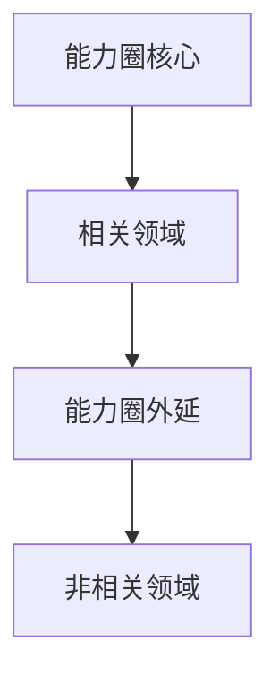
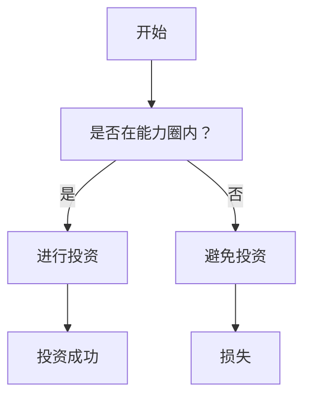
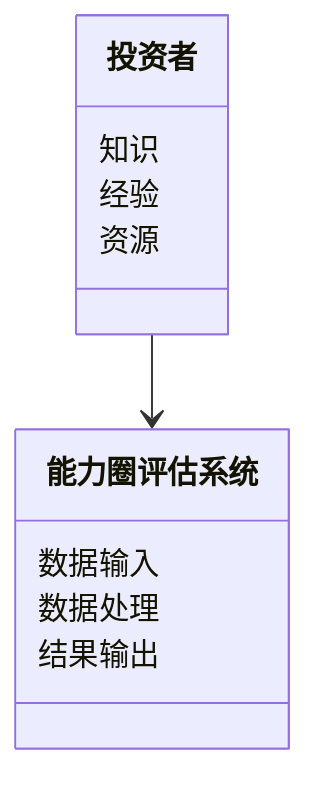
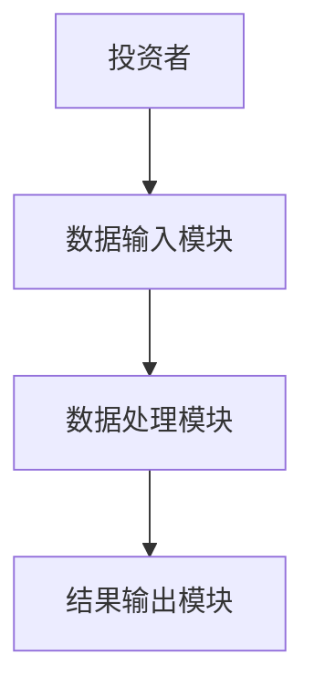
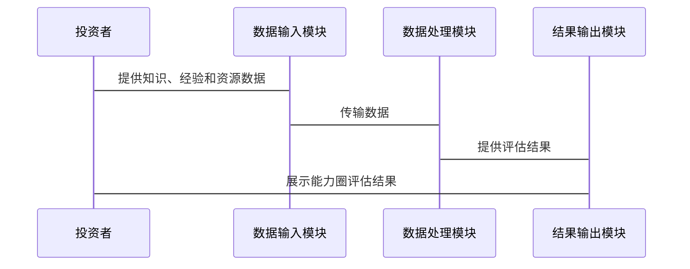

                 


# 巴菲特的“能力圈”：专注于你了解的领域

## 关键词：能力圈、巴菲特、投资、决策树、护城河、竞争优势、数学模型

## 摘要：  
巴菲特的“能力圈”理论强调投资者应专注于自己熟悉和擅长的领域，避免超出能力范围的投资决策。本文从技术角度出发，通过逻辑推理和系统分析，深入探讨能力圈的核心概念、算法模型、系统架构以及实际应用。我们结合决策树、概率论等数学工具，分析能力圈的边界与外延，并通过具体案例展示如何构建和优化能力圈，以实现更高效的投资决策。

---

## 第一章: 能力圈的核心概念与背景

### 1.1 能力圈的定义与背景

#### 1.1.1 能力圈的定义  
能力圈（Circle of Competence）是巴菲特提出的一个核心投资理念，指的是投资者在知识、经验和资源上的优势领域。只有在能力圈内进行投资，才能有效降低风险并提高收益。

#### 1.1.2 能力圈的起源与历史背景  
能力圈理论起源于巴菲特的投资哲学，强调“知道自己不懂的东西”，即避免投资于自己不熟悉的领域。这一理念在投资领域具有深远的影响，成为价值投资的重要原则。

#### 1.1.3 巴菲特对能力圈的诠释  
巴菲特认为，能力圈并非固定不变，而是可以通过不断学习和实践来扩展。但前提是必须深刻理解能力圈的边界，避免盲目扩张。

### 1.2 能力圈的核心要素

#### 1.2.1 知识的深度与广度  
能力圈的核心在于知识的深度（对特定领域的深入了解）和广度（跨领域的知识储备）。深度决定了在某一领域的专业性，广度则帮助识别跨领域的机会。

#### 1.2.2 个人能力的边界  
能力圈的边界由个人的知识、经验和资源决定。超出能力圈的投资往往会导致失败。

#### 1.2.3 投资领域的外延  
能力圈的外延是指与核心领域相关的扩展领域。这些领域虽然不是核心能力所在，但可以通过能力圈的延伸进行投资。

### 1.3 能力圈与投资决策的关系

#### 1.3.1 能力圈在投资中的作用  
能力圈帮助投资者专注于自己熟悉的领域，降低投资风险，提高决策的准确性。

#### 1.3.2 超越能力圈的后果  
超出能力圈的投资往往基于不确定的信息，可能导致重大损失。

#### 1.3.3 能力圈的动态调整  
能力圈并非一成不变，随着知识和经验的积累，能力圈可以逐步扩展。

## 1.4 本章小结  
能力圈是巴菲特投资理论的核心，它强调专注和深入理解特定领域。通过动态调整能力圈，投资者可以更好地把握机会，降低风险。

---

## 第二章: 能力圈的边界与外延

### 2.1 能力圈的边界分析

#### 2.1.1 知识的边界  
知识的边界是能力圈的核心限制因素。投资者必须清楚自己知识的局限性。

#### 2.1.2 经验的边界  
经验的边界决定了投资者在特定领域的熟练程度。缺乏经验的投资者应避免进入陌生领域。

#### 2.1.3 能力的边界  
能力的边界涉及投资者的专业技能和资源。超出能力范围的投资往往不可行。

### 2.2 能力圈的外延特征

#### 2.2.1 相关领域的扩展  
能力圈的外延包括与核心领域相关的扩展领域。这些领域可以通过能力圈的延伸进行投资。

#### 2.2.2 非相关领域的风险  
非相关领域的投资风险较高，因为投资者缺乏对该领域的深入了解。

#### 2.2.3 能力圈的模糊区域  
能力圈的模糊区域是指介于核心领域和非相关领域之间的灰色地带。投资者需要谨慎评估这些区域的风险。

### 2.3 能力圈的可视化分析

#### 2.3.1 能力圈的图形化表示  
以下是能力圈的图形化表示：



#### 2.3.2 能力圈与投资领域的对应关系  
能力圈的核心与投资领域的核心领域对应，外延与相关领域对应，模糊区域与非相关领域对应。

#### 2.3.3 能力圈的动态变化  
能力圈的边界会随着知识和经验的积累而动态调整。

### 2.4 本章小结  
能力圈的边界和外延决定了投资者的决策范围。清晰的能力圈边界和动态调整是成功投资的关键。

---

## 第三章: 能力圈与竞争优势

### 3.1 能力圈与护城河

#### 3.1.1 护城河的定义与分类  
护城河是企业抵御竞争对手的核心优势，常见的护城河包括成本优势、品牌优势和技术优势。

#### 3.1.2 能力圈如何构建护城河  
投资者通过专注于特定领域，可以构建自己的护城河，增强竞争优势。

#### 3.1.3 护城河如何强化能力圈  
护城河的存在可以进一步巩固能力圈，降低外部竞争压力。

### 3.2 能力圈的竞争优势

#### 3.2.1 能力圈的竞争优势来源  
能力圈的竞争优势来源于对特定领域的深入理解和资源积累。

#### 3.2.2 能力圈的竞争优势与投资机会  
能力圈的竞争优势帮助投资者识别和抓住投资机会，提高投资回报率。

### 3.3 本章小结  
能力圈与竞争优势密切相关。通过构建护城河，投资者可以巩固能力圈，增强竞争优势。

---

## 第四章: 能力圈的算法与数学模型

### 4.1 能力圈的决策树模型

#### 4.1.1 决策树的基本概念  
决策树是一种树状结构，用于表示决策过程。每个节点代表一个决策点，叶子节点代表最终结果。

#### 4.1.2 决策树在能力圈中的应用  
决策树可以帮助投资者在能力圈内进行决策，通过逐步排除法缩小选择范围。

#### 4.1.3 决策树的构建过程  
以下是决策树的构建过程：



### 4.2 能力圈的数学模型

#### 4.2.1 贝叶斯定理的应用  
贝叶斯定理可以帮助投资者在能力圈内评估投资机会的概率。公式如下：

$$ P(A|B) = \frac{P(B|A) \cdot P(A)}{P(B)} $$

其中，\( P(A|B) \) 表示在 B 条件下 A 的概率，\( P(B|A) \) 表示在 A 条件下 B 的概率，\( P(A) \) 是 A 的先验概率，\( P(B) \) 是 B 的全概率。

#### 4.2.2 投资机会的评估  
通过贝叶斯定理，投资者可以在能力圈内评估投资机会的可行性。例如，评估某个股票在能力圈内的投资概率。

### 4.3 本章小结  
决策树和贝叶斯定理是能力圈分析的重要工具。通过这些算法，投资者可以更科学地进行决策。

---

## 第五章: 系统分析与架构设计

### 5.1 系统功能设计

#### 5.1.1 领域模型  
以下是能力圈评估系统的领域模型：



### 5.2 系统架构设计

#### 5.2.1 系统架构  
以下是能力圈评估系统的架构图：



### 5.3 系统接口设计

#### 5.3.1 输入接口  
输入接口接收投资者的知识、经验和资源数据。

#### 5.3.2 输出接口  
输出接口提供能力圈评估结果，包括核心领域和相关领域的建议。

### 5.4 系统交互设计

#### 5.4.1 交互流程  
以下是能力圈评估系统的交互流程：



### 5.5 本章小结  
能力圈评估系统通过数据输入、处理和输出模块，帮助投资者科学地进行能力圈评估。

---

## 第六章: 项目实战

### 6.1 环境安装

#### 6.1.1 Python环境搭建  
安装Python和必要的库，如numpy、pandas、scikit-learn。

### 6.2 系统核心实现源代码

#### 6.2.1 决策树实现  
以下是决策树的Python代码：

```python
from sklearn.tree import DecisionTreeClassifier
from sklearn.datasets import make_classification
from sklearn.model_selection import train_test_split
from sklearn.metrics import accuracy_score

# 生成数据
X, y = make_classification(n_samples=100, n_features=2, n_classes=2, random_state=42)

# 划分训练集和测试集
X_train, X_test, y_train, y_test = train_test_split(X, y, test_size=0.2, random_state=42)

# 训练决策树模型
model = DecisionTreeClassifier()
model.fit(X_train, y_train)

# 预测
y_pred = model.predict(X_test)

# 评估准确率
print("Accuracy:", accuracy_score(y_test, y_pred))
```

#### 6.2.2 贝叶斯模型实现  
以下是贝叶斯模型的Python代码：

```python
from sklearn.naive_bayes import GaussianNB
from sklearn.datasets import make_classification
from sklearn.model_selection import train_test_split
from sklearn.metrics import accuracy_score

# 生成数据
X, y = make_classification(n_samples=100, n_features=2, n_classes=2, random_state=42)

# 划分训练集和测试集
X_train, X_test, y_train, y_test = train_test_split(X, y, test_size=0.2, random_state=42)

# 训练贝叶斯模型
model = GaussianNB()
model.fit(X_train, y_train)

# 预测
y_pred = model.predict(X_test)

# 评估准确率
print("Accuracy:", accuracy_score(y_test, y_pred))
```

### 6.3 项目小结  
通过项目实战，我们展示了如何在能力圈评估中应用决策树和贝叶斯模型。

---

## 第七章: 最佳实践与小结

### 7.1 小结  
能力圈是巴菲特投资理论的核心，通过专注和深入理解特定领域，投资者可以降低风险，提高投资回报。

### 7.2 注意事项  
投资者应清楚能力圈的边界，避免盲目扩张。同时，能力圈需要动态调整，以适应市场变化。

### 7.3 拓展阅读  
推荐阅读巴菲特的《聪明的投资者》和《投资的真相》。

---

## 总结  
能力圈是投资成功的关键。通过科学的方法和工具，投资者可以在能力圈内做出更明智的决策。希望本文能为您提供有价值的见解和启发。

