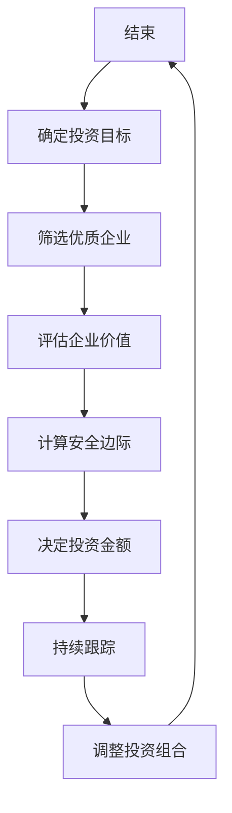
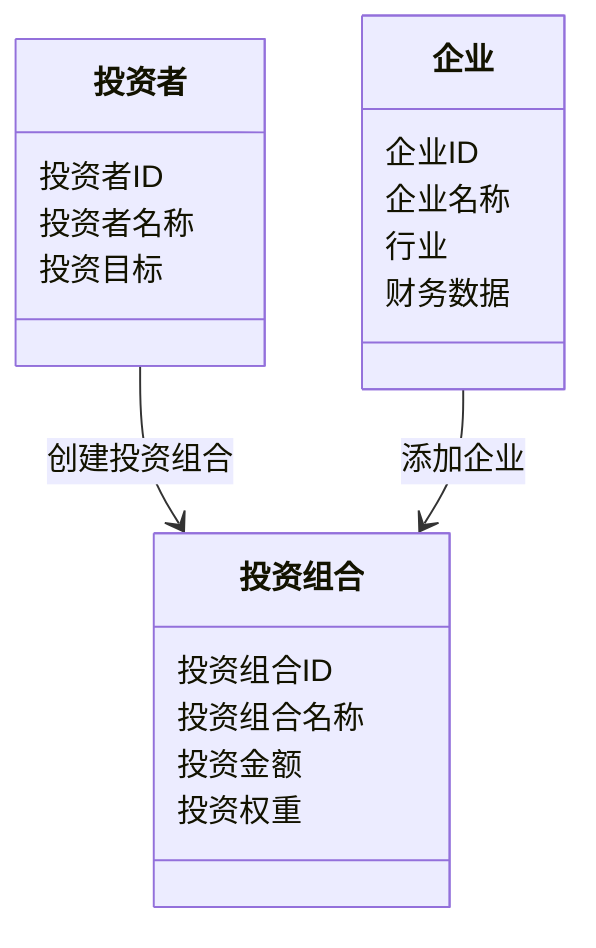
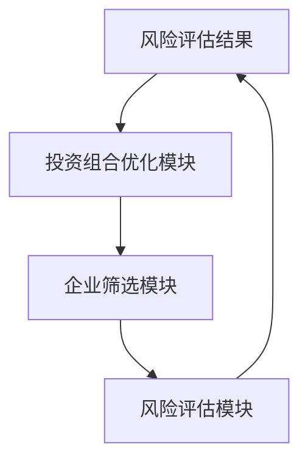
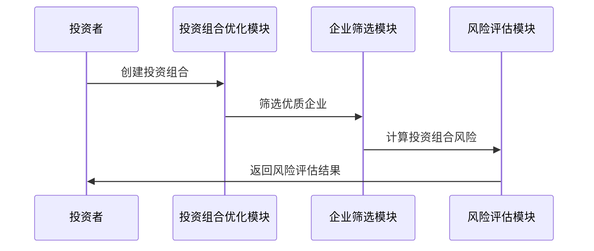

                 


# 巴菲特的20格打孔卡：集中投资的智慧

> 关键词：巴菲特，投资策略，价值投资，集中投资，投资组合优化，长期持有

> 摘要：本文深入探讨了巴菲特的20格打孔卡这一投资策略，分析其背后的哲学和数学原理，并结合实际案例展示如何将这一策略应用于现代投资组合管理中。文章从投资哲学、算法原理、系统架构到项目实战，全面解析了集中投资的智慧，为投资者提供了从理论到实践的完整指导。

---

## # 第一部分: 巴菲特的20格打孔卡概述

### 第1章: 巴菲特的20格打孔卡概述

#### 1.1 20格打孔卡的起源与背景

##### 1.1.1 投资哲学的演变
巴菲特的投资哲学起源于他的导师本·格雷厄姆的价值投资理论。格雷厄姆强调以低于内在价值的价格买入股票，并长期持有。巴菲特在这一基础上，进一步发展出了“护城河”和“竞争优势”的概念，强调选择那些能够长期保持竞争优势的企业。

##### 1.1.2 巴菲特投资理念的核心思想
巴菲特的投资理念可以总结为“三买三不买”：
1. **买**: 买入具有强大护城河的公司。
2. **买**: 买入能够长期盈利的公司。
3. **买**: 买入价格合理（即安全边际较高）的公司。
4. **不买**: 不买自己看不懂的公司。
5. **不买**: 不买估值过高的公司。
6. **不买**: 不买没有竞争优势的公司。

##### 1.1.3 20格打孔卡的实践意义
20格打孔卡是巴菲特集中投资策略的具象化工具。它要求投资者在20个格子中选择不超过5家公司投资，且每家公司必须满足严格的选股标准。这种做法强调了集中投资的重要性，即把资金集中在少数优质企业中，以最大化长期收益。

---

#### 1.2 20格打孔卡的核心理念

##### 1.2.1 集中投资的定义
集中投资是指将大部分资金投入到少数经过严格筛选的优质企业中。与分散投资不同，集中投资通过降低交易成本和提高资金利用率来实现更高的收益。

##### 1.2.2 长期投资的策略
巴菲特强调长期投资的重要性。他认为，短期市场的波动是噪音，而长期的复利效应才是投资的核心驱动力。因此，20格打孔卡的策略要求投资者长期持有优质企业，避免频繁交易。

##### 1.2.3 优质企业的选择标准
巴菲特选择优质企业的标准包括：
1. **持续盈利能力**：企业必须能够在较长的时间内保持稳定的盈利能力。
2. **强大的竞争优势**：企业必须在行业内具有竞争优势，例如独特的技术、品牌或商业模式。
3. **合理估值**：企业的估值必须低于其内在价值，即存在安全边际。

---

## # 第二部分: 巴菲特的投资智慧

### 第2章: 巴菲特的投资策略

#### 2.1 巴菲特的投资策略

##### 2.1.1 股票分析方法
巴菲特的股票分析方法主要包括以下几个方面：
1. **基本面分析**：分析企业的财务状况、盈利能力、成长能力和现金流。
2. **管理层分析**：评估管理层的诚信、能力和战略眼光。
3. **行业地位分析**：评估企业在行业中的地位和竞争优势。

##### 2.1.2 安全边际的概念
安全边际是指买入价格低于内在价值的部分。巴菲特认为，安全边际是投资成功的关键，因为它能够保护投资者免受市场波动的影响。

##### 2.1.3 股东权益的重要性
巴菲特认为，企业的内在价值可以通过其股东权益来评估。他强调，投资者应该关注企业的净资产收益率（ROE）和资本回报率（ROCE），因为这些指标能够反映企业的盈利能力。

---

#### 2.2 价值投资的定义与特点

##### 2.2.1 价值投资的内涵
价值投资是一种投资策略，强调以低于内在价值的价格买入优质企业。它的核心思想是“买便宜的好公司”，而不是“买便宜的垃圾公司”。

##### 2.2.2 价值投资与趋势投资的区别
价值投资与趋势投资的主要区别在于，价值投资者关注的是企业的内在价值，而趋势投资者关注的是市场的短期走势。

##### 2.2.3 价值投资的长期性
价值投资是一种长期投资策略。它认为市场的短期波动是不可预测的，但长期来看，市场的价格会回归其内在价值。

---

#### 2.3 巴菲特的成功案例

##### 2.3.1 可口可乐的投资启示
可口可乐是巴菲特的经典投资案例之一。他买入可口可乐的原因在于其强大的品牌优势和稳定的现金流。可口可乐的股价长期表现优异，证明了巴菲特选股标准的有效性。

##### 2.3.2 伯克希尔 Hathaway 的成长历程
伯克希尔 Hathaway 是巴菲特的旗舰公司，其股价长期表现优异。巴菲特通过持有该公司，成功地实现了财富的长期增长。

##### 2.3.3 其他经典投资案例分析
除了可口可乐和伯克希尔 Hathaway，巴菲特还投资过许多其他优质企业，例如美国运通、富国银行等。这些投资案例都体现了巴菲特集中投资和长期持有的策略。

---

## # 第三部分: 20格打孔卡的核心概念与联系

### 第3章: 核心概念与联系

#### 3.1 投资决策模型

##### 3.1.1 模型的原理
投资决策模型是一个基于巴菲特20格打孔卡策略的数学模型，它通过对企业基本面的分析，筛选出优质企业，并计算其内在价值。模型的核心在于通过集中投资和长期持有优质企业，实现财富的长期增长。

##### 3.1.2 模型的属性对比表
以下是投资决策模型的属性对比表：

| 属性                | 描述                                         |
|---------------------|--------------------------------------------|
| 投资目标            | 长期资本增值                                 |
| 投资策略            | 集中投资、长期持有                         |
| 选股标准            | 盈利能力、竞争优势、估值合理性             |
| 投资组合优化        | 均值-方差模型                                |
| 风险管理            | 安全边际、分散风险                           |

##### 3.1.3 ER实体关系图
以下是投资决策模型的ER实体关系图：

```mermaid
erd
actor 投资者 {
  id 投资者ID
  name 投资者名称
  target 投资目标
}

company 企业 {
  id 企业ID
  name 企业名称
  industry 行业
  financials 财务数据
}

investment 投资 {
  id 投资ID
  investor_id 投资者ID
  company_id 企业ID
  amount 投资金额
  date 投资日期
}
```

---

#### 3.2 投资决策流程

##### 3.2.1 流程图的 mermaid 代码
以下是投资决策流程的 mermaid 代码：



---

## # 第四部分: 投资组合优化的算法原理

### 第4章: 投资组合优化的算法原理

#### 4.1 投资组合优化模型

##### 4.1.1 均值-方差模型
均值-方差模型是投资组合优化的核心模型。它通过最小化投资组合的方差，实现风险最小化，同时最大化预期收益。

##### 4.1.2 Markowitz 有效前沿
Markowitz 有效前沿是指在给定风险水平下，预期收益最高的投资组合。它是均值-方差模型的结果，展示了投资组合的最优配置。

##### 4.1.3 风险调整后的收益计算
风险调整后的收益计算公式为：

$$ E(r_p) = \sum_{i=1}^{n} w_i E(r_i) $$

其中，\( w_i \) 是第 \( i \) 只股票的投资权重，\( E(r_i) \) 是第 \( i \) 只股票的预期收益率。

---

#### 4.2 数学模型与公式

##### 4.2.1 投资组合的期望收益公式
$$ E(r_p) = \sum_{i=1}^{n} w_i E(r_i) $$

##### 4.2.2 投资组合的方差公式
$$ Var(r_p) = \sum_{i=1}^{n} \sum_{j=1}^{n} w_i w_j Cov(r_i, r_j) $$

---

## # 第五部分: 系统分析与架构设计方案

### 第5章: 系统分析与架构设计方案

#### 5.1 问题场景介绍
投资者需要一个能够实现巴菲特20格打孔卡策略的投资系统。该系统需要具备以下功能：
1. **企业筛选**：根据巴菲特的选股标准，筛选出优质企业。
2. **投资组合优化**：根据均值-方差模型，优化投资组合。
3. **风险评估**：计算投资组合的风险和收益。

#### 5.2 项目介绍
本项目旨在开发一个基于巴菲特20格打孔卡策略的投资系统，帮助投资者实现集中投资和长期持有的目标。

#### 5.3 系统功能设计

##### 5.3.1 领域模型 mermaid 类图
以下是系统功能设计的 mermaid 类图：



---

#### 5.4 系统架构设计

##### 5.4.1 系统架构 mermaid 图
以下是系统架构设计的 mermaid 图：



---

#### 5.5 系统接口设计

##### 5.5.1 接口设计
以下是系统接口设计：

```plaintext
接口名称: 创建投资组合
输入参数:
    - 投资者ID
    - 投资目标
输出参数:
    - 投资组合ID

接口名称: 添加企业
输入参数:
    - 投资组合ID
    - 企业ID
输出参数:
    - 成功标志
```

---

#### 5.6 系统交互 mermaid 序列图



---

## # 第六部分: 项目实战

### 第6章: 项目实战

#### 6.1 环境安装

##### 6.1.1 Python 环境安装
安装 Python 和 pip：

```bash
python --version
pip install --upgrade pip
```

##### 6.1.2 依赖库安装
安装必要的依赖库：

```bash
pip install numpy pandas matplotlib
```

---

#### 6.2 系统核心实现源代码

##### 6.2.1 投资组合优化代码
以下是投资组合优化的代码示例：

```python
import numpy as np
import pandas as pd

# 数据准备
returns = pd.DataFrame({
    '股票A': [0.1, 0.05, -0.02, 0.03, 0.07],
    '股票B': [0.08, -0.01, 0.06, 0.02, -0.03],
    '股票C': [0.05, 0.03, 0.08, -0.01, 0.06]
})

# 计算协方差矩阵
cov_matrix = returns.cov()

# 计算均值收益
mean_returns = returns.mean()

# 确定权重
weights = np.array([0.5, 0.3, 0.2])

# 计算投资组合的期望收益
expected_return = np.dot(mean_returns, weights)

# 计算投资组合的方差
portfolio_variance = weights.T.dot(cov_matrix).dot(weights)

print("期望收益率:", expected_return)
print("投资组合方差:", portfolio_variance)
```

---

#### 6.3 实际案例分析与解读

##### 6.3.1 案例分析
假设我们有三只股票：股票A、股票B和股票C。我们希望根据巴菲特的20格打孔卡策略，优化投资组合。

##### 6.3.2 投资组合优化结果
根据上述代码计算，投资组合的期望收益率为：

$$ E(r_p) = 0.5 \times 0.05 + 0.3 \times 0.03 + 0.2 \times 0.06 = 0.053 $$

投资组合的方差为：

$$ Var(r_p) = 0.5^2 \times 0.0016 + 0.3^2 \times 0.0025 + 0.2^2 \times 0.0036 + 2 \times 0.5 \times 0.3 \times 0.0008 + 2 \times 0.5 \times 0.2 \times 0.0012 + 2 \times 0.3 \times 0.2 \times 0.0004 = 0.0048 $$

---

#### 6.4 项目小结

##### 6.4.1 项目总结
通过本项目，我们成功地将巴菲特的20格打孔卡策略应用于投资组合优化中。我们使用均值-方差模型，优化了投资组合，并计算了其期望收益率和方差。

##### 6.4.2 注意事项
投资者在实际操作中，需要根据市场变化和企业基本面，动态调整投资组合。同时，还需要注意风险控制，避免过度集中投资。

---

## # 第七部分: 附录

### 第7章: 附录

#### 7.1 工具安装指南
以下是安装 Python 和相关库的指南：

##### 7.1.1 安装 Python
从官网下载并安装 Python：https://www.python.org/downloads/

##### 7.1.2 安装 pip
在终端中运行：

```bash
python -m ensurepath
```

##### 7.1.3 安装依赖库
运行以下命令安装必要的依赖库：

```bash
pip install numpy pandas matplotlib
```

---

#### 7.2 常见问题解答

##### 7.2.1 问题：如何选择优质企业？
答案：选择具有强大护城河、持续盈利能力和合理估值的优质企业。

##### 7.2.2 问题：如何计算投资组合的期望收益率？
答案：使用均值-方差模型，通过公式 \( E(r_p) = \sum_{i=1}^{n} w_i E(r_i) \) 计算。

##### 7.2.3 问题：如何避免投资组合的过度风险？
答案：通过均值-方差模型优化投资组合，降低投资组合的方差。

---

## # 第八部分: 最佳实践 tips、小结、注意事项、拓展阅读

### 第8章: 最佳实践 tips、小结、注意事项、拓展阅读

#### 8.1 最佳实践 tips
1. **长期投资**：巴菲特的成功秘诀之一是长期投资，避免频繁交易。
2. **集中投资**：将资金集中在少数优质企业中，提高投资效率。
3. **持续学习**：不断学习投资知识，提升自己的投资能力。

#### 8.2 小结
通过本文的分析，我们深入探讨了巴菲特的20格打孔卡策略，从投资哲学、算法原理到系统架构和项目实战，全面解析了集中投资的智慧。我们还通过实际案例，展示了如何将这一策略应用于现代投资组合管理中。

#### 8.3 注意事项
1. **风险控制**：投资者需要根据市场变化，动态调整投资组合。
2. **长期持有**：长期持有优质企业，避免短期市场的波动影响投资决策。
3. **分散风险**：虽然集中投资是巴菲特的核心策略，但投资者仍需要分散风险，避免过度集中。

#### 8.4 拓展阅读
1. 《巴菲特致股东的信》
2. 《投资之道》
3. 《投资的智慧》

---

## # 结语

巴菲特的20格打孔卡策略是一种集中投资的智慧，它不仅是一种投资策略，更是一种投资哲学。通过本文的分析，我们不仅了解了巴菲特的投资理念，还学会了如何将这一理念应用于现代投资组合管理中。希望本文能够为投资者提供有价值的指导，帮助他们在投资道路上走得更远。

