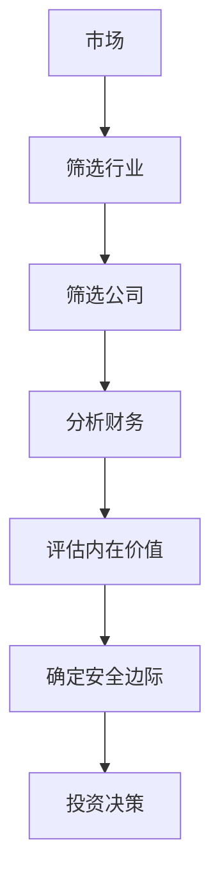
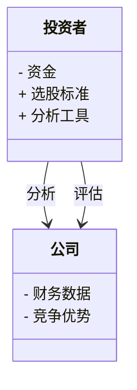

                 

# 巴菲特的价值投资实践案例分析

## 关键词：巴菲特，价值投资，投资案例，投资策略，股票分析，投资哲学，长期投资

## 摘要：  
本文深入分析了巴菲特的价值投资实践，从其投资哲学、选股标准到实际案例，全面解析了巴菲特如何通过基本面分析和长期持有实现超额收益。文章结合技术语言，使用系统化的分析方法，探讨了巴菲特的投资策略在实际中的应用，并通过经典案例展示了其投资决策的逻辑。

---

## 第1章 价值投资的背景与巴菲特的投资哲学

### 1.1 价值投资的定义与背景  
- 价值投资：一种以基本面分析为基础的投资方法，旨在通过识别市场价格低于内在价值的资产，实现长期稳定的收益。  
- 投资市场的不确定性：价格波动与价值的分离为价值投资提供了机会。  
- 巴菲特的贡献：将价值投资理念系统化、通俗化，成为全球投资领域的经典方法。  

### 1.2 巴菲特的投资哲学  
- **长期主义**：巴菲特强调长期持有优质资产，而非短期交易。  
- **安全边际**：买入价格低于内在价值，确保投资的安全性。  
- **竞争优势**：投资具有强大护城河的企业，确保企业未来的盈利能力。  

### 1.3 投资哲学的核心要素  
| 核心要素 | 描述 | 重要性 |
|----------|------|--------|
| 内在价值 | 资产的真实价值，基于未来现金流的折现 | 核心，决定买入价格 |
| 安全边际 | 买入价格与内在价值的差距 | 确保投资的安全性 |
| 竞争优势 | 企业的独特优势，确保长期盈利能力 | 决定企业的未来价值 |

---

## 第2章 价值投资的核心概念与分析框架

### 2.1 内在价值的计算方法  
- 内在价值公式：  
  $$ V = \frac{CF}{r} $$  
  其中，CF为未来现金流，r为折现率。  
- 例：假设某公司未来现金流为100万元，折现率为10%，则内在价值为1000万元。  

### 2.2 安全边际的计算与作用  
- 安全边际公式：  
  $$ \text{安全边际} = V_{\text{内在}} - P_{\text{市场}} $$  
  其中，\( V_{\text{内在}} \)为内在价值，\( P_{\text{市场}} \)为市场价格。  
- 例：内在价值为1200万元，市场价格为1000万元，安全边际为200万元。  

### 2.3 价值投资的分析框架  

---

## 第3章 巴菲特的选股标准与投资策略

### 3.1 选股标准  
- **财务健康**：关注企业的盈利能力、现金流和负债情况。  
- **竞争优势**：寻找具有强大护城河的企业，如品牌、技术、成本优势。  
- **管理团队**：信任管理层的能力和诚信。  

### 3.2 行业偏好  
- 偏好行业：消费、金融、能源等具有稳定现金流的行业。  
- 不偏好行业：技术更新快、竞争激烈的行业。  

### 3.3 投资策略  

---

## 第4章 经典投资案例分析

### 4.1 可口可乐案例  
- **背景**：可口可乐具有强大的品牌优势和稳定的现金流。  
- **分析**：计算内在价值，确定安全边际。  
- **结果**：长期持有，获得超额收益。  

### 4.2 苹果公司案例  
- **背景**：苹果具有强大的技术创新和市场地位。  
- **分析**：评估其竞争优势和未来现金流。  
- **结果**：巴菲特通过长期持有，获得巨大收益。  

---

## 第5章 价值投资的系统化分析

### 5.1 系统分析框架  

### 5.2 投资组合管理  
- **分散投资**：降低风险，避免单一资产损失过大。  
- **动态调整**：定期评估资产，重新平衡投资组合。  

---

## 第6章 价值投资的实际应用与拓展

### 6.1 价值投资的现代挑战  
- 通货膨胀的影响：如何通过投资保值。  
- 数字化转型：新兴行业中的价值投资机会。  

### 6.2 价值投资的未来展望  
- 技术赋能：利用大数据和人工智能辅助投资决策。  
- 教育普及：让更多人了解价值投资的逻辑。  

---

## 第7章 总结与思考

### 7.1 核心观点回顾  
- 价值投资的本质是寻找低估的优质资产。  
- 长期持有和分散投资是实现财富增长的关键。  

### 7.2 投资者的心理与纪律  
- 克服短期波动的诱惑，坚持长期投资。  
- 遵循纪律，严格执行投资计划。  

### 7.3 最后思考  
- 投资不仅是技术分析，更是一种哲学。  
- 价值投资的核心是寻找优秀的公司，与优秀的企业共同成长。

---

## 参考文献  
1. 巴菲特股东大会演讲集。  
2. 《巴菲特传：一个美国资本家的成功之路》。  
3. 《价值投资实战策略》。  

---

## END

