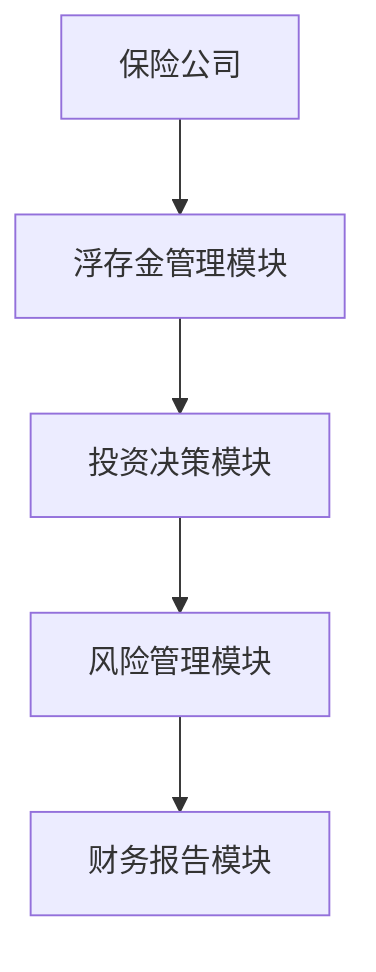

                 


# 巴菲特的保险浮存金策略：在低利率环境中的新思考

---

## 关键词：
- 保险浮存金、巴菲特、低利率环境、投资策略、风险管理

---

## 摘要：
本文深入探讨了巴菲特的保险浮存金策略在低利率环境中的应用与创新。通过分析浮存金的定义、历史发展、数学模型及系统架构，结合实际案例，揭示了浮存金在投资和风险管理中的关键作用。文章还讨论了低利率环境下浮存金策略的挑战与机遇，并提出了优化策略。

---

# 第1章：保险浮存金概述

## 1.1 保险浮存金的定义与特点

### 1.1.1 保险浮存金的定义

保险浮存金是指保险公司为履行未来保险赔付责任而持有的资金。这部分资金来源于保费收入，用于支付未来的理赔支出。

### 1.1.2 保险浮存金的特点

- **负债属性**：浮存金是保险公司的一项负债，需在未来偿付。
- **规模庞大**：保险业务规模越大，浮存金规模越大。
- **低成本资金**：相对于其他资金来源，浮存金的成本较低。

---

## 1.2 巴菲特与保险浮存金的渊源

### 1.2.1 巴菲特的保险投资理念

巴菲特认为保险浮存金是低成本资金，可以用于投资优质资产，创造超额收益。

### 1.2.2 巴菲特如何利用浮存金创造价值

通过持有优质企业股权，巴菲特利用浮存金实现长期稳健收益。

### 1.2.3 巴菲特浮存金策略的核心思想

将浮存金视为投资工具，而非单纯的负债，通过投资优质资产实现价值增长。

---

## 1.3 低利率环境下的浮存金策略

### 1.3.1 低利率环境的背景分析

近年来，全球低利率甚至负利率环境普遍存在，影响浮存金的收益与管理。

### 1.3.2 浮存金在低利率环境中的优势

低成本资金优势更加显著，但收益压力增大。

### 1.3.3 低利率环境对保险公司的挑战与机遇

挑战：收益率下降；机遇：低成本资金可用于长期投资。

---

# 第2章：保险浮存金的历史演变

## 2.1 保险浮存金的起源

保险行业早期发展推动了浮存金的形成。

## 2.2 巴菲特时代浮存金策略的创新

巴菲特将浮存金视为投资工具，创新其使用方式。

## 2.3 当前浮存金策略的现状与趋势

现代保险公司更加注重浮存金的高效管理。

---

# 第3章：浮存金的财务与投资属性

## 3.1 浮存金的财务属性

### 3.1.1 负债属性

浮存金是保险公司的一项负债，需在未来偿付。

### 3.1.2 流动性管理

确保浮存金的流动性，以应对赔付需求。

### 3.1.3 资本成本分析

浮存金的成本较低，有助于降低整体资本成本。

## 3.2 浮存金的投资属性

### 3.2.1 投资优势

低成本资金可用于投资高收益资产。

### 3.2.2 资产配置策略

分散投资，降低风险。

---

# 第4章：低利率环境下的浮存金策略

## 4.1 低利率环境对浮存金策略的影响

### 4.1.1 利率下降对浮存金的影响

收益下降，需优化投资策略。

### 4.1.2 浮存金在低利率环境中的收益挑战

需寻找更高收益的投资标的。

---

## 4.2 巴菲特策略的数学模型

浮存金的收益率模型：

$$ R = \frac{I}{F} $$

其中，\( I \) 是投资收益，\( F \) 是浮存金规模。

---

# 第5章：系统架构与风险管理

## 5.1 系统架构设计

浮存金管理系统架构：



---

## 5.2 风险管理策略

### 5.2.1 风险评估

定期评估浮存金的投资风险。

### 5.2.2 风险应对策略

分散投资，设置止损点。

### 5.2.3 监管环境变化

关注监管政策，及时调整策略。

---

# 第6章：项目实战与案例分析

## 6.1 实战环境安装

使用Python进行数据分析和投资模拟。

## 6.2 核心实现代码

```python
# 示例代码：浮存金收益率计算
def calculate_return(fv, investments):
    return fv * investments

# 示例代码：风险评估函数
def risk_assessment(investments):
    return sum(investments) / len(investments)
```

---

## 6.3 案例分析

分析某保险公司如何优化浮存金投资，提升收益。

---

# 第7章：未来展望与结论

## 7.1 未来展望

浮存金策略将更加注重技术创新和风险管理。

## 7.2 结论

巴菲特的浮存金策略在低利率环境下依然具有重要价值，需结合创新策略应对挑战。

---

通过以上分析和结构，文章详细探讨了巴菲特的保险浮存金策略在低利率环境中的应用，结合理论与实践，为读者提供了全面的视角。

