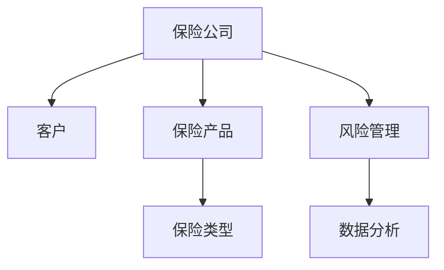

                 


# 巴菲特的保险行业投资逻辑

## 关键词
巴菲特, 保险行业, 投资逻辑, 价值投资, 财务指标, 风险管理, 投资策略

## 摘要
本文深入分析了巴菲特在保险行业的投资逻辑，探讨了他如何通过价值投资理念选择优质保险公司，分析了关键的财务指标，并结合实际案例展示了其投资策略。文章结构清晰，从背景介绍到系统分析，层层递进，为读者提供了全面的视角。

---

## 第1章 巴菲特投资理念概述

### 1.1 巴菲特的生平与投资哲学

- **巴菲特的成长经历**
  - 出生在美国内布拉斯州奥马哈市，父亲是证券经纪人。
  - 在哥伦比亚大学获得经济学硕士学位。

- **投资哲学的核心**
  - 价值投资：寻找被市场低估的企业，长期持有。
  - 避免市场波动，注重企业基本面。
  - 重视企业的财务健康和管理层能力。

- **保险行业的特殊关注**
  - 保险行业的稳定性高，现金流稳定。
  - 保险企业具有杠杆效应，能放大收益。

### 1.2 保险行业的基本概念

- **定义与分类**
  - 保险：以合同形式提供风险保障的金融行为。
    - 分为人寿保险、财产保险、责任保险等。
  - 保险行业：提供保险产品和服务的行业。

- **商业模式**
  - 收取保费，建立保险准备金。
  - 通过投资保费获得收益，覆盖赔付支出。

- **监管环境**
  - 保险行业受严格监管，确保资金安全。
  - 监管机构要求保险公司保持充足资本。

### 1.3 巴菲特与保险行业的关联

- **如何进入保险行业**
  - 通过收购保险公司，如GEICO和伯克希尔 Hathaway。
  - 利用保险资金的特性进行长期投资。

- **保险行业在投资组合中的地位**
  - 提供稳定的现金流和较高的内在价值。
  - 保险公司的浮存金（float）为巴菲特提供了低成本资金。

---

## 第2章 保险行业的核心要素

### 2.1 保险行业的核心要素分析

- **核心要素**
  - 保费收入：保险公司收入的主要来源。
  - 准备金：用于赔付的储备资金。
  - 投资收益：保费资金的投资回报。

- **财务指标分析**
  - 净资产收益率（ROE）：衡量公司盈利能力。
  - 保费增长率：反映市场拓展能力。
  - 综合成本率：评估保险业务的效率。

### 2.2 保险行业的市场环境

- **行业竞争格局**
  - 市场集中度高，头部公司占据主要份额。
  - 新进入者面临高竞争壁垒。

- **市场需求的驱动因素**
  - 经济增长带来的保险需求增加。
  - 人口老龄化推动寿险需求。

- **技术发展的影响**
  - 保险科技（InsurTech）的应用改变行业模式。
  - 数据分析提升风险评估精准度。

---

## 第3章 巴菲特的保险投资策略

### 3.1 巴菲特的价值投资理念

- **核心原则**
  - 寻找具有持续竞争优势的企业。
  - 重点关注企业的内在价值，而非市场波动。

- **保险行业的独特性**
  - 保险公司的浮存金为巴菲特提供了长期低成本资金。
  - 保险行业具有防御性，经济衰退时需求相对稳定。

- **选择优质保险公司的标准**
  - 财务健康：ROE高，负债结构合理。
  - 管理层能力：管理层诚信且有能力。
  - 市场地位：在细分市场中有领导地位。

### 3.2 财务指标分析

- **ROE分析**
  - 公式：$$ROE = \frac{\text{净利润}}{\text{净资产}}$$
  - 例子：假设A公司ROE为15%，B公司ROE为10%，则A公司的盈利能力更强。

- **市盈率与市净率**
  - 市盈率：$$P/E = \frac{\text{股价}}{\text{每股收益}}$$
  - 市净率：$$P/B = \frac{\text{股价}}{\text{每股净资产}}$$
  - 低市盈率和市净率可能意味着低估。

- **现金流分析**
  - 自由现金流：$$FCF = \text{净利润} - \text{资本支出}$$
  - 现金流健康是企业财务健康的重要指标。

---

## 第4章 经典投资案例分析

### 4.1 GEICO案例

- **背景**
  - GEICO是美国第四大汽车保险公司，以低价格和高效率著称。
  - 巴菲特收购GEICO时，公司处于亏损状态，但具有竞争优势。

- **投资逻辑**
  - GEICO的保费收入稳定增长。
  - 公司具有强大的成本控制能力。
  - 管理层具有诚信和能力。

- **结果**
  - 收购后，GEICO扭亏为盈，成为巴菲特的重要投资之一。
  - 通过GEICO，巴菲特获得了稳定的浮存金来源。

### 4.2 伯克希尔 Hathaway案例

- **背景**
  - 伯克希尔 Hathaway是一家控股公司，旗下拥有多家保险公司。
  - 巴菲特收购该公司后，逐步将其打造成一个多元化的金融帝国。

- **投资逻辑**
  - 伯克希尔 Hathaway具有强大的资本实力和多元化的业务。
  - 公司管理层（如芒格）具有卓越的管理能力。
  - 公司的浮存金为巴菲特提供了大量低成本资金，用于其他投资。

- **结果**
  - 伯克希尔 Hathaway的市值长期增长，成为巴菲特最成功的投资之一。
  - 公司的浮存金规模庞大，为巴菲特的投资提供了重要支持。

---

## 第5章 风险管理与保险投资

### 5.1 保险行业的风险管理

- **风险来源**
  - 市场风险：经济波动影响保费收入和投资收益。
  - 信用风险：保险准备金不足以覆盖赔付风险。
  - 操作风险：内部管理不当导致损失。

- **巴菲特的管理策略**
  - 严格控制负债规模，确保资本充足。
  - 通过分散投资降低风险。
  - 选择具有强大风险管理能力的保险公司。

### 5.2 巴菲特的长期投资逻辑

- **长期价值投资**
  - 保险行业的长期稳定性使其成为巴菲特的首选行业。
  - 通过持有优质保险公司股份，实现长期价值增长。

- **风险管理的重要性**
  - 保险行业的风险管理能力直接影响公司的财务健康。
  - 巴菲特注重选择具有强大风险管理能力的公司。

---

## 第6章 保险行业的未来发展趋势

### 6.1 保险行业的未来挑战

- **技术发展带来的变革**
  - 保险科技（InsurTech）的应用将改变保险行业的商业模式。
  - 数据分析和人工智能将提升风险评估和客户服务的效率。

- **行业竞争加剧**
  - 新进入者利用技术优势挑战传统保险公司。
  - 行业整合可能加剧，市场集中度进一步提高。

### 6.2 巴菲特投资逻辑的适应性

- **传统投资逻辑的延续**
  - 巴菲特的价值投资理念在保险行业依然适用。
  - 优质保险公司依然具有长期投资价值。

- **新技术环境下的调整**
  - 巴菲特需要关注保险科技对企业价值的影响。
  - 新技术可能改变保险公司的竞争优势。

---

## 第7章 总结与展望

### 7.1 总结

- 巴菲特的保险投资逻辑基于价值投资理念，注重选择具有强大财务实力和管理能力的保险公司。
- 保险行业的长期稳定性和防御性使其成为巴菲特投资组合中的重要组成部分。
- 通过浮存金的运用，巴菲特实现了资金的高效利用，进一步增强了投资收益。

### 7.2 展望

- 保险行业的未来将更加依赖于技术创新和数据驱动的管理。
- 巴菲特的投资逻辑将面临新的挑战，需要在传统价值投资的基础上，适应行业的变化。
- 优质保险公司依然具有长期投资价值，值得投资者关注。

---

## 附录

### 附录A：保险行业的财务指标分析表格

| 指标名称   | 定义与计算公式                     | 重要性         |
|------------|----------------------------------|----------------|
| ROE        | 净利润 / 净资产                 | 高             |
| 保费增长率 | （本年保费收入 - 去年保费收入） / 去年保费收入 | 中           |
| 综合成本率 | （赔付支出 + 业务及管理费） / 保费收入         | 高           |

### 附录B：保险公司的ER实体关系图

```mermaid
er
  class Diagram {
    Company(公司ID, 公司名称, 注册资本)
    Policy(保单ID, 保单编号, 保额)
    Customer(客户ID, 客户名称, 联系方式)
    InsuranceType(险种ID, 险种名称, 险种描述)
  }
  Company --> Policy: 发售
  Customer --> Policy: 购买
  Policy --> InsuranceType: 属于
```

### 附录C：巴菲特保险投资策略的Python代码示例

```python
import pandas as pd

def calculate_roe(net_profit, net_assets):
    return net_profit / net_assets

# 示例数据
data = {
    '公司名称': ['公司A', '公司B', '公司C'],
    '净利润': [100, 150, 200],
    '净资产': [500, 600, 700]
}

df = pd.DataFrame(data)

# 计算ROE
df['ROE'] = calculate_roe(df['净利润'], df['净资产'])

print(df)
```

### 附录D：保险行业的系统架构图



---

## 参考文献

1. 巴菲特股东大会的公开演讲。
2. 保险行业的相关研究报告。
3. 巴菲特的著作《聪明的投资者》。
4. 各大保险公司的年度报告。

---

通过以上内容，我们详细分析了巴菲特在保险行业的投资逻辑，从背景介绍到系统分析，层层深入，帮助读者全面理解巴菲特的投资策略和成功秘诀。

