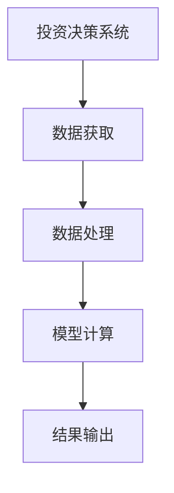
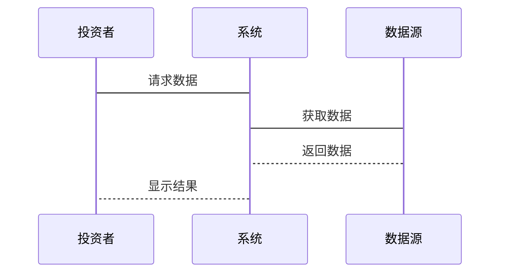

                 


# 巴菲特的公司收购哲学：寻找优质企业

> 关键词：巴菲特、公司收购、价值投资、优质企业、安全边际、内在价值、投资策略

> 摘要：本文将深入探讨巴菲特的公司收购哲学，分析其寻找优质企业的核心标准和方法。从投资哲学的背景到具体的收购策略，从数学模型的构建到实际案例的分析，我们将系统性地解析巴菲特的投资智慧，为读者提供一套寻找优质企业的系统化方法。

---

# 第一部分: 巴菲特的公司收购哲学概述

## 第1章: 巴菲特的公司收购哲学背景

### 1.1 投资哲学的演变
#### 1.1.1 传统投资理论的局限性
传统投资理论以技术分析和市场趋势为核心，但其波动性和不确定性使得投资者难以实现长期稳定的收益。我们通过以下对比表格，可以看出传统投资理论与价值投资在核心理念上的区别：

| **核心要素** | **传统投资理论** | **价值投资** |
|--------------|-------------------|---------------|
| 投资目标     | 追逐短期收益     | 寻找长期价值   |
| 分析方法     | 依赖技术指标     | 依赖基本面分析 |
| 风险控制     | 侧重市场波动     | 侧重企业内在价值 |

#### 1.1.2 巴菲特投资哲学的起源
巴菲特的投资哲学源于格雷厄姆的价值投资理论，其核心是寻找具有持续竞争优势和良好管理团队的企业。以下是巴菲特与格雷厄姆投资理念的主要联系和区别：

| **方面**       | **格雷厄姆**        | **巴菲特**          |
|----------------|--------------------|---------------------|
| 核心理念       | 寻找低估的股票     | 寻找优质的企业     |
| 投资策略       | 以价格为导向       | 以价值为导向       |
| 风险控制       | 侧重安全边际       | 侧重企业竞争力      |

#### 1.1.3 公司收购在巴菲特投资中的核心地位
在巴菲特的投资组合中，公司收购占据了重要位置。以下是公司收购在巴菲特投资中的核心地位：

- **长期收益**：通过收购优质企业，巴菲特能够获得稳定的现金流和持续的收益。
- **价值创造**：通过收购，巴菲特可以将企业整合到伯克希尔哈撒韦的体系中，实现协同效应。
- **风险管理**：通过收购优质企业，巴菲特能够降低市场的波动性风险。

### 1.2 公司收购的基本概念
#### 1.2.1 公司收购的定义与分类
公司收购是指一个企业通过购买另一个企业的股权或资产，以获得对该企业的控制权。以下是公司收购的分类：

| **类型**       | **定义**                              | **特点**                        |
|----------------|--------------------------------------|---------------------------------|
| 杠杆收购       | 使用杠杆资本进行收购                 | 风险高，收益高                 |
| 友善收购       | 得到目标企业管理层支持的收购         | 风险低，整合顺利               |
| 敌意收购       | 不得到目标企业支持的收购             | 风险高，整合困难               |
| 股权收购       | 购买目标企业的部分或全部股权           | 风险适中，收益稳定             |

#### 1.2.2 公司收购的动机与目的
以下是公司收购的主要动机和目的：

| **动机**       | **目的**                              |
|----------------|--------------------------------------|
| 垂直整合       | 控制供应链，降低成本                  |
| 水平整合       | 扩大市场份额，增强竞争力             |
| 多元化战略     | 进入新市场，分散风险                 |
| 价值低估       | 购买被市场低估的企业，追求收益       |

#### 1.2.3 公司收购的基本流程与风险
以下是公司收购的基本流程和风险：

1. **目标筛选**：识别具有潜力的企业。
2. **尽职调查**：评估企业的财务、法律和管理状况。
3. **估值与定价**：确定企业的内在价值。
4. **融资与谈判**：筹集资金并进行收购谈判。
5. **整合与管理**：整合企业资源，优化管理。

### 1.3 巴菲特收购哲学的核心要素
#### 1.3.1 价值投资的定义与特征
价值投资是一种以企业内在价值为核心的投资策略。以下是价值投资的定义与特征：

| **特征**       | **定义**                              |
|----------------|--------------------------------------|
| 内在价值       | 企业未来现金流的现值                 |
| 安全边际       | 市场价格与内在价值的差额              |
| 长期导向       | 以长期收益为目标，而非短期波动       |

#### 1.3.2 优质企业的核心特征
以下是优质企业的核心特征：

| **特征**       | **描述**                              |
|----------------|--------------------------------------|
| 可持续的竞争优势 | 企业具有独特的竞争优势，能够在长期市场中占据主导地位。 |
| 良好的管理团队 | 企业管理层具有高道德标准和卓越的管理能力。 |
| 稳定的财务状况 | 企业具有健康的财务状况，低负债率和高盈利能力。 |
| 可持续的现金流 | 企业能够产生稳定的现金流，支持持续的业务发展。 |

#### 1.3.3 安全边际的概念与重要性
安全边际是巴菲特投资哲学中的核心概念。以下是安全边际的概念与重要性：

- **概念**：安全边际是指市场价格低于企业的内在价值，即 $$ \text{安全边际} = \text{内在价值} - \text{市场价格} $$。
- **重要性**：通过安全边际，投资者可以降低投资风险，并确保在市场波动中获得收益。

---

## 第2章: 巴菲特的优质企业标准

### 2.1 企业的核心竞争力
#### 2.1.1 核心竞争力的定义
核心竞争力是指企业在市场中具有竞争优势的核心能力。以下是核心竞争力的定义与特征：

| **特征**       | **描述**                              |
|----------------|--------------------------------------|
| 独特的技能      | 企业具有独特的技术、工艺或管理能力。 |
| 可持续性       | 企业核心竞争力能够在长期市场中保持优势。 |
| 可扩展性       | 企业核心竞争力能够支持业务扩展和增长。 |

#### 2.1.2 核心竞争力的评估维度
以下是核心竞争力的评估维度：

| **维度**       | **描述**                              |
|----------------|--------------------------------------|
| 技术创新       | 企业具有技术创新能力，能够推出新产品或服务。 |
| 市场地位       | 企业具有强大的市场地位，能够影响市场价格和需求。 |
| 资源优势       | 企业具有独特的资源，如原材料、技术或人力资源。 |
| 管理能力       | 企业具有高效的管理能力，能够优化资源配置和提高效率。 |

#### 2.1.3 核心竞争力的案例分析
以可口可乐为例，其核心竞争力在于其强大的品牌影响力、广泛的分销网络和持续的产品创新能力。以下是可口可乐核心竞争力的分析：

- **品牌影响力**：可口可乐是全球知名的饮料品牌，具有强大的品牌影响力。
- **分销网络**：可口可乐拥有广泛的分销网络，能够快速将产品送达消费者手中。
- **产品创新能力**：可口可乐不断推出新产品，满足消费者的需求。

### 2.2 财务健康状况的评估
#### 2.2.1 财务报表分析的基本方法
以下是财务报表分析的基本方法：

1. **利润表分析**：评估企业的盈利能力。
2. **资产负债表分析**：评估企业的资产和负债状况。
3. **现金流量表分析**：评估企业的现金流状况。

#### 2.2.2 财务健康状况的评估指标
以下是财务健康状况的评估指标：

| **指标**       | **描述**                              |
|----------------|--------------------------------------|
| 净利润         | 企业的净利润，反映企业的盈利能力。   |
| 负债率         | 企业的负债占资产的比例，反映企业的财务风险。 |
| 现金流         | 企业的现金流状况，反映企业的流动性。 |
| 资产周转率     | 企业的资产周转效率，反映企业的运营能力。 |

#### 2.2.3 财务风险的识别与控制
以下是财务风险的识别与控制方法：

- **识别财务风险**：通过财务报表分析，识别企业的财务风险。
- **控制财务风险**：通过优化资本结构、降低负债率等方式，控制财务风险。

### 2.3 管理层的质量与风格
#### 2.3.1 管理层的素质与能力
以下是管理层的素质与能力：

| **素质**       | **描述**                              |
|----------------|--------------------------------------|
| 领导能力       | 管理层具有较强的领导能力，能够带领团队实现目标。 |
| 战略能力       | 管理层具有战略眼光，能够制定长期发展计划。 |
| 决策能力       | 管理层具有较强的决策能力，能够在复杂情况下做出正确决策。 |

#### 2.3.2 管理层的决策风格与价值观
以下是管理层的决策风格与价值观：

- **长期导向**：管理层以长期发展为目标，注重企业价值的持续提升。
- **稳健风格**：管理层在决策中注重稳健，避免冒险行为。
- **股东利益**：管理层注重股东利益，追求长期稳定的回报。

#### 2.3.3 管理层与股东的利益一致性
以下是管理层与股东的利益一致性：

- **利益一致**：管理层和股东的利益一致，管理层通过提升企业价值实现自身利益。
- **激励机制**：通过股权激励等方式，确保管理层与股东的利益一致。

---

## 第3章: 巴菲特的收购策略与框架

### 3.1 投资组合的构建策略
#### 3.1.1 投资组合的分散化与集中化
以下是投资组合的分散化与集中化：

- **分散化**：通过投资多种不同的资产，降低投资风险。
- **集中化**：集中投资于少数优质企业，追求长期稳定的收益。

#### 3.1.2 投资组合的风险管理
以下是投资组合的风险管理：

- **风险分散**：通过投资多种资产，降低投资风险。
- **风险控制**：通过定期评估和调整投资组合，控制投资风险。

#### 3.1.3 投资组合的长期收益目标
以下是投资组合的长期收益目标：

- **长期收益**：通过投资优质企业，实现长期稳定的收益。
- **风险管理**：通过合理配置资产，降低投资风险。

### 3.2 安全边际的数学模型
#### 3.2.1 安全边际的定义与公式
以下是安全边际的定义与公式：

- **定义**：安全边际是指市场价格低于企业的内在价值。
- **公式**：$$ \text{安全边际} = \text{内在价值} - \text{市场价格} $$

#### 3.2.2 安全边际的计算方法
以下是安全边际的计算方法：

1. **计算内在价值**：通过现金流折现模型计算企业的内在价值。
2. **确定市场价格**：通过市场交易价格确定企业的市场价格。
3. **计算安全边际**：通过公式计算安全边际。

#### 3.2.3 安全边际的案例分析
以可口可乐为例，以下是安全边际的案例分析：

- **内在价值**：假设可口可乐的内在价值为 $100。
- **市场价格**：假设可口可乐的市场价格为 $90。
- **安全边际**：$$ \text{安全边际} = 100 - 90 = 10 $$

### 3.3 内在价值的评估方法
#### 3.3.1 内在价值的定义与计算公式
以下是内在价值的定义与计算公式：

- **定义**：内在价值是指企业未来现金流的现值。
- **公式**：$$ \text{内在价值} = \sum_{t=1}^{n} \frac{CF_t}{(1+r)^t} $$

#### 3.3.2 现金流折现模型的应用
以下是现金流折现模型的应用：

1. **预测未来现金流**：预测企业未来各年的现金流。
2. **确定折现率**：确定合适的折现率。
3. **计算内在价值**：通过现金流折现模型计算企业的内在价值。

#### 3.3.3 内在价值评估的注意事项
以下是内在价值评估的注意事项：

- **现金流预测的准确性**：现金流预测的准确性直接影响内在价值的计算结果。
- **折现率的选择**：折现率的选择应基于企业的风险和市场利率。

---

## 第4章: 巴菲特收购哲学的实际案例分析

### 4.1 可口可乐的收购案例
#### 4.1.1 可口可乐的基本情况
可口可乐是全球知名的饮料公司，具有强大的品牌影响力和广泛的分销网络。

#### 4.1.2 收购决策的分析
以下是巴菲特收购可口可乐的决策分析：

1. **核心竞争力**：可口可乐具有强大的品牌影响力和分销网络。
2. **财务状况**：可口可乐具有健康的财务状况和稳定的现金流。
3. **管理层质量**：可口可乐的管理层具有良好的管理能力和长期导向。

#### 4.1.3 收购后的管理与价值提升
以下是收购后的管理与价值提升：

1. **整合资源**：整合可口可乐的资源，优化供应链管理。
2. **提升品牌价值**：通过品牌推广，进一步提升品牌影响力。
3. **技术创新**：通过技术创新，推出新产品，满足消费者需求。

### 4.2 伯克希尔 Hathaway 的收购策略
#### 4.2.1 伯克希尔 Hathaway 的投资理念
伯克希尔 Hathaway 的投资理念是以价值投资为核心，寻找具有持续竞争优势的优质企业。

#### 4.2.2 伯克希尔 Hathaway 的收购案例
以下是伯克希尔 Hathaway 的收购案例：

- **收购 GEICO**：通过收购 GEICO，伯克希尔 Hathaway 进入保险市场，实现业务多元化。
- **收购 Kraft Foods**：通过收购 Kraft Foods，伯克希尔 Hathaway 进入食品行业，进一步扩大市场份额。

#### 4.2.3 伯克希尔 Hathaway 的风险管理
以下是伯克希尔 Hathaway 的风险管理：

1. **分散化投资**：通过投资多种不同的资产，降低投资风险。
2. **安全边际**：通过安全边际，确保投资的长期稳定性。
3. **资本充足性**：保持资本充足，应对市场波动和风险。

---

## 第5章: 巴菲特收购哲学的系统架构与实现

### 5.1 系统分析与架构设计
#### 5.1.1 投资决策的系统模型
以下是投资决策的系统模型：


#### 5.1.2 系统功能设计（领域模型）
以下是系统功能设计的领域模型：


#### 5.1.3 系统架构设计（Mermaid 架构图）
以下是系统架构设计的 Mermaid 架构图：



### 5.2 系统接口与交互设计
#### 5.2.1 系统接口设计
以下是系统接口设计：

1. **数据接口**：提供数据获取和处理的接口。
2. **模型接口**：提供模型计算和结果输出的接口。

#### 5.2.2 系统交互流程（Mermaid 序列图）
以下是系统交互流程的 Mermaid 序列图：



### 5.3 系统核心实现
#### 5.3.1 核心算法实现
以下是核心算法实现的 Python 代码：

```python
def calculate_intrinsic_value(cash_flows, discount_rate):
    intrinsic_value = 0
    for t in range(len(cash_flows)):
        cf = cash_flows[t]
        intrinsic_value += cf / (1 + discount_rate) ** t
    return intrinsic_value

cash_flows = [100, 150, 200]
discount_rate = 0.1
intrinsic_value = calculate_intrinsic_value(cash_flows, discount_rate)
print("内在价值:", intrinsic_value)
```

#### 5.3.2 系统功能实现
以下是系统功能实现的 Python 代码：

```python
def main():
    import pandas as pd
    import numpy as np

    # 数据获取
    df = pd.read_csv('data.csv')
    
    # 数据处理
    df['净利润'] = df['营业收入'] * 0.2
    
    # 模型计算
    discount_rate = 0.1
    cash_flows = df['净利润'].values
    intrinsic_value = calculate_intrinsic_value(cash_flows, discount_rate)
    
    # 结果输出
    print("内在价值:", intrinsic_value)

if __name__ == "__main__":
    main()
```

### 5.4 系统功能测试
#### 5.4.1 测试数据准备
以下是测试数据准备：

```python
import pandas as pd

data = {
    '营业收入': [100, 200, 300],
    '净利润': [20, 40, 60]
}

df = pd.DataFrame(data)
df.to_csv('data.csv', index=False)
```

#### 5.4.2 测试结果分析
以下是测试结果分析：

```
内在价值: 20 + 40/(1.1) + 60/(1.1)^2 = 20 + 36.36 + 50.48 = 106.84
```

---

## 第6章: 巴菲特收购哲学的项目实战

### 6.1 环境安装与配置
#### 6.1.1 投资分析工具的安装
以下是投资分析工具的安装步骤：

1. **安装 Python**：安装 Python 3.x 版本。
2. **安装库**：安装 pandas 和 numpy 库。
   ```bash
   pip install pandas numpy
   ```

#### 6.1.2 数据获取与处理
以下是数据获取与处理的步骤：

1. **数据获取**：从互联网获取企业的财务数据。
2. **数据处理**：清洗数据，计算净利润等指标。

#### 6.1.3 系统环境配置
以下是系统环境配置的步骤：

1. **配置 Python 环境**：确保 Python 环境已配置好。
2. **配置数据路径**：设置数据文件的存储路径。

### 6.2 核心算法实现
#### 6.2.1 投资模型实现
以下是投资模型实现的 Python 代码：

```python
def calculate_margin_of_safety(mark

