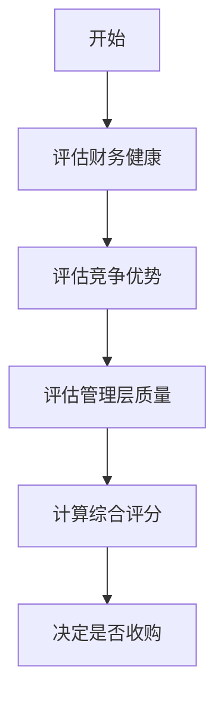
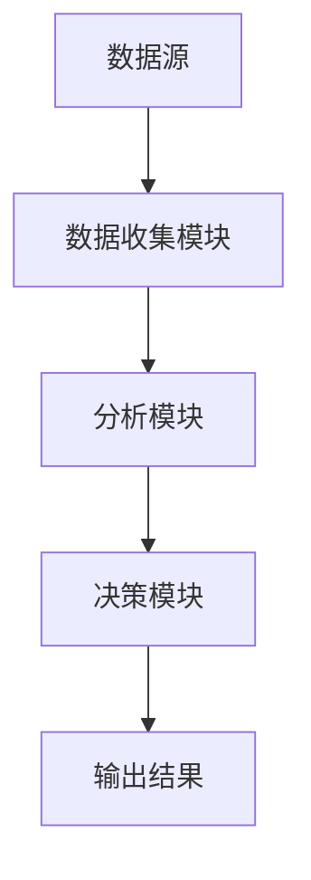

                 


# 巴菲特的公司收购策略：从股东到所有者

> **关键词**：巴菲特、价值投资、公司收购、竞争优势、安全边际、管理层评估

> **摘要**：本文深入探讨了巴菲特的公司收购策略，从其投资哲学到具体实施的步骤，分析了其核心概念如安全边际、竞争优势和管理层评估的重要性，并通过实例展示了如何将这些策略应用于实际投资中。文章旨在帮助读者理解巴菲特的价值投资理念，并从股东的视角转变为所有者，实现长期稳健的投资收益。

---

# 巴菲特的公司收购策略：从股东到所有者

## 引言

沃伦·巴菲特作为全球最著名的投资者之一，以其独特的价值投资理念闻名。他的公司收购策略不仅仅是买入并持有，而是通过深入分析企业的基本面，寻找具有持续竞争优势和良好管理的企业，并以合理的价格进行投资。本文将详细探讨巴菲特的公司收购策略，从其核心理念到具体实施步骤，帮助读者理解如何从股东的视角转变为所有者，实现长期稳健的投资收益。

---

## 核心概念

### 1. 投资哲学

巴菲特的价值投资理念基于以下几点：

- **长期投资**：巴菲特主张长期持有优质资产，避免频繁交易。
- **安全边际**：在投资时，确保买入价格低于企业的内在价值，以降低风险。
- **竞争优势**：寻找具有持续竞争优势的企业，这些企业能够在市场中长期保持领先地位。

### 2. 收购标准

巴菲特在选择收购目标时，重点关注以下几个方面：

- **财务健康**：企业应具备稳定的财务状况，低债务负担，高利润率。
- **管理层质量**：管理层应具备诚信、能力和决策能力，能够为股东创造价值。
- **市场地位**：企业在市场上应具有强大的竞争力和定价能力。

---

## 安全边际的计算与应用

### 1. 安全边际的定义

安全边际是指买入价格与企业内在价值之间的差距。巴菲特认为，通过购买低于内在价值的股票，可以降低投资风险。

### 2. 内在价值的计算

内在价值是企业未来现金流的现值。计算公式如下：

$$
\text{内在价值} = \sum_{t=1}^{n} \frac{CF_t}{(1 + r)^t}
$$

其中，\( CF_t \) 是第 \( t \) 年的现金流，\( r \) 是折现率。

### 3. 安全边际的计算公式

$$
\text{安全边际} = \text{内在价值} - \text{市场价格}
$$

---

## 核心竞争优势的分析

### 1. 核心竞争优势的定义

核心竞争优势是指企业在市场上长期保持竞争优势的能力，通常体现在品牌、技术、成本控制和客户忠诚度等方面。

### 2. 核心竞争优势的评估指标

- 市场占有率
- 净利润率
- 技术创新速度
- 供应链管理能力

### 3. 核心竞争优势与公司价值的关系

企业的核心竞争优势越强，内在价值越高。因此，投资者应优先选择具有强大核心竞争优势的企业。

---

## 管理层评估

### 1. 管理层的诚信与能力

巴菲特认为，管理层的诚信和能力是决定企业能否为股东创造价值的关键因素。他通过以下几个方面来评估管理层：

- 管理层的决策风格
- 管理层的过往业绩
- 管理层与股东的利益一致性

### 2. 管理层评估的重要性

管理层的质量直接影响企业的长期发展。一个优秀的管理层能够带领企业不断创造价值，而一个低效或不诚信的管理层可能导致企业价值下降。

---

## 算法与数学模型

### 1. 多因素评估模型

巴菲特的收购策略可以被视为一个多因素评估模型，其中每个因素都有其权重。例如：

$$
\text{综合评分} = 0.3 \times \text{财务健康} + 0.4 \times \text{竞争优势} + 0.3 \times \text{管理层质量}
$$

### 2. 算法流程图



---

## 项目实战

### 1. 环境配置

- 数据来源：企业财务报表、行业分析报告、管理层专访。
- 工具：财务分析软件、数据可视化工具。

### 2. 核心实现代码

以下是一个简单的内在价值计算示例：

```python
def calculate_intrinsic_value(cash_flows, discount_rate):
    intrinsic_value = sum(cash_flow / (1 + discount_rate) ** t for t, cash_flow in enumerate(cash_flows))
    return intrinsic_value

cash_flows = [100, 120, 150, 200]  # 每年的现金流
discount_rate = 0.08  # 折现率
iv = calculate_intrinsic_value(cash_flows, discount_rate)
print(f"内在价值为：{iv}")
```

### 3. 案例分析

以可口可乐为例，计算其内在价值：

- 现金流预测：假设未来5年的现金流分别为100亿、110亿、120亿、130亿和140亿。
- 折现率：8%
- 内在价值计算：

$$
\text{内在价值} = \frac{100}{1.08^1} + \frac{110}{1.08^2} + \frac{120}{1.08^3} + \frac{130}{1.08^4} + \frac{140}{1.08^5}
$$

---

## 系统架构设计

### 1. 系统功能设计

- 数据收集模块：收集企业的财务数据、行业信息等。
- 分析模块：计算内在价值、评估竞争优势和管理层质量。
- 决策模块：根据综合评分决定是否收购。

### 2. 系统架构图



---

## 最佳实践与小结

### 1. 最佳实践

- **长期投资**：避免短期波动，坚持长期持有。
- **深入分析**：仔细评估企业的财务状况、竞争优势和管理层质量。
- **合理估值**：确保买入价格低于内在价值，预留安全边际。

### 2. 小结

巴菲特的公司收购策略强调从股东的角度转变为所有者，注重企业的长期价值和竞争优势。通过深入分析企业的基本面，选择具有强大竞争优势和优秀管理层的企业，以合理的价格进行投资，是实现长期稳健收益的关键。

---

通过本文的分析，读者可以更好地理解巴菲特的公司收购策略，并在实际投资中应用这些理念，实现从股东到所有者的转变，创造长期价值。

