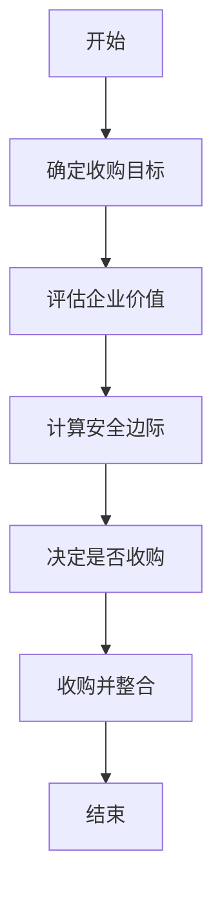
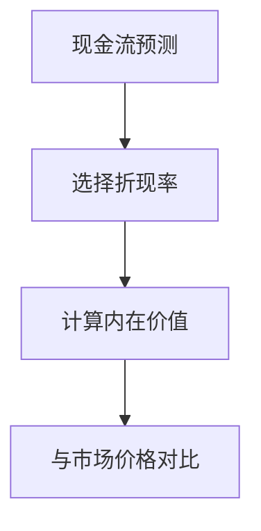
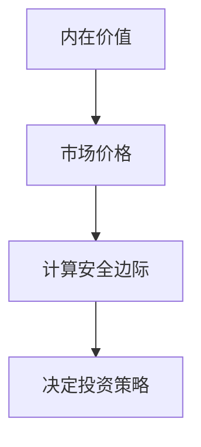
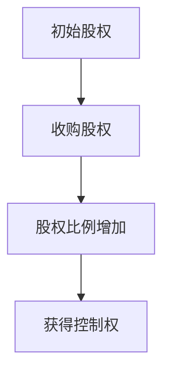
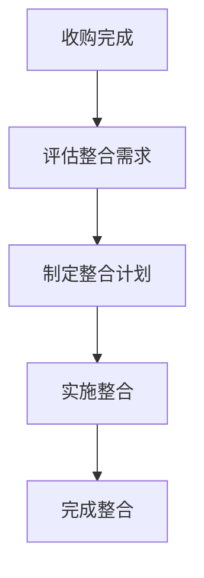
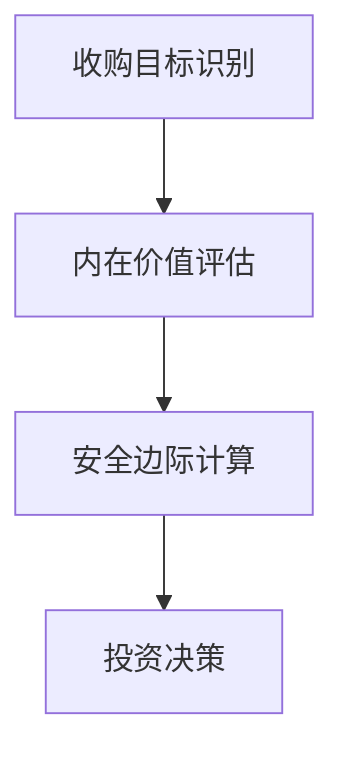
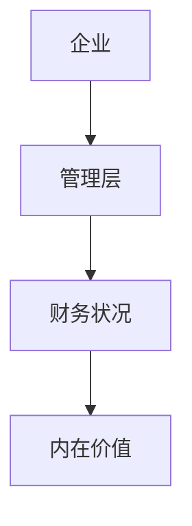
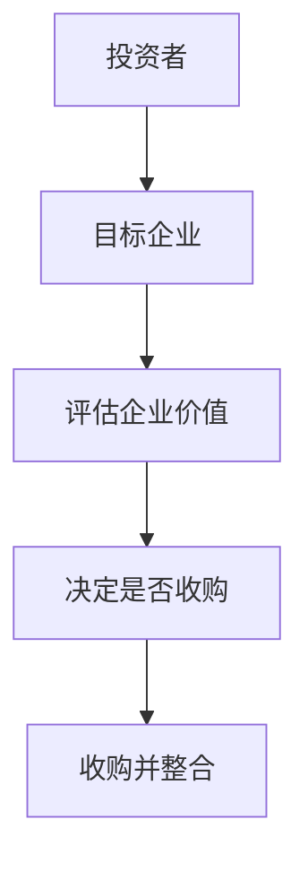

                 


# 巴菲特的公司收购策略：从股东到所有者的转变

## 关键词：巴菲特，公司收购，股东，所有者，投资策略，价值投资，安全边际，内在价值，收购决策

## 摘要：本文系统地探讨了巴菲特的公司收购策略，从其核心理念到具体的数学模型，再到实际案例的系统架构设计。通过分析巴菲特的收购标准、安全边际和内在价值评估，结合Mermaid流程图和架构图，深入剖析了其从股东到所有者的转变过程，并通过模拟项目实战，总结了最佳实践和未来展望。

---

# 第一部分: 巴菲特的公司收购策略背景介绍

# 第1章: 巴菲特的生平与投资理念

## 1.1 巴菲特的生平简介

### 1.1.1 巴菲特的早年经历
- 1934年出生于美国内布拉斯州
- 10岁开始投资，15岁赚取第一桶金
- 师从格雷厄姆，学习价值投资

### 1.1.2 巴菲特的投资哲学
- 价值投资：寻找市场低估的企业
- 长期持有，追求内在价值增长

### 1.1.3 巴菲特的价值投资理念
- 买入并持有优质资产
- 避免短期市场波动，关注长期价值

## 1.2 巴菲特的投资理念

### 1.2.1 价值投资的核心思想
- 市场先生理论：市场波动反映非理性
- 安全边际：价格低于内在价值

### 1.2.2 巴菲特的长期投资策略
- 专注于企业基本面
- 寻找具备持续盈利能力的企业

### 1.2.3 巴菲特的安全边际概念
- 安全边际：内在价值与市场价格的差距
- 保护投资者免受市场波动影响

## 1.3 公司收购在巴菲特投资中的重要性

### 1.3.1 公司收购的定义与特点
- 收购：购买企业股权，成为所有者
- 特点：控制权、长期价值、安全边际

### 1.3.2 巴菲特为何选择公司收购
- 寻找具备竞争优势的企业
- 实现从股东到所有者的转变

### 1.3.3 公司收购与股东价值的关系
- 收购创造股东价值
- 持股比例决定影响力

# 第2章: 巴菲特收购策略的背景与演变

## 2.1 美国经济环境与公司收购的历史背景

### 2.1.1 20世纪70年代的经济环境
- 石油危机导致企业重组
- 利率下降推动并购活动

### 2.1.2 美国企业的并购潮
- 企业寻求规模效应
- 股东压力推动公司重组

### 2.1.3 巴菲特时代的企业收购特点
- 买入低估企业，长期持有
- 专注于具有竞争优势的企业

## 2.2 巴菲特收购策略的演变

### 2.2.1 早期的合伙企业阶段
- 与合伙人共同投资
- 采用合伙制结构，分散风险

### 2.2.2 伯克希尔哈撒韦的形成
- 收购纺织厂，开始转型
- 逐步收购保险公司，构建金融帝国

### 2.2.3 巴菲特收购策略的成熟
- 专注于优质企业，长期持有
- 强调安全边际，避免风险

# 第二部分: 巴菲特的公司收购策略核心概念

# 第3章: 巴菲特收购策略的核心要素

## 3.1 巴菲特收购的标准与原则

### 3.1.1 企业具备持续盈利能力
- 行业地位稳固
- 财务状况健康
- 管理层可靠

### 3.1.2 公司具有良好的财务状况
- 低债务，高现金流
- 稳定的收益能力
- 肯定的经济前景

### 3.1.3 管理层的诚信与能力
- 高层具备长期眼光
- 管理层与股东利益一致
- 管理层具备优秀的企业运营能力

## 3.2 安全边际的概念与应用

### 3.2.1 安全边际的定义
- 安全边际=内在价值-市场价格
- 确保投资的安全性

### 3.2.2 安全边际在收购中的作用
- 降低投资风险
- 抵御市场波动
- 提供利润空间

### 3.2.3 计算安全边际的方法
- 确定内在价值
- 计算安全边际=内在价值-市场价格

## 3.3 内在价值的评估与定价

### 3.3.1 内在价值的定义
- 企业未来现金流的现值
- 考虑时间价值和风险

### 3.3.2 内在价值的计算方法
- 肖像法：DCF模型
- 市盈率、市净率等相对估值法

### 3.3.3 内在价值与市场价的关系
- 内在价值低于市场价格时买入
- 内在价值高于市场价格时卖出

## 3.4 股东与所有者的角色转变

### 3.4.1 股东的角色
- 通过收购成为大股东
- 获得控制权，影响公司决策

### 3.4.2 所有者的角色
- 实施长期战略规划
- 改善企业运营，创造价值

### 3.4.3 股东与所有者的区别
- 股东：被动投资者
- 所有者：主动管理者

# 第4章: 巴菲特收购策略的数学模型

## 4.1 内在价值计算模型

### 4.1.1 肖像法模型
$$
内在价值 = \sum_{t=1}^{\infty} \frac{CF_t}{(1 + r)^t}
$$
其中：
- $CF_t$ 是第t年的自由现金流
- $r$ 是折现率

### 4.1.2 肖像法模型的应用
- 确定企业的未来现金流
- 选择合适的折现率
- 计算内在价值

## 4.2 安全边际计算模型

### 4.2.1 安全边际的计算
$$
安全边际 = 内在价值 - 市场价格
$$

### 4.2.2 安全边际的应用
- 安全边际为正时买入
- 安全边际为负时卖出

## 4.3 内在价值与市场价格的对比

### 4.3.1 内在价值高于市场价格时的策略
- 买入并持有
- 等待市场价格回归

### 4.3.2 内在价值低于市场价格时的策略
- 卖出，避免损失
- 寻找其他投资机会

## 4.4 股东与所有者的转换模型

### 4.4.1 股权比例与控制权的关系
- 股权比例达到一定水平时，获得控制权
- 通过收购增加股权比例

### 4.4.2 转换过程中的数学模型
$$
控制权 = 股权比例 \times 公司决策影响力
$$
- 股权比例超过50%时，获得控制权
- 低于50%时，需与其他股东合作

## 4.5 股东与所有者角色的数学区分

### 4.5.1 股东的数学模型
$$
股东价值 = 股权比例 \times 公司利润
$$
- 股东的价值取决于公司利润和股权比例

### 4.5.2 所有者的数学模型
$$
所有者价值 = 公司利润 + 股权比例 \times 利润增长
$$
- 所有者不仅获得利润，还能通过改善运营增加利润

# 第三部分: 巴菲特收购策略的系统分析与架构设计

# 第5章: 巴菲特收购策略的系统分析

## 5.1 收购决策的流程图

### 5.1.1 收购决策流程


## 5.2 内在价值评估的系统架构

### 5.2.1 内在价值评估系统


## 5.3 安全边际评估的系统架构

### 5.3.1 安全边际评估系统


## 5.4 股东到所有者的转换系统

### 5.4.1 股权转换系统


## 5.5 收购后的整合系统

### 5.5.1 整合流程


# 第6章: 巴菲特收购策略的架构设计

## 6.1 系统功能设计

### 6.1.1 收购目标识别
- 识别具备竞争优势的企业
- 评估财务状况和管理层能力

### 6.1.2 内在价值评估
- 使用肖像法模型计算内在价值
- 对比市场价格，确定安全边际

## 6.2 系统架构设计

### 6.2.1 架构图


### 6.2.2 实体关系图


## 6.3 系统接口设计

### 6.3.1 收购目标识别接口
- 输入：企业基本信息
- 输出：收购目标列表

### 6.3.2 内在价值评估接口
- 输入：现金流预测、折现率
- 输出：内在价值

## 6.4 系统交互设计

### 6.4.1 收购决策流程


# 第7章: 巴菲特收购策略的项目实战

## 7.1 环境安装

### 7.1.1 安装工具
- 安装Python编程环境
- 安装数据处理库（Pandas、NumPy）
- 安装可视化工具（Matplotlib、Seaborn）

## 7.2 核心代码实现

### 7.2.1 内在价值计算
```python
import pandas as pd
import numpy as np

def calculate_intrinsic_value(cash_flows, discount_rate):
    return np.npv(discount_rate, cash_flows[1:], cash_flows[0])

# 示例数据
cash_flows = [100, 120, 150, 200, 250]
discount_rate = 0.1

intrinsic_value = calculate_intrinsic_value(cash_flows, discount_rate)
print(f"内在价值：{intrinsic_value}")
```

### 7.2.2 安全边际计算
```python
def calculate_margin_of_safety(intrinsic_value, market_price):
    return intrinsic_value - market_price

# 示例数据
intrinsic_value = 500
market_price = 400

margin_of_safety = calculate_margin_of_safety(intrinsic_value, market_price)
print(f"安全边际：{margin_of_safety}")
```

## 7.3 应用解读与分析

### 7.3.1 内在价值计算结果
- 示例中，内在价值为500，市场价格为400
- 安全边际为100，表明存在较大的安全空间

### 7.3.2 安全边际的意义
- 较大的安全边际意味着投资风险较低
- 适合长期持有，等待市场回归

## 7.4 案例分析

### 7.4.1 可口可乐案例分析
- 收购背景：寻找稳定的现金流
- 内在价值计算：基于DCF模型
- 安全边际：计算后决定收购

## 7.5 项目小结

### 7.5.1 收购策略总结
- 通过内在价值和安全边际评估企业
- 确定收购目标，制定整合计划
- 实施收购，长期持有，创造价值

# 第四部分: 巴菲特收购策略的总结与展望

## 第8章: 总结与展望

### 8.1 核心要点总结
- 巴菲特收购策略的核心在于内在价值和安全边际
- 通过长期持有优质企业，实现股东价值
- 从股东到所有者的转变是收购策略的关键

### 8.2 未来展望
- 投资者应继续关注企业的基本面
- 安全边际在不同市场环境下的应用
- 数字化工具在收购策略中的应用

## 8.3 最佳实践Tips

### 8.3.1 投资者建议
- 保持对企业的深入研究
- 确定合理的安全边际
- 长期持有优质资产

### 8.3.2 收购策略小结
- 选择具备持续盈利能力的企业
- 确保管理层可靠
- 计算合理的内在价值和安全边际

### 8.3.3 注意事项
- 避免短期市场波动影响决策
- 确保收购目标与自身投资目标一致
- 定期评估和调整投资组合

## 8.4 拓展阅读

### 8.4.1 推荐书籍
- 《巴菲特的“护城河”》
- 《投资中最简单的事》
- 《价值投资入门》

### 8.4.2 推荐博客
- 巴菲特投资理念的深入解读
- 价值投资策略的现代应用
- 投资组合管理的技巧

## 8.5 项目实战小结

### 8.5.1 收购策略总结
- 通过内在价值和安全边际评估企业
- 确定收购目标，制定整合计划
- 实施收购，长期持有，创造价值

### 8.5.2 案例分析
- 通过实际案例分析，验证收购策略的有效性
- 学习巴菲特的思维方式，提升自己的投资能力

### 8.5.3 未来展望
- 随着市场的变化，投资策略需要不断调整
- 利用新技术和工具，提高投资分析效率
- 持续学习，精进投资策略

---

# 结语

巴菲特的公司收购策略是一个系统而深奥的体系，从股东到所有者的转变不仅仅是股权的变化，更是对企业的深刻理解和长期价值的追求。通过本文的系统分析和实战案例，读者可以更好地理解巴菲特的投资哲学，并将其应用到实际投资中。未来，随着市场环境的变化和投资工具的更新，巴菲特的收购策略将继续为投资者提供宝贵的启示。

