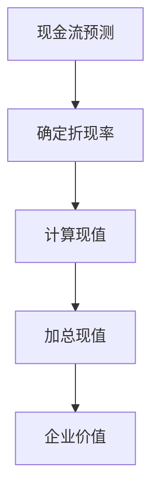
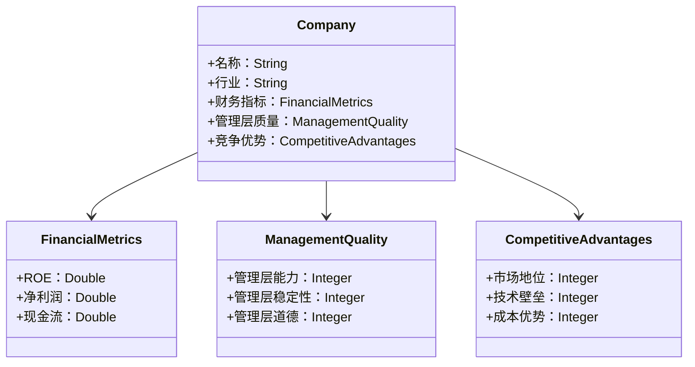
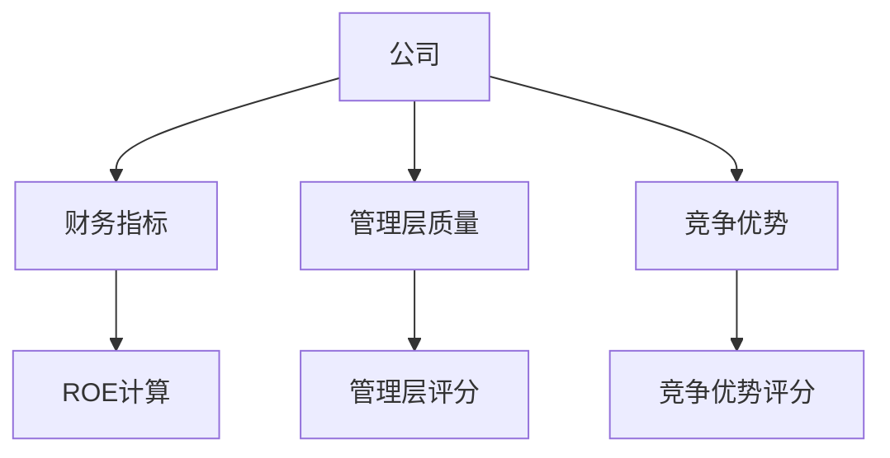
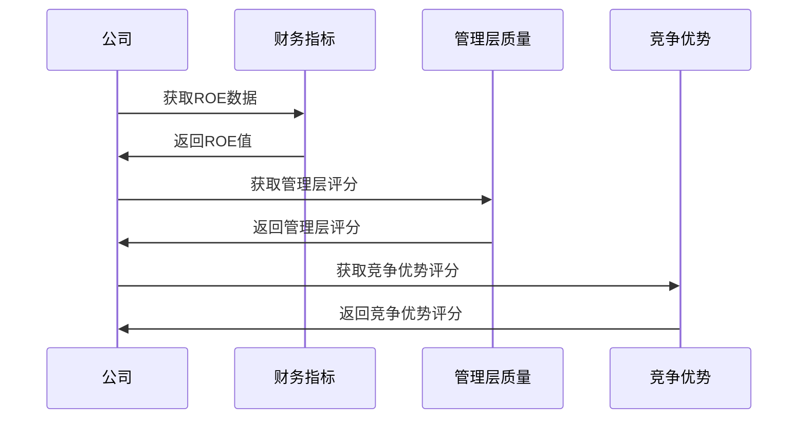

                 


# 巴菲特的公司收购策略：全资控股的魅力

## 关键词：巴菲特，公司收购，全资控股，投资策略，价值投资，财务分析

## 摘要：本文深入探讨巴菲特的公司收购策略，特别是全资控股的魅力。从巴菲特的投资哲学到具体的收购标准，再到实际案例分析，系统性地分析了为何全资控股是巴菲特实现长期价值增长的关键策略。

---

# 第一部分: 巴菲特的公司收购策略基础

## 第1章: 巴菲特投资哲学与公司收购概述

### 1.1 巴菲特投资哲学的核心理念

#### 1.1.1 价值投资的定义与特点

价值投资是一种以内在价值为导向的投资策略，强调以低于内在价值的价格买入优质资产。其核心在于寻找市场先生犯错时的机会，通过长期持有优质资产来实现财富增长。价值投资的关键要素包括：

- **安全边际**：买入价格低于内在价值，以降低风险。
- **长期视角**：关注企业的长期盈利能力，而非短期市场波动。
- **选股标准**：寻找具备持续竞争优势、良好治理结构和稳定管理层的企业。

#### 1.1.2 巴菲特的价值投资体系

巴菲特的价值投资体系建立在以下几个支柱之上：

- **理解企业价值**：通过分析财务报表和行业地位，准确评估企业的内在价值。
- **关注管理层**：管理层的能力和道德水准直接影响企业的长期发展。
- **安全边际**：买入价格必须显著低于内在价值，以确保投资的安全性。

#### 1.1.3 公司收购在巴菲特投资策略中的地位

公司收购是巴菲特实现价值投资的重要手段。通过全资收购，巴菲特能够完全掌控目标企业，确保其长期发展符合自己的投资理念。与部分股权收购相比，全资控股的优势在于：

- **控制权**：全资控股后，可以对企业的经营战略、管理层和日常运营进行直接干预，确保企业按照既定目标发展。
- **风险可控**：通过全资收购，巴菲特可以更好地控制风险，避免因部分股权导致的管理层决策失误或战略偏离。

### 1.2 公司收购的基本概念

#### 1.2.1 公司收购的定义

公司收购是指一个企业通过购买目标企业的全部或部分股权，以获得对目标企业的控制权。公司收购可以分为全资收购和部分收购两种类型。

- **全资收购**：收购方购买目标企业的全部股权，成为目标企业的唯一股东。
- **部分收购**：收购方购买目标企业的部分股权，成为目标企业的少数或重要股东。

#### 1.2.2 全资控股的定义与特点

全资控股是指收购方通过购买目标企业的全部股权，成为目标企业的唯一股东。其特点包括：

- **完全控制权**：收购方可以完全掌控目标企业的经营决策和管理层。
- **财务透明度高**：全资控股后，收购方能够完全掌握目标企业的财务状况，便于进行财务分析和决策。
- **风险可控**：通过全资控股，收购方可以更好地控制经营风险，避免因部分股权导致的决策冲突。

#### 1.2.3 公司收购的类型与分类

公司收购可以按照不同的标准进行分类：

- **按收购方式**：
  - 现金收购：用现金购买目标企业的股权。
  - 股权收购：用发行新股或现有股权购买目标企业的股权。
- **按收购目的**：
  - 战略性收购：为了获取目标企业的特定资源、技术或市场地位。
  - 财务性收购：为了获取投资收益，通过收购企业并出售其资产或股权获利。
- **按收购主体**：
  - 直接收购：由母公司直接收购目标企业。
  - 间接收购：通过子公司或其他中介结构进行收购。

### 1.3 巴菲特收购策略的核心要素

#### 1.3.1 财务健康状况的重要性

在巴菲特的收购策略中，财务健康状况是首要考虑因素。他倾向于收购那些财务状况稳健、盈利能力强的企业。具体来说，巴菲特关注以下几个财务指标：

- **ROE（净资产收益率）**：衡量企业使用股东资产创造利润的能力。ROE越高，说明企业的盈利能力越强。
- **净利润**：衡量企业实际盈利情况的重要指标。
- **负债率**：企业负债与资产的比例，负债率过高的企业财务风险较大。
- **现金流**：企业经营活动产生的现金流是企业财务健康的重要指标，巴菲特特别重视现金流的稳定性。

#### 1.3.2 管理层质量的关键作用

在巴菲特看来，优秀的管理层是企业成功的关键。他倾向于收购那些由有能力、有道德水准的管理层领导的企业。具体来说，巴菲特关注以下几个方面：

- **管理层能力**：管理层是否具备行业经验和管理能力，能够带领企业持续发展。
- **管理层稳定性**：管理层是否稳定，是否有长期致力于企业发展的意愿。
- **管理层道德**：管理层是否诚实守信，是否存在财务造假或其他不当行为。

#### 1.3.3 行业地位与竞争优势

行业地位和竞争优势是巴菲特评估企业的重要标准。他倾向于收购那些在行业中具有竞争优势的企业，具体包括：

- **市场地位**：企业在行业中的市场份额、品牌影响力等。
- **竞争优势**：企业是否具有独特的竞争优势，如技术壁垒、成本优势、客户忠诚度等。
- **行业前景**：行业的未来发展趋势，是否具备增长潜力。

### 1.4 巴菲特收购策略的边界与外延

#### 1.4.1 收购的行业限制

巴菲特的收购策略并非适用于所有行业。他倾向于选择那些他熟悉且具有长期增长潜力的行业。具体来说，巴菲特偏好以下类型的行业：

- **稳定的行业**：如公用事业、消费品、保险等，这些行业的需求相对稳定，受经济波动的影响较小。
- **具备竞争优势的行业**：如具备技术壁垒、成本优势或品牌优势的行业。
- **周期性较弱的行业**：巴菲特倾向于避免投资于周期性较强的行业，如高科技行业，因为这些行业的波动性较大。

#### 1.4.2 收购规模的考量

在收购规模方面，巴菲特通常倾向于收购中等规模的企业，而非大型企业。他认为中等规模的企业更容易管理和控制，且具有较大的增长潜力。此外，他还关注收购后的整合成本和管理难度，避免因规模过大而导致管理混乱。

#### 1.4.3 收购与分散投资的平衡

虽然巴菲特以集中投资闻名，但他也意识到分散投资的重要性。他通常会将资金分散投资于少数优质企业，以降低风险。具体来说，他倾向于投资于那些具有长期竞争优势、财务状况稳健且管理层优秀的企业。

---

## 第2章: 巴菲特收购策略的核心概念

### 2.1 巴菲特收购策略的属性特征对比

#### 2.1.1 财务指标对比

下表对比了巴菲特在收购过程中关注的几个关键财务指标：

| 财务指标       | 关注点                          |
|----------------|---------------------------------|
| ROE            | 越高越好，反映企业盈利能力     |
| 净利润         | 实际盈利情况                   |
| 负债率         | 越低越好，降低财务风险         |
| 现金流         | 现金流稳定，企业运营能力强     |

#### 2.1.2 管理层能力对比

下表对比了优秀管理层和普通管理层在巴菲特收购中的重要性：

| 管理层能力     | 优秀管理层                   | 普通管理层                   |
|----------------|-------------------------------|-----------------------------|
| 行业经验       | 丰富                        | 一般                        |
| 管理能力       | 强                           | 一般                        |
| 长期愿景       | 明确                        | 不明确                      |
| 诚信道德       | 高                           | 一般                        |

#### 2.1.3 行业地位对比

下表对比了不同行业地位在巴菲特收购中的重要性：

| 行业地位       | 优势行业                   | 劣势行业                   |
|----------------|-------------------------------|-----------------------------|
| 市场份额       | 领先                        | 落后                      |
| 品牌影响力     | 强                           | 一般                        |
| 行业前景       | 向好                        | 不乐观                      |

### 2.2 核心概念的ER实体关系图

以下是核心概念的ER实体关系图，展示了公司收购过程中涉及的关键实体及其关系：

```mermaid
erd
    Company
    财务指标
    管理层质量
    行业地位
    竞争优势
    市场需求
    Company --> 财务指标
    Company --> 管理层质量
    Company --> 行业地位
    Company --> 竞争优势
    Company --> 市场需求
```

---

## 第3章: 巴菲特收购策略的数学模型与算法原理

### 3.1 财务指标的计算公式

在巴菲特的收购策略中，财务指标的计算至关重要。以下是几个关键财务指标的计算公式：

#### 3.1.1 ROE计算公式

ROE（净资产收益率）是衡量企业盈利能力的重要指标，其计算公式如下：

$$
ROE = \frac{净利润}{股东权益} \times 100\%
$$

其中，股东权益 = 总资产 - 总负债。

#### 3.1.2 PE计算公式

PE（市盈率）是衡量股票估值的重要指标，其计算公式如下：

$$
PE = \frac{股价}{每股收益}
$$

其中，每股收益 = 净利润 ÷ 总股本。

#### 3.1.3 市净率计算公式

市净率（P/B）是衡量股票估值的另一个重要指标，其计算公式如下：

$$
P/B = \frac{股价}{每股净资产}
$$

其中，每股净资产 = 股东权益 ÷ 总股本。

### 3.2 投资价值评估模型

#### 3.2.1 现金流折现模型（DCF）

现金流折现模型（DCF）是一种常用的估值方法，通过将未来现金流折现为现值，评估企业的内在价值。以下是DCF模型的步骤：

1. **预测未来现金流**：根据企业的历史业绩和行业前景，预测未来几年的现金流。
2. **确定折现率**：选择适当的折现率，通常是企业的加权平均资本成本（WACC）。
3. **计算现值**：将未来现金流折现为现值。
4. **加总现值**：将所有现值加总，得到企业的整体价值。

以下是一个简单的DCF模型示意图：



#### 3.2.2 简单的ROE分析模型

ROE分析模型用于评估企业的盈利能力，其步骤如下：

1. **计算ROE**：使用ROE公式计算企业的净资产收益率。
2. **比较ROE水平**：将企业的ROE与行业平均水平或其他竞争对手进行比较。
3. **评估盈利能力**：ROE越高，企业的盈利能力越强。

---

## 第4章: 巴菲特收购策略的系统分析与架构设计

### 4.1 系统分析与架构设计方案

#### 4.1.1 系统功能设计（领域模型）

以下是系统功能设计的领域模型：



#### 4.1.2 系统架构设计

以下是系统架构设计的架构图：



#### 4.1.3 系统接口设计

以下是系统接口设计的接口图：


#### 4.1.4 系统交互设计

以下是系统交互设计的序列图：



---

## 第5章: 巴菲特收购策略的项目实战

### 5.1 环境安装与配置

在进行项目实战之前，需要确保环境已经安装并配置好以下工具：

- **Python编程语言**：用于数据分析和建模。
- **Jupyter Notebook**：用于数据可视化和分析。
- **Pandas库**：用于数据分析和处理。
- **Matplotlib库**：用于数据可视化。

### 5.2 数据收集与预处理

#### 5.2.1 数据收集

收集目标企业的财务数据、管理层信息和行业数据。数据来源可以包括企业年报、行业报告和新闻报道。

#### 5.2.2 数据预处理

对收集到的数据进行清洗和整理，确保数据的准确性和完整性。例如，处理缺失值、异常值和数据格式统一。

### 5.3 模型实现与分析

#### 5.3.1 ROE计算

使用Pandas库计算企业的ROE：

```python
import pandas as pd

# 假设df是包含财务数据的DataFrame
df['ROE'] = df['净利润'] / df['股东权益']
```

#### 5.3.2 竞争优势评分

根据企业的市场地位、技术壁垒和成本优势进行评分，分数范围为1到5分。

```python
def calculate_competitive_advantages(company_data):
    market_position = company_data['市场份额']
    technology_barriers = company_data['技术壁垒']
    cost_advantages = company_data['成本优势']
    return (market_position + technology_barriers + cost_advantages) / 3
```

#### 5.3.3 管理层评分

根据管理层的能力、稳定性和道德水平进行评分，分数范围为1到5分。

```python
def calculate_management_quality(management_data):
    management_capability = management_data['管理层能力']
    management_stability = management_data['管理层稳定性']
    management_integrity = management_data['管理层道德']
    return (management_capability + management_stability + management_integrity) / 3
```

### 5.4 案例分析与解读

#### 5.4.1 案例介绍

假设我们要分析一家名为“ABC公司”的企业，收集其财务数据、管理层信息和行业数据。

#### 5.4.2 模型实现

使用上述代码计算ABC公司的ROE和管理层评分。

#### 5.4.3 结果分析

分析计算结果，评估ABC公司的投资价值。如果ABC公司的ROE较高，管理层评分较高，且竞争优势明显，那么它可能是一个值得收购的目标。

### 5.5 项目小结

通过该项目实战，我们可以看到，巴菲特的收购策略不仅需要对企业的财务状况进行深入分析，还需要对管理层和行业地位进行全面评估。通过数学模型和系统架构的设计，我们可以更系统地分析企业的投资价值。

---

## 第6章: 巴菲特收购策略的最佳实践

### 6.1 最佳实践 tips

- **深入研究企业的财务数据**：巴菲特强调财务健康的重要性，因此在收购前必须对企业的财务状况进行全面分析。
- **关注管理层的能力和道德**：优秀的管理层是企业成功的关键，因此在收购前必须对管理层进行全面评估。
- **选择具有竞争优势的行业**：巴菲特倾向于收购那些在行业中具有竞争优势的企业，因此在选择收购目标时，必须关注企业的市场地位和技术壁垒。
- **保持适度分散投资**：虽然巴菲特以集中投资闻名，但他也意识到分散投资的重要性，因此在收购时应保持适度分散。

### 6.2 小结

通过本文的分析，我们可以看到，巴菲特的公司收购策略是一个系统化的过程，涵盖了对企业财务状况、管理层能力和行业地位的全面评估。通过数学模型和系统架构的设计，我们可以更系统地分析企业的投资价值，从而做出更明智的收购决策。

### 6.3 注意事项

- **避免盲目模仿**：巴菲特的策略虽然成功，但并不适用于所有投资者。在实际操作中，应根据自身的实际情况进行调整。
- **保持持续学习**：投资环境不断变化，投资者需要不断学习和更新自己的知识，以应对新的挑战。
- **注重风险控制**：在收购过程中，必须注重风险控制，避免因管理不善或市场变化导致的投资失败。

### 6.4 拓展阅读

- **《巴菲特致股东的信》**：书中详细介绍了巴菲特的投资理念和管理思想。
- **《投资学》**：系统性地介绍了投资的基本原理和方法。
- **《价值投资实战》**：通过实际案例分析，深入探讨价值投资的实践应用。

---

通过本文的系统分析，我们可以看到，巴菲特的公司收购策略不仅是一种投资方法，更是一种智慧和艺术。它需要我们对企业的内在价值有深刻的理解，对管理层的能力有准确的判断，并对行业的发展趋势有清晰的洞察。通过本文的分析，我们希望读者能够更好地理解巴菲特的收购策略，并能够在实际投资中灵活运用这些策略，实现长期的价值增长。

