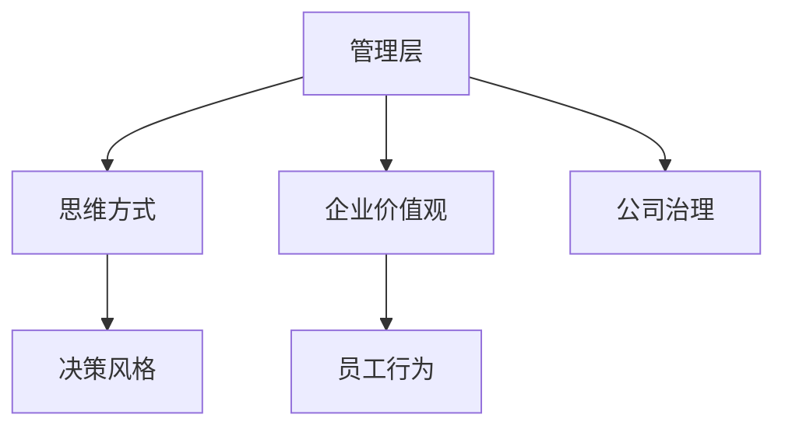
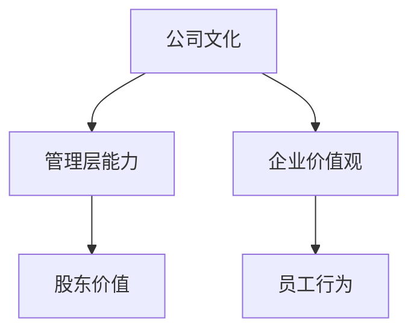
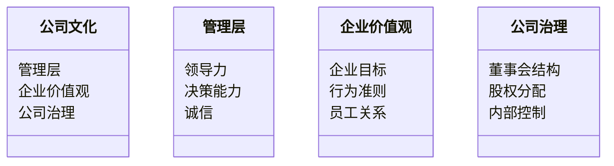
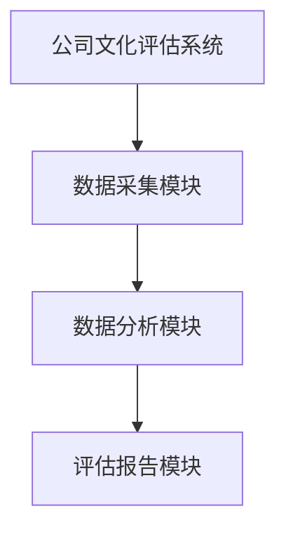
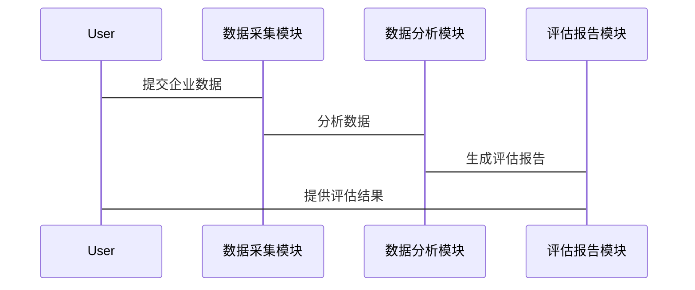

                 


# 巴菲特的公司文化评估：优秀管理层的特征

> 关键词：巴菲特，公司文化，优秀管理层，投资理念，文化评估

> 摘要：本文探讨了巴菲特在评估公司文化时的方法，重点分析了优秀管理层的特征，包括领导力、决策能力、诚信与责任感等。通过具体案例和系统分析，揭示了公司文化对长期投资价值的影响。

---

# 第一部分: 巴菲特的公司文化评估方法论

## 第1章: 巴菲特投资理念与公司文化评估的背景

### 1.1 巴菲特投资理念概述

#### 1.1.1 巴菲特的投资哲学
巴菲特的投资哲学以价值投资为核心，强调长期投资、安全边际和对公司基本面的深入研究。他不仅关注财务数据，更关注公司治理、管理层素质和企业文化等软性因素。

#### 1.1.2 巴菲特对管理层能力的重视
巴菲特认为，优秀的企业管理层是企业长期成功的关键。他特别关注管理层的决策能力、诚信和对股东价值的重视程度。

#### 1.1.3 巴菲特与公司文化的关系
公司文化是企业长期发展的基石。巴菲特通过分析公司文化，评估管理层的思维方式和企业价值观，从而判断企业的长期发展潜力。

### 1.2 公司文化的重要性

#### 1.2.1 什么是公司文化
公司文化是企业在长期经营中形成的共同价值观、行为准则和思维方式。它包括企业目标、管理风格、员工关系等多个方面。

#### 1.2.2 公司文化的核心要素
公司文化的核心要素包括：
1. 企业目标：企业的长期发展方向和使命。
2. 价值观：企业倡导的核心理念和行为准则。
3. 管理风格：管理层的决策方式和领导风格。
4. 员工关系：企业与员工之间的互动和信任程度。

#### 1.2.3 公司文化对长期价值的影响
公司文化直接影响企业的凝聚力、创新能力和抗风险能力。优秀的公司文化能够吸引优秀人才，提升企业效率，增强企业的市场竞争力。

### 1.3 优秀管理层的特征

#### 1.3.1 领导力与决策能力
优秀管理层具备清晰的愿景和目标，能够制定合理的战略，并在决策过程中注重长期利益。

#### 1.3.2 以股东价值为导向
优秀管理层关注企业的长期价值创造，注重股东回报，避免短期行为和过度杠杆。

#### 1.3.3 诚信与责任感
优秀管理层以诚信为本，对公司和社会负责，避免虚假陈述和不当行为。

## 第2章: 巴菲特的公司文化评估框架

### 2.1 公司文化评估的核心维度

#### 2.1.1 管理层的思维方式
管理层的思维方式决定了企业的战略方向和决策风格。巴菲特通过分析管理层的决策历史和行为模式，评估其思维方式的优劣。

#### 2.1.2 企业文化与价值观
企业文化是公司文化的核心，包括企业的目标、价值观和行为准则。巴菲特通过分析企业的文化，判断其是否具备可持续发展的潜力。

#### 2.1.3 公司治理结构
公司治理结构是公司文化的重要组成部分，包括董事会结构、股权分配和内部控制系统。优秀的公司治理能够确保管理层的决策符合股东利益。

### 2.2 巴菲特的评估方法

#### 2.2.1 通过财务指标评估公司文化
巴菲特通过分析企业的财务指标，如ROE（净资产收益率）、ROA（资产回报率）等，评估企业的盈利能力和发展潜力。

#### 2.2.2 通过管理层行为观察文化
巴菲特关注管理层的行为，如是否注重成本控制、是否避免过度负债、是否注重股东回报等，判断其是否具备优秀管理者的特征。

#### 2.2.3 通过公司历史案例分析文化
巴菲特通过分析企业的历史案例，如公司应对危机的方式、管理层的决策风格等，评估公司的文化是否稳健和可持续。

### 2.3 评估框架的可视化

#### 2.3.1 公司文化构成要素的 Mermaid 图


#### 2.3.2 巴菲特评估框架的 Mermaid 图


## 第3章: 优秀管理层的特征分析

### 3.1 领导力与决策能力

#### 3.1.1 领导力的核心要素
领导力是优秀管理层的关键特征之一。优秀的领导者具备清晰的愿景、良好的沟通能力和团队激励能力，能够带领团队实现目标。

#### 3.1.2 决策能力的关键特征
优秀的管理层在决策时注重长期利益，避免短期行为，能够在复杂环境中做出明智决策。

#### 3.1.3 巴菲特对管理层决策的评价标准
巴菲特通过分析管理层的决策历史，判断其是否具备稳健和理性的决策能力。

### 3.2 以股东价值为导向

#### 3.2.1 股东价值的定义
股东价值是指企业在未来为股东创造的经济价值，包括股息、股价增长等。

#### 3.2.2 管理层对股东价值的重视程度
优秀的管理层将股东价值放在首位，注重企业长期发展和股东回报。

#### 3.2.3 巴菲特对股东价值的关注点
巴菲特关注企业的股东回报率、股息支付率等指标，判断管理层是否以股东价值为导向。

### 3.3 诚信与责任感

#### 3.3.1 诚信的重要性
诚信是优秀管理层的基石。具备诚信的管理层能够赢得投资者的信任和支持。

#### 3.3.2 责任感的体现
优秀的管理层对企业的长期发展负责，对股东和社会负责，避免短期利益诱惑。

#### 3.3.3 巴菲特对管理层诚信的判断
巴菲特通过分析企业的历史行为和管理层的公开声明，判断其是否具备诚信和责任感。

---

# 第二部分: 系统分析与架构设计

## 第4章: 系统分析与架构设计方案

### 4.1 问题场景介绍
为了评估公司文化，我们需要构建一个系统化的评估框架，涵盖公司治理、管理层能力、企业价值观等多个方面。

### 4.2 项目介绍
本项目旨在设计一个公司文化评估系统，帮助投资者和管理层分析和改进公司文化。

### 4.3 系统功能设计

#### 4.3.1 领域模型 Mermaid 类图


### 4.4 系统架构设计

#### 4.4.1 系统架构 Mermaid 图


### 4.5 系统接口设计

#### 4.5.1 数据采集接口
数据采集模块负责收集企业的财务数据、管理层行为数据和公司治理数据。

### 4.6 系统交互 Mermaid 序列图


---

# 第三部分: 项目实战

## 第5章: 项目实战

### 5.1 环境安装
为了进行公司文化评估，我们需要安装必要的工具和数据采集系统。

### 5.2 核心实现源代码

#### 5.2.1 数据分析代码
```python
import pandas as pd

def analyze_culture(data):
    # 数据分析逻辑
    pass

# 示例数据
data = {
    '公司': ['A', 'B', 'C'],
    'ROE': [15, 10, 8],
    'ROA': [12, 8, 5]
}

df = pd.DataFrame(data)
```

### 5.3 实际案例分析
通过分析具体公司的数据，评估其公司文化和管理层特征。

### 5.4 案例分析与解读
以某公司为例，分析其公司文化，判断其管理层是否具备优秀特征。

### 5.5 项目小结
总结项目实施过程中的经验教训，提出改进建议。

---

# 第四部分: 最佳实践

## 第6章: 最佳实践

### 6.1 小结
公司文化评估是投资决策的重要部分，优秀管理层的特征是公司长期成功的关键。

### 6.2 注意事项
在评估公司文化时，需要注意数据的全面性、分析的客观性和结论的实用性。

### 6.3 拓展阅读
推荐相关书籍和文章，供读者进一步学习和研究。

---

# 结语
通过本文的分析和探讨，我们深入了解了巴菲特在公司文化评估中的方法和优秀管理层的特征。希望这些内容能够为投资者和企业管理者提供有价值的参考和启示。

