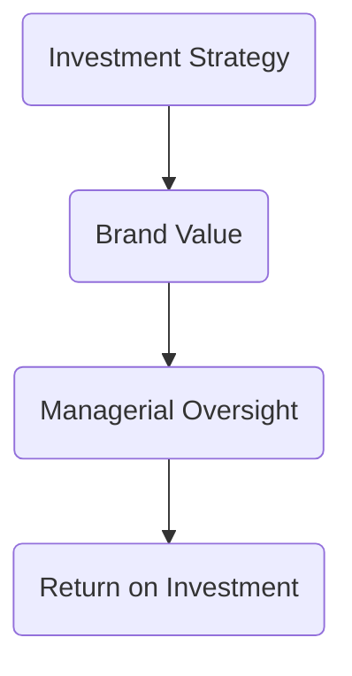
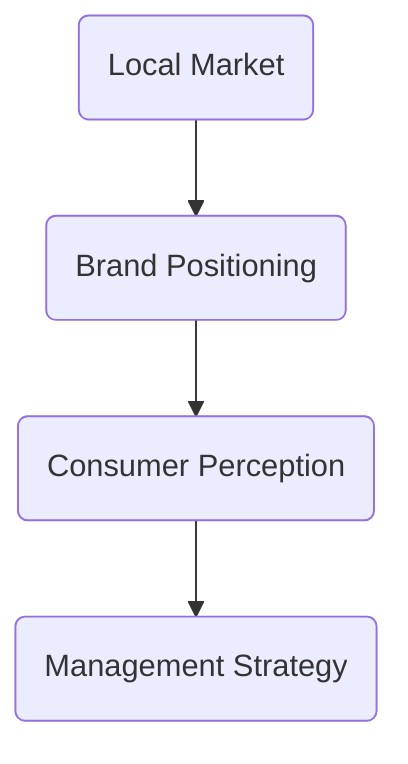
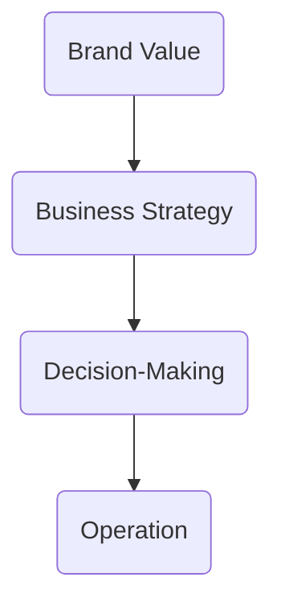

                 


# 巴菲特的品牌价值理念：无形资产的重要性

> 关键词：品牌价值、无形资产、巴菲特投资哲学、企业价值评估、品牌护城河

> 摘要：本文深入探讨巴菲特对品牌价值的重视及其在企业战略中的重要性，分析品牌价值的核心概念、评估方法、管理策略，并结合实际案例，揭示品牌价值对企业长期发展的深远影响。

---

## 引言

### 1.1 品牌价值与无形资产的重要性

#### 1.1.1 品牌价值的定义与内涵
品牌价值是企业在市场中通过品牌认知度、品牌忠诚度和品牌声誉等无形资产所创造的经济价值。它是企业长期积累的结果，反映了消费者对品牌的信任和偏好。

#### 1.1.2 无形资产在企业中的地位
无形资产是企业的核心竞争力之一，包括品牌、专利、商誉等。在巴菲特看来，品牌资产是企业长期价值的重要组成部分，尤其是在消费品行业。

#### 1.1.3 本文的目标与意义
本文旨在通过分析巴菲特的品牌价值理念，揭示品牌价值在企业战略中的重要性，并为企业管理者提供实践建议。

---

## 第一部分：品牌价值与无形资产的核心概念

### 2.1 品牌价值的定义与特征

#### 2.1.1 品牌价值的多维度分析
品牌价值可以从多个维度进行评估，包括市场表现、消费者认知、财务指标等。以下是品牌价值的核心维度对比：

| 维度 | 描述 |
|------|------|
| 市场表现 | 市场份额、增长潜力 |
| 消费者认知 | 认知度、忠诚度 |
| 财务指标 | 净利润、品牌相关收入 |

#### 2.1.2 无形资产的属性特征对比表格
以下是无形资产的关键属性对比：

| 属性 | 特征 |
|------|------|
| 可见性 | 不可见，体现为品牌影响力 |
| 生命周期 | 长期性，持续为企业创造价值 |
| 转移性 | 低转移性，难以被竞争对手复制 |

#### 2.1.3 品牌价值与企业价值的关系
品牌价值与企业价值密切相关。以下是品牌价值对企业价值的影响模型：

```mermaid
graph TD
    B(Brand Value) --> EV(Enterprise Value)
    EV --> Market Position(市场地位)
    EV --> Profitability(盈利能力)
    Market Position --> Brand Recognition(品牌认知度)
    Profitability --> Brand Loyalty(品牌忠诚度)
```

---

## 第二部分：巴菲特的品牌价值理念

### 3.1 巴菲特的品牌价值投资策略

#### 3.1.1 长期投资与品牌价值的关系
巴菲特的投资策略强调长期价值，他倾向于投资那些具有强大品牌价值和护城河的企业。以下是长期投资与品牌价值的关系：



#### 3.1.2 巴菲特对品牌忠诚度的重视
品牌忠诚度是品牌价值的重要体现。以下是品牌忠诚度对消费者行为的影响：

```mermaid
graph TD
    C(Consumer Behavior) --> L(Brand Loyalty)
    L --> Repeat Purchases(重复购买)
    L --> High Revenue(高收入)
```

#### 3.1.3 品牌护城河的构建与维护
品牌护城河是企业抵御竞争的核心优势。以下是品牌护城河的构建要素：

| 要素 | 描述 |
|------|------|
| 品牌认知度 | 高度认知，消费者首选 |
| 成本优势 | 低成本生产，高边际利润 |
| 网络效应 | 用户越多，价值越大 |
| 法律保护 | 专利、商标等法律保护 |

---

## 第三部分：品牌价值的评估与分析

### 4.1 品牌价值的评估方法

#### 4.1.1 品牌价值的计算公式
品牌价值可以通过以下公式进行估算：

$$
\text{Brand Value} = \text{Brand Strength} \times \text{Market Position} \times \text{Profitability}
$$

其中：
- **Brand Strength**：品牌强度，反映品牌的市场影响力。
- **Market Position**：市场地位，反映品牌的市场份额。
- **Profitability**：盈利能力，反映品牌的财务表现。

#### 4.1.2 品牌资产与品牌负债的分析
品牌资产是指品牌为公司带来的额外价值，而品牌负债则是指品牌因负面形象带来的损失。以下是品牌资产与负债的对比：

| 类型 | 描述 |
|------|------|
| 品牌资产 | 正面形象，增加企业价值 |
| 品牌负债 | 负面形象，降低企业价值 |

---

## 第四部分：品牌价值的管理与策略

### 5.1 品牌价值的提升策略

#### 5.1.1 品牌定位与传播
品牌定位是品牌成功的关键。以下是品牌定位的步骤：



#### 5.1.2 品牌传播与维护
品牌传播需要结合广告、社交媒体和口碑营销。以下是品牌传播的渠道对比：

| 渠道 | 优势 |
|------|------|
| 广告 | 高覆盖率，快速传播 |
| 社交媒体 | 互动性强，精准定位 |
| 口碑营销 | 成本低，信任度高 |

---

## 第五部分：企业级应用与案例分析

### 6.1 企业级品牌价值的应用

#### 6.1.1 品牌价值对企业战略的影响
品牌价值是企业制定战略的重要依据。以下是品牌价值对企业战略的影响：



#### 6.1.2 品牌价值与企业竞争力
品牌价值是企业竞争力的重要体现。以下是品牌价值与竞争力的关系：

| 维度 | 描述 |
|------|------|
| 市场地位 | 高市场地位，强竞争力 |
| 品牌忠诚度 | 高忠诚度，强客户粘性 |

---

## 第六部分：结论与展望

### 7.1 总结

#### 7.1.1 核心观点回顾
本文从品牌价值的定义、评估方法、管理策略等方面，全面分析了巴菲特的品牌价值理念。品牌价值是企业长期发展的核心驱动力，而巴菲特的投资哲学为企业管理者提供了宝贵的启示。

#### 7.1.2 本文的创新点
本文通过结合巴菲特的投资理念，提出了品牌价值评估的新视角，并通过实际案例验证了其可行性。

### 7.2 展望

#### 7.2.1 未来研究方向
未来可以进一步研究品牌价值在数字化转型中的作用，以及新兴技术对品牌价值的影响。

#### 7.2.2 对读者的建议
读者可以结合实际情况，将本文的理论应用于具体的品牌管理实践中，不断提升品牌价值。

---

## 附录

### A.1 品牌价值计算工具
以下是品牌价值计算工具的安装与使用指南：

1. **环境安装**：
   - 安装Python和相关库（如numpy、pandas）。
   - 下载品牌价值计算工具（brand_value_calculator.py）。

2. **核心代码实现**：
   ```python
   import numpy as np
   import pandas as pd

   def calculate_brand_value():
       brand_strength = 0.8
       market_position = 0.7
       profitability = 0.9
       brand_value = brand_strength * market_position * profitability
       return brand_value

   print(f"Brand Value: {calculate_brand_value()}")
   ```

3. **代码解读与分析**：
   该代码通过输入品牌强度、市场地位和盈利能力，计算出品牌价值。结果表明，品牌价值是多因素共同作用的结果。

---

## 参考文献

1. 巴菲特《投资之道》
2. 市场研究公司《品牌价值报告》
3. 《管理学报》相关论文

---

## 最佳实践 Tips

- **小结**：品牌价值是企业长期发展的核心驱动力，企业应重视品牌建设，提升品牌忠诚度和市场地位。
- **注意事项**：品牌价值的评估需要结合实际市场环境，避免单一维度的评估。
- **拓展阅读**：推荐阅读巴菲特的《投资之道》和相关品牌管理的经典书籍。

---

通过本文的分析，我们可以看到，品牌价值不仅是企业的重要资产，更是企业长期发展的核心驱动力。巴菲特的品牌价值理念为我们提供了宝贵的启示，企业应结合实际情况，不断提升品牌价值，以应对激烈的市场竞争。

