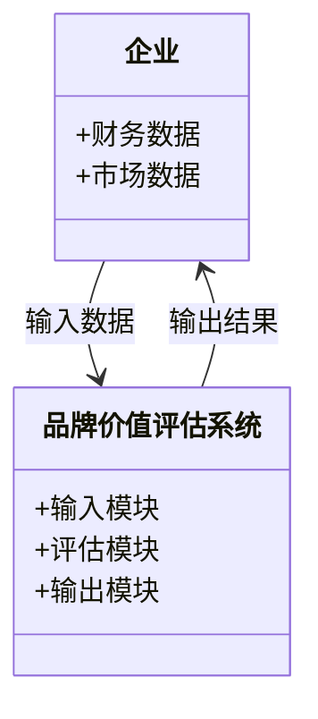
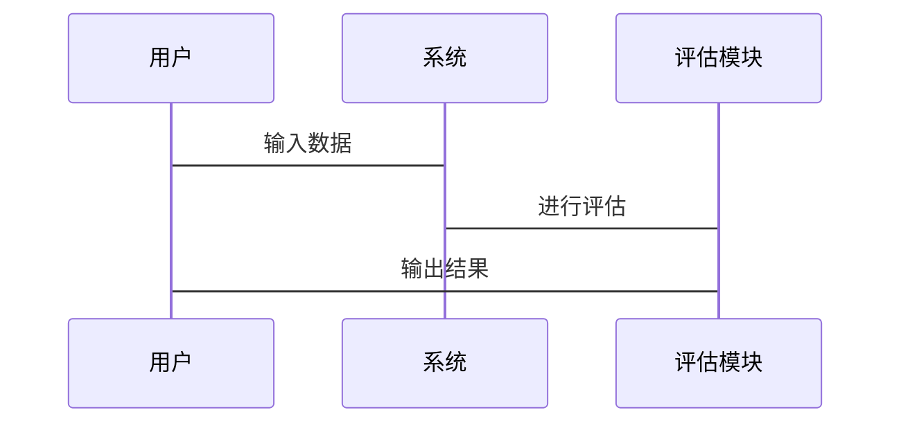

                 


# 巴菲特的品牌价值评估：无形资产在企业价值中的重要性

## 关键词：品牌价值评估，无形资产，巴菲特，企业价值，投资评估

## 摘要：  
本文深入探讨了巴菲特在品牌价值评估中的独特见解，重点分析了无形资产在企业价值中的重要性。通过结合巴菲特的投资理念和实际案例，文章详细阐述了品牌价值的构成要素、评估方法以及其对投资决策的影响。文章还提供了数学模型和系统架构设计，帮助读者全面理解品牌价值评估的理论与实践。

---

# 第1章: 品牌价值评估的背景与概念

## 1.1 无形资产在企业价值中的作用

### 1.1.1 无形资产的定义与分类

- **无形资产**是指那些没有实体形态但具有经济价值的资产，包括品牌、专利、商标、商誉等。
- **品牌**作为无形资产的核心部分，是企业市场竞争力的象征。

### 1.1.2 无形资产对企业价值的影响

- **品牌认知度**：高知名度的品牌能带来更高的市场占有率和客户忠诚度。
- **品牌忠诚度**：客户对品牌的忠诚度直接影响企业的长期收益。

### 1.1.3 巴菲特对品牌价值的重视

- 巴菲特认为品牌是企业长期竞争优势的重要来源。
- 他倾向于投资那些具有强大品牌价值的企业，如可口可乐和吉列公司。

## 1.2 巴菲特的投资理念与品牌价值

### 1.2.1 巴菲特的投资哲学

- **长期价值投资**：关注企业的基本面和长期盈利能力。
- **护城河**：投资具有强大竞争优势的企业。

### 1.2.2 巴菲特的品牌价值评估方法

- 通过分析企业的市场地位、品牌影响力和客户忠诚度来评估品牌价值。
- 结合财务数据和市场表现，综合判断企业价值。

### 1.2.3 品牌价值在巴菲特投资决策中的地位

- 品牌价值是巴菲特评估企业长期价值的重要指标。
- 强大的品牌价值意味着企业在市场中有更强的定价权和抗风险能力。

## 1.3 品牌价值评估的核心要素

### 1.3.1 品牌认知度

- 品牌在市场中的知名度和被认知的程度直接影响其价值。

### 1.3.2 品牌忠诚度

- 客户对品牌的忠诚度越高，企业的长期收益越稳定。

### 1.3.3 品牌的市场地位

- 市场领导者通常具有更强的品牌影响力和定价能力。

## 1.4 本章小结

本章介绍了品牌价值评估的基本概念和巴菲特的投资理念，强调了品牌作为无形资产在企业价值中的重要性。通过分析品牌认知度、忠诚度和市场地位，我们可以更好地理解品牌价值的构成和其对企业长期发展的意义。

---

# 第2章: 品牌价值评估的核心概念与联系

## 2.1 品牌价值的构成要素

### 2.1.1 品牌名称与标识

- 品牌名称和标识是品牌识别的核心部分，直接影响品牌认知度。

### 2.1.2 品牌故事与文化

- 品牌背后的故事和文化赋予品牌情感价值，增强客户忠诚度。

### 2.1.3 品牌的市场声誉与形象

- 市场声誉是品牌在行业中的信誉和形象，直接影响品牌价值。

## 2.2 有形资产与无形资产的对比

### 2.2.1 有形资产的特征

- 具有实体形态，如设备、房地产等。
- 价值相对稳定，易于评估。

### 2.2.2 无形资产的特征

- 没有实体形态，如品牌、专利等。
- 价值难以量化，受市场和管理因素影响较大。

### 2.2.3 有形与无形资产的协同作用

- 有形资产为无形资产提供物质基础，无形资产提升有形资产的市场价值。

## 2.3 品牌价值评估的系统架构

### 2.3.1 品牌价值评估的ER实体关系图

```mermaid
erDiagram
    customer[顾客] {
        +id: int
        +name: string
        +loyalty: int
    }
    brand[品牌] {
        +id: int
        +name: string
        +reputation: int
    }
    transaction[交易] {
        +id: int
        +customer_id: int
        +brand_id: int
        +value: float
    }
    customer --> transaction: 参与
    brand --> transaction: 关联
```

## 2.4 本章小结

本章详细分析了品牌价值的构成要素，并通过对比有形资产与无形资产，强调了品牌作为无形资产的独特价值。通过ER实体关系图展示了品牌价值评估的系统架构，为后续的分析奠定了基础。

---

# 第3章: 巴菲特的评估方法与品牌价值分析

## 3.1 巴菲特的投资理念

### 3.1.1 长期价值投资

- 巴菲特注重企业的长期盈利能力，而非短期股价波动。

### 3.1.2 护城河策略

- 投资具有强大竞争优势的企业，如可口可乐和吉列公司。

## 3.2 巴菲特的品牌价值评估指标

### 3.2.1 市场占有率

- 市场占有率高的企业通常具有更强的品牌影响力。

### 3.2.2 净利润率

- 净利润率高表明企业具有较强的市场定价能力。

### 3.2.3 品牌忠诚度

- 通过分析客户忠诚度评估品牌价值。

## 3.3 实际案例分析

### 3.3.1 可口可乐案例

- 可口可乐作为全球知名品牌，具有强大的市场占有率和客户忠诚度。
- 巴菲特认为可口可乐的品牌价值是其长期盈利能力的重要保障。

### 3.3.2 吉列公司案例

- 吉列公司在剃须刀市场的领先地位体现了其品牌价值和市场影响力。

## 3.4 本章小结

本章通过分析巴菲特的投资理念和品牌价值评估指标，结合实际案例，展示了品牌价值在企业长期发展中的重要作用。

---

# 第4章: 数学模型与品牌价值评估公式

## 4.1 品牌价值的数学模型

### 4.1.1 贴现现金流模型

- 通过预测企业未来现金流，计算其现值作为品牌价值的评估依据。

公式如下：
$$
\text{品牌价值} = \sum_{t=1}^{n} \frac{\text{现金流}_t}{(1 + r)^t}
$$
其中，$r$为折现率，$n$为预测年数。

### 4.1.2 市盈率法

- 通过市盈率和净利润预测品牌价值。

公式如下：
$$
\text{品牌价值} = \text{市盈率} \times \text{净利润}
$$

## 4.2 品牌价值评估的步骤

### 4.2.1 确定评估方法

- 选择合适的数学模型进行品牌价值评估。

### 4.2.2 收集数据

- 获取企业的财务数据和市场数据。

### 4.2.3 计算与分析

- 应用数学模型计算品牌价值，并进行对比分析。

## 4.3 案例分析：使用贴现现金流模型评估品牌价值

### 步骤1：确定现金流和折现率

- 现金流：假设未来5年的现金流分别为100万、120万、150万、180万和200万。
- 折现率：假设为8%。

### 步骤2：计算现值

$$
\text{现值} = \sum_{t=1}^{5} \frac{\text{现金流}_t}{(1 + 0.08)^t}
$$

### 步骤3：计算品牌价值

- 现值总和即为品牌价值。

## 4.4 本章小结

本章通过数学模型和公式，详细讲解了品牌价值的评估方法，并通过案例分析展示了如何应用这些方法进行实际评估。

---

# 第5章: 系统分析与架构设计

## 5.1 系统分析

### 5.1.1 问题场景介绍

- 品牌价值评估系统需要整合企业财务数据和市场数据，进行综合分析。

### 5.1.2 项目介绍

- 开发一个品牌价值评估系统，帮助投资者评估企业的品牌价值。

## 5.2 系统功能设计

### 5.2.1 领域模型设计



### 5.2.2 系统架构设计


## 5.3 系统接口设计

### 5.3.1 输入接口

- 支持多种数据格式的输入，如CSV和Excel。

### 5.3.2 输出接口

- 提供多种输出格式，如报告和图表。

## 5.4 系统交互设计

### 5.4.1 交互流程



## 5.5 本章小结

本章从系统分析和架构设计的角度，详细讲解了品牌价值评估系统的实现过程，为实际应用提供了理论基础。

---

# 第6章: 项目实战与品牌价值评估

## 6.1 项目实战环境

### 6.1.1 环境安装

- 安装Python和相关数据处理库，如Pandas和NumPy。

## 6.2 核心代码实现

### 6.2.1 数据处理代码

```python
import pandas as pd

# 读取数据
data = pd.read_csv('brand_data.csv')

# 计算品牌价值
def calculate_brand_value(data):
    # 假设使用市盈率法
    brand_value = data['市盈率'] * data['净利润']
    return brand_value

# 应用计算
brand_values = calculate_brand_value(data)
```

### 6.2.2 可视化代码

```python
import matplotlib.pyplot as plt

plt.figure(figsize=(10,6))
plt.plot(data['品牌'], brand_values, 'b-')
plt.xlabel('品牌')
plt.ylabel('品牌价值')
plt.title('品牌价值分布')
plt.show()
```

## 6.3 代码应用解读

### 6.3.1 数据处理

- 读取CSV文件中的品牌数据，计算品牌价值。

### 6.3.2 可视化

- 绘制品牌价值分布图，直观展示各品牌的价值差异。

## 6.4 实际案例分析

### 6.4.1 某公司品牌价值评估

- 通过代码计算该公司品牌价值，并分析其市场地位。

## 6.5 本章小结

本章通过项目实战，展示了如何利用Python代码进行品牌价值评估，并通过可视化工具直观展示评估结果。

---

# 第7章: 最佳实践与未来展望

## 7.1 最佳实践 tips

- 结合财务数据和市场数据，全面评估品牌价值。
- 定期更新评估模型，适应市场变化。

## 7.2 小结

本文系统地介绍了巴菲特的品牌价值评估方法，分析了品牌作为无形资产对企业价值的重要性，并通过数学模型和系统设计展示了评估方法的实际应用。

## 7.3 注意事项

- 数据的准确性和完整性直接影响评估结果。
- 模型的选择应根据具体情况进行调整。

## 7.4 未来展望

- 随着技术的发展，品牌价值评估将更加智能化和数据化。
- 人工智能和大数据技术将为品牌价值评估提供新的方法和工具。

---

# 参考文献

1. 巴菲特的年度股东大会演讲和投资理念分析。
2. 《巴菲特传》相关书籍。
3. 相关品牌价值评估的学术论文和研究报告。

---

# 结束语

通过本文的系统分析和实际案例，读者可以深入了解巴菲特的品牌价值评估方法，掌握无形资产在企业价值中的重要性。未来，随着技术的进步，品牌价值评估将更加精准和高效，为企业决策提供更有力的支持。

