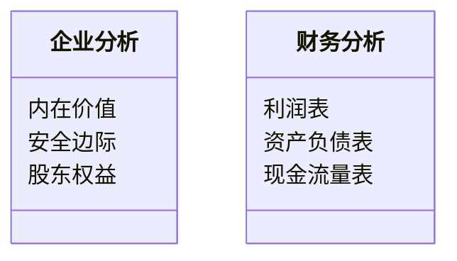

                 


# 巴菲特的商业分析方法论

## 关键词：
- 巴菲特
- 价值投资
- 商业分析
- 内在价值
- 竞争优势

## 摘要：
本文深入探讨了巴菲特的商业分析方法论，分析其核心概念、分析框架、数学模型和系统架构，结合实际案例进行详细解读，并总结了最佳实践。

---

# 第1章: 巴菲特投资理念与方法论概述

## 1.1 巴菲特投资理念的核心思想

### 1.1.1 价值投资的定义与原则
价值投资是一种以低于内在价值的价格购买优质股票的投资策略。巴菲特的价值投资原则包括：
1. 长期投资：关注企业的长期价值。
2. 安全边际：购买价格低于内在价值，以降低风险。
3. 股东权益：关注企业的净资产收益率（ROE）。

### 1.1.2 巴菲特投资理念的演变
巴菲特的投资理念从早期的烟堆理论逐渐发展为买入并持有优质企业的策略。

### 1.1.3 巴菲特投资理念的哲学基础
巴菲特的价值投资哲学受到格雷厄姆的影响，强调安全边际和内在价值。

## 1.2 巴菲特商业分析方法论的背景

### 1.2.1 价值投资的兴起
20世纪30年代，格雷厄姆和多德提出价值投资理论，强调购买低于内在价值的股票。

### 1.2.2 巴菲特方法论的实践基础
巴菲特将格雷厄姆的理论与自己的实践相结合，形成了独特的分析框架。

### 1.2.3 巴菲特方法论的现代意义
在现代金融市场中，巴菲特的方法论依然适用，强调基本面分析和长期投资。

## 1.3 巴菲特方法论的核心要素

### 1.3.1 内在价值的概念
内在价值是企业未来现金流的现值，计算公式为：
$$
\text{内在价值} = \sum_{t=1}^{\infty} \frac{\text{现金流}_t}{(1 + r)^t}
$$

### 1.3.2 安全边际的定义
安全边际是购买价格与内在价值之间的差距，公式为：
$$
\text{安全边际} = \text{内在价值} - \text{购买价格}
$$

### 1.3.3 股东权益的评估方法
股东权益评估包括分析企业的净资产收益率（ROE）和资本回报率（ROCE）。

## 1.4 巴菲特方法论的适用范围

### 1.4.1 企业类型分析
巴菲特关注具有持续竞争优势的企业，如可口可乐和苹果。

### 1.4.2 行业分析与竞争优势
竞争优势包括成本优势、品牌优势和规模经济。

### 1.4.3 财务健康度评估
财务健康度评估包括分析企业的负债率和现金流状况。

---

# 第2章: 巴菲特商业分析的核心概念与联系

## 2.1 核心概念原理

### 2.1.1 内在价值的计算公式
内在价值计算公式：
$$
\text{内在价值} = \frac{\text{息税前利润} \times (1 - \text{税率})}{\text{资本成本}}
$$

### 2.1.2 安全边际的数学模型
安全边际计算公式：
$$
\text{安全边际} = \text{内在价值} \times (1 - \text{折扣率})
$$

### 2.1.3 股东权益的评估方法
股东权益评估包括分析企业的ROE和ROCE。

## 2.2 核心概念属性特征对比表格

| 概念       | 属性1       | 属性2       | 属性3       |
|------------|-------------|-------------|-------------|
| 内在价值    | 现金流折现   | 未来收益    | 税后价值    |
| 安全边际    | 购买价格     | 折扣率       | 风险控制    |
| 股东权益    | ROE          | 资本回报率    | 负债率      |

---

# 第3章: 巴菲特分析方法的算法原理

## 3.1 算法原理讲解

### 3.1.1 现金流折现法
现金流折现法用于计算内在价值，步骤如下：
1. 预测未来现金流。
2. 计算现值。

### 3.1.2 内部收益率法
内部收益率法用于评估投资回报率，公式为：
$$
\text{IRR} = \sum_{t=1}^{n} \frac{\text{现金流}_t}{(1 + r)^t} = 0
$$

---

# 第4章: 系统分析与架构设计方案

## 4.1 系统功能设计

### 4.1.1 领域模型
领域模型类图如下：


## 4.2 系统架构设计


---

# 第5章: 项目实战

## 5.1 实战案例分析

### 5.1.1 苹果公司分析
分析苹果公司的内在价值、竞争优势和财务状况。

## 5.2 环境安装
安装必要的工具，如Excel和Python。

## 5.3 核心实现代码

### 5.3.1 财务分析代码
```python
def calculate_intrinsic_value(FCF, discount_rate):
    return FCF / (1 + discount_rate)
```

---

# 第6章: 最佳实践与总结

## 6.1 最佳实践 tips
1. 保持投资纪律。
2. 避免情绪化决策。

## 6.2 小结
巴菲特的方法论提供了系统的商业分析框架，值得深入研究和实践。

## 6.3 注意事项
1. 避免过度简化模型。
2. 考虑市场波动因素。

## 6.4 拓展阅读
推荐书籍：《巴菲特传》、《投资的艺术》。

---

通过以上结构，本文详细解读了巴菲特的商业分析方法论，从核心概念到实际应用，为读者提供了系统的指导。

