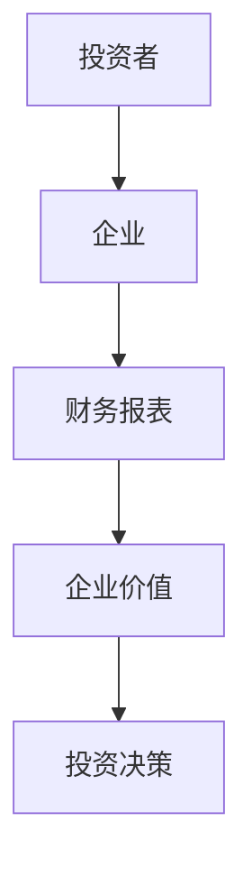
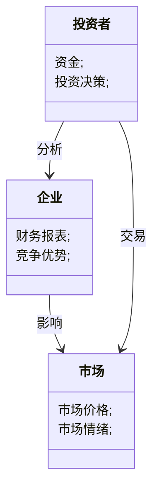
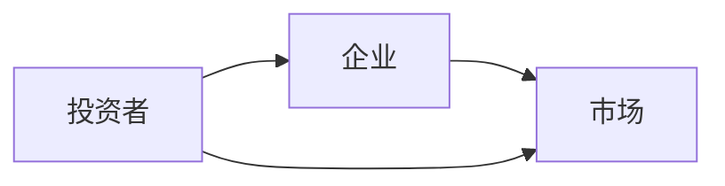

                 


# 巴菲特的商业模式分析

> 关键词：巴菲特，商业模式，价值投资，投资策略，技术分析，投资哲学

> 摘要：本文从技术分析的角度，详细解析巴菲特的商业模式，探讨其投资哲学、分析方法及其在现代投资中的应用。通过系统架构设计和案例分析，揭示巴菲特商业模式的核心要素和内在逻辑。

---

# 第一部分: 巴菲特投资理念基础

## 第1章: 巴菲特投资哲学概述

### 1.1 巴菲特生平与投资理念

#### 1.1.1 巴菲特的生平简介
沃伦·巴菲特（Warren Buffett），1934年8月31日出生于美国奥马哈市，是全球著名的价值投资者、慈善家和投资家。他通过长期投资、价值投资和股息投资策略积累了巨额财富，并成为《福布斯》全球富豪榜上的常客。

#### 1.1.2 巴菲特的投资哲学核心
巴菲特的投资哲学基于以下几点：
- **价值投资**：寻找市场价格低于内在价值的企业进行投资。
- **安全边际**：在价格显著低于内在价值时买入，以降低投资风险。
- **长期持有**：投资优质企业，长期持有，而非频繁交易。

#### 1.1.3 巴菲特的价值投资理念
价值投资的核心在于寻找市场先生的错误定价。巴菲特定义“市场先生”为市场情绪的化身，当市场恐慌时，市场先生会提供廉价的资产；当市场狂热时，市场先生会要求过高的价格。

---

### 1.2 价值投资的定义与特点

#### 1.2.1 价值投资的定义
价值投资是一种投资策略，通过深入分析企业的财务状况、行业地位、竞争优势和管理层质量，寻找市场价格低于其内在价值的企业进行投资。

#### 1.2.2 价值投资的核心特点
1. **注重企业内在价值**：分析企业的盈利能力、成长性和财务健康状况。
2. **强调安全边际**：买入价格显著低于内在价值，以降低投资风险。
3. **长期投资**：避免短期市场波动，耐心持有优质企业。

#### 1.2.3 价值投资与其它投资策略的对比
- **与投机投资的区别**：价值投资注重长期稳健，而投机投资追求短期收益。
- **与趋势投资的区别**：价值投资基于企业基本面，趋势投资基于市场趋势。

---

## 第2章: 巴菲特商业模式的核心要素

### 2.1 巴菲特商业模式的核心概念

#### 2.1.1 企业基本面分析
企业基本面分析是巴菲特商业模式的核心，包括以下几个方面：
- **财务报表分析**：利润表、资产负债表和现金流量表。
- **盈利能力分析**：ROE（净资产收益率）、ROA（资产回报率）和净利润增长率。
- **成长能力分析**：销售收入增长率、净利润增长率和研发投入占比。

#### 2.1.2 财务报表分析
巴菲特通过财务报表分析来评估企业的财务健康状况，包括以下几个方面：
- **利润表**：关注企业的收入来源和成本结构。
- **资产负债表**：评估企业的资产结构和负债水平。
- **现金流量表**：分析企业的现金流健康状况。

#### 2.1.3 企业竞争优势分析
巴菲特注重企业的竞争优势，包括以下几个方面：
- **成本优势**：企业是否具有更低的生产成本。
- **技术优势**：企业是否拥有独特的技术或专利。
- **市场优势**：企业在市场中的占有率和品牌影响力。

---

### 2.2 巴菲特商业模式的属性特征

#### 2.2.1 价值投资的长期性
巴菲特强调长期投资，避免短期市场波动的影响。他认为，短期市场的波动是噪音，长期趋势才是关键。

#### 2.2.2 安全边际的重要性
安全边际是巴菲特投资策略的核心要素。他通过买入价格显著低于内在价值的股票，来降低投资风险。

#### 2.2.3 企业内在价值的评估
内在价值是巴菲特商业模式的基石。他通过分析企业的财务状况、行业地位和竞争优势，估算企业的内在价值。

---

### 2.3 巴菲特商业模式的ER实体关系图



---

## 第3章: 巴菲特商业模式的分析框架

### 3.1 巴菲特商业模式的核心原理

#### 3.1.1 企业内在价值的计算公式
$$\text{内在价值} = \frac{\text{净利润}}{\text{资本成本} - \text{增长率}}$$

#### 3.1.2 市盈率与市净率分析
- **市盈率（P/E）**：$$\text{市盈率} = \frac{\text{股价}}{\text{每股净利润}}$$
- **市净率（P/B）**：$$\text{市净率} = \frac{\text{股价}}{\text{每股净资产}}$$

---

## 第4章: 巴菲特商业模式的系统分析

### 4.1 系统架构设计

#### 4.1.1 系统功能设计（领域模型）


#### 4.1.2 系统架构设计


---

## 第5章: 巴菲特商业模式的技术实现

### 5.1 技术分析方法

#### 5.1.1 市盈率分析
$$\text{市盈率} = \frac{\text{股价}}{\text{每股净利润}}$$

#### 5.1.2 市净率分析
$$\text{市净率} = \frac{\text{股价}}{\text{每股净资产}}$$

---

## 第6章: 投资决策系统实现

### 6.1 环境安装与配置

#### 6.1.1 数据收集与预处理
- 数据来源：历史股价、财务报表数据、行业数据。
- 数据清洗：处理缺失值、异常值和重复数据。

#### 6.1.2 投资决策系统实现

```python
import pandas as pd
import numpy as np

# 示例代码：计算市盈率和市净率
df = pd.DataFrame({
    '股价': [100, 200, 300],
    '净利润': [10, 20, 30],
    '每股净资产': [5, 10, 15]
})

df['市盈率'] = df['股价'] / df['净利润']
df['市净率'] = df['股价'] / df['每股净资产']

print(df)
```

---

## 第7章: 实战案例分析

### 7.1 案例分析

#### 7.1.1 案例环境分析
分析某上市公司的财务状况和市场表现。

#### 7.1.2 数据收集与处理
收集该公司的历史股价、财务报表数据和行业数据。

#### 7.1.3 模型构建与分析
使用市盈率和市净率模型进行分析。

#### 7.1.4 投资决策
基于分析结果，做出投资决策。

---

## 第8章: 总结与展望

### 8.1 总结
巴菲特的商业模式以价值投资为核心，通过深入分析企业的财务状况和市场环境，寻找市场价格低于内在价值的投资机会。其商业模式强调长期投资、安全边际和竞争优势分析。

### 8.2 展望
在现代投资环境中，巴菲特的商业模式可以结合大数据和人工智能技术，进一步优化投资决策和风险管理。未来，价值投资将与技术创新相结合，为投资者提供更精准的投资策略。

---

### 8.3 最佳实践 Tips

1. **长期投资**：耐心持有优质企业，避免短期波动。
2. **安全边际**：买入价格低于内在价值，降低投资风险。
3. **持续学习**：关注行业动态和市场变化，不断提升分析能力。

---

### 8.4 注意事项

1. **风险管理**：分散投资，避免过度集中。
2. **市场波动**：关注市场情绪，避免盲目跟风。
3. **持续监控**：定期评估投资组合，及时调整策略。

---

### 8.5 拓展阅读

1. 巴菲特的《投资哲学》
2. 技术分析的经典书籍
3. 价值投资的现代发展

---

通过以上分析，我们可以看到巴菲特的商业模式不仅是一种投资策略，更是一种系统的、技术化的分析方法。结合现代技术，投资者可以更高效地应用巴菲特的商业模式，实现稳健的投资收益。

