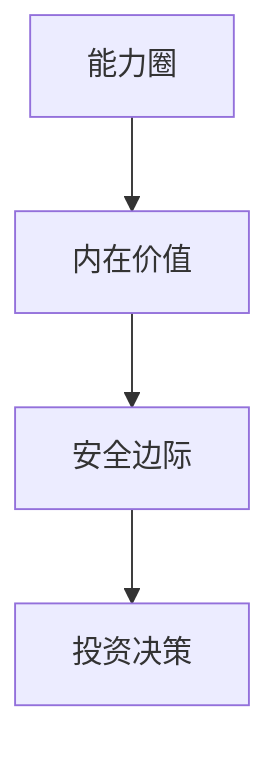

                 


# 巴菲特的圈子理论：投资你懂的行业

> **关键词**：巴菲特，圈子理论，价值投资，能力圈，投资策略，风险管理

> **摘要**：本文深入探讨了巴菲特的圈子理论，即投资自己熟悉且理解的行业。通过分析巴菲特的投资哲学、价值评估方法、经典案例以及系统性投资策略，本文旨在帮助投资者理解如何通过专注于自己的能力圈来实现长期稳定的收益。文章结合了理论分析和实际案例，提供了详细的指导和实用的建议。

---

## 第1章：引言

### 1.1 问题背景与核心概念
- **巴菲特的圈子理论**是指投资者应专注于自己熟悉且具备竞争优势的领域，避免盲目跟风或投资不熟悉的行业。这一理论强调了能力圈的重要性，即投资者应在自己理解的领域内寻找投资机会，以降低风险并提高投资成功的可能性。
- 本文将从背景介绍、核心概念、算法原理、系统架构设计、项目实战等方面全面解析巴菲特的圈子理论。

### 1.2 问题解决与边界条件
- **问题解决**：通过分析巴菲特的投资策略，帮助投资者明确自己的能力圈，从而做出更明智的投资决策。
- **边界条件**：本文聚焦于巴菲特的价值投资理念，结合实际案例分析，探讨如何将圈子理论应用于实际投资中。

### 1.3 核心要素与结构安排
- **核心要素**：能力圈的定义与扩展、价值投资的核心要素、投资决策的系统性分析。
- **结构安排**：文章分为七章，涵盖背景、核心概念、算法原理、系统设计、案例分析、项目实战和总结展望。

---

## 第2章：巴菲特的投资哲学

### 2.1 投资的本质
- **投资与投机的区别**：投资强调长期价值，而投机关注短期价格波动。
- **长期投资的价值观**：巴菲特倡导长期持有优质资产，避免频繁交易。
- **安全边际的概念**：在投资中，安全边际是资产的内在价值与其市场价格之间的差距，确保投资的安全性。

### 2.2 巴菲特的价值投资理念
- **价值投资的定义**：寻找市场定价低于其内在价值的股票进行投资。
- **核心要素对比**：通过表格对比价值投资与其他投资策略的差异。
  | **核心要素** | **价值投资** | **其他投资策略** |
  |--------------|---------------|--------------------|
  | 投资目标     | 内在价值      | 短期收益或趋势     |
  | 投资期限     | 长期          | 短期               |
  | 风险管理     | 强调安全边际  | 风险中性或高风险    |

### 2.3 能力圈理论
- **能力圈的定义**：投资者的知识和经验范围，决定了其能够有效分析和投资的领域。
- **能力圈的边界与扩展**：通过持续学习和经验积累，逐步扩大能力圈的范围。
- **能力圈与投资决策的关系**：投资者应只在其能力圈内进行投资，避免超出能力范围。

---

## 第3章：巴菲特的圈子理论核心概念

### 3.1 核心概念与原理
- **核心概念**：能力圈、内在价值、安全边际。
- **核心原理**：通过深入分析企业的财务状况、行业地位和竞争优势，找到具有持续盈利能力的公司。

### 3.2 核心概念的联系
- **实体关系图**：使用Mermaid绘制能力圈、内在价值和安全边际的关系图。



### 3.3 算法原理与数学模型
- **DCF模型**：用于评估企业的内在价值。
  - 公式：$$\text{企业价值} = \sum_{t=1}^{n} \frac{\text{现金流}}{(1+r)^t}$$
  - 示例：假设某公司未来5年的现金流分别为100、120、140、160、180，折现率r=10%。计算其现值：
    $$\text{现值} = \frac{100}{1.1} + \frac{120}{1.1^2} + \frac{140}{1.1^3} + \frac{160}{1.1^4} + \frac{180}{1.1^5}$$

---

## 第4章：巴菲特的经典投资案例

### 4.1 可口可乐的投资分析
- **背景介绍**：巴菲特在20世纪80年代投资可口可乐，基于其强大的品牌和市场地位。
- **投资决策流程**：
  ```mermaid
  graph TD
      A[开始] --> B[评估企业]
      B --> C[分析财务状况]
      C --> D[判断是否在能力圈内]
      D --> E[决定投资]
  ```

### 4.2 苹果公司的投资策略
- **长期投资视角**：巴菲特通过长期持有苹果股票，分享其创新带来的增长收益。
- **案例分析**：使用DCF模型评估苹果的内在价值。

---

## 第5章：投资决策的系统性分析

### 5.1 系统功能设计
- **领域模型**：使用Mermaid类图展示投资决策的领域模型。
  ```mermaid
  classDiagram
      class 投资者 {
          能力圈
          投资组合
          风险管理
      }
      class 投资标的 {
          内在价值
          市场价格
      }
      投资者 --> 投资标的：评估
  ```

### 5.2 系统架构设计
- **系统架构图**：展示投资决策系统的整体架构。
  ```mermaid
  graph TD
      A[投资者] --> B[能力圈评估]
      B --> C[投资标的分析]
      C --> D[投资决策]
      D --> E[风险管理]
  ```

### 5.3 系统接口与交互
- **接口设计**：投资者通过分析工具获取数据，评估投资标的的价值。
- **交互流程**：
  ```mermaid
  sequenceDiagram
      投资者 -> 分析工具：请求数据
      分析工具 -> 数据源：获取财务数据
      数据源 --> 分析工具：返回数据
      分析工具 --> 投资者：显示评估结果
  ```

---

## 第6章：项目实战

### 6.1 环境安装与工具准备
- **工具安装**：安装Excel或Python的Pandas库，用于数据处理和分析。
  ```bash
  pip install pandas
  ```

### 6.2 核心实现源代码
- **DCF模型实现**：
  ```python
  def calculate_intrinsic_value(cash_flows, discount_rate):
      return sum(flow / (1 + discount_rate) ** t for t, flow in enumerate(cash_flows))
  
  cash_flows = [100, 120, 140, 160, 180]
  discount_rate = 0.1
  iv = calculate_intrinsic_value(cash_flows, discount_rate)
  print(f"内在价值：{iv}")
  ```

### 6.3 案例分析与解读
- **案例分析**：选择一家公司，使用DCF模型计算其内在价值，并与市场价格进行比较。
- **代码解读**：解释代码的功能和实现逻辑，帮助读者理解如何应用DCF模型进行投资分析。

---

## 第7章：总结与展望

### 7.1 核心小结
- **主要结论**：巴菲特的圈子理论强调了能力圈的重要性，投资者应专注于自己熟悉且具备竞争优势的领域。
- **最佳实践**：通过持续学习和经验积累，逐步扩大能力圈，同时注重风险管理，确保投资的安全性。

### 7.2 展望未来
- **未来趋势**：随着市场环境的变化，投资者需要不断调整自己的能力圈，适应新的经济形势。
- **进一步思考**：结合人工智能和大数据技术，探索如何更高效地识别和评估投资标的的内在价值。

---

## 第8章：注意事项与拓展阅读

### 8.1 投资中的注意事项
- **避免情绪化决策**：投资决策应基于理性分析，避免受市场情绪影响。
- **分散投资风险**：通过分散投资降低非系统性风险，避免过度集中于单一行业或资产。

### 8.2 拓展阅读
- **推荐阅读书籍**：
  - 《巴菲特传：一个美国资本家的成功之路》
  - 《投资之道：彼得·林奇的投资智慧》

---

通过以上结构和内容，本文系统地介绍了巴菲特的圈子理论，结合理论分析和实际案例，为投资者提供了实用的指导和深入的见解。

