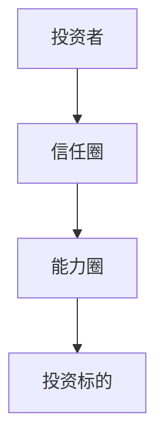
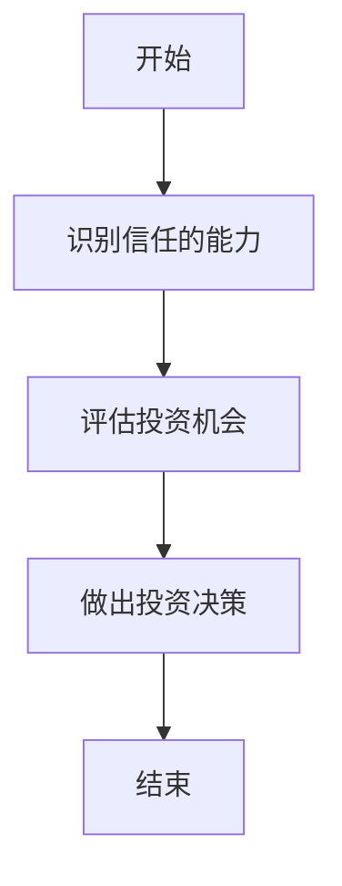
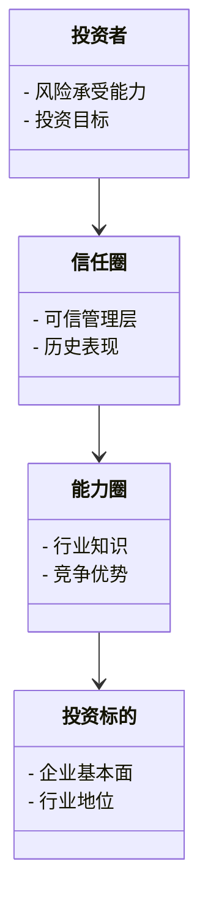

                 


# 巴菲特的圈子理论：投资你懂的领域

## 关键词：巴菲特，投资理论，价值投资，信任圈，能力圈，投资策略，数学模型

## 摘要：本文详细探讨了巴菲特的圈子理论，分析其核心概念与数学模型，并结合实际案例，展示了如何应用该理论进行投资决策。文章从信任、能力和边界三个维度，构建了完整的投资框架，并通过流程图和数学公式，直观地展示了投资策略的应用过程。最后，结合项目实战，帮助读者更好地理解和应用圈子理论。

---

# 第一部分：巴菲特的圈子理论概述

## 第1章：巴菲特的投资理念与圈子理论背景

### 1.1 巴菲特的投资哲学

#### 1.1.1 价值投资的内涵

价值投资是一种以内在价值为核心的投资策略，强调购买价格低于其实际价值的资产。巴菲特的导师本杰明·格雷厄姆曾提出，投资的本质是寻找市场先生的错误定价。巴菲特将这一理念发扬光大，认为市场先生的情绪波动为理性投资者提供了机会。

- **市场先生**：市场的波动性是投资者的朋友，而非敌人。巴菲态度保持冷静，避免被市场情绪左右。
- **安全边际**：买入价格低于内在价值，为投资决策提供缓冲区，降低风险。

#### 1.1.2 巴菲特投资理念的核心要素

- **长期投资**：巴菲特倡导长期持有优质资产，避免频繁交易。
- **企业基本面分析**：通过分析企业的财务状况、行业地位和竞争优势，寻找具有持续盈利能力的企业。
- **Margin of Safety（安全边际）**：买入价格低于估算的内在价值，以降低投资风险。

#### 1.1.3 圈子理论的定义和特点

巴菲特的圈子理论强调投资者应专注于自己熟悉的企业和行业，避免超出能力范围的决策。其特点包括：

- **信任圈**：投资者仅在信任的范围内进行投资，信任基于对管理层的信任和对企业的了解。
- **能力圈**：投资者应只投资于自己具备竞争优势的企业，避免涉足不熟悉的领域。
- **边界意识**：明确投资的边界，避免因市场波动而超出能力范围。

### 1.2 巴菲特圈子理论的核心要素

#### 1.2.1 信任与能力的双重评估

信任和能力是圈子理论的两大核心要素。投资者需要对企业的管理层和行业环境有深刻了解，才能在信任的基础上，评估企业的盈利能力。

- **信任评估**：信任管理层的诚实和能力，确保企业在长期具备竞争优势。
- **能力评估**：分析企业的财务状况、行业地位和竞争优势，评估其盈利潜力。

#### 1.2.2 圈子理论的数学模型构建

巴菲特的圈子理论可以通过数学模型进行量化分析。以下是一个简单的投资价值评估公式：

$$ \text{投资价值} = \sum_{i=1}^{n} w_i \cdot x_i $$

其中，\( w_i \) 是第 \( i \) 个因素的权重，\( x_i \) 是第 \( i \) 个因素的得分。该公式用于评估企业各方面的综合价值，帮助投资者做出决策。

#### 1.2.3 圈子理论的ER实体关系图

通过ER实体关系图，可以直观展示巴菲特圈子理论的核心要素：



该图展示了投资者通过信任圈和能力圈，评估投资标的的价值。

---

## 第2章：圈子理论的核心要素分析

### 2.1 信任与能力的双重评估

#### 2.1.1 信任的来源与评估标准

信任是圈子理论的核心，投资者需要对企业的管理层和行业环境有充分的信任。信任的来源包括：

- **管理层的诚信**：管理层是否诚实可靠，是否有良好的道德记录。
- **历史表现**：企业过去的表现是否稳健，能否在市场波动中保持增长。

#### 2.1.2 能力的界定与分析维度

能力是投资决策的另一关键要素，投资者需要评估自己的竞争优势。能力的界定包括：

- **行业知识**：是否对投资标的所在的行业有足够的了解。
- **竞争优势**：企业是否具备独特的竞争优势，如品牌、技术或成本优势。

#### 2.1.3 信任与能力的相互作用

信任和能力是相互作用的。投资者的信任建立在对管理层和企业的深入了解基础上，而能力又需要通过信任来实现。两者共同作用，帮助投资者做出明智的决策。

### 2.2 圈子理论的数学模型构建

#### 2.2.1 投资机会的评估公式

巴菲特的圈子理论可以通过数学模型进行量化分析。以下是一个简单的投资价值评估公式：

$$ \text{投资价值} = \sum_{i=1}^{n} w_i \cdot x_i $$

其中，\( w_i \) 是第 \( i \) 个因素的权重，\( x_i \) 是第 \( i \) 个因素的得分。该公式用于评估企业各方面的综合价值，帮助投资者做出决策。

#### 2.2.2 圈子理论的概率模型

以下是一个概率模型，用于评估投资机会的成功概率：

$$ P(\text{成功}) = \frac{\sum_{i=1}^{m} p_i}{m} $$

其中，\( p_i \) 是第 \( i \) 个投资机会成功的概率，\( m \) 是总机会数。该模型帮助投资者量化投资机会的风险和收益。

### 2.3 圈子理论的ER实体关系图

通过ER实体关系图，可以直观展示巴菲特圈子理论的核心要素：


该图展示了投资者通过信任圈和能力圈，评估投资标的的价值。

---

## 第3章：圈子理论的算法实现

### 3.1 圈子理论的算法流程

#### 3.1.1 投资决策的流程图

以下是一个投资决策的流程图，展示了如何通过圈子理论进行投资决策：



该流程图展示了从识别信任的能力到做出投资决策的整个过程。

### 3.2 算法实现的Python代码示例

以下是一个Python代码示例，展示了如何通过圈子理论进行投资决策：

```python
def calculate_investment_value(factors, weights):
    value = 0
    for i in range(len(factors)):
        value += weights[i] * factors[i]
    return value

factors = [0.8, 0.9, 0.7]
weights = [0.5, 0.3, 0.2]
investment_value = calculate_investment_value(factors, weights)
print("投资价值:", investment_value)
```

该代码根据各因素的得分和权重，计算出投资价值，帮助投资者做出决策。

---

## 第4章：圈子理论的系统架构设计

### 4.1 系统分析与架构设计

#### 4.1.1 系统功能设计

以下是一个系统功能设计的类图：



该类图展示了投资者如何通过信任圈和能力圈，评估投资标的的价值。

#### 4.1.2 系统架构设计

以下是一个系统架构设计的架构图：


该架构图展示了投资者通过信任圈和能力圈，评估投资标的的价值。

---

## 第5章：项目实战

### 5.1 项目实战

#### 5.1.1 环境配置

以下是一个项目实战的环境配置示例：

```bash
# 安装Python和必要的库
pip install numpy pandas matplotlib
```

#### 5.1.2 核心实现源代码

以下是一个核心实现的源代码示例：

```python
import numpy as np
import pandas as pd
import matplotlib.pyplot as plt

# 数据预处理
data = pd.read_csv('invest_data.csv')
data.head()

# 计算投资价值
def calculate_investment_value(factors, weights):
    return np.dot(factors, weights)

factors = data[['factor1', 'factor2', 'factor3']].values
weights = np.array([0.5, 0.3, 0.2])
investment_values = calculate_investment_value(factors, weights)

# 可视化结果
plt.scatter(factors[:, 0], investment_values)
plt.xlabel('Factor1')
plt.ylabel('Investment Value')
plt.show()
```

#### 5.1.3 结果解读

通过上述代码，投资者可以根据各因素的得分和权重，计算出投资价值，并通过可视化结果，直观地了解投资标的的价值。

---

## 第6章：总结与展望

### 6.1 总结

巴菲特的圈子理论是一种以信任和能力为核心的投资策略，强调投资者应专注于自己熟悉的企业和行业。通过数学模型和流程图的分析，可以帮助投资者更好地理解和应用该理论。

### 6.2 未来展望

未来，随着人工智能和大数据技术的发展，圈子理论可以在更广泛的领域中应用，帮助投资者更精准地评估投资标的的价值。同时，投资者也需要不断学习和提升自己的能力，以应对市场的变化。

---

通过以上思考过程，我们可以看到，巴菲特的圈子理论是一个复杂但有效的投资策略。通过信任、能力和边界的分析，投资者可以在不确定的市场中做出明智的决策。

