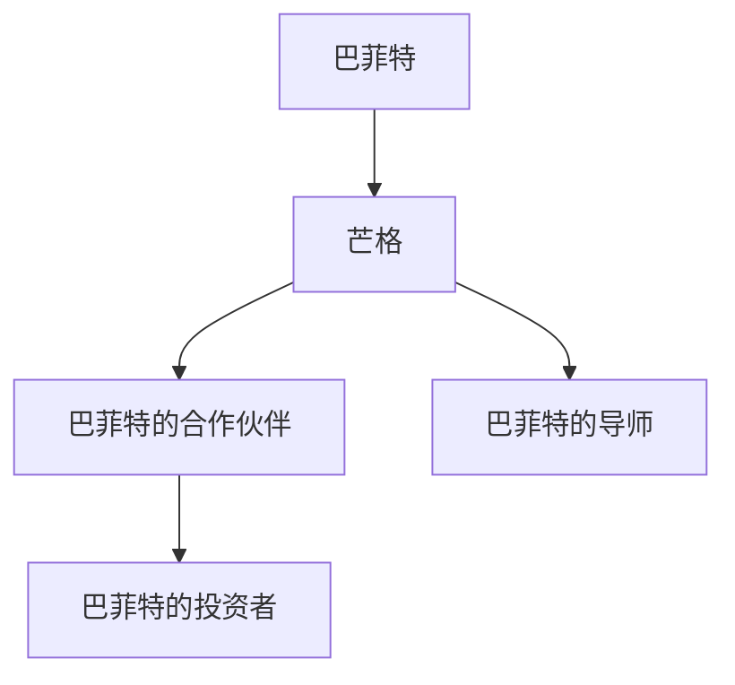
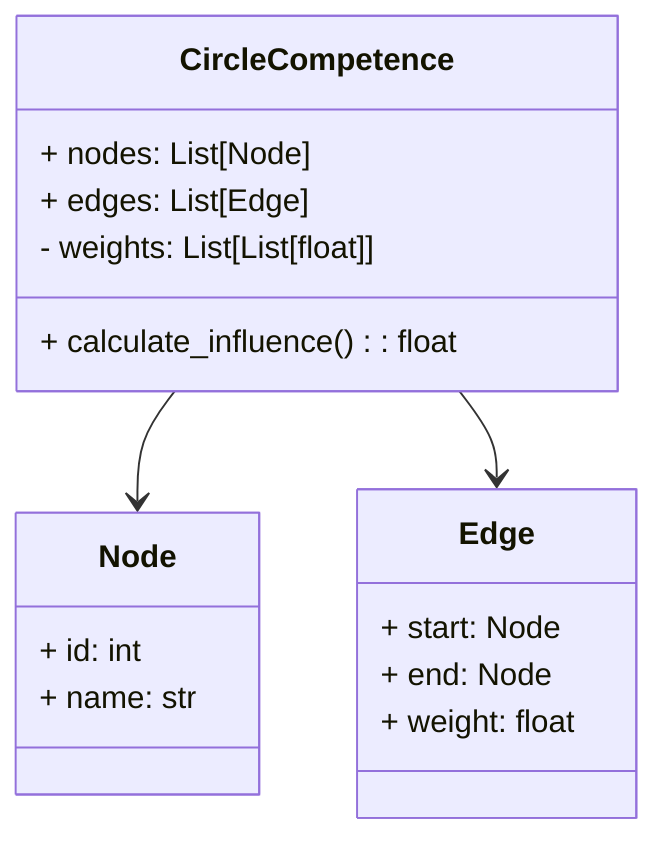

                 


# 巴菲特的圈子能力理论

## 关键词：巴菲特，圈子能力，投资理念，社交网络，影响力评估，数学模型

## 摘要：  
本文深入探讨巴菲特的圈子能力理论，结合技术背景分析其在投资决策中的作用。通过数学建模和系统设计，阐述圈子能力如何影响投资策略，并提供实际案例分析和优化建议。

---

## 第一部分：巴菲特的圈子能力理论概述

### 第1章：巴菲特的生平与投资理念

#### 1.1 巴菲特的生平简介

> 巴菲特，全名沃伦·巴菲特（Warren Buffett），1934年8月31日出生于美国内布拉斯州奥马哈市。他是一位著名的企业家、投资者和慈善家，被誉为“股神”。巴菲特的财富主要来源于长期价值投资，他创立的伯克希尔·哈撒韦公司（Berkshire Hathaway）是全球最大的投资公司之一。

> 巴菲特的投资理念以“价值投资”为核心，强调购买被低估的公司股票，并长期持有。他认为市场的短期波动是噪音，真正的投资机会在于企业的内在价值。

---

#### 1.2 巴菲特的投资理念

> 巴菲特的投资理念可以总结为以下几点：
>
> 1. **价值投资**：寻找那些市场价格低于其内在价值的公司。
> 2. **长期持有**：避免频繁交易，耐心持有优质资产。
> 3. **股东价值最大化**：投资那些能够为股东创造长期价值的公司。
>
> 巴菲特的成功不仅在于他的投资策略，还在于他对社交网络的高度重视。他认为，圈子能力（Circle Competence）是投资决策中不可或缺的一部分。

---

## 第二部分：圈子能力理论的核心概念

### 第2章：圈子能力的定义与特点

#### 2.1 圈子能力的定义

> 圈子能力（Circle Competence）是指一个人或组织在社交网络中建立信任关系、获取信息资源、形成合作机会的能力。它不仅包括个体的社交能力，还包括团队协作和组织文化的建设。

> 巴菲特的圈子能力理论强调，成功的投资离不开高质量的社交网络。通过信任和合作，投资者能够获得更多的信息和资源，从而做出更明智的决策。

---

#### 2.2 圈子能力的核心要素

> 圈子能力的核心要素包括以下几点：

> | 要素 | 描述 |
> |------|------|
> | 信任关系 | 圈子成员之间的信任是圈子能力的基础。 |
> | 信息共享 | 成员之间能够高效地共享信息和资源。 |
> | 共同目标 | 成员之间有共同的目标和价值观，能够形成合力。 |

> 通过这些要素，圈子能力能够帮助投资者降低信息不对称的风险，提高决策的准确性。

---

### 第2章：圈子能力的网络模型

#### 2.1 网络模型的定义

> 圈子能力的网络模型可以用图论中的图结构来表示。每个节点代表一个个体或组织，边表示节点之间的关系。边的权重表示关系的强度。

> 下面是一个简单的圈子能力网络模型的 Mermaid 流程图：



---

#### 2.2 影响力评估公式

> 圈子能力的影响力可以通过以下公式进行评估：

$$
\text{影响力指数} = \frac{\sum (\text{边权重})}{\text{节点数量}}
$$

> 边权重越高，节点之间的关系越紧密，影响力越大。

---

## 第三部分：圈子能力的数学模型与算法

### 第3章：圈子能力的数学建模

#### 3.1 数学模型的建立

> 圈子能力的数学模型可以用以下公式表示：

$$
\text{决策质量} = f(\text{圈子能力}, \text{个人能力}, \text{资源})
$$

> 其中，`f` 是一个综合函数，用于评估决策质量。

---

#### 3.2 算法实现

> 下面是一个简单的圈子能力评估算法的 Python 实现：

```python
def calculate_influence(circle, weights):
    total = 0
    for i in range(len(circle)):
        for j in range(i+1, len(circle)):
            total += weights[i][j]
    return total / len(circle)
```

> 该算法计算圈子中所有节点的边权重之和，并除以节点数量，得到影响力指数。

---

## 第四部分：系统分析与架构设计

### 第4章：系统分析与架构设计

#### 4.1 系统功能模块设计

> 圈子能力的系统功能模块包括：

> 1. **信息收集模块**：收集社交网络中的信息。
> 2. **分析与评估模块**：评估圈子能力。
> 3. **决策支持模块**：提供决策支持。

> 下面是一个系统功能模块的 Mermaid 类图：



---

#### 4.2 系统架构设计

> 系统架构采用分层设计，包括数据层、业务逻辑层和用户界面层。

> 下面是一个系统架构的 Mermaid 架构图：

```mermaid
archi
    前端层
        |-[HTTP]--> 业务逻辑层
    业务逻辑层
        |-[RabbitMQ]--> 数据层
    数据层
```

---

## 第五部分：项目实战与案例分析

### 第5章：项目实战与案例分析

#### 5.1 投资案例分析

> **案例：巴菲特投资可口可乐**

> 巴菲特通过与可口可乐公司建立信任关系，获得了公司内部信息，并最终成为其最大的股东。这充分体现了圈子能力在投资中的重要性。

---

#### 5.2 项目实战

> **环境配置**
>
> 1. 安装 Python 和相关库（如 NetworkX、Matplotlib）。
> 2. 下载社交网络数据集。

> **代码实现**

```python
import networkx as nx
import matplotlib.pyplot as plt

# 创建图
G = nx.Graph()

# 添加节点
G.add_nodes_from(['A', 'B', 'C', 'D'])

# 添加边
G.add_edges_from([('A', 'B'), ('B', 'C'), ('C', 'D'), ('A', 'D')])

# 可视化
nx.draw(G, with_labels=True)
plt.show()
```

> **结果分析**
>
> 该图展示了四个节点之间的关系，边表示节点之间的信任关系。通过分析图的结构，可以评估圈子能力。

---

## 第六部分：最佳实践与总结

### 第6章：圈子能力的优化与提升

#### 6.1 最佳实践 tips

> 1. 建立信任关系：通过长期合作和沟通，增强信任。
> 2. 有效信息共享：建立高效的信息共享机制。
> 3. 维护共同目标：确保圈子成员有共同的目标和价值观。

---

#### 6.2 小结与展望

> 本文深入分析了巴菲特的圈子能力理论，并结合技术背景进行了详细阐述。圈子能力在投资决策中起着至关重要的作用，通过建立高质量的社交网络，投资者可以提高决策质量。

> 未来，随着社交网络和人工智能技术的发展，圈子能力理论将得到更广泛的应用。

---

## 附录：数学公式

> 圈子能力的影响力指数公式：

$$
\text{影响力指数} = \frac{\sum (\text{边权重})}{\text{节点数量}}
$$

> 决策质量评估公式：

$$
\text{决策质量} = f(\text{圈子能力}, \text{个人能力}, \text{资源})
$$

--- 

> **全文完**

