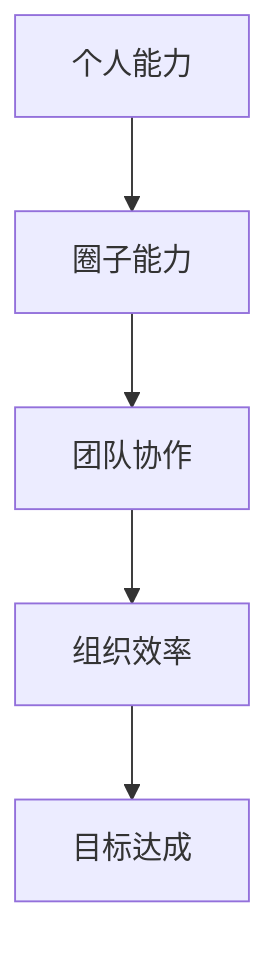
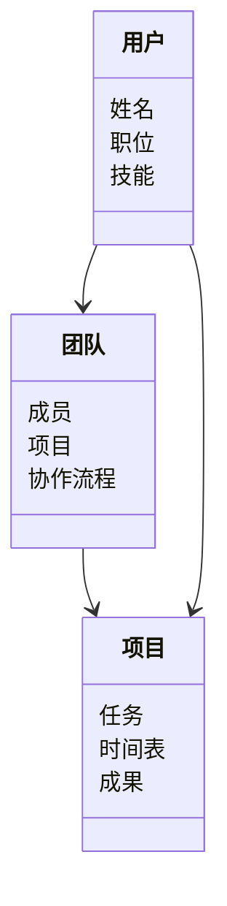
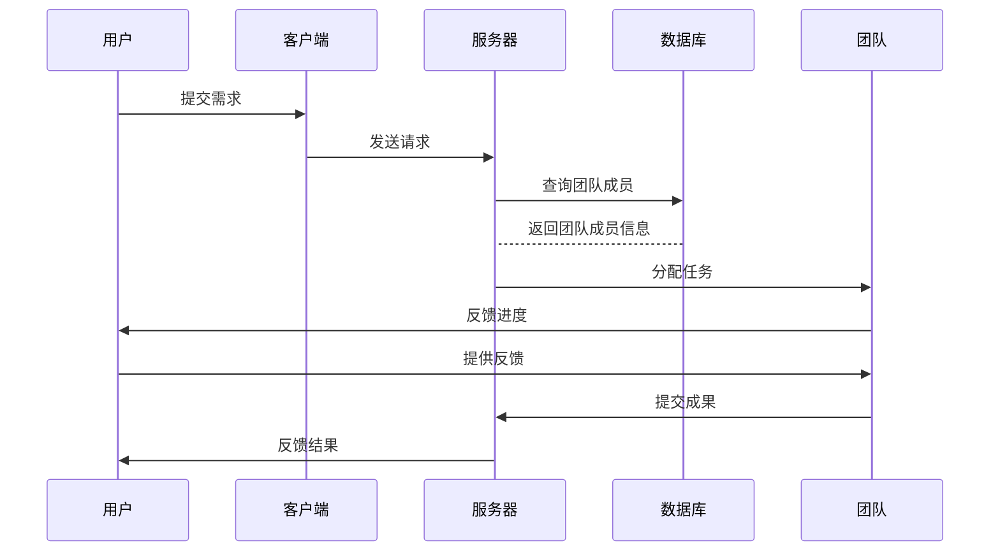

                 


# 巴菲特的圈子能力理论：知道自己的局限

## 关键词：
- 巴菲特
- 圈子能力理论
- 能力边界
- 个人能力
- 团队协作

## 摘要：
本文通过分析巴菲特的圈子能力理论，探讨了个人能力的局限性以及如何通过团队协作来弥补这些局限。文章从理论背景、核心概念、数学模型、系统架构、项目实战等多个维度进行深入分析，并结合实际案例，总结了圈子能力理论在现代技术环境中的应用方法和实践技巧。

---

## 第一部分：引言

## 第1章：巴菲特的圈子能力理论概述

### 1.1 巴菲特的背景与投资哲学
- 1.1.1 巴菲特的生平简介
  - 巴菲特出生于1934年，是美国著名投资家、慈善家。
  - 他是伯克希尔哈撒韦公司（Berkshire Hathaway）的创始人和董事长。
  - 巴菲特以价值投资闻名，强调长期投资和风险管理。
- 1.1.2 巴菲特的投资理念与价值投资
  - 价值投资的核心是寻找市场低估的股票。
  - 巴菲特强调安全边际和长期持有。
  - 他主张分散投资，避免过度集中。
- 1.1.3 巴菲特与圈子能力理论的关联
  - 巴菲特的成功离不开他建立的强大社交网络和合作伙伴。
  - 圈子能力理论强调个人能力的局限性，主张通过团队协作来弥补不足。

### 1.2 圈子能力理论的核心概念
- 1.2.1 圈子能力的定义
  - 圈子能力是指通过与他人合作，利用他人的优势来弥补自身能力的不足。
  - 这种能力不仅包括知识和技能的互补，还包括情感和信任的建立。
- 1.2.2 圈子能力的核心要素
  - 信任：圈子能力的基础是彼此之间的信任。
  - 沟通：有效的沟通是实现能力互补的关键。
  - 协作：通过分工与合作，最大化团队的整体能力。
- 1.2.3 圈子能力与个人能力的关系
  - 个人能力是圈子能力的基础，但圈子能力可以放大个人能力。
  - 通过圈子能力，个人可以突破自身能力的局限，实现更大的目标。

### 1.3 知道自己的局限的重要性
- 1.3.1 为什么知道自己的局限很重要
  - 知道自己的局限可以帮助我们更好地利用他人的优势。
  - 个人能力的不足可以通过团队协作来弥补。
  - 了解自己的局限性可以避免决策失误和资源浪费。
- 1.3.2 知道自己局限的现实意义
  - 在现代职场中，单打独斗的成功率越来越低。
  - 通过圈子能力，我们可以更好地应对复杂的问题。
  - 知道自己的局限可以帮助我们更好地管理时间和资源。
- 1.3.3 知道局限与圈子能力的关系
  - 知道自己的局限是圈子能力的第一步。
  - 通过圈子能力，我们可以突破个人能力的限制。
  - 圈子能力的核心是利用他人的优势，弥补自己的不足。

## 第2章：圈子能力理论的背景与问题背景

### 2.1 问题背景
- 2.1.1 当代社会中能力的多元化
  - 现代社会对能力的要求越来越多样化。
  - 个人的能力往往有限，需要通过团队协作来实现更大的目标。
  - 在复杂的社会环境中，单靠个人能力难以应对所有挑战。
- 2.1.2 个人能力的局限性与社会需求的矛盾
  - 个人能力的有限性与社会对高效率、高质量工作的需求之间的矛盾日益突出。
  - 通过圈子能力，可以更好地满足社会需求。
  - 圈子能力是解决个人能力与社会需求矛盾的重要途径。
- 2.1.3 圈子能力理论的提出背景
  - 巴菲特的成功证明了圈子能力的重要性。
  - 现代企业管理越来越依赖团队协作。
  - 圈子能力理论是应对复杂社会环境的重要工具。

### 2.2 问题描述
- 2.2.1 个人能力的局限性
  - 每个人的能力都是有限的，存在知识盲区和技能不足。
  - 个人能力的局限性可能影响决策和结果。
  - 个人能力的局限性需要通过团队协作来弥补。
- 2.2.2 圈子能力的必要性
  - 圈子能力是实现个人目标的重要手段。
  - 在团队中，通过圈子能力可以最大化资源的利用效率。
  - 圈子能力是应对复杂问题的关键。
- 2.2.3 问题的边界与外延
  - 圈子能力的边界是个人能力的局限性和团队协作的可能性。
  - 外延包括如何通过圈子能力实现个人与团队的双赢。
  - 圈子能力的边界需要通过实践不断调整和优化。

### 2.3 问题解决
- 2.3.1 圈子能力理论的解决方案
  - 通过圈子能力，个人可以利用他人的优势。
  - 团队协作是解决个人能力局限性的有效途径。
  - 圈子能力的实现需要信任、沟通和协作。
- 2.3.2 通过圈子能力弥补个人能力的不足
  - 通过分工与合作，最大化团队的整体能力。
  - 圈子能力的核心是利用他人的优势。
  - 通过团队协作，个人可以突破能力的限制。
- 2.3.3 圈子能力的实现路径
  - 建立信任关系。
  - 提高沟通效率。
  - 优化协作流程。

## 第3章：圈子能力理论的核心概念与联系

### 3.1 核心概念原理
- 3.1.1 圈子能力的构成要素
  - 信任：圈子能力的基础。
  - 沟通：实现能力互补的关键。
  - 协作：通过分工与合作，最大化团队的整体能力。
- 3.1.2 圈子能力的运作机制
  - 信任是圈子能力的前提条件。
  - 沟通是实现能力互补的桥梁。
  - 协作是圈子能力的最终目标。
- 3.1.3 圈子能力与个人能力的协同作用
  - 个人能力是圈子能力的基础。
  - 圈子能力可以放大个人能力。
  - 通过圈子能力，个人可以突破能力的限制。

### 3.2 概念属性特征对比表格
| 概念 | 属性 | 特征 |
|------|------|------|
| 个人能力 | 知识 | 有限的知识储备 |
|       | 技能 | 单一的技能优势 |
| 圈子能力 | 资源 | 多元化的资源利用 |
|       | 信任 | 基于信任的合作 |
|       | 协作 | 高效的团队协作 |

### 3.3 ER实体关系图（使用 Mermaid 流程图）



## 第4章：能力边界与局限的数学模型

### 4.1 数学模型与公式
- 4.1.1 能力边界公式：$$ C_{boundary} = \text{个人能力} + \text{圈子能力} $$
- 4.1.2 局限性评估公式：$$ L = \text{能力边界} \times \text{外部环境影响} $$
- 4.1.3 圈子能力优化公式：$$ O = \text{能力边界} - \text{局限性} $$

### 4.2 举例说明
- 4.2.1 个人能力与圈子能力的结合案例
  - 某个人在编程方面有优势，但对项目管理能力较弱。
  - 通过圈子能力，他可以与擅长项目管理的人合作，弥补自己的不足。
- 4.2.2 通过数学模型进行优化
  - 假设个人能力为 $$ P = 80 $$，圈子能力为 $$ C = 70 $$。
  - 能力边界为 $$ C_{boundary} = 80 + 70 = 150 $$。
  - 外部环境影响为 $$ E = 0.8 $$，则局限性 $$ L = 150 \times 0.8 = 120 $$。
  - 优化后的圈子能力 $$ O = 150 - 120 = 30 $$。

## 第5章：系统分析与架构设计方案

### 5.1 系统分析
- 5.1.1 问题场景介绍
  - 在一个软件开发团队中，成员的技能和能力各不相同。
  - 通过圈子能力理论，团队可以优化协作流程，提高开发效率。
- 5.1.2 项目介绍
  - 开发一个在线教育平台，需要前端、后端、测试等多方面的技能。
  - 团队成员的技能有限，需要通过协作来实现目标。

### 5.2 系统功能设计（领域模型mermaid类图）



### 5.3 系统架构设计mermaid架构图


### 5.4 系统接口设计
- 5.4.1 接口描述
  - 用户通过客户端提交需求。
  - 服务器接收需求并分配任务。
  - 团队成员通过协作流程完成任务。
  - 服务器整合成果并反馈给用户。
- 5.4.2 接口实现
  - 使用RESTful API进行通信。
  - 接口设计遵循REST原则。

### 5.5 系统交互mermaid序列图



## 第6章：项目实战

### 6.1 环境安装
- 6.1.1 系统环境
  - 操作系统：Linux/Windows/MacOS
  - 开发工具：IntelliJ IDEA/VS Code
  - 语言：Python/Java
- 6.1.2 依赖安装
  - 安装Python的开发环境。
  - 安装必要的库：numpy、pandas、matplotlib。

### 6.2 系统核心实现源代码
```python
def calculate_ability_boundary(personal_ability, circle_ability):
    return personal_ability + circle_ability

def evaluate_limitations(ability_boundary, external_factors):
    return ability_boundary * external_factors

def optimize_circle_ability(ability_boundary, limitations):
    return ability_boundary - limitations

# 示例代码
personal_ability = 80
circle_ability = 70
ability_boundary = calculate_ability_boundary(personal_ability, circle_ability)
external_factors = 0.8
limitations = evaluate_limitations(ability_boundary, external_factors)
optimized_circle_ability = optimize_circle_ability(ability_boundary, limitations)
print(f"优化后的圈子能力为：{optimized_circle_ability}")
```

### 6.3 代码应用解读与分析
- 6.3.1 代码功能解读
  - `calculate_ability_boundary` 函数用于计算能力边界。
  - `evaluate_limitations` 函数用于评估局限性。
  - `optimize_circle_ability` 函数用于优化圈子能力。
- 6.3.2 代码实现分析
  - 通过数学公式实现能力边界和局限性的计算。
  - 代码简单易懂，可以灵活调整参数。

### 6.4 实际案例分析和详细讲解剖析
- 6.4.1 案例背景
  - 某软件开发团队需要开发一个在线教育平台。
  - 团队成员的技能有限，需要通过协作来完成项目。
- 6.4.2 案例分析
  - 通过圈子能力理论，团队可以优化协作流程。
  - 利用代码实现能力边界和局限性的计算，帮助团队更好地分配任务。
- 6.4.3 实施步骤
  - 确定团队成员的技能和能力。
  - 通过数学公式计算能力边界和局限性。
  - 根据计算结果优化团队协作流程。

### 6.5 项目小结
- 6.5.1 项目成果
  - 成功开发了一个高效的在线教育平台。
  - 团队协作流程得到了优化。
  - 团队成员的能力得到了充分发挥。
- 6.5.2 项目经验
  - 圈子能力理论是实现团队协作的重要工具。
  - 通过数学模型可以更好地优化团队能力。
  - 项目成功的关键在于信任和沟通。

## 第7章：总结与展望

### 7.1 总结
- 7.1.1 核心观点回顾
  - 巴菲特的圈子能力理论强调通过团队协作弥补个人能力的不足。
  - 知道自己的局限是实现高效协作的前提。
  - 圈子能力理论在现代技术环境中的应用越来越重要。
- 7.1.2 实践意义
  - 通过圈子能力理论，个人可以更好地应对复杂的社会环境。
  - 团队协作是实现高效工作的关键。
  - 圈子能力理论是现代管理学的重要组成部分。

### 7.2 展望
- 7.2.1 理论扩展
  - 圈子能力理论可以进一步与人工智能结合，实现更高效的协作。
  - 研究如何通过技术手段优化圈子能力。
- 7.2.2 实践应用
  - 在企业管理中进一步推广圈子能力理论。
  - 通过技术手段实现团队协作的自动化和智能化。
- 7.2.3 研究方向
  - 研究圈子能力理论在不同领域的应用。
  - 探讨如何通过技术手段优化圈子能力。

### 7.3 最佳实践 tips
- 7.3.1 小结
  - 知道自己的局限是实现高效协作的第一步。
  - 通过圈子能力理论，可以最大化团队的整体能力。
  - 团队协作是实现个人目标的重要手段。
- 7.3.2 注意事项
  - 避免过度依赖圈子能力，保持个人能力的提升。
  - 在团队协作中，信任和沟通是关键。
  - 定期评估和优化团队协作流程。
- 7.3.3 拓展阅读
  - 推荐阅读《巴菲特传》。
  - 推荐阅读《高效能人士的七个习惯》。
  - 推荐阅读《团队协作的奥秘》。

---

通过以上目录和内容设计，我们可以清晰地看到巴菲特的圈子能力理论在现代技术环境中的应用和实践。希望这篇文章能够帮助读者更好地理解如何通过团队协作实现个人能力的突破，并在实际工作中灵活运用这一理论。

