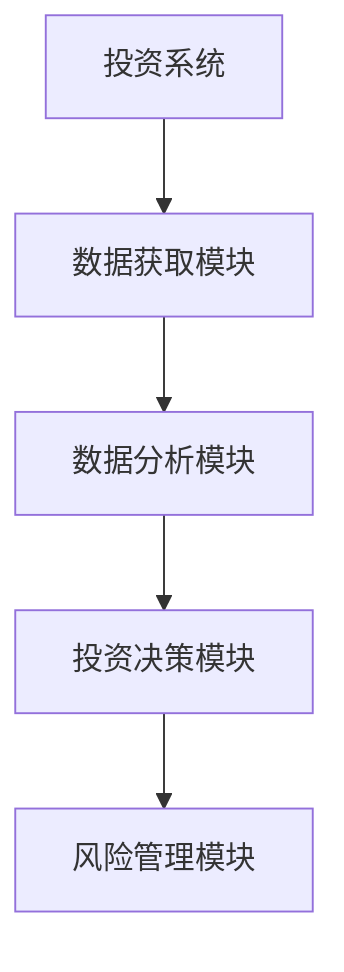

                 


# 巴菲特的复利效应投资观

> 关键词：复利效应、巴菲特、价值投资、投资策略、Python代码、系统架构、风险管理

> 摘要：本文深入探讨了巴菲特的复利效应投资观，从复利效应的基本概念到其在投资中的应用，结合数学模型、系统架构和实战案例，分析了巴菲特的投资理念、策略和方法，帮助读者理解如何通过复利效应实现长期稳健的投资回报。

---

## 第1章: 复利效应的背景与概念

### 1.1 复利效应的定义与特点

#### 1.1.1 复利效应的定义
复利效应是指在投资中，本金和产生的收益会不断再投资，随着时间的推移，收益呈指数级增长的现象。与单利不同，复利能够将收益滚存，形成更大的收益。

#### 1.1.2 复利效应的核心特点
- **指数增长**：复利效应使投资回报随时间呈指数增长，而非线性增长。
- **时间的魔力**：复利效应的时间越长，效果越显著。
- **滚雪球效应**：通过不断再投资，收益逐渐累积，形成更大的财富。

#### 1.1.3 复利效应与传统投资的区别
| 方面       | 单利                  | 复利                  |
|------------|-----------------------|-----------------------|
| 计算方式   | 仅计算本金产生的利息  | 利息也产生利息       |
| 增长速度   | 线性增长              | 指数增长              |
| 长期效果   | 增长缓慢              | 增长迅速              |

### 1.2 巴菲特投资观的背景介绍

#### 1.2.1 巴菲特的投资理念
巴菲特是一位价值投资者，主张以低于内在价值的价格买入优质股票，并长期持有，让复利效应发挥作用。

#### 1.2.2 巴菲特投资观的核心要素
- **价值投资**：寻找具有持续竞争优势和良好管理的公司。
- **安全边际**：以低于内在价值的价格买入，以避免市场波动带来的风险。
- **长期投资**：通过长期持有，让复利效应最大化。

#### 1.2.3 巴菲特投资观的演变与影响
巴菲特的投资理念起源于格雷厄姆的价值投资理论，经过长期实践和优化，形成了独特的投资体系，影响了全球投资者。

### 1.3 复利效应与巴菲特投资观的联系

#### 1.3.1 复利效应在投资中的作用
复利效应是巴菲特投资成功的关键因素之一，通过长期持有优质股票，投资者可以最大化复利效应带来的收益。

#### 1.3.2 巴菲特如何运用复利效应
巴菲特通过选择优质股票，长期持有，不断复利，实现财富的快速增长。

#### 1.3.3 复利效应与长期投资的关系
长期投资是复利效应发挥作用的基础，复利效应又反过来促进长期投资的成功。

---

## 第2章: 复利效应的数学模型与算法原理

### 2.1 复利计算的基本公式

#### 2.1.1 单利与复利的对比
- 单利公式：$$ I = P \times r \times t $$
- 复利公式：$$ A = P \times (1 + r)^t $$

#### 2.1.2 复利计算的数学公式
$$ A = P \times (1 + r)^t $$
其中：
- \( A \)：最终金额
- \( P \)：本金
- \( r \)：年利率
- \( t \)：时间（年）

#### 2.1.3 复利计算的实例分析
假设本金为10000元，年利率为10%，投资10年，复利计算结果为：
$$ A = 10000 \times (1 + 0.1)^{10} = 25937.42元 $$

### 2.2 巴菲特投资观中的复利模型

#### 2.2.1 投资回报的复利公式
$$ A = P \times (1 + r)^t $$
其中，\( r \) 是投资回报率，\( t \) 是投资时间。

#### 2.2.2 投资组合的复利模型
$$ A = \sum_{i=1}^{n} P_i \times (1 + r_i)^t $$
其中，\( P_i \) 是投资组合中的第i个资产的本金，\( r_i \) 是第i个资产的年回报率，\( t \) 是时间。

#### 2.2.3 复利模型的优化与调整
通过分散投资和选择优质资产，优化投资组合的回报率，降低风险。

### 2.3 复利效应的算法实现

#### 2.3.1 复利计算的Python代码实现

```python
def compound_interest(principal, rate, time):
    return principal * (1 + rate) ** time

# 示例计算
principal = 10000
rate = 0.1
time = 10
print(compound_interest(principal, rate, time))  # 输出25937.42
```

#### 2.3.2 投资回报的复利算法
通过计算每个投资的时间和回报率，利用复利公式计算最终收益。

#### 2.3.3 复利模型的可视化展示
使用Matplotlib绘制复利增长曲线。

```python
import matplotlib.pyplot as plt

principal = 10000
rate = 0.1
time = 10

years = range(0, time + 1)
amounts = [principal * (1 + rate)**year for year in years]

plt.plot(years, amounts)
plt.xlabel('Years')
plt.ylabel('Amount')
plt.title('Compound Interest Growth')
plt.show()
```

---

## 第3章: 巴菲特投资观的核心理念

### 3.1 价值投资的基本原则

#### 3.1.1 价值投资的定义
价值投资是寻找市场价格低于内在价值的股票进行投资。

#### 3.1.2 价值投资的核心要素
- 内在价值：公司未来现金流的现值。
- 市场价格：低于内在价值时买入。

#### 3.1.3 价值投资与复利效应的结合
通过长期持有优质股票，复利效应得以最大化。

### 3.2 安全边际的概念与应用

#### 3.2.1 安全边际的定义
安全边际是指市场价格与内在价值之间的差额，用于降低投资风险。

#### 3.2.2 安全边际的计算方法
$$ \text{安全边际} = \text{内在价值} - \text{市场价格} $$

#### 3.2.3 安全边际在投资中的作用
降低投资风险，确保在市场波动中仍能获得收益。

### 3.3 长期投资与复利效应的关系

#### 3.3.1 长期投资的优势
复利效应随着时间的推移而增强，长期投资能够最大化复利效应。

#### 3.3.2 长期投资与复利效应的结合
通过长期持有优质股票，复利效应得以充分发挥。

#### 3.3.3 长期投资的风险管理
分散投资、定期调整投资组合，以应对市场变化。

---

## 第4章: 复利效应的系统架构与投资策略

### 4.1 投资系统的整体架构

#### 4.1.1 投资系统的组成
- 数据获取模块：收集市场数据。
- 数据分析模块：评估股票价值。
- 投资决策模块：制定投资策略。
- 风险管理模块：监控投资风险。

#### 4.1.2 投资系统的功能模块
- 数据源：市场数据、财务报表。
- 分析工具：财务指标分析、估值模型。
- 决策支持：投资建议、风险评估。
- 监控系统：实时监控、调整策略。

#### 4.1.3 投资系统的架构图


### 4.2 复利效应的投资策略

#### 4.2.1 投资组合的构建
选择具有竞争优势和良好管理的公司，构建多元化的投资组合。

#### 4.2.2 投资组合的优化
定期评估投资组合，调整权重，以最大化复利效应。

#### 4.2.3 投资组合的风险管理
分散投资、设置止损点、定期再平衡。

### 4.3 系统接口与交互设计

#### 4.3.1 投资系统的接口设计
- 数据接口：获取市场数据。
- 分析接口：评估股票价值。
- 决策接口：制定投资策略。
- 监控接口：实时监控投资组合。

#### 4.3.2 投资系统的交互流程
1. 获取市场数据。
2. 分析股票价值。
3. 制定投资策略。
4. 实时监控投资组合。

#### 4.3.3 投资系统的用户界面设计
简洁直观的界面，提供数据可视化、投资建议和风险评估。

---

## 第5章: 巴菲特投资观的实战应用

### 5.1 实战环境的安装与配置

#### 5.1.1 投资分析工具的安装
安装Python、Pandas、NumPy、Matplotlib等工具。

#### 5.1.2 数据源的获取与处理
使用Yahoo Finance API获取股票数据，处理数据并进行分析。

#### 5.1.3 投资分析系统的配置
配置环境变量、安装依赖库，确保系统正常运行。

### 5.2 投资组合的核心实现

#### 5.2.1 投资组合的构建方法
选择具有竞争优势的公司，构建多元化的投资组合。

#### 5.2.2 投资组合的优化算法
使用均值-方差优化模型，调整投资组合的权重。

#### 5.2.3 投资组合的风险管理策略
分散投资、设置止损点、定期再平衡。

### 5.3 实战案例分析与解读

#### 5.3.1 巴菲特经典投资案例分析
分析巴菲特投资可口可乐的案例，说明复利效应的应用。

#### 5.3.2 实战案例的代码实现
使用Python代码分析可口可乐的财务数据，评估其投资价值。

#### 5.3.3 实战案例的总结与反思
总结投资经验，反思投资策略的优缺点。

---

## 第6章: 复利效应的最佳实践与注意事项

### 6.1 投资心态的管理

#### 6.1.1 投资心态的重要性
保持冷静，避免情绪化决策。

#### 6.1.2 投资心态的管理方法
制定投资计划，严格执行纪律。

#### 6.1.3 投资心态与复利效应的关系
良好的心态是复利效应发挥作用的前提。

### 6.2 投资策略的优化与调整

#### 6.2.1 定期评估投资组合
根据市场变化，调整投资策略。

#### 6.2.2 优化投资组合
选择优质资产，分散投资风险。

#### 6.2.3 应对市场波动
在市场下跌时，保持信心，坚持长期投资。

### 6.3 最佳实践 tips

- 长期投资是复利效应的关键。
- 分散投资降低风险。
- 选择优质资产，避免短期波动。
- 定期评估和调整投资组合。

### 6.4 总结

巴菲特的复利效应投资观是一种长期、稳健的投资方法，通过选择优质资产，长期持有，实现财富的快速增长。投资者应结合自身的风险承受能力和投资目标，制定合适的投资策略。

### 6.5 注意事项

- 避免短期投机，坚持长期投资。
- 选择优质资产，避免盲目跟风。
- 定期评估投资组合，及时调整。

### 6.6 拓展阅读

- 巴菲特的《投资哲学》
- 《证券分析》（本杰明·格雷厄姆）

---

通过本文的分析，读者可以深入了解巴菲特的复利效应投资观，并将其应用到实际投资中，实现长期稳健的投资回报。

