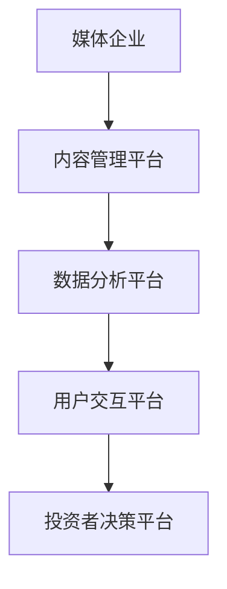
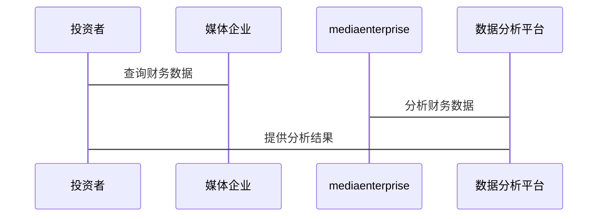

                 


# 巴菲特的媒体投资策略：数字化转型时代的调整

## 关键词：
- 巴菲特
- 媒体投资
- 数字化转型
- 投资策略
- 媒体行业
- 技术驱动

## 摘要：
本文深入分析了巴菲特的媒体投资策略在数字化转型时代的调整。从巴菲特的投资理念出发，探讨了媒体行业的数字化转型对投资策略的影响，结合数学模型和实际案例，详细讲解了如何在技术驱动的环境下优化投资决策。文章内容涵盖背景介绍、核心概念、数学模型、系统设计、项目实战等部分，为读者提供了全面的视角和深入的分析。

---

## 第1章: 巴菲特的媒体投资策略概述

### 1.1 巴菲特投资策略的核心理念

#### 1.1.1 巴菲特投资理念的形成与发展
巴菲特的投资理念起源于价值投资，他强调长期持有优质资产，注重企业的内在价值。他的投资策略不仅关注企业的财务表现，还关注企业的竞争优势和管理团队。这种理念在媒体行业中尤为重要，因为媒体行业的核心竞争力在于内容和品牌。

#### 1.1.2 巴菲特媒体投资的核心原则
巴菲特的媒体投资策略强调以下几点：
1. **内容为王**：投资于拥有优质内容资源的企业，如《华盛顿邮报》。
2. **长期价值**：关注企业的长期盈利能力，而非短期市场波动。
3. **竞争优势**：投资于具有护城河的企业，确保其在行业中的领先地位。

#### 1.1.3 媒体行业在巴菲特投资组合中的地位
媒体行业在巴菲特的投资组合中占据重要地位。他认为，媒体行业具有强大的网络效应和品牌价值，能够在数字化转型中保持竞争优势。例如，他投资的《华盛顿邮报》在数字化转型中依然保持了其影响力。

---

### 1.2 媒体行业的数字化转型背景

#### 1.2.1 数字化转型的定义与特征
数字化转型是指将传统媒体的采编、分发、互动等环节通过数字技术进行重构和优化。其特征包括数据驱动、技术融合和用户互动。

#### 1.2.2 媒体行业数字化转型的驱动因素
- **技术驱动**：互联网、人工智能、大数据等技术的发展推动了媒体行业的变革。
- **用户需求变化**：用户逐渐从传统媒体转向数字化媒体，要求更高的互动性和个性化体验。
- **商业模式转变**：传统广告模式向精准营销转变，内容付费模式逐渐兴起。

#### 1.2.3 数字化转型对媒体投资策略的影响
数字化转型使得媒体行业的竞争更加激烈，投资策略需要更加灵活。投资者需要关注企业的技术投入、数字化转型的能力以及用户粘性。

---

## 第2章: 巴菲特媒体投资策略的核心概念

### 2.1 巴菲特投资策略的核心要素

#### 2.1.1 投资标的的选择标准
巴菲特选择媒体投资标的时，注重以下几点：
1. **内容质量**：企业是否拥有优质的内容资源。
2. **财务健康**：企业的盈利能力、现金流是否稳定。
3. **管理团队**：是否具备优秀的管理能力。

#### 2.1.2 投资标的的价值评估
巴菲特通过以下指标评估企业的价值：
- **ROE（净资产收益率）**：衡量企业的盈利能力。
- **PE（市盈率）**：衡量企业的估值是否合理。

#### 2.1.3 投资组合的优化策略
巴菲特通过分散投资、长期持有和定期调整优化投资组合。例如，他会根据市场变化调整对媒体企业的持仓比例。

---

### 2.2 媒体行业的核心竞争力分析

#### 2.2.1 内容为王：媒体的核心竞争力
媒体的核心竞争力在于内容的质量和创新能力。优质的内容能够吸引用户，形成竞争优势。

#### 2.2.2 技术驱动：媒体行业的技术变革
技术驱动是媒体行业数字化转型的核心动力。例如，人工智能技术可以提高内容分发的精准性。

#### 2.2.3 用户体验：媒体产品的核心吸引力
用户体验是媒体产品成功的关键。媒体企业需要通过数据分析优化用户体验，提升用户粘性。

---

## 第3章: 巴菲特媒体投资策略的数学模型与算法

### 3.1 投资价值评估的数学模型

#### 3.1.1 基于ROE的评估模型
ROE（净资产收益率）是衡量企业盈利能力的重要指标。公式如下：
$$ROE = \frac{净利润}{平均股东权益}$$

#### 3.1.2 基于PE的估值方法
PE（市盈率）是衡量企业估值的重要指标。公式如下：
$$PE = \frac{股价}{每股收益}$$

#### 3.1.3 综合评估模型的构建与应用
综合评估模型结合ROE和PE进行企业价值评估：
$$综合价值 = \alpha \times ROE + \beta \times PE$$
其中，$\alpha$ 和 $\beta$ 是权重系数。

---

### 3.2 投资策略优化的算法原理

#### 3.2.1 基于动态规划的组合优化算法
动态规划是一种优化算法，适用于投资组合优化问题。通过动态规划可以找到最优的投资组合。

#### 3.2.2 基于马科夫链的风险评估模型
马科夫链可以用来评估市场的风险。通过分析市场的转移概率，投资者可以做出更明智的投资决策。

#### 3.2.3 基于机器学习的市场预测算法
机器学习算法可以用来预测市场的走势。例如，使用LSTM神经网络进行时间序列预测。

---

## 第4章: 媒体行业数字化转型的系统分析与架构设计

### 4.1 数字化转型的系统功能设计

#### 4.1.1 领域模型设计（Mermaid类图）
```mermaid
classDiagram
    class 媒体企业 {
        内容资源
        技术平台
        用户数据
    }
    class抽 资 投 资 者 {
        资金
        投资决策
    }
    class用户 {
        用户需求
        用户行为
    }
    媒体企业<->抽 资 投 资 者
    媒体企业<->用户
```

#### 4.1.2 系统架构设计（Mermaid架构图）


#### 4.1.3 系统接口设计与交互流程（Mermaid序列图）


---

### 4.2 数字化转型对媒体投资策略的影响

#### 4.2.1 数据驱动的投资决策
通过数据分析，投资者可以更精准地评估企业的价值。

#### 4.2.2 技术驱动的媒体产品创新
技术驱动媒体产品创新，例如通过AI优化内容分发。

#### 4.2.3 用户行为分析与投资策略调整
通过分析用户行为，投资者可以更好地理解市场变化，调整投资策略。

---

## 第5章: 巴菲特媒体投资策略的项目实战

### 5.1 项目环境与工具安装

#### 5.1.1 投资分析工具的安装与配置
常用的工具包括Excel、Python、数据分析库（如Pandas、NumPy）等。

#### 5.1.2 数据分析环境的搭建
安装Python和相关数据分析库，例如：
```bash
pip install pandas numpy matplotlib
```

---

### 5.2 系统核心实现源代码

#### 5.2.1 数据分析代码
```python
import pandas as pd

# 读取数据
data = pd.read_csv('media.csv')

# 计算ROE
data['ROE'] = data['净利润'] / data['平均股东权益']

# 计算PE
data['PE'] = data['股价'] / data['每股收益']

# 输出结果
print(data[['公司名称', 'ROE', 'PE']])
```

---

### 5.3 实际案例分析

#### 5.3.1 投资决策分析
以《华盛顿邮报》为例，分析其ROE和PE，评估其投资价值。

#### 5.3.2 数据分析与解读
通过Python代码分析媒体企业的财务数据，评估其投资价值。

---

## 第6章: 总结与展望

### 6.1 总结
巴菲特的媒体投资策略在数字化转型时代需要不断调整。投资者需要关注企业的技术投入、用户体验和长期价值。

### 6.2 展望
随着技术的不断进步，媒体行业的投资策略将更加依赖数据和算法。未来，投资者需要更加关注技术驱动的媒体产品创新和用户行为分析。

---

### 附录
- **附录A**：相关术语解释
- **附录B**：Python代码示例
- **附录C**：参考文献

---

通过以上分析，我们可以看到，巴菲特的媒体投资策略在数字化转型时代需要结合技术驱动和数据驱动的分析方法，以实现更优的投资决策。

