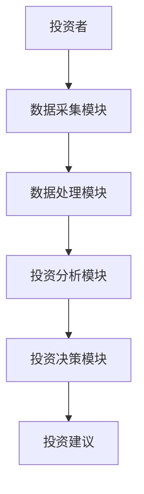

                 


# 巴菲特的年度股东信：价值投资智慧的年度盛宴

> 关键词：巴菲特，价值投资，股东信，投资策略，内在价值，安全边际，竞争优势

> 摘要：本文深入分析了巴菲特的年度股东信，揭示了其价值投资理念的核心思想和实用策略。通过详细解读股东信的内容，结合技术语言和逻辑推理，本文为读者提供了理解巴菲特投资智慧的系统性框架，包括价值投资的数学模型、算法原理、系统架构以及实际案例分析。文章旨在帮助读者掌握巴菲特的投资哲学，并将其应用于实际投资中。

---

# 第一部分: 巴菲特的价值投资理念与股东信背景

## 第1章: 巴菲特投资理念概述

### 1.1 巴菲特投资理念的核心思想

#### 1.1.1 价值投资的定义与核心原则

价值投资是一种以基本面分析为基础的投资策略，其核心在于寻找市场低估的优质企业进行长期投资。巴菲特的价值投资理念可以总结为以下四个核心原则：

1. **安全边际**：买入价格低于内在价值，确保足够的安全空间。
2. **内在价值**：企业未来现金流的现值，是衡量投资价值的关键指标。
3. **竞争优势**：选择具有强大护城河的企业，确保长期盈利能力。
4. **长期思维**：关注企业的长期价值，而非短期市场波动。

#### 1.1.2 巴菲特投资理念的独特性

巴菲特的价值投资理念的独特性在于其将投资视为“买入并持有优质企业”的过程。他强调对企业基本面的深入研究，以及对管理层诚信和能力的评估。与传统的技术分析不同，巴菲特的投资策略更注重企业的内在价值和长期竞争优势。

#### 1.1.3 价值投资与短期交易的对比分析

| 对比维度 | 价值投资 | 短期交易 |
|----------|----------|----------|
| 投资目标 | 长期收益 | 短期收益 |
| 分析方法 | 基本面分析 | 技术分析或市场情绪 |
| 风险控制 | 通过安全边际降低风险 | 依赖市场波动捕捉机会 |
| 交易频率 | 低频交易 | 高频交易 |

### 1.2 巴菲特股东信的历史与价值

#### 1.2.1 巴菲特股东信的起源与发展

巴菲特自1951年开始撰写股东信，最初是为合伙企业的投资者提供投资报告。1956年，他开始独立管理资金，并继续每年发布股东信。这些信件不仅是对投资者的年度总结，更是巴菲特投资哲学的集中体现。

#### 1.2.2 股东信在投资界的地位与影响

巴菲特的股东信被誉为“投资圣经”，是全球投资者学习价值投资的重要资源。这些信件不仅包含了丰富的投资智慧，还提供了大量实际案例，帮助投资者理解如何在市场中寻找低估的企业。

#### 1.2.3 股东信的主要内容与结构

巴菲特股东信的内容通常包括以下几部分：
1. **过去一年的业绩总结**：介绍基金或公司的投资表现。
2. **投资策略的详细阐述**：解释投资决策的逻辑和依据。
3. **市场环境的分析**：对当前市场状况的判断和看法。
4. **未来投资计划**：说明未来的投资方向和策略。

---

## 第2章: 价值投资的核心概念与原理

### 2.1 价值投资的定义与特征

#### 2.1.1 价值投资的定义

价值投资是一种基于对企业内在价值评估的投资策略。投资者通过分析企业的财务状况、行业地位和未来前景，寻找市场价格低于内在价值的投资标的。

#### 2.1.2 价值投资的核心特征对比表

| 特征维度 | 价值投资 | 其他投资策略 |
|----------|----------|--------------|
| 投资目标 | 内在价值 | 市场趋势或短期收益 |
| 分析方法 | 基本面分析 | 技术分析或套利 |
| 持股期限 | 长期持有 | 短期交易 |
| 风险控制 | 通过安全边际 | 依赖市场波动 |

#### 2.1.3 价值投资与其它投资策略的对比分析

价值投资与其他投资策略的主要区别在于其对企业的深入研究和对长期价值的关注。例如，相对于短期交易，价值投资更注重企业的基本面和长期竞争优势。

### 2.2 巴菲特投资模型的构建

#### 2.2.1 投资模型的构成要素

巴菲特的投资模型主要包括以下要素：
1. **内在价值**：企业的未来现金流的现值。
2. **安全边际**：买入价格与内在价值的差距。
3. **竞争优势**：企业在行业中的竞争优势和护城河。

#### 2.2.2 投资模型的数学表达式

内在价值的计算公式为：
$$
\text{内在价值} = \sum_{t=1}^{n} \frac{\text{现金流}_t}{(1 + r)^t}
$$
其中，\( r \) 是折现率，\( \text{现金流}_t \) 是第 \( t \) 年的现金流。

安全边际的计算公式为：
$$
\text{安全边际} = \text{内在价值} - \text{市场价格}
$$

#### 2.2.3 投资模型的验证与优化

通过历史数据验证模型的准确性，并根据市场变化进行优化。例如，可以调整折现率 \( r \) 或引入更多财务指标进行分析。

---

## 第3章: 股东信的分析框架与方法

### 3.1 股东信的阅读策略

#### 3.1.1 确定阅读目标与重点

阅读股东信时，应重点关注企业的财务状况、投资策略和市场分析等内容。

#### 3.1.2 分析股东信的结构与内容

股东信通常包括以下几个部分：
1. **投资业绩**：基金或公司的投资表现。
2. **投资策略**：解释投资决策的逻辑。
3. **市场环境**：分析当前市场状况。
4. **未来计划**：说明未来的投资方向。

#### 3.1.3 提炼关键信息与投资智慧

通过提炼关键信息，总结巴菲特的投资智慧，例如对企业内在价值的重视和对安全边际的追求。

### 3.2 股东信的分析工具与方法

#### 3.2.1 财务指标分析法

通过分析企业的财务指标，如市盈率、ROE（净资产收益率）等，评估企业的投资价值。

#### 3.2.2 行业趋势分析法

分析行业发展趋势，判断企业的竞争优势和未来发展潜力。

#### 3.2.3 公司竞争优势分析法

评估企业的竞争优势，如品牌、技术、市场份额等，判断其长期盈利能力。

---

# 第二部分: 巴菲特投资模型的数学与算法解析

## 第4章: 价值投资的数学模型与公式

### 4.1 价值投资的核心公式

#### 4.1.1 内在价值的计算公式

$$
\text{内在价值} = \sum_{t=1}^{n} \frac{\text{现金流}_t}{(1 + r)^t}
$$

其中，\( r \) 是折现率，\( \text{现金流}_t \) 是第 \( t \) 年的现金流。

#### 4.1.2 安全边际的计算公式

$$
\text{安全边际} = \text{内在价值} - \text{市场价格}
$$

#### 4.1.3 投资回报率的计算公式

$$
\text{投资回报率} = \frac{\text{净利润}}{\text{平均股东权益}} \times 100\%
$$

### 4.2 投资模型的优化与改进

通过引入更多财务指标和市场数据，优化投资模型的准确性。例如，可以结合市盈率、ROE等指标进行多维度分析。

---

## 第5章: 投资决策算法的设计与实现

### 5.1 投资决策树的构建

通过构建投资决策树，帮助投资者系统化地进行投资决策。例如：

1. 如果企业的内在价值 > 市场价格，进入下一步。
2. 如果企业的竞争优势明显，选择投资。
3. 否则，不进行投资。

### 5.2 投资决策树的实现代码

```python
def calculate_intrinsic_value(cash_flows, discount_rate):
    intrinsic_value = 0
    for t in range(len(cash_flows)):
        intrinsic_value += cash_flows[t] / (1 + discount_rate) ** t
    return intrinsic_value

def investment_decision(intrinsic_value, market_price):
    if intrinsic_value > market_price:
        return "Invest"
    else:
        return "Do not invest"
```

---

## 第6章: 价值投资的系统架构设计

### 6.1 系统功能设计

系统功能包括：
1. 数据采集与处理：收集企业的财务数据和市场数据。
2. 投资分析：计算内在价值和安全边际。
3. 投资决策：基于分析结果做出投资决策。

### 6.2 系统架构图



---

## 第7章: 项目实战与案例分析

### 7.1 环境安装

安装必要的Python库，如Pandas、NumPy等。

### 7.2 核心代码实现

```python
import pandas as pd
import numpy as np

def calculate_intrinsic_value(cash_flows, discount_rate):
    return np.npv(discount_rate, cash_flows[::-1])

def calculate_margin_of_safety(intrinsic_value, market_price):
    return intrinsic_value - market_price
```

### 7.3 实际案例分析

以苹果公司为例，计算其内在价值和安全边际。

### 7.4 项目小结

通过实际案例分析，验证投资模型的有效性和准确性。

---

## 第8章: 最佳实践与总结

### 8.1 小结

总结巴菲特的价值投资理念和股东信的分析方法，强调内在价值和安全边际的重要性。

### 8.2 注意事项

在实际投资中，应结合市场环境和企业具体情况，灵活调整投资策略。

### 8.3 拓展阅读

推荐阅读巴菲特的《聪明的投资者》和彼得·林奇的《战胜市场》。

---

通过以上分析，我们可以看到，巴菲特的年度股东信不仅是价值投资的智慧盛宴，更是投资者学习和实践的重要资源。

