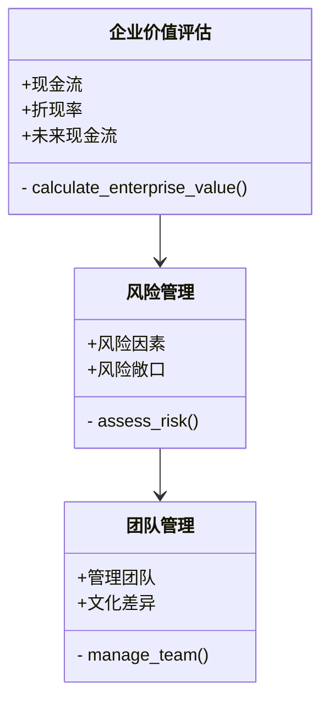
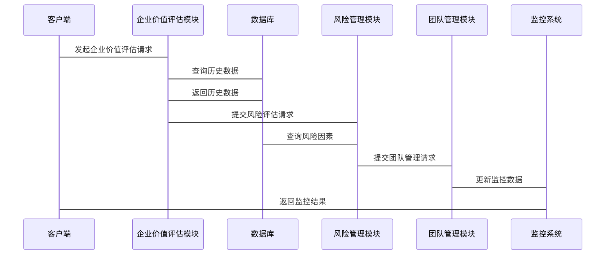

                 


# 巴菲特的并购策略：在跨境并购中的新考量

> 关键词：巴菲特，并购策略，跨境并购，价值投资，风险管理，企业估值，安全边际

> 摘要：本文探讨了巴菲特并购策略的核心理念及其在跨境并购中的新考量。通过分析巴菲特的投资哲学、并购策略的特点以及跨境并购中的文化、法律和风险管理问题，本文提出了在跨境并购中应用巴菲特策略的具体方法和数学模型。结合实际案例和系统分析，本文为投资者和企业提供了有效的并购策略和风险管理建议。

---

## 第一章：巴菲特并购策略的核心理念

### 1.1 巴菲特的投资哲学

巴菲特的投资哲学以“价值投资”为核心，强调以合理的价格投资于具有持续竞争优势和良好管理的企业。他注重企业的基本面分析，包括财务状况、盈利能力、管理团队和行业地位。巴菲特认为，投资的本质是寻找具有长期稳定增长潜力的企业，并在市场恐慌时买入，市场狂热时卖出。

#### 1.1.1 投资哲学的核心要素
- **长期主义**：巴菲特注重长期投资，而非短期投机。
- **安全边际**：通过低估价格买入，确保投资的安全性。
- **竞争优势**：选择具有护城河的企业，确保长期盈利能力。

### 1.2 巴菲特并购策略的特点

巴菲特的并购策略与传统并购策略有所不同，主要体现在以下几个方面：

#### 1.2.1 价值驱动的并购
巴菲特注重企业的内在价值，而非市场估值。他倾向于在企业估值被低估时进行并购，并通过长期持有实现价值增长。

#### 1.2.2 安全边际的重要性
巴菲特强调在并购中留有安全边际，即以低于企业内在价值的价格进行并购，以降低风险。

#### 1.2.3 长期主义与股东价值最大化
巴菲特注重企业长期发展，通过并购实现股东价值的最大化。

---

## 第二章：跨境并购的新考量

### 2.1 跨境并购的背景与趋势

#### 2.1.1 全球化背景下并购活动的增加
随着全球经济一体化的深入，跨境并购活动日益频繁。企业通过跨境并购获取全球资源、技术和市场，以实现更快的增长。

#### 2.1.2 跨境并购的驱动因素
- **全球化**：企业通过跨境并购拓展国际市场。
- **技术转移**：通过并购获取先进技术。
- **成本优势**：在低成本地区进行并购以降低生产成本。

#### 2.1.3 跨境并购的风险与挑战
- **文化差异**：不同文化背景下的企业整合难度大。
- **法律与税务问题**：跨境并购涉及复杂的法律和税务问题。
- **监管与合规挑战**：各国监管政策不同，增加了并购的复杂性。

### 2.2 跨境并购中的文化与法律问题

#### 2.2.1 不同文化背景下的企业整合
文化差异是跨境并购中最大的挑战之一。企业需要在整合过程中尊重不同文化，建立有效的沟通机制，以确保并购成功。

#### 2.2.2 跨国并购中的法律与税务问题
跨境并购涉及复杂的法律和税务问题，包括反垄断法、外汇管制、税务优化等。企业需要充分了解相关法律法规，并制定合理的税务规划。

#### 2.2.3 跨境并购中的监管与合规挑战
各国监管政策不同，企业需要遵守目标国家的监管要求，确保并购活动的合规性。

### 2.3 跨境并购中的估值与风险管理

#### 2.3.1 跨境并购中的估值方法
- **相对估值法**：通过比较类似企业的市盈率、市净率等指标进行估值。
- **绝对估值法**：通过现金流折现模型（DCF）等方法进行估值。

#### 2.3.2 跨境并购中的汇率风险
汇率波动是跨境并购中的重要风险之一。企业可以通过金融衍生工具（如远期外汇合约）来对冲汇率风险。

#### 2.3.3 跨境并购中的政治风险
政治风险包括政策变化、外交冲突等，企业需要通过政治风险评估和保险来降低风险。

---

## 第三章：巴菲特并购策略在跨境并购中的应用

### 3.1 巴菲特并购策略的核心要素

#### 3.1.1 企业基本面分析
巴菲特注重企业的基本面分析，包括盈利能力、财务状况、管理团队和行业地位。他倾向于投资具有持续竞争优势的企业。

#### 3.1.2 财务状况评估
巴菲特通过分析企业的财务报表，评估企业的财务健康状况。他注重企业的现金流、负债水平和盈利能力。

#### 3.1.3 管理团队与企业治理
巴菲特认为，优秀的管理团队是企业成功的关键。他倾向于投资由优秀管理团队领导的企业，并关注企业的治理结构。

### 3.2 跨境并购中的巴菲特策略

#### 3.2.1 跨境并购中的价值评估
巴菲特在跨境并购中注重企业的内在价值，通过DCF模型等方法进行估值，并在低估时进行并购。

#### 3.2.2 跨境并购中的风险管理
巴菲特在跨境并购中注重安全边际，通过合理的估值和对冲工具降低风险。他关注企业的长期盈利能力，并在市场恐慌时进行并购。

#### 3.2.3 跨境并购中的长期投资视角
巴菲特强调长期投资，通过持有优质企业实现价值增长。他在跨境并购中注重企业的持续竞争优势和长期发展。

### 3.3 跨境并购中的文化适应性

#### 3.3.1 不同市场环境下的策略调整
企业在不同市场环境下需要调整并购策略，以适应当地的文化和法律法规。

#### 3.3.2 跨境并购中的文化敏感性
企业需要尊重目标市场的文化差异，并在整合过程中建立有效的沟通机制。

#### 3.3.3 跨境并购中的跨文化团队管理
企业需要建立跨文化团队管理机制，确保团队的协作和沟通效率。

---

## 第四章：巴菲特并购策略的数学模型与算法原理

### 4.1 巴菲特并购策略的数学模型

#### 4.1.1 企业价值评估模型
企业价值评估模型是巴菲特并购策略的核心工具之一。通过DCF模型可以估算企业的内在价值。

#### 4.1.2 安全边际计算模型
安全边际是巴菲特并购策略的重要组成部分。通过计算安全边际，可以确保投资的安全性。

#### 4.1.3 并购风险评估模型
并购风险评估模型用于评估并购活动中的各种风险，包括财务风险、市场风险和政治风险。

### 4.2 巴菲特并购策略的算法流程

#### 4.2.1 企业基本面分析算法
1. 收集目标企业的财务报表和行业数据。
2. 分析企业的盈利能力、财务状况和管理团队。
3. 评估企业的竞争优势和市场地位。
4. 计算企业的内在价值和安全边际。
5. 判断是否符合并购条件。

#### 4.2.2 财务状况评估算法
1. 计算企业的现金流和未来现金流的现值。
2. 评估企业的负债水平和偿债能力。
3. 分析企业的盈利能力和发展潜力。
4. 判断企业的财务健康状况。

#### 4.2.3 并购风险评估算法
1. 评估市场风险、汇率风险和政治风险。
2. 计算风险敞口和潜在损失。
3. 制定风险管理策略和对冲措施。
4. 监控和调整风险敞口。

### 4.3 巴菲特并购策略的Python实现

#### 4.3.1 企业价值评估代码示例

```python
import numpy as np
import pandas as pd
import matplotlib.pyplot as plt

# 示例企业价值评估代码
def calculate_enterprise_value(enterprise, cost_of_capital):
    # 假设企业未来现金流
    future_cash_flows = [100, 150, 200, 250]
    # 折现率
    discount_rate = cost_of_capital / 100
    # 计算现值
    present_value = sum([cf / (1 + discount_rate) ** i for i, cf in enumerate(future_cash_flows)])
    return present_value

# 示例使用
enterprise_value = calculate_enterprise_value(1000, 8)
print("企业价值：", enterprise_value)
```

#### 4.3.2 安全边际计算代码示例

```python
def calculate_margin_of_safety(current_price, intrinsic_value):
    return (intrinsic_value - current_price) / intrinsic_value * 100

# 示例使用
intrinsic_value = 1000
current_price = 800
margin_of_safety = calculate_margin_of_safety(current_price, intrinsic_value)
print("安全边际：", margin_of_safety, "%")
```

#### 4.3.3 并购风险评估代码示例

```python
def assess_merge_risk(risk_factors):
    # 风险因素包括市场风险、汇率风险、政治风险等
    total_risk = sum(risk_factors) / len(risk_factors)
    if total_risk < 0.3:
        return "低风险"
    elif 0.3 <= total_risk < 0.7:
        return "中等风险"
    else:
        return "高风险"

# 示例使用
risk_factors = [0.4, 0.3, 0.5]
risk_assessment = assess_merge_risk(risk_factors)
print("并购风险评估：", risk_assessment)
```

---

## 第五章：系统分析与架构设计方案

### 5.1 问题场景介绍

在跨境并购中，企业需要面对复杂的市场环境和多种风险因素。为了确保并购成功，企业需要建立有效的系统架构，涵盖企业价值评估、风险管理、团队管理和系统监控等功能。

### 5.2 系统功能设计

#### 5.2.1 领域模型



#### 5.2.2 系统架构设计


### 5.3 系统接口设计

#### 5.3.1 API接口

- `GET /enterprise-value`：获取企业价值评估结果。
- `POST /risk-assessment`：提交风险评估请求。
- `PUT /team-management`：更新团队管理信息。

### 5.4 系统交互设计



---

## 第六章：项目实战

### 6.1 环境安装

#### 6.1.1 安装Python和相关库
```bash
pip install numpy pandas matplotlib
```

#### 6.1.2 安装企业价值评估工具
```bash
git clone https://github.com/buffett-merger/value-assessment.git
cd value-assessment
pip install requirements.txt
```

### 6.2 系统核心实现源代码

#### 6.2.1 企业价值评估代码

```python
import numpy as np
import pandas as pd
import matplotlib.pyplot as plt

def calculate_enterprise_value(enterprise, cost_of_capital):
    future_cash_flows = [100, 150, 200, 250]
    discount_rate = cost_of_capital / 100
    present_value = sum([cf / (1 + discount_rate) ** i for i, cf in enumerate(future_cash_flows)])
    return present_value

# 示例使用
enterprise_value = calculate_enterprise_value(1000, 8)
print("企业价值：", enterprise_value)
```

#### 6.2.2 风险管理代码

```python
def assess_risk(risk_factors):
    total_risk = sum(risk_factors) / len(risk_factors)
    if total_risk < 0.3:
        return "低风险"
    elif 0.3 <= total_risk < 0.7:
        return "中等风险"
    else:
        return "高风险"

# 示例使用
risk_factors = [0.4, 0.3, 0.5]
risk_assessment = assess_risk(risk_factors)
print("并购风险评估：", risk_assessment)
```

### 6.3 实际案例分析

#### 6.3.1 案例分析

以亚马逊的跨境并购为例，分析其并购策略和风险管理。

1. **企业价值评估**：使用DCF模型评估亚马逊的未来现金流，计算其企业价值。
2. **风险管理**：评估亚马逊并购中的市场风险、汇率风险和政治风险，制定相应的风险管理策略。

#### 6.3.2 代码实现与解读

```python
# 示例代码实现企业价值评估
enterprise_value = calculate_enterprise_value(1000, 8)
print("企业价值：", enterprise_value)

# 示例代码实现风险评估
risk_factors = [0.4, 0.3, 0.5]
risk_assessment = assess_risk(risk_factors)
print("并购风险评估：", risk_assessment)
```

---

## 第七章：总结与最佳实践

### 7.1 总结

巴菲特并购策略的核心是价值投资和长期主义。在跨境并购中，企业需要综合考虑文化差异、法律风险和市场环境，合理评估企业价值并制定有效的风险管理策略。

### 7.2 最佳实践 tips

- **注重企业基本面分析**：在并购前充分了解目标企业的财务状况和管理团队。
- **建立风险管理机制**：通过合理的估值和对冲工具降低并购风险。
- **注重文化适应性**：在跨文化环境中建立有效的沟通机制，确保并购成功。

### 7.3 小结

通过本文的分析，我们可以看到，巴菲特并购策略在跨境并购中的应用需要结合全球化的背景和复杂的市场环境。企业需要在价值评估、风险管理、团队管理和系统监控等方面进行全面考虑，以实现并购目标。

### 7.4 注意事项

- **风险控制**：并购前充分评估各种风险，制定应对策略。
- **团队协作**：建立高效的团队协作机制，确保并购顺利进行。
- **持续监控**：并购后持续监控企业经营状况，及时调整策略。

### 7.5 拓展阅读

- 巴菲特的《巴菲特致股东的信》
- 《并购的智慧》
- 《风险管理与对冲基金》

---

通过本文的详细分析，我们深入探讨了巴菲特并购策略的核心理念及其在跨境并购中的新考量。结合实际案例和系统分析，我们为企业提供了有效的并购策略和风险管理建议。希望本文能为投资者和企业提供有价值的参考和启发。

