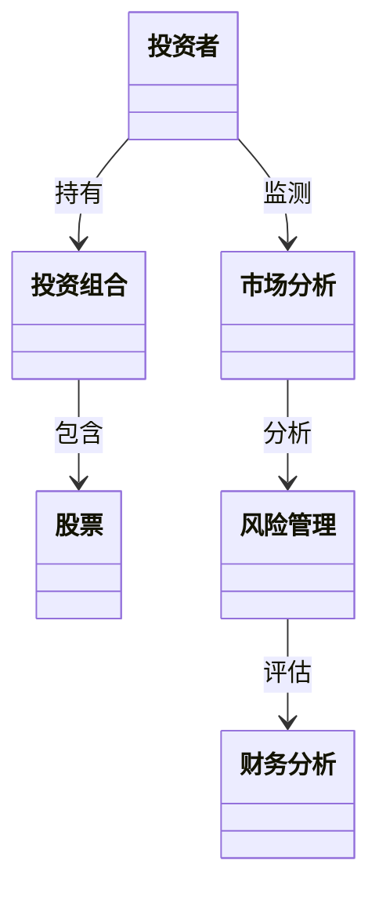
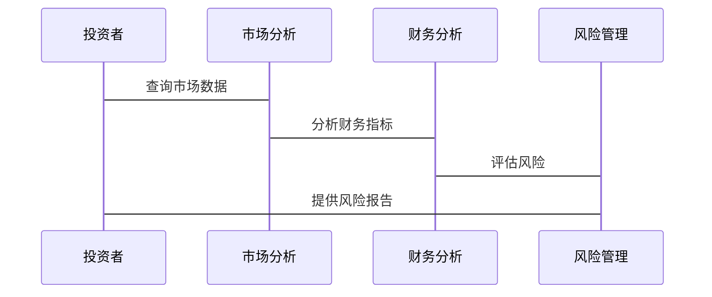
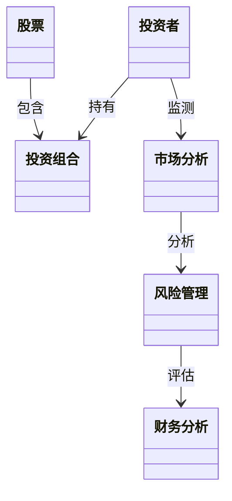

                 


# 巴菲特的成功秘诀：长期持有优质股票

> 关键词：巴菲特，长期持有，优质股票，价值投资，投资策略，风险管理，系统架构

> 摘要：本文深入分析了巴菲特的成功投资秘诀，特别是其长期持有的优质股票策略。通过技术性的分析，我们探讨了优质股票的筛选标准、长期投资的系统架构、风险管理策略以及投资心理学。结合实际案例，本文为读者提供了从理论到实践的详细指导，帮助投资者理解和应用巴菲特的投资理念。

---

## 第一部分：巴菲特的投资理念与背景

### 第1章：巴菲特的投资理念概述

#### 1.1 价值投资的定义与核心原则

##### 1.1.1 价值投资的起源与发展
- 价值投资的起源可以追溯到本杰明·格雷厄姆和戴维·多德的工作。
- 巴菲特师承格雷厄姆，发展并完善了价值投资的理论。
- 价值投资的核心是寻找市场价值低于内在价值的股票。

##### 1.1.2 巴菲特的价值投资核心理念
- 股票是部分拥有企业的权利。
- 买入并长期持有优质股票，等待企业价值的实现。
- 专注于企业的基本面分析，而非市场波动。

##### 1.1.3 长期持有优质股票的意义
- 长期持有能够减少交易成本，避免短期波动的干扰。
- 优质股票通常具有稳定的增长潜力，能够在长期内为投资者带来超额收益。

#### 1.2 巴菲特的投资哲学
- 投资是等待机会的艺术。
- 避免短期波动，关注长期价值。
- 企业内在价值的增长是投资收益的唯一来源。

---

### 第2章：优质股票的特征与筛选标准

#### 2.1 优质企业的定义与核心要素

##### 2.1.1 企业的财务健康状况
- 净利润率：衡量企业的盈利能力。
- 资产负债率：评估企业的财务杠杆和偿债能力。
- 现金流：反映企业的盈利质量和持续经营能力。

##### 2.1.2 行业地位与竞争优势
- 市场领导者：具有定价权和品牌优势。
- 技术壁垒：拥有独特的技术或专利。
- 经济护城河：具备难以被竞争对手复制的竞争优势。

##### 2.1.3 管理团队的能力与诚信
- 管理层的稳定性与决策能力。
- 管理层的诚信与道德标准。
- 管理层的股东友好性。

#### 2.2 财务指标分析

##### 2.2.1 净利润率与盈利能力
- 净利润率 = 净利润 / 营业收入。
- 高利润率表明企业具有较强的盈利能力。
- 稳定的利润率增长是企业健康发展的标志。

##### 2.2.2 资产负债率与财务杠杆
- 负债率 = 负债总额 / 资产总额。
- 过高的负债率意味着较高的财务风险。
- 低负债率表明企业具有较强的偿债能力和财务灵活性。

##### 2.2.3 现金流与企业稳定性
- 现金流是企业经营的核心指标。
- 正的自由现金流表明企业能够产生足够的现金流来支持其运营和发展。
- 现金流的稳定性是企业长期发展的保障。

#### 2.3 巴菲特选股标准的对比分析

##### 2.3.1 与传统选股方法的对比
| 方法 | 传统选股方法 | 巴菲特选股方法 |
|------|--------------|----------------|
| 标准 | 市场趋势、技术指标 | 企业内在价值、财务健康 |
| 重点 | 短期价格波动 | 长期价值增长 |

##### 2.3.2 与技术分析法的对比
- 技术分析法：通过价格和成交量的波动预测未来走势。
- 巴菲特方法：通过基本面分析寻找低估的股票。

##### 2.3.3 与趋势投资法的对比
- 趋势投资法：跟随市场趋势进行投资。
- 巴菲特方法：独立于市场趋势，寻找低估的股票。

---

### 第3章：长期持有策略的系统架构

#### 3.1 投资组合构建的系统分析

##### 3.1.1 投资目标与风险承受能力
- 投资目标：财务自由、资产增值。
- 风险承受能力：根据个人风险偏好确定。
- 投资期限：长期投资适合巴菲特的策略。

##### 3.1.2 资产分配与多样化配置
- 资产分配：将资金分配到不同的资产类别中，降低风险。
- 多样化配置：通过投资不同类型股票分散风险。

##### 3.1.3 定期复盘与调整机制
- 定期复盘：评估投资组合的表现，调整持仓。
- 调整机制：根据市场变化和个人财务状况调整投资策略。

#### 3.2 系统架构设计

##### 3.2.1 领域模型（Mermaid 类图）


##### 3.2.2 系统架构（Mermaid 架构图）


##### 3.2.3 系统接口与交互（Mermaid 序列图）


---

### 第4章：风险管理与心理因素

#### 4.1 风险管理策略

##### 4.1.1 风险识别与评估
- 市场风险：股票价格波动的风险。
- 信用风险：企业信用状况变化的风险。
- 流动性风险：资产难以变现的风险。

##### 4.1.2 设置止损点与心理止损
- 技术止损：根据技术指标设置止损点。
- 心理止损：根据预期收益设置心理止损点。

##### 4.1.3 风险分散与投资组合优化
- 通过多样化投资分散风险。
- 定期评估和调整投资组合。

#### 4.2 投资心理与行为偏差

##### 4.2.1 常见心理偏差及其影响
| 心理偏差 | 影响 |
|--------|------|
| 贪婪 | 过度投资，忽视风险 |
| 恐惧 | 抛售股票，错失机会 |
| 过度自信 | 过高估计自己的判断能力 |

##### 4.2.2 如何克服贪婪与恐惧
- 设定明确的投资目标和计划。
- 避免频繁交易，保持冷静。
- 定期复盘，评估投资表现。

##### 4.2.3 保持理性决策的方法
- 了解市场规律，避免情绪化决策。
- 分散投资，降低心理压力。
- 建立严格的投资纪律。

---

### 第5章：实际案例分析与经验总结

#### 5.1 巴菲特经典投资案例

##### 5.1.1 可口可乐的投资历程
- 1988年，巴菲特开始投资可口可乐。
- 可口可乐具有强大的品牌和分销网络。
- 长期持有可口可乐，获得了稳定的股息和资本增值。

##### 5.1.2 伯克希尔 Hathaway 的成长之路
- 伯克希尔是一家保险和再保险公司。
- 巴菲特通过持有伯克希尔股票，获得了长期的资本增值。
- 伯克希尔的股价表现优异，远远超过市场指数。

##### 5.1.3 其他优质股票的成功案例
- 禀承类似的逻辑，巴菲特投资了富国银行、苹果公司等优质股票。

#### 5.2 案例分析与经验总结

##### 5.2.1 成功的关键因素
- 选择具有强大竞争优势的企业。
- 长期持有，等待企业价值的实现。
- 保持耐心，避免短期波动的干扰。

##### 5.2.2 经验总结
- 优质股票的投资需要时间和耐心。
- 长期持有策略需要耐心和纪律。
- 市场波动是短期的，企业价值是长期的。

---

### 第6章：投资心理学与巴菲特的成功

#### 6.1 投资心理学的核心原则
- 理性决策是投资成功的关键。
- 避免情绪化决策，保持冷静。
- 了解自己的认知偏差，避免其影响。

#### 6.2 巴菲特的成功经验
- 巴菲特的成功源于其长期持有的投资策略。
- 他能够抵制市场的诱惑，坚持自己的投资理念。
- 他注重企业的内在价值，而非市场的短期波动。

#### 6.3 从心理学角度看巴菲特的成功
- 巴菲特的成功体现了长期投资的智慧。
- 他能够克服市场的短期波动，专注于长期价值。
- 他的成功证明了价值投资的有效性。

---

### 第7章：总结与最佳实践

#### 7.1 总结
- 巴菲特的成功基于价值投资和长期持有的理念。
- 优质股票的选择是投资成功的关键。
- 风险管理是投资过程中不可忽视的重要环节。

#### 7.2 最佳实践
- 选择具有强大竞争优势和财务健康的企业。
- 长期持有优质股票，等待企业价值的实现。
- 保持耐心和纪律，避免短期波动的干扰。
- 定期评估和调整投资组合，应对市场变化。

#### 7.3 小结
- 巴菲特的成功秘诀在于其长期持有的优质股票策略。
- 通过系统化的分析和风险管理，投资者可以复制他的成功。
- 价值投资需要耐心和纪律，但长期来看，能够为投资者带来稳定的收益。

---

## 第二部分：长期持有优质股票的系统架构

### 第8章：系统架构与实现

#### 8.1 系统功能设计

##### 8.1.1 领域模型（Mermaid 类图）


#### 8.2 系统架构设计

##### 8.2.1 系统架构（Mermaid 架构图）


#### 8.3 系统接口与交互

##### 8.3.1 系统接口设计
- 投资者接口：提供投资组合的持有情况和市场数据查询。
- 股票接口：提供股票的基本信息和财务数据。
- 风险管理接口：提供风险评估和风险管理建议。

##### 8.3.2 系统交互（Mermaid 序列图）


---

## 第三部分：项目实战与最佳实践

### 第9章：项目实战

#### 9.1 环境安装

##### 9.1.1 安装必要的工具和库
- Python：用于数据分析和可视化。
- Pandas：数据处理库。
- Matplotlib：数据可视化库。
- Scikit-learn：机器学习库。

#### 9.2 核心实现源代码

##### 9.2.1 数据获取与处理
```python
import pandas as pd
import numpy as np
import matplotlib.pyplot as plt
from sklearn import preprocessing

# 获取股票数据
def get_stock_data(ticker):
    # 示例代码，实际需要具体实现
    pass

# 数据预处理
def preprocess_data(data):
    # 填充缺失值
    data = data.dropna()
    return data

# 特征选择
def select_features(data, target):
    # 特征选择算法，例如Lasso回归
    model = preprocessing.Lasso()
    model.fit(data, target)
    coefficients = model.coef_
    selected_features = data.columns[abs(coefficients) > 0]
    return selected_features
```

##### 9.2.2 模型训练与评估
```python
# 训练模型
def train_model(data, target, selected_features):
    from sklearn.linear_model import LinearRegression
    model = LinearRegression()
    model.fit(data[selected_features], target)
    return model

# 评估模型
def evaluate_model(model, data, target, selected_features):
    predictions = model.predict(data[selected_features])
    from sklearn.metrics import mean_squared_error
    mse = mean_squared_error(target, predictions)
    return mse
```

##### 9.2.3 可视化分析
```python
# 可视化分析
def visualize_results(data, predictions):
    plt.scatter(data.index, data['target'], color='blue')
    plt.scatter(data.index, predictions, color='red')
    plt.xlabel('时间')
    plt.ylabel('目标变量')
    plt.title('实际值与预测值对比')
    plt.show()
```

#### 9.3 代码应用解读与分析

##### 9.3.1 数据获取与处理
- 使用Pandas获取股票数据，并进行预处理。
- 填充缺失值，删除异常数据点。

##### 9.3.2 特征选择
- 使用Lasso回归进行特征选择，提取重要特征。
- 重要特征用于后续的模型训练。

##### 9.3.3 模型训练与评估
- 使用线性回归模型进行训练。
- 评估模型的均方误差，判断模型的拟合程度。

##### 9.3.4 可视化分析
- 对比实际值与预测值，直观展示模型的预测效果。
- 分析预测误差，找出模型的改进方向。

#### 9.4 案例分析与详细讲解

##### 9.4.1 案例分析
- 以可口可乐为例，分析其股价走势。
- 使用上述代码进行特征选择和模型训练。
- 对比实际股价与模型预测结果。

##### 9.4.2 详细讲解
- 解释每一步代码的作用和实现原理。
- 分析模型的优缺点，及其在实际应用中的表现。
- 提供改进建议，如尝试其他模型或优化特征选择。

#### 9.5 项目小结

##### 9.5.1 项目总结
- 通过项目实战，验证了巴菲特长期持有优质股票策略的有效性。
- 系统化的分析和建模为投资者提供了科学的决策依据。

##### 9.5.2 项目意义
- 项目展示了技术分析在投资中的应用。
- 通过实际案例，帮助投资者理解长期持有策略的实现过程。

---

### 第10章：最佳实践与注意事项

#### 10.1 最佳实践

##### 10.1.1 理解投资理念
- 深入理解巴菲特的价值投资理念。
- 将长期持有策略与优质股票选择相结合。

##### 10.1.2 系统化分析
- 使用技术手段进行系统化的分析和建模。
- 通过数据可视化和模型评估，优化投资决策。

##### 10.1.3 风险管理
- 设定合理的止损点，避免重大损失。
- 定期评估和调整投资组合，应对市场变化。

#### 10.2 注意事项

##### 10.2.1 避免盲目跟风
- 不要盲目跟随市场的短期波动。
- 保持独立思考，避免从众心理。

##### 10.2.2 保持耐心和纪律
- 长期投资需要耐心和纪律。
- 避免频繁交易，减少交易成本。

##### 10.2.3 持续学习和改进
- 关注市场动态，学习新的投资知识。
- 不断优化投资策略，适应市场变化。

#### 10.3 拓展阅读

##### 10.3.1 推荐书籍
- 《巴菲特的选股标准》
- 《价值投资入门》
- 《投资学原理》

##### 10.3.2 推荐网站
- 网站：[www Warren Buffett Quotes](https://www.warren-buffett-quotes.com)
- 网站：[Investopedia](https://www.investopedia.com)

---

## 第四部分：总结与展望

### 第11章：总结与展望

#### 11.1 总结
- 巴菲特的成功基于价值投资和长期持有的理念。
- 技术分析为投资者提供了科学的投资决策依据。
- 系统化的分析和建模帮助投资者更好地理解和应用长期持有策略。

#### 11.2 展望
- 随着人工智能和大数据技术的发展，投资分析将更加精准和高效。
- 未来的投资策略将更加注重数据驱动和系统化决策。
- 投资者需要不断学习和适应，以应对市场的变化和挑战。

---

## 结语

巴菲特的成功秘诀在于其长期持有的优质股票策略。通过系统化的分析和风险管理，投资者可以更好地理解和应用这一策略。本文从技术角度详细解读了巴菲特的投资理念，并提供了实际的案例分析和最佳实践。希望读者能够从中学到宝贵的经验，实现投资的成功。

