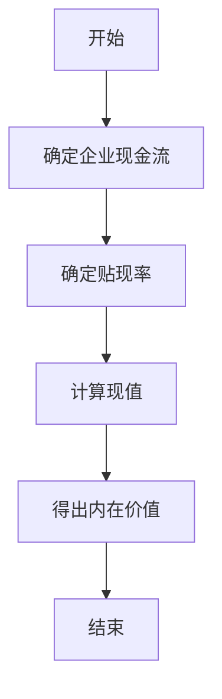
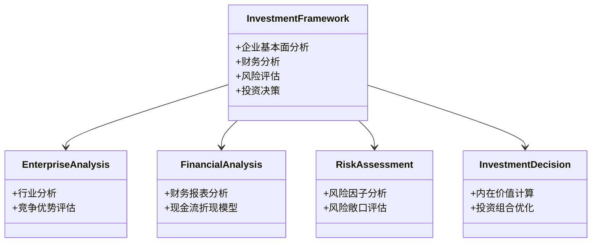
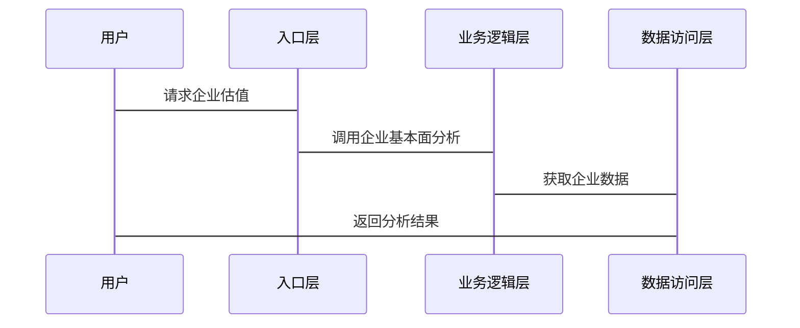

                 


# 巴菲特的投资决策框架

## 关键词
- 巴菲特
- 价值投资
- 投资决策框架
- 投资分析
- 投资风险管理
- 投资组合优化
- 股票估值

## 摘要
本文详细分析了巴菲特的投资决策框架，从背景、核心概念、分析框架、算法模型到系统设计与实战案例，层层深入地探讨了巴菲特价值投资理念的精髓。通过具体的技术语言和专业分析，揭示了巴菲特投资决策框架的内在逻辑与实际应用，帮助读者理解如何在实际投资中运用这一框架进行决策。

---

# 第一部分: 巴菲特的投资决策框架概述

## 第1章: 巴菲特投资决策框架的背景与核心概念

### 1.1 投资决策框架的背景

#### 1.1.1 传统投资理论的局限性
传统的投资理论，如技术分析和短期市场预测，往往忽视了企业的基本面和长期价值。这些方法依赖于价格波动和市场情绪，难以在长期投资中稳定获利。巴菲特的投资框架作为一种革命性的方法，弥补了这些缺陷。

#### 1.1.2 巴菲特投资理念的起源与演变
巴菲特的投资理念起源于价值投资理论，由本杰明·格雷厄姆提出。巴菲特在格雷厄姆的基础上，结合自己的实践，形成了独特的投资框架。这一框架强调对企业内在价值的评估，而非市场的短期波动。

#### 1.1.3 巴菲特投资框架的核心目标
巴菲特的投资框架以长期价值为导向，旨在通过识别具有持续竞争优势和良好治理的企业，进行长期持有的投资策略。其核心目标是实现超越市场的长期收益。

### 1.2 巴菲特投资决策框架的核心概念

#### 1.2.1 价值投资的定义与特征
价值投资是一种以低于内在价值的价格购买优质资产的投资策略。其核心特征包括：
1. **长期视角**：关注企业的长期价值。
2. **安全边际**：购买价格低于内在价值。
3. **竞争优势**：投资于具有持续竞争优势的企业。

#### 1.2.2 投资决策的三要素：价值、价格与风险
- **价值**：企业的内在价值，即未来现金流的现值。
- **价格**：市场上的当前价格。
- **风险**：投资的不确定性。

#### 1.2.3 巴菲特决策框架的边界与外延
巴菲特的投资框架适用于长期股权投资，但不适用于短期交易和高频交易。其外延包括对企业的深度分析和对管理团队的信任评估。

---

## 第2章: 巴菲特投资决策框架的分析框架

### 2.1 企业基本面分析

#### 2.1.1 企业的核心竞争力分析
- **竞争优势**：企业的独特优势，如品牌、技术、成本优势等。
- **管理团队**：团队的能力和诚信。
- **行业地位**：企业在行业中的地位和前景。

#### 2.1.2 财务报表分析的关键指标
- **ROE（净资产收益率）**：衡量企业盈利能力的重要指标。
- **ROA（资产回报率）**：衡量资产使用效率。
- **毛利率**：反映企业的定价策略和成本控制能力。

#### 2.1.3 行业地位与竞争优势
分析企业在行业中的地位，包括市场份额、竞争对手分析等。

### 2.2 财务分析与估值模型

#### 2.2.1 财务报表分析的关键指标
- **收入与利润**：分析企业的收入来源和利润结构。
- **资产负债表**：评估企业的资产、负债和所有者权益。
- **现金流**：分析企业的现金流入和流出情况。

#### 2.2.2 现金流折现模型的应用
现金流折现模型（DCF）是巴菲特估值的核心工具，用于计算企业的内在价值。

#### 2.2.3 内在价值的计算公式
$$ V = \frac{CF}{r} $$
其中：
- \( V \) 是企业的内在价值。
- \( CF \) 是企业的未来自由现金流。
- \( r \) 是贴现率。

### 2.3 投资风险的评估与管理

#### 2.3.1 风险的定义与分类
- **系统性风险**：市场整体波动带来的风险。
- **非系统性风险**：特定企业或行业带来的风险。

#### 2.3.2 巴菲特风险评估方法
巴菲特强调通过对企业基本面的深入分析来降低投资风险。

#### 2.3.3 风险管理的策略
- **分散投资**：通过投资于多个优质企业分散风险。
- **安全边际**：购买价格低于内在价值，为潜在风险提供缓冲。

---

## 第3章: 巴菲特投资决策框架的核心算法与数学模型

### 3.1 投资决策的算法原理

#### 3.1.1 现金流折现模型的算法流程


#### 3.1.2 内在价值计算的数学公式
$$ V = \frac{CF}{r} $$

### 3.2 投资组合优化的数学模型

#### 3.2.1 马科维茨投资组合理论
$$ \text{目标函数: } \min_{w} w^T \Sigma w $$
$$ \text{约束条件: } w^T \mu = \text{目标收益} $$

#### 3.2.2 巴菲特投资组合优化的改进
结合企业的竞争优势和内在价值，进一步优化投资组合。

#### 3.2.3 投资组合优化的Python实现
```python
import numpy as np
from scipy.optimize import minimize

def portfolio_optimization(returns, cov_matrix, target_return):
    n = len(cov_matrix)
    # 定义目标函数
    def objective(w):
        return np.dot(w.T, np.dot(cov_matrix, w))
    # 定义约束条件
    constraints = [
        {'type': 'eq', 'fun': lambda w: np.sum(w) - 1},
        {'type': 'eq', 'fun': lambda w: np.dot(w, returns) - target_return}
    ]
    # 约束条件：权重非负
    for i in range(n):
        constraints.append({'type': 'ineq', 'fun': lambda w, i=i: w[i]})
    # 求解优化问题
    result = minimize(objective, np.ones(n)/n, constraints=constraints)
    return result.x

# 示例数据
returns = np.array([0.1, 0.15, 0.08, 0.12])
cov_matrix = np.array([
    [0.02, 0.01, 0.015, 0.01],
    [0.01, 0.03, 0.02, 0.015],
    [0.015, 0.02, 0.03, 0.01],
    [0.01, 0.015, 0.01, 0.02]
])
target_return = 0.1

weights = portfolio_optimization(returns, cov_matrix, target_return)
print("最优权重:", weights)
```

---

## 第4章: 系统分析与架构设计方案

### 4.1 问题场景介绍
描述一个投资决策系统的应用场景，包括企业估值、风险评估和投资组合优化。

### 4.2 系统功能设计

#### 4.2.1 领域模型（mermaid 类图）


### 4.3 系统架构设计

#### 4.3.1 系统架构（mermaid 架构图）


### 4.4 系统接口设计
- **API 接口**：提供企业数据接口、财务数据接口和投资决策接口。

### 4.5 系统交互（mermaid 序列图）


---

## 第5章: 项目实战

### 5.1 环境安装
安装必要的 Python 库，如 numpy、pandas、scipy。

### 5.2 系统核心实现源代码

#### 5.2.1 现金流折现模型的实现
```python
import numpy as np
from scipy.optimize import minimize

def calculate_intrinsic_value(cash_flows, discount_rate):
    return np.sum(cash_flows / (1 + discount_rate)**np.arange(len(cash_flows)))

# 示例数据
cash_flows = [100, 150, 200, 250]
discount_rate = 0.1

intrinsic_value = calculate_intrinsic_value(cash_flows, discount_rate)
print("内在价值:", intrinsic_value)
```

#### 5.2.2 投资组合优化的实现
```python
import numpy as np
from scipy.optimize import minimize

def portfolio_optimization(returns, cov_matrix, target_return):
    n = len(cov_matrix)
    # 定义目标函数
    def objective(w):
        return np.dot(w.T, np.dot(cov_matrix, w))
    # 定义约束条件
    constraints = [
        {'type': 'eq', 'fun': lambda w: np.sum(w) - 1},
        {'type': 'eq', 'fun': lambda w: np.dot(w, returns) - target_return}
    ]
    # 约束条件：权重非负
    for i in range(n):
        constraints.append({'type': 'ineq', 'fun': lambda w, i=i: w[i]})
    # 求解优化问题
    result = minimize(objective, np.ones(n)/n, constraints=constraints)
    return result.x

# 示例数据
returns = np.array([0.1, 0.15, 0.08, 0.12])
cov_matrix = np.array([
    [0.02, 0.01, 0.015, 0.01],
    [0.01, 0.03, 0.02, 0.015],
    [0.015, 0.02, 0.03, 0.01],
    [0.01, 0.015, 0.01, 0.02]
])
target_return = 0.1

weights = portfolio_optimization(returns, cov_matrix, target_return)
print("最优权重:", weights)
```

### 5.3 代码应用解读与分析
解释上述代码的功能和实现逻辑，展示如何通过代码实现巴菲特的投资决策框架。

---

## 第6章: 总结与展望

### 6.1 总结
总结巴菲特投资决策框架的核心内容和实际应用价值。

### 6.2 投资建议与注意事项
- **长期视角**：坚持价值投资，避免短期波动干扰。
- **安全边际**：购买价格低于内在价值。
- **分散投资**：降低投资组合的整体风险。

### 6.3 展望
展望未来，结合人工智能和大数据分析，进一步优化巴菲特的投资决策框架。

---

## 第7章: 最佳实践 tips

### 7.1 价值投资的误区
- **误区一**：忽视企业的基本面。
- **误区二**：过度依赖市场情绪。

### 7.2 风险管理的重要性
- 定期评估投资组合的风险敞口。
- 设置止损点，控制投资风险。

### 7.3 持续学习与精进
- 关注企业的长期发展，不断学习新的投资知识。

---

## 参考文献
- 巴菲特股东大会演讲集
- 《价值投资实战策略》
- 马科维茨的《投资组合选》

---

通过以上内容，我们可以清晰地看到巴菲特投资决策框架的逻辑与实际应用。这一框架不仅适用于个人投资者，也可以为机构投资者提供重要的参考价值。

