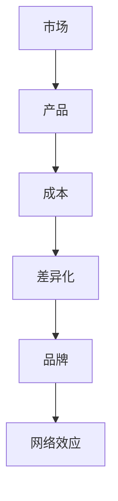
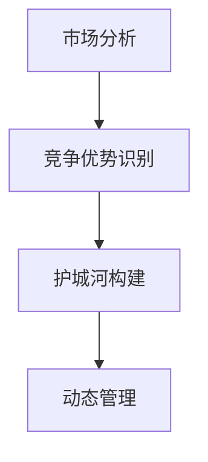

                 

好的，让我们一步步来分析如何撰写这篇文章。

# {{此处是文章标题}}

> 关键词：{{此处列出文章的5-7个核心关键词}}

> 摘要：{{此处给出文章的核心内容和主题思想}}

---

# 第1章: 护城河理论的核心概念

## 1.1 护城河的定义与背景

### 1.1.1 什么是护城河
护城河是企业在市场竞争中建立的一种持久竞争优势，能够保护企业免受竞争对手的侵蚀。这种优势可以是成本优势、产品差异化、网络效应或品牌优势。

### 1.1.2 护城河在商业中的作用
护城河的作用是确保企业在长期的竞争中能够保持领先地位，通过建立壁垒来阻止竞争对手进入市场或削弱其市场份额。

### 1.1.3 护城河与竞争优势的关系
护城河是竞争优势的核心，它不仅仅是暂时的优势，而是能够持续为企业带来超额利润的能力。

---

## 1.2 护城河的核心要素

### 1.2.1 成本优势
成本优势是护城河的一种形式，企业通过降低生产成本或运营成本，能够在价格上与竞争对手形成差异化。

### 1.2.2 差异化优势
差异化优势是通过提供独特的的产品或服务，使得企业在市场上具有独特性，从而吸引特定客户群体。

### 1.2.3 网络效应
网络效应是指随着用户数量的增加，产品或服务的价值也增加。这种效应能够形成强大的壁垒，阻止竞争对手进入市场。

### 1.2.4 品牌优势
品牌优势是指强大的品牌影响力和客户忠诚度，能够为企业带来长期的市场优势。

---

## 1.3 护城河的分类与特点

### 1.3.1 成本优势型护城河
成本优势型护城河的特点是企业能够以更低的成本提供产品或服务，从而在价格上具有竞争力。

### 1.3.2 差异化优势型护城河
差异化优势型护城河的特点是企业提供独特的产品或服务，满足特定客户群体的需求。

### 1.3.3 网络效应型护城河
网络效应型护城河的特点是随着用户数量的增加，产品或服务的价值也增加，形成正反馈循环。

### 1.3.4 品牌优势型护城河
品牌优势型护城河的特点是强大的品牌影响力和客户忠诚度，能够抵御竞争对手的市场渗透。

---

## 1.4 护城河的构建与维护

### 1.4.1 护城河的构建原则
护城河的构建原则包括专注于核心竞争力、不断创新、强化品牌影响力等。

### 1.4.2 护城河的维护策略
护城河的维护策略包括持续改进产品或服务、加强客户关系管理、优化运营成本等。

### 1.4.3 护城河的动态管理
护城河的动态管理包括定期评估竞争优势、及时调整战略、应对市场变化等。

---

## 1.5 本章小结
本章介绍了护城河理论的核心概念，包括护城河的定义、核心要素、分类以及构建与维护的策略。通过这些内容，我们可以更好地理解护城河在商业竞争中的重要性。

---

# 第2章: 护城河理论的数学模型与分析方法

## 2.1 护城河的五力分析模型

### 2.1.1 五力分析模型的定义
五力分析模型是迈克尔·波特提出的一种竞争分析工具，用于评估企业在市场中的竞争地位。

### 2.1.2 五力分析模型的公式
$$ 护城河强度 = \frac{市场占有率 + 产品差异化 + 成本优势 + 网络效应 + 品牌影响力}{5} $$

---

## 2.2 护城河的财务指标分析

### 2.2.1 净利润率
净利润率是衡量企业盈利能力的重要指标，公式为：
$$ 净利润率 = \frac{净利润}{营业收入} $$

### 2.2.2 资产回报率
资产回报率是衡量企业资产使用效率的重要指标，公式为：
$$ 资产回报率 = \frac{净利润}{平均总资产} $$

### 2.2.3 市场占有率
市场占有率是衡量企业在市场中的份额，公式为：
$$ 市场占有率 = \frac{企业销售额}{市场总销售额} $$

---

## 2.3 护城河的竞争对手分析

### 2.3.1 竞争对手的护城河识别
识别竞争对手的护城河需要分析其成本结构、产品差异化、网络效应和品牌影响力。

### 2.3.2 竞争对手的护城河强度评估
通过五力分析模型和财务指标分析，可以评估竞争对手的护城河强度。

---

## 2.4 本章小结
本章介绍了护城河理论的数学模型与分析方法，包括五力分析模型、财务指标分析和竞争对手分析。这些方法可以帮助企业更好地识别和评估自身的护城河。

---

# 第3章: 护城河的系统分析与架构设计

## 3.1 护城河的系统模型

### 3.1.1 护城河系统模型的定义
护城河系统模型是一种用于分析企业竞争优势的系统模型，通过将市场、产品、成本、差异化、品牌和网络效应等要素结合起来，形成一个完整的系统。

### 3.1.2 护城河系统模型的 mermaid 图

---

## 3.2 护城河的系统架构设计

### 3.2.1 护城河系统的功能模块
护城河系统的功能模块包括市场分析、竞争优势识别、护城河构建和动态管理。

### 3.2.2 护城河系统的架构图

---

## 3.3 护城河的系统接口设计

### 3.3.1 护城河系统的输入接口
护城河系统的输入接口包括市场数据、竞争对手信息、企业内部数据等。

---

## 3.4 本章小结
本章介绍了护城河的系统分析与架构设计，包括系统模型、系统架构设计和系统接口设计。这些内容为护城河理论的实际应用提供了系统化的思路。

---

# 第4章: 项目实战

## 4.1 护城河理论在实际项目中的应用

### 4.1.1 项目背景与目标
本项目旨在通过护城河理论分析一家企业的竞争优势，制定长期发展战略。

### 4.1.2 项目实施步骤
1. 市场分析与竞争对手研究
2. 竞争优势识别与评估
3. 护城河构建与实施
4. 动态管理与持续优化

### 4.1.3 项目成果与总结
通过护城河理论的应用，企业成功识别并强化了其核心竞争优势，提升了市场地位。

---

## 4.2 本章小结
本章通过一个实际项目展示了护城河理论的应用，强调了理论与实践相结合的重要性。

---

# 第5章: 总结与展望

## 5.1 护城河理论的意义与价值
护城河理论为企业的长期发展提供了重要的指导，帮助企业识别和建立持久的竞争优势。

## 5.2 未来发展趋势
随着市场竞争的加剧，护城河理论的应用将更加广泛和深入，企业需要不断创新和优化其竞争优势。

## 5.3 本章小结
本章总结了护城河理论的意义与价值，并展望了其未来的发展趋势。

---

# {{此处是文章标题}}

> 关键词：{{此处列出文章的5-7个核心关键词}}

> 摘要：{{此处给出文章的核心内容和主题思想}}

---

通过以上内容，我们可以看到，护城河理论在商业竞争中的重要性以及其在实际应用中的广泛性。希望这篇文章能够为企业在竞争激烈的市场中提供有价值的指导。

