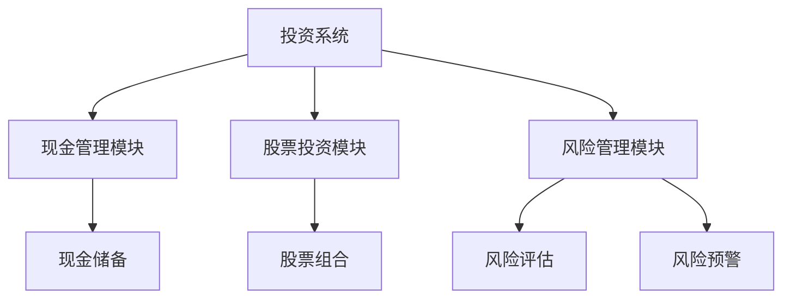
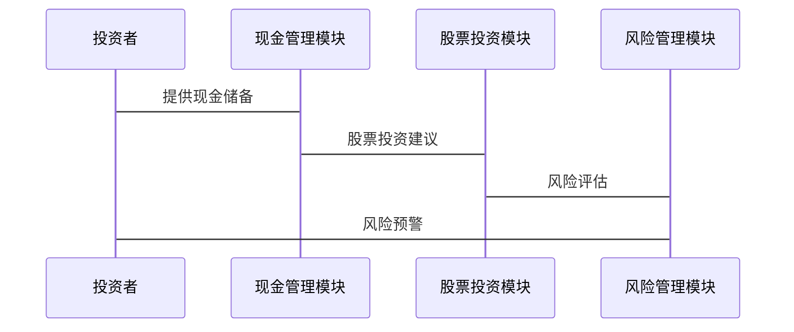

                 


# 巴菲特的杠铃策略：现金+股票的平衡

## 关键词：
- 巴菲特
- 杠铃策略
- 现金
- 股票
- 资产配置
- 风险管理
- 投资组合

## 摘要：
本文详细阐述了巴菲特提出的杠铃策略，即通过持有现金和股票的平衡来实现资产的稳健增长。文章从杠铃策略的背景、理论基础、具体实施策略、风险管理等方面进行了深入分析，并结合实际案例和系统架构设计，展示了如何在不同市场环境下应用杠铃策略来优化投资组合。通过本文的分析，读者可以全面理解杠铃策略的核心思想，并掌握在实际投资中如何运用这一策略来平衡风险与收益。

---

# 第一部分：杠铃策略的背景与核心概念

## 第1章：杠铃策略的背景与核心思想

### 1.1 巴菲特杠铃策略的背景

#### 1.1.1 巴菲特投资理念的演进
巴菲特作为全球最著名的投资者之一，其投资理念经历了从“价值投资”到“长期投资”的演变。他最初关注于寻找具有内在价值的股票，但随着市场环境的变化，他逐渐形成了更为灵活的投资策略。杠铃策略是巴菲特在2008年全球金融危机后提出的一种投资方法，旨在通过现金和股票的平衡来应对市场的不确定性。

#### 1.1.2 杠铃策略的提出与核心思想
杠铃策略的核心思想是通过持有一定比例的现金和股票，来实现投资组合的稳健增长。与传统的投资策略不同，杠铃策略强调在市场波动中保持灵活性，通过现金储备在市场下跌时抄底，同时通过股票投资在市场上涨时获利。

#### 1.1.3 杠铃策略在投资组合中的地位
杠铃策略是一种防御性投资策略，它通过在现金和股票之间进行动态平衡，帮助投资者在不同市场环境下实现资产的保值与增值。这种策略特别适合在市场波动较大或经济不确定性较高的情况下使用。

### 1.2 杠铃策略的核心概念

#### 1.2.1 现金与股票的平衡关系
杠铃策略的核心是将投资组合分为两部分：一部分用于持有现金，另一部分用于投资股票。现金部分用于应对市场波动和潜在的投资机会，股票部分则用于长期增值。

#### 1.2.2 杠铃策略的数学模型与公式
杠铃策略的数学模型可以用以下公式表示：
$$杠铃策略 = 现金 \times 现金权重 + 股票 \times 股票权重$$
其中，现金权重和股票权重可以根据市场环境动态调整，但通常建议将现金和股票的比例保持在1:1或接近的比例。

#### 1.2.3 杠铃策略的边界与外延
杠铃策略的边界在于现金和股票的比例分配，以及市场环境的变化。其外延则包括对不同类型股票和现金管理工具的选择。

### 1.3 杠铃策略的核心要素对比

| 核心要素 | 现金 | 股票 |
|----------|------|------|
| 风险特征 | 低风险 | 高风险 |
| 收益特征 | 稳定收益 | 高潜在收益 |
| 涨跌特性 | 抗跌性强 | 波动性大 |

---

## 第2章：杠铃策略的理论基础

### 2.1 资产配置理论

#### 2.1.1 资产配置的核心原理
资产配置是杠铃策略的基础，它通过将资金分配到不同的资产类别（如现金和股票）中，来分散风险并优化收益。

#### 2.1.2 现金与股票的资产分配比例
通常建议将资金的50%分配给现金，50%分配给股票。在市场波动较大时，可以适当增加现金比例；在市场上涨时，可以适当增加股票比例。

### 2.2 风险管理理论

#### 2.2.1 风险分散与投资组合
通过持有现金和股票，杠铃策略实现了风险的分散。现金部分可以对冲股票市场的下跌风险，而股票部分则可以捕捉市场的上涨收益。

#### 2.2.2 杠铃策略的风险控制机制
杠铃策略的风险控制机制包括定期调整现金和股票的比例，以及在市场出现极端情况时及时采取保护措施。

### 2.3 现金流管理理论

#### 2.3.1 现金流的重要性
现金流是杠铃策略的核心要素之一，它不仅用于应对短期资金需求，还可以用于在市场低谷时投资优质资产。

#### 2.3.2 现金流的稳定性与投资决策
稳定的现金流可以为投资者提供更大的灵活性，使其能够在市场波动时做出更明智的投资决策。

---

## 第3章：杠铃策略的股票选择标准

### 3.1 股票选择的核心原则

#### 3.1.1 价值投资的核心要素
巴菲特强调选择具有强大基本面和良好管理的公司股票。具体包括：
- 公司具有持续的盈利能力和竞争优势
- 公司管理团队具有良好的声誉和能力
- 公司股票的估值合理

#### 3.1.2 股票的内在价值评估
内在价值是股票合理价格的基础，可以通过对公司未来现金流的贴现来计算。

### 3.2 股票组合的构建策略

#### 3.2.1 股票组合的分散化原则
为了避免过度集中风险，建议选择多个行业的优质股票，以实现风险分散。

#### 3.2.2 高质量股票的筛选标准
- 行业龙头股
- 具有稳定的盈利能力
- 股东权益回报率（ROE）高

### 3.3 股票投资的风险管理

#### 3.3.1 股票投资的风险来源
市场波动、公司基本面变化、宏观经济环境等都可能影响股票投资的风险。

#### 3.3.2 风险控制的具体措施
- 定期评估股票组合的风险敞口
- 及时调整股票仓位
- 设置止损点

---

## 第4章：杠铃策略的现金管理

### 4.1 现金管理的核心目标

#### 4.1.1 现金储备的目的
- 应对短期资金需求
- 抓住投资机会
- 降低市场波动对投资组合的影响

#### 4.1.2 现金储备的规模
通常建议将6个月到1年的生活开支储备金作为现金储备。

### 4.2 现金管理的策略

#### 4.2.1 现金储备的流动性管理
- 将部分现金存放在高流动性账户中
- 考虑短期国债或货币市场基金作为现金储备的替代品

#### 4.2.2 现金储备的投资优化
- 在确保流动性的前提下，将部分现金投资于低风险的固定收益产品

### 4.3 现金与股票的动态平衡

#### 4.3.1 现金与股票的再平衡机制
定期（如每季度）评估现金和股票的比例，根据市场环境进行调整。

#### 4.3.2 市场波动对平衡的影响
在市场下跌时，增加现金比例；在市场上涨时，增加股票比例。

---

## 第5章：杠铃策略的风险管理与应对

### 5.1 风险识别与评估

#### 5.1.1 投资组合的风险来源
- 市场风险
- 利率风险
- 通货膨胀风险

#### 5.1.2 现金与股票的风险特征对比
- 现金风险：低风险
- 股票风险：高风险

### 5.2 风险管理的具体措施

#### 5.2.1 资产配置的风险分散
- 通过持有现金和股票实现风险分散

#### 5.2.2 现金储备的风险缓冲作用
- 现金储备可以在市场下跌时提供缓冲，避免投资组合的重大损失

#### 5.2.3 股票投资的风险对冲策略
- 选择具有抗跌性的股票
- 通过分散化降低个股风险

### 5.3 风险应对的实战案例

#### 5.3.1 熊市中的杠铃策略应用
- 增加现金比例
- 减少股票比例
- 抓住市场低点投资优质股票

#### 5.3.2 牛市中的杠铃策略调整
- 减少现金比例
- 增加股票比例
- 避免过度杠杆

---

## 第6章：杠铃策略的系统性分析

### 6.1 投资系统构建

#### 6.1.1 系统目标设定
- 实现资产的稳健增长
- 通过动态调整现金和股票比例实现风险与收益的平衡

#### 6.1.2 系统模块划分
- 现金管理模块
- 股票投资模块
- 风险管理模块

#### 6.1.3 系统功能设计
- 现金与股票的比例调整
- 市场趋势分析
- 风险评估与预警

### 6.2 系统架构设计

#### 6.2.1 系统架构图


### 6.3 系统接口设计

#### 6.3.1 现金管理接口
- 现金流入/流出管理
- 现金投资决策

#### 6.3.2 股票投资接口
- 股票筛选与评估
- 股票买卖决策

### 6.4 系统交互流程

#### 6.4.1 投资决策流程


---

## 第7章：杠铃策略的实战技巧

### 7.1 环境安装与配置

#### 7.1.1 投资工具的选择
- 使用金融数据分析工具（如Excel、Python）
- 选择可靠的金融交易平台

#### 7.1.2 数据源获取
- 从股票交易所获取实时数据
- 使用金融数据服务（如Yahoo Finance）

### 7.2 核心实现源代码

#### 7.2.1 现金与股票比例调整的Python代码
```python
def balance_assets(cash, stock):
    total = cash + stock
    cash_weight = cash / total
    stock_weight = stock / total
    return cash_weight, stock_weight

cash = 50000
stock = 50000
cash_weight, stock_weight = balance_assets(cash, stock)
print(f"现金权重：{cash_weight:.2f}, 股票权重：{stock_weight:.2f}")
```

#### 7.2.2 市场趋势分析的Python代码
```python
import pandas as pd
import numpy as np

def market_trend_analysis(stock_prices):
    # 计算股票收益率
    returns = stock_prices.pct_change().dropna()
    # 计算波动率
    volatility = returns.std() * 100
    # 计算收益率均值
    mean_return = returns.mean() * 100
    return mean_return, volatility

stock_prices = pd.DataFrame({
    'price': [100, 105, 98, 110, 108]
})
mean_return, volatility = market_trend_analysis(stock_prices)
print(f"平均收益率：{mean_return:.2f}%, 波动率：{volatility:.2f}%")
```

### 7.3 实际案例分析

#### 7.3.1 案例背景
假设投资者有100万元资金，其中50万元用于现金储备，50万元用于股票投资。

#### 7.3.2 投资组合调整
在市场下跌时，增加现金比例至60%；在市场上涨时，增加股票比例至60%。

### 7.4 项目小结

---

## 第8章：最佳实践与注意事项

### 8.1 最佳实践Tips
- 定期审视投资组合，根据市场环境进行调整
- 选择优质股票，避免盲目跟风
- 保持适度的杠杆率，避免过度杠杆

### 8.2 小结
杠铃策略是一种简单而有效的投资策略，它通过持有现金和股票的平衡，帮助投资者在不同市场环境下实现资产的稳健增长。投资者在实际操作中，应根据自身的风险承受能力和市场环境，灵活调整投资策略。

---

## 第9章：拓展阅读与深入思考

### 9.1 拓展阅读
- 巴菲特的其他投资策略
- 资产配置的理论与实践
- 风险管理的经典案例

### 9.2 深入思考
- 在不同经济周期中，杠铃策略的表现如何？
- 如何进一步优化杠铃策略的资产分配比例？
- 杠铃策略在机构投资中的应用有哪些？

---

# 附录：数据与工具

## 附录A：杠铃策略的数学模型与公式
$$杠铃策略 = 现金 \times 现金权重 + 股票 \times 股票权重$$
其中，现金权重和股票权重可以根据市场环境动态调整。

## 附录B：Python代码实现
```python
import pandas as pd
import numpy as np

def balance_assets(cash, stock):
    total = cash + stock
    cash_weight = cash / total
    stock_weight = stock / total
    return cash_weight, stock_weight

def market_trend_analysis(stock_prices):
    returns = stock_prices.pct_change().dropna()
    volatility = returns.std() * 100
    mean_return = returns.mean() * 100
    return mean_return, volatility

# 示例数据
cash = 50000
stock = 50000
stock_prices = pd.DataFrame({
    'price': [100, 105, 98, 110, 108]
})

# 资产平衡计算
cash_weight, stock_weight = balance_assets(cash, stock)
print(f"现金权重：{cash_weight:.2f}, 股票权重：{stock_weight:.2f}")

# 市场趋势分析
mean_return, volatility = market_trend_analysis(stock_prices)
print(f"平均收益率：{mean_return:.2f}%, 波动率：{volatility:.2f}%")
```

---

## 附录C：进一步的阅读建议

### 1. 巴菲特的经典著作
- 《巴菲特致股东的信》
- 《投资的智慧》

### 2. 资产配置与风险管理的经典书籍
- 《投资学原理》
- 《风险管理与金融创新》

---

# 结语

通过本文的详细分析，读者可以全面理解巴菲特的杠铃策略，并掌握在实际投资中如何运用这一策略来平衡风险与收益。杠铃策略不仅是一种投资策略，更是一种风险管理的艺术。在实际操作中，投资者需要根据自身的风险偏好和市场环境，灵活调整策略，以实现资产的稳健增长。

