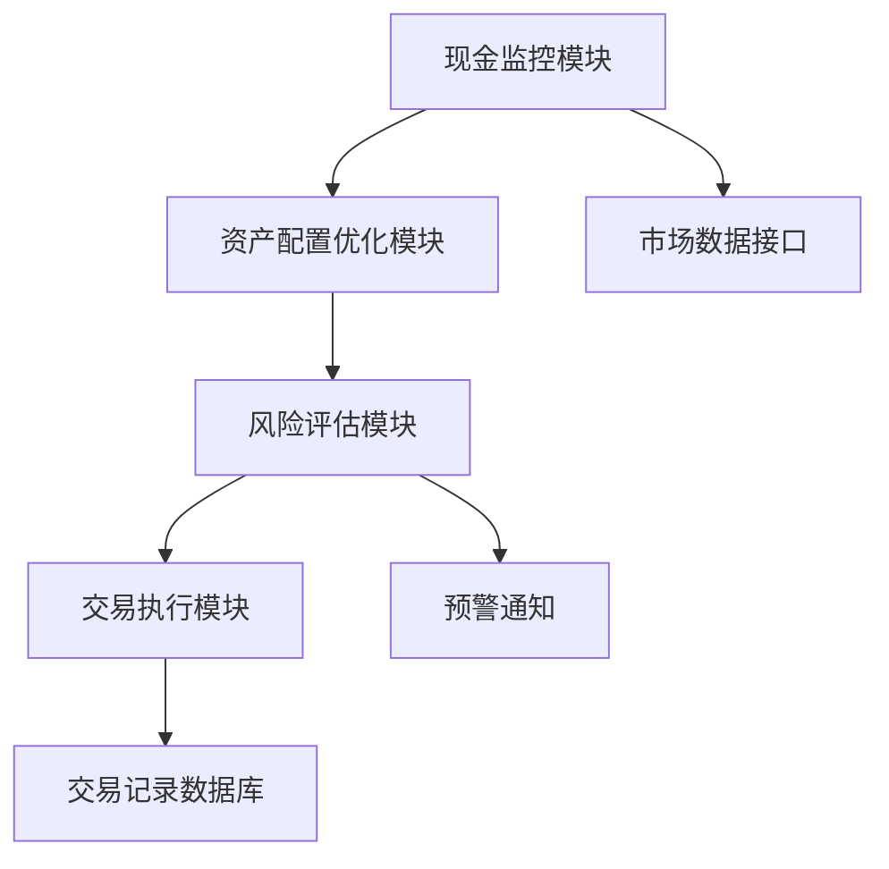

                 


# 巴菲特的现金储备策略：应对全球经济不确定性

## 关键词：巴菲特, 现金储备, 投资策略, 经济不确定性, 资产配置, 安全边际, 风险管理

## 摘要：  
巴菲特的现金储备策略是其投资哲学中的核心部分，旨在通过在经济不确定性中保持足够的流动性来维护投资组合的安全性和收益性。本文详细解析了巴菲特现金储备策略的背景、原理、数学模型、系统架构以及实际应用，探讨了其在应对全球经济波动中的有效性。

---

## 第1章 巴菲特的投资理念与现金储备的重要性

### 1.1 巴菲特的价值投资哲学  
巴菲特的价值投资哲学强调长期投资、安全边际和企业基本面分析。他主张以低于内在价值的价格买入优质资产，并长期持有。现金储备作为其投资组合的一部分，旨在在市场恐慌时抓住低估资产的投资机会。

#### 1.1.1 价值投资的核心原则  
- **长期投资**：巴菲特认为短期市场波动无法预测，长期投资才能实现财富增长。  
- **安全边际**：买入价格低于内在价值，以降低投资风险。  
- **企业基本面**：关注企业的盈利能力、竞争优势和管理团队。

#### 1.1.2 现金储备的定义与特点  
现金储备是指投资者持有的高流动性资产，包括现金、货币市场基金等，目的是在需要时能够迅速变现。其特点包括：  
- **流动性**：随时可变现。  
- **安全性**：低风险，本金损失风险极小。  
- **收益性**：虽然收益较低，但在市场机会出现时可迅速部署资金。

#### 1.1.3 现金储备在投资组合中的作用  
现金储备在投资组合中扮演着“缓冲器”的角色：  
- 在市场下跌时，可以避免被迫卖出优质资产。  
- 在市场上涨时，可以抓住低估资产的投资机会。  
- 在应对紧急资金需求时，提供流动性支持。

### 1.2 巴菲特现金储备策略的核心原则  
巴菲特的现金储备策略并非一成不变，而是根据市场环境动态调整。其核心原则包括：  
#### 1.2.1 现金储备的三大原则  
1. **保持流动性**：确保在市场恐慌时能够迅速行动。  
2. **注重安全边际**：在市场估值过高时增加现金储备。  
3. **灵活调整**：根据经济周期和市场环境动态调整现金持有比例。

#### 1.2.2 现金储备的动态调整机制  
巴菲特的现金储备并非固定比例，而是根据市场环境和企业基本面进行动态调整。例如：  
- **经济繁荣期**：减少现金储备，增加对优质企业的投资。  
- **经济衰退期**：增加现金储备，等待市场底部出现投资机会。

#### 1.2.3 现金储备与市场周期的关系  
现金储备在不同市场周期中的表现：  
- **牛市**：现金储备的机会成本较高，巴菲特倾向于减少现金持有。  
- **熊市**：现金储备的价值相对稳定，巴菲特倾向于增加现金持有，等待投资机会。

### 1.3 巴菲特现金储备策略的实践案例  
#### 1.3.1 巴菲特在经济危机中的现金储备策略  
2008年金融危机期间，巴菲特大幅增加现金储备，等待市场底部出现。他通过持有现金，避免了被迫卖出优质资产，并在市场底部投资于伯克希尔 Hathaway和其他优质企业。

#### 1.3.2 巴菲特在经济复苏期的现金储备调整  
经济复苏期间，巴菲特逐渐减少现金储备，增加对高收益资产的投资。例如，他在2009年投资于高盛和通用电气等企业。

#### 1.3.3 巴菲特在经济繁荣期的现金储备管理  
在经济繁荣期，巴菲特倾向于将现金储备投资于优质企业，以实现更高的收益。例如，他在2010年代投资于苹果公司，并取得了丰厚的回报。

---

## 第2章 现金储备策略的数学模型与分析

### 2.1 现金储备策略的数学模型  
#### 2.1.1 现金储备的持有成本模型  
现金储备的持有成本包括机会成本和管理成本。机会成本是指将资金用于其他高收益资产时的潜在收益损失，管理成本是指现金管理的相关费用。  
公式：  
$$ \text{持有成本} = \text{机会成本} + \text{管理成本} $$

#### 2.1.2 现金储备的流动性溢价模型  
流动性溢价是指因资产流动性高而产生的额外收益。现金储备作为流动性最高的资产，其流动性溢价较低，甚至可能为负（即持有现金的机会成本）。  
公式：  
$$ \text{流动性溢价} = \text{资产流动性} - \text{预期收益} $$

#### 2.1.3 现金储备的风险收益平衡模型  
现金储备的风险收益平衡模型旨在在风险和收益之间找到最优平衡点。  
公式：  
$$ \text{风险收益比} = \frac{\text{预期收益}}{\text{风险}} $$

### 2.2 现金储备的资产配置优化  
#### 2.2.1 资产配置的马科维茨有效前沿模型  
马科维茨的有效前沿模型是一种优化资产配置的数学模型，旨在在给定风险下实现最大收益。  
公式：  
$$ \text{最优资产组合} = \argmax_{w} \left( \mu_w - \lambda \sigma_w \right) $$  
其中，\( \mu_w \) 是资产组合的预期收益，\( \sigma_w \) 是资产组合的风险，\( \lambda \) 是风险厌恶系数。

#### 2.2.2 现金储备在资产配置中的权重分配  
现金储备在资产配置中的权重取决于投资者的风险承受能力和市场环境。  
公式：  
$$ \text{现金权重} = \frac{\text{现金储备规模}}{\text{总投资规模}} $$

#### 2.2.3 现金储备与风险资产的相关性分析  
现金储备与风险资产的相关性较低，甚至为负相关。  
公式：  
$$ \text{相关性系数} = \text{Cov}(r_c, r_r) / (\sigma_c \sigma_r) $$  
其中，\( r_c \) 是现金收益，\( r_r \) 是风险资产收益，\( \sigma_c \) 和 \( \sigma_r \) 是各自的波动性。

### 2.3 现金储备的动态调整模型  
#### 2.3.1 市场周期对现金储备的影响  
市场周期对现金储备的影响可以通过市场估值指标（如市盈率、市净率）来衡量。  
公式：  
$$ \text{市场估值} = \frac{\text{市场指数}}{\text{企业盈利}} $$

#### 2.3.2 现金储备的再平衡策略  
再平衡策略是指定期调整资产配置，使现金储备比例与投资目标保持一致。  
公式：  
$$ \text{再平衡比例} = \text{目标比例} \times \frac{\text{当前总投资规模}}{\text{当前现金储备规模}} $$

#### 2.3.3 现金储备的流动性管理模型  
流动性管理模型旨在在满足流动性需求的前提下，优化现金储备规模。  
公式：  
$$ \text{最优现金储备规模} = \text{流动性需求} \times \text{安全系数} $$

---

## 第3章 现金储备策略的系统架构设计

### 3.1 系统架构概述  
现金储备管理系统的架构设计包括以下几个部分：  
- **现金监控模块**：实时监控现金储备规模和市场环境。  
- **资产配置优化模块**：根据市场环境调整现金储备比例。  
- **风险评估模块**：评估市场风险并触发预警机制。  
- **交易执行模块**：根据调整策略执行交易。

#### 3.1.1 现金储备监控模块  
现金监控模块需要实时收集市场数据，包括：  
- 市场指数（如标普500指数）。  
- 利率水平（如国债收益率）。  
- 企业盈利数据。

#### 3.1.2 资产配置优化模块  
资产配置优化模块基于马科维茨模型，优化现金储备比例。  
公式：  
$$ \text{最优现金比例} = \argmax_{w} \left( \mu_w - \lambda \sigma_w \right) $$

#### 3.1.3 风险评估模块  
风险评估模块需要分析市场风险指标，如波动率、VaR（在险价值）等。  
公式：  
$$ \text{VaR} = \text{置信水平} \times \text{标准差} $$

### 3.2 系统功能设计  
#### 3.2.1 现金监控功能  
- 实时监控现金储备规模。  
- 监控市场环境指标（如市场估值、利率水平）。  
- 生成现金储备报告。

#### 3.2.2 资产配置优化功能  
- 根据市场环境优化现金储备比例。  
- 提供资产配置建议。  
- 自动生成优化报告。

#### 3.2.3 风险评估与预警功能  
- 评估市场风险。  
- 设置预警指标（如市场估值过高或过低）。  
- 发出预警通知。

### 3.3 系统架构图  
以下是系统的架构图，使用mermaid表示：  


### 3.4 系统接口设计  
系统需要与外部数据源（如市场数据接口）和交易执行系统（如 brokerage API）对接。接口设计包括：  
- **市场数据接口**：提供实时市场数据。  
- **交易执行接口**：执行买入或卖出指令。  
- **预警通知接口**：发送预警通知。

### 3.5 系统交互流程  
以下是系统的交互流程，使用mermaid表示：  
```mermaid  
sequenceDiagram  
参与者：用户  
参与者：市场数据接口  
参与者：交易执行系统  
参与者：风险评估系统  

用户->市场数据接口：获取市场数据  
市场数据接口->用户：返回市场数据  
用户->风险评估系统：评估市场风险  
风险评估系统->用户：返回风险评估结果  
用户->交易执行系统：执行交易指令  
交易执行系统->用户：确认交易完成  
```

---

## 第4章 项目实战：现金储备管理系统实现

### 4.1 环境安装  
#### 4.1.1 系统环境  
- 操作系统：Linux/Windows/MacOS  
- 开发工具：Python、Jupyter Notebook、Git  
- 依赖库：pandas、numpy、scipy、plotly、dash

#### 4.1.2 数据源  
- 市场数据：Yahoo Finance API  
- 经济指标：美联储数据接口

### 4.2 核心代码实现  
#### 4.2.1 现金监控模块  
```python
import pandas as pd
import numpy as np

# 获取市场数据
def get_market_data(ticker):
    # 使用Yahoo Finance API获取数据
    pass

# 计算市场估值
def calculate_market_valuation(index_data):
    market_valuation = index_data / index_data['盈利']
    return market_valuation

# 监控现金储备规模
def monitor_cash_reserve(cash_reserve, total_assets):
    cash_reserve_ratio = cash_reserve / total_assets
    return cash_reserve_ratio
```

#### 4.2.2 资产配置优化模块  
```python
import scipy.optimize as optimize

# 定义优化目标函数
def objective_function(weights, expected_returns, risk_aversion):
    portfolio_return = np.dot(weights, expected_returns)
    portfolio_variance = np.dot(weights.T, np.dot(cov_matrix, weights))
    return -portfolio_return + risk_aversion * portfolio_variance

# 约束条件
def constraint(weights):
    return np.sum(weights) - 1

# 调用优化函数
def optimize_portfolio(expected_returns, cov_matrix, risk_aversion):
    bounds = [(0, 1) for _ in range(len(expected_returns))]
    result = optimize.minimize(objective_function, 
                               np.ones(len(expected_returns))/len(expected_returns), 
                               args=(expected_returns, risk_aversion),
                               bounds=bounds,
                               constraints={'type': 'eq', 'fun': constraint})
    return result.x
```

#### 4.2.3 风险评估与预警模块  
```python
import warnings
warnings.filterwarnings("ignore")

# 风险评估函数
def assess_market_risk(market_valuation, risk_threshold):
    if market_valuation > risk_threshold:
        return '市场估值过高，建议增加现金储备'
    elif market_valuation < (1/risk_threshold):
        return '市场估值过低，建议减少现金储备'
    else:
        return '市场估值合理，保持当前现金储备'

# 预警机制
def trigger_alert(message):
    print(f'警告：{message}')
```

### 4.3 案例分析与解读  
#### 4.3.1 案例背景  
假设当前市场估值为15（合理），但利率上升，巴菲特可能选择增加现金储备以应对潜在的市场波动。

#### 4.3.2 模型实现  
```python
# 示例代码
market_data = get_market_data('^GSPC')  # 标普500指数
market_valuation = calculate_market_valuation(market_data)
cash_reserve_ratio = monitor_cash_reserve(1000000, 10000000)  # 现金储备比例为10%
```

#### 4.3.3 实际应用  
通过上述代码，投资者可以实时监控市场环境，并根据模型建议动态调整现金储备比例。例如，当市场估值过高时，增加现金储备；当市场估值合理时，减少现金储备。

### 4.4 项目总结  
通过本项目，我们实现了基于巴菲特现金储备策略的管理系统，能够实时监控市场环境并优化资产配置。该系统可以在实际投资中帮助投资者降低风险并抓住市场机会。

---

## 第5章 总结与最佳实践

### 5.1 本章小结  
巴菲特的现金储备策略是一种有效的风险管理工具，能够在经济不确定性中保护投资组合的安全性。本文通过理论分析、数学建模和系统设计，详细探讨了现金储备策略的实现和应用。

### 5.2 投资者的最佳实践  
1. **动态调整现金储备比例**：根据市场环境和企业基本面动态调整现金持有比例。  
2. **关注市场估值**：在市场估值过高时增加现金储备，在市场估值过低时减少现金储备。  
3. **长期投资**：坚持巴菲特的价值投资理念，避免短期市场波动的干扰。  
4. **系统化管理**：通过系统化的方法和工具优化现金储备管理。

### 5.3 小结  
巴菲特的现金储备策略不仅是一种投资策略，更是一种风险管理的艺术。通过科学的数学模型和系统的架构设计，投资者可以在全球经济不确定性中保持投资组合的安全性和收益性。

### 5.4 注意事项  
- 投资者应根据自身的风险承受能力和投资目标调整现金储备比例。  
- 现金储备管理需要结合市场环境和企业基本面进行动态调整。  
- 系统化管理需要专业的知识和技能，建议投资者在实践中寻求专业顾问的帮助。

### 5.5 拓展阅读  
- 巴菲特的《聪明的投资者》。  
- 马科维茨的《投资学精要》。  
- 现代投资组合理论的相关文献。

---

## 结语  
巴菲特的现金储备策略为投资者提供了应对全球经济不确定性的有效工具。通过理论分析、数学建模和系统设计，投资者可以在实践中灵活运用这一策略，实现稳健的投资回报。

