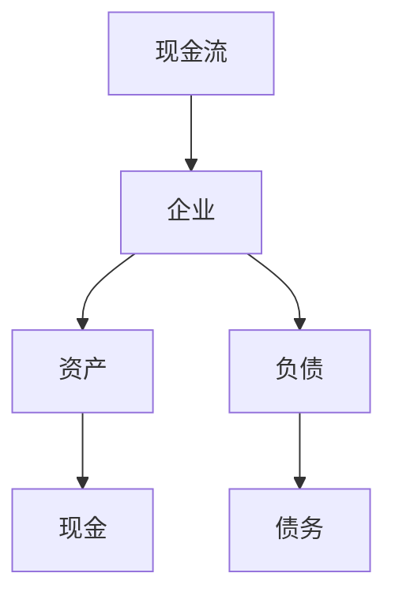
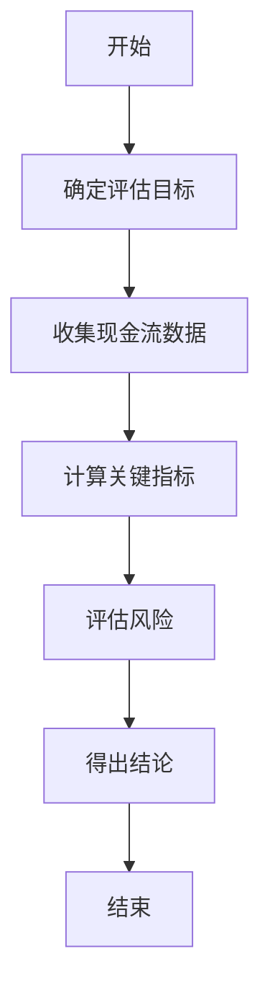
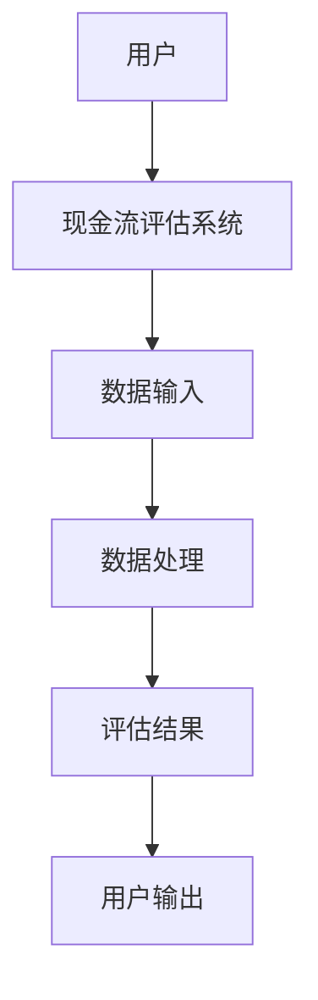
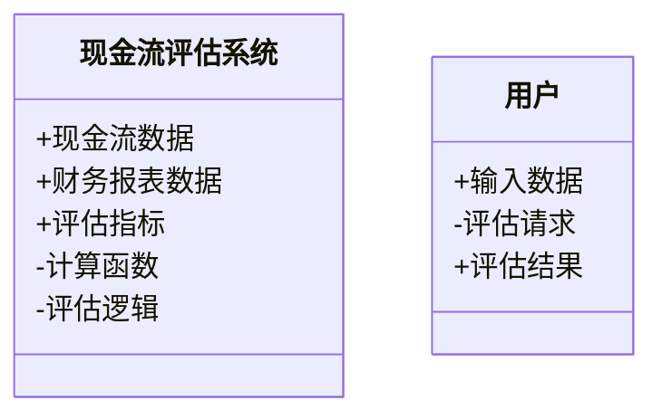
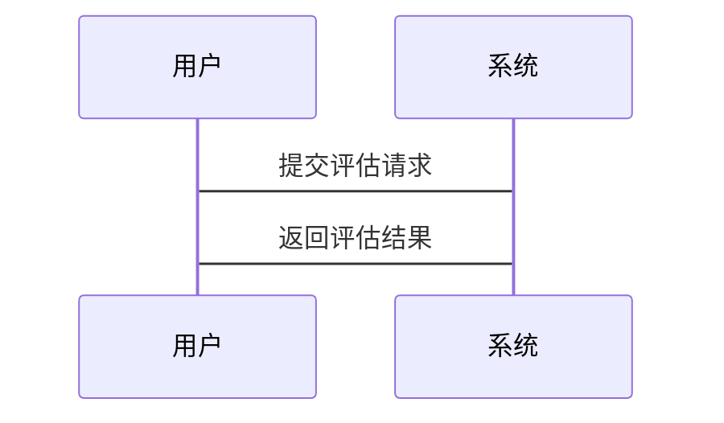

                 


# 巴菲特的现金流评估方法

> 关键词：巴菲特，现金流，投资评估，财务分析，价值投资

> 摘要：本文详细探讨了巴菲特的现金流评估方法，分析其背后的逻辑和数学模型，结合实际案例和代码实现，为读者提供深入的理解和应用指导。

---

## 第1章: 背景介绍

### 1.1 现金流的基本概念

#### 1.1.1 现金流的定义
现金流是指企业在一定时期内，由于交易活动而产生的现金流入和流出。它反映了企业的资金流动状况，是衡量企业财务健康的重要指标。

#### 1.1.2 现金流的分类
1. **经营活动现金流**：企业日常运营中产生的现金流，包括销售商品、提供服务等。
2. **投资活动现金流**：企业投资于长期资产或处置资产所产生的现金流。
3. **筹资活动现金流**：企业通过借款、发行股票等方式筹集资金所产生的现金流。

#### 1.1.3 现金流与企业价值的关系
现金流是企业价值的核心驱动因素。健康的现金流表明企业能够维持自身运营并创造价值，而现金流的持续增长则意味着企业的长期发展潜力。

### 1.2 巴菲特现金流评估方法的背景

#### 1.2.1 巴菲特的投资理念
巴菲特的价值投资理念强调企业内在价值的重要性。他认为，企业的真实价值在于其未来现金流的现值。

#### 1.2.2 现金流在巴菲特投资中的重要性
巴菲特认为，现金流是企业生存和发展的基础。他通过分析企业的现金流状况，判断其是否具备长期盈利能力。

#### 1.2.3 现金流评估方法的演变
巴菲特的现金流评估方法随着他的投资实践不断完善，逐渐形成了一套系统化的分析框架。

### 1.3 现金流评估方法的核心要素

#### 1.3.1 现金流的生成机制
现金流的生成机制包括收入来源、成本结构和资金管理等方面。了解这些机制有助于准确评估企业的现金流状况。

#### 1.3.2 现金流的时间价值
现金流的时间价值是指资金随着时间的推移而产生的价值变化。通过贴现率计算，可以将未来的现金流折算为现值。

#### 1.3.3 现金流评估的边界与外延
现金流评估的边界包括企业的业务范围和时间跨度，外延则涉及宏观经济环境和行业竞争状况。

### 1.4 现金流评估的核心概念与联系

#### 1.4.1 现金流的逻辑框架
1. 确定现金流来源和用途。
2. 计算净现金流。
3. 分析现金流的可持续性。

#### 1.4.2 现金流评估的核心指标
1. 自由现金流（FCF）：企业在扣除资本支出后的剩余现金流。
2. 现金流收益率（CFROI）：现金流与初始投资的比率。

#### 1.4.3 现金流评估的步骤与流程
1. 收集财务报表数据。
2. 计算各项现金流指标。
3. 评估现金流的稳定性和增长性。

## 第2章: 现金流评估的核心概念与联系

### 2.1 现金流评估的核心原理

#### 2.1.1 现金流的生成机制
现金流的生成机制涉及企业的收入、成本和资金管理。通过分析这些因素，可以预测企业的未来现金流。

#### 2.1.2 现金流的时间价值
现金流的时间价值通过现值计算体现。现值公式为：
$$ PV = \frac{CF}{(1 + r)^n} $$
其中，CF是现金流，r是贴现率，n是时间周期。

#### 2.1.3 现金流的风险评估
现金流的风险评估包括市场风险、流动性风险和信用风险。通过VaR（Value at Risk）模型可以量化这些风险。

### 2.2 现金流评估的核心概念对比

#### 2.2.1 现金流与利润的对比
1. **现金流**：反映企业的实际资金流动情况。
2. **利润**：反映企业的盈亏情况，不考虑资金的实际流动。

#### 2.2.2 现金流与资产的对比
1. **现金流**：体现企业的资金流动状况。
2. **资产**：体现企业的资源和财富。

#### 2.2.3 现金流与负债的对比
1. **现金流**：影响企业的偿债能力。
2. **负债**：反映企业的债务负担。

### 2.3 现金流评估的ER实体关系图


## 第3章: 现金流评估的算法原理

### 3.1 现金流评估的算法流程


### 3.2 现金流评估的Python实现
```python
def calculate_cash_flow(inflows, outflows):
    net_cash_flow = inflows - outflows
    return net_cash_flow

# 示例数据
inflows = [100, 200, 300]
outflows = [50, 100, 150]
result = calculate_cash_flow(inflows, outflows)
print(result)
```

### 3.3 现金流评估的数学模型

#### 3.3.1 现金流的现值公式
$$ PV = \frac{CF}{(1 + r)^n} $$

#### 3.3.2 内部收益率公式
$$ IRR = \sum_{t=0}^{n} \frac{CF_t}{(1 + IRR)^t} = 0 $$

## 第4章: 现金流评估的系统分析与架构设计

### 4.1 现金流评估的系统架构


### 4.2 现金流评估的领域模型


### 4.3 现金流评估的系统架构图


### 4.4 现金流评估的接口设计


## 第5章: 项目实战

### 5.1 环境安装
安装必要的Python库，如Pandas和Matplotlib。

### 5.2 代码实现
```python
import pandas as pd
import matplotlib.pyplot as plt

def calculate_cash_flow(inflows, outflows):
    net_cash_flow = inflows - outflows
    return net_cash_flow

# 示例数据
inflows = [100, 200, 300]
outflows = [50, 100, 150]
result = calculate_cash_flow(inflows, outflows)
print(result)

# 可视化
plt.plot(result)
plt.title('Net Cash Flow')
plt.xlabel('时间')
plt.ylabel('现金流')
plt.show()
```

### 5.3 案例分析
以一家制造企业为例，分析其过去五年的现金流状况，预测未来现金流趋势。

### 5.4 项目总结
总结项目实施过程中的关键点和经验教训。

## 第6章: 最佳实践与注意事项

### 6.1 最佳实践
1. 定期更新现金流数据。
2. 结合宏观经济环境进行分析。
3. 多维度验证评估结果。

### 6.2 小结
现金流评估是巴菲特投资方法的核心，准确评估现金流能够帮助投资者识别优质企业。

### 6.3 注意事项
1. 数据的准确性和完整性。
2. 模型的合理性和适用性。
3. 风险的充分识别和管理。

### 6.4 拓展阅读
推荐相关书籍和文章，帮助读者深入理解现金流评估方法。

---

通过以上内容，读者可以全面了解巴菲特的现金流评估方法，并掌握其在实际投资中的应用技巧。

