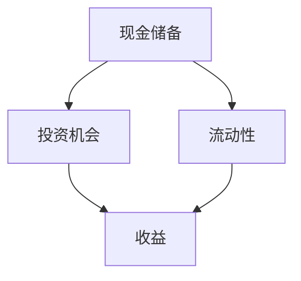
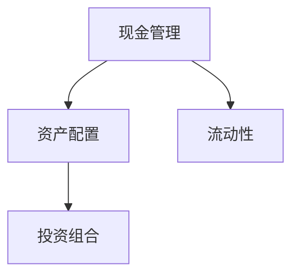
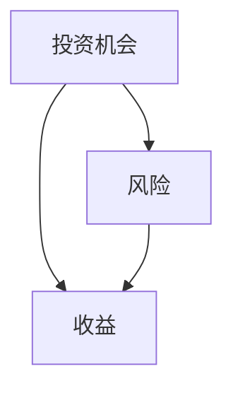
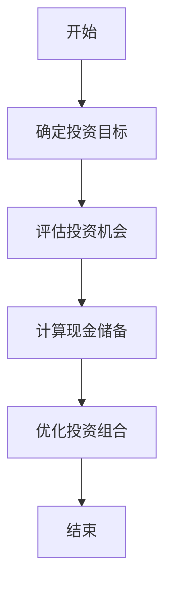
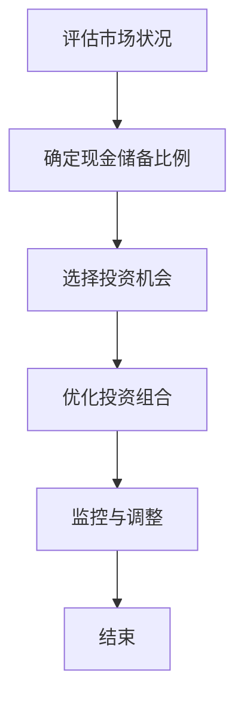
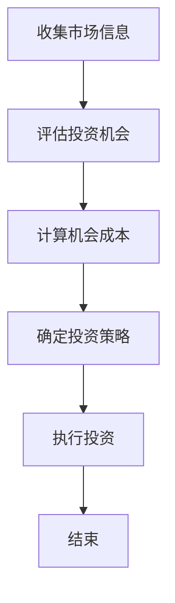
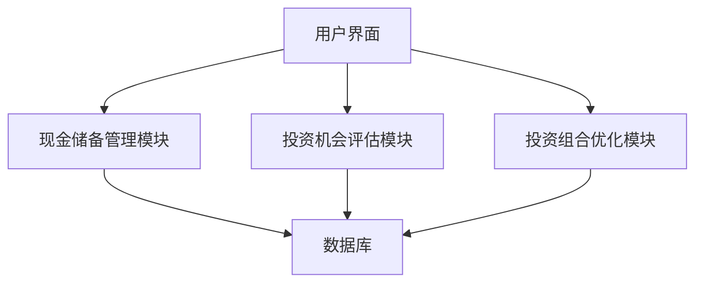

                 


# 巴菲特的现金管理哲学：保持流动性与把握机会的平衡

> 关键词：巴菲特，现金管理，流动性，投资机会，价值投资，资产配置

> 摘要：本文深入探讨了巴菲特的现金管理哲学，分析了流动性与投资机会之间的平衡关系。通过详细阐述现金管理的核心概念、算法原理、系统设计和项目实战，结合实际案例，为读者提供了全面的理解和实践指导。

---

## 第一部分：巴菲特的现金管理哲学概述

### 第1章：巴菲特投资哲学的背景与核心理念

#### 1.1 巴菲特生平与投资理念的形成

##### 1.1.1 巴菲特的早年经历与投资启蒙
- 巴菲特的童年与青少年时期
- 早期投资经历与《股王之路》的影响
- 巴菲特对投资的深刻理解

##### 1.1.2 价值投资理念的核心思想
- 价值投资的定义与内涵
- 巴菲特的价值投资三要素：安全边际、内在价值、市场先生
- 长期投资与复利效应

##### 1.1.3 巴菲特投资哲学的演变与成熟
- 从格雷厄姆到巴菲特的转变
- 巴菲特对价值投资的创新与发展
- 巴菲特哲学的现代意义

#### 1.2 现金管理在投资中的重要性

##### 1.2.1 现金管理的基本概念与定义
- 现金管理的定义
- 现金管理的目标与原则
- 现金管理在投资组合中的角色

##### 1.2.2 现金管理的核心原则与特征
- 保持流动性：现金储备的重要性
- 把握机会：投资机会的成本与风险
- 平衡之道：流动性与机会的动态平衡

##### 1.2.3 现金管理在投资组合中的作用
- 现金作为资产配置的核心要素
- 现金储备与投资风险的关联
- 现金管理对投资收益的影响

#### 1.3 巴菲特现金管理哲学的背景分析

##### 1.3.1 问题背景与问题描述
- 投资者面临的现金管理困境
- 现金储备与投资机会的矛盾
- 如何在不确定性中找到平衡点

##### 1.3.2 现金管理哲学的演进过程
- 巴菲特早期的现金管理策略
- 成熟后的现金管理哲学
- 巴菲特哲学对现代投资的影响

##### 1.3.3 现金管理与投资机会的平衡关系
- 现金储备与投资机会的关系
- 现金管理对投资决策的影响
- 现金管理哲学的实践意义

---

## 第二部分：巴菲特现金管理哲学的核心概念与联系

### 第2章：现金管理的核心概念

#### 2.1 现金管理的核心概念

##### 2.1.1 流动性与投资机会的定义与属性
- 现金流动性：定义与分类
- 投资机会：定义与分类
- 流动性与投资机会的对比分析

##### 2.1.2 现金储备与投资风险的关系
- 现金储备的作用与影响
- 投资风险的定义与分类
- 现金储备与投资风险的相互作用

##### 2.1.3 现金管理的长期与短期目标
- 现金管理的短期目标
- 现金管理的长期目标
- 长期与短期目标的平衡策略

#### 2.2 核心概念的对比分析

##### 2.2.1 流动性与收益性的对比表格
| **指标** | **流动性** | **收益性** |
|----------|------------|------------|
| 定义     | 现金的流动性是指资产迅速转化为现金的能力。 | 收益性是指资产产生收益的能力。 |
| 优缺点   | 优点：资金安全，风险低；缺点：收益有限 | 优点：可能产生更高收益；缺点：风险较高 |
| 关系     | 流动性高的资产通常收益较低，反之亦然 |

##### 2.2.2 现金储备与投资风险的对比分析
- 现金储备对投资风险的影响
- 投资风险的类型与表现
- 现金储备与风险控制的关系

##### 2.2.3 现金管理与资产配置的关系
- 现金管理在资产配置中的位置
- 资产配置的定义与类型
- 现金管理对资产配置的影响

#### 2.3 实体关系图

##### 2.3.1 现金储备与投资机会的ER实体关系图


##### 2.3.2 现金管理与资产配置的实体关系图


##### 2.3.3 投资机会与风险的实体关系图


---

## 第三部分：巴菲特现金管理哲学的算法原理

### 第3章：巴菲特价值投资模型的算法原理

#### 3.1 巴菲特价值投资模型

##### 3.1.1 价值投资模型的定义与原理
- 价值投资模型的核心原理
- 价值投资模型的输入与输出
- 模型的适用场景与限制

##### 3.1.2 现金管理在价值投资中的应用
- 现金储备在价值投资中的作用
- 投资机会的选择与现金储备的关系
- 价值投资模型中的流动性管理

##### 3.1.3 投资组合优化的算法流程
- 投资组合优化的定义与目标
- 投资组合优化的数学模型
- 巴菲特价值投资模型的优化流程

#### 3.2 现金管理的数学模型与公式

##### 3.2.1 现金储备的计算公式
$$ \text{现金储备} = \text{资产总额} \times \text{流动性比例} $$

##### 3.2.2 投资机会成本的计算公式
$$ \text{机会成本} = \text{投资收益} - \text{现金收益} $$

##### 3.2.3 现金与资产配置的平衡公式
$$ \text{资产配置} = \text{现金储备} + \text{其他资产} $$

#### 3.3 算法流程图

##### 3.3.1 巴菲特价值投资模型的mermaid流程图


##### 3.3.2 现金管理决策流程的mermaid图


##### 3.3.3 投资机会评估流程的mermaid图


---

## 第四部分：系统分析与架构设计

### 第4章：现金管理系统的功能设计

#### 4.1 现金管理系统的功能模块划分

##### 4.1.1 现金储备管理模块
- 现金储备的监控与管理
- 现金储备的优化策略
- 现金储备的风险控制

##### 4.1.2 投资机会评估模块
- 投资机会的筛选与评估
- 投资机会的成本分析
- 投资机会的优先级排序

##### 4.1.3 投资组合优化模块
- 投资组合的构建与优化
- 资产配置的动态调整
- 投资组合的绩效评估

#### 4.2 系统架构设计

##### 4.2.1 系统架构的mermaid图


##### 4.2.2 系统模块之间的交互关系
- 用户与系统模块的交互流程
- 系统模块之间的数据流
- 系统模块的协同工作

#### 4.3 系统交互设计

##### 4.3.1 现金管理系统的交互流程
- 用户登录与退出
- 现金储备的查询与调整
- 投资机会的提交与评估

##### 4.3.2 投资机会评估的交互流程
- 投资机会的提交
- 系统评估与反馈
- 用户确认与调整

##### 4.3.3 系统功能的交互设计
- 功能模块的交互流程
- 数据输入与输出的交互设计
- 用户界面的交互设计

---

## 第五部分：项目实战与案例分析

### 第5章：项目实战与案例分析

#### 5.1 项目环境安装与配置

##### 5.1.1 系统环境要求
- 操作系统要求
- 开发工具安装
- 数据库配置

##### 5.1.2 工具安装与配置
- Python环境的安装与配置
- 第三方库的安装（如numpy、pandas等）
- 开发工具的配置

##### 5.1.3 数据源获取与准备
- 数据来源与获取方式
- 数据清洗与预处理
- 数据存储与管理

#### 5.2 系统核心实现

##### 5.2.1 现金储备管理模块的实现
- 现金储备的计算与监控
- 现金储备的优化策略
- 现金储备的风险控制

##### 5.2.2 投资机会评估模块的实现
- 投资机会的筛选与评估
- 投资机会的成本分析
- 投资机会的优先级排序

##### 5.2.3 系统功能的实现代码
```python
import numpy as np
import pandas as pd

def calculate_cash_reserve(asset_total, liquidity_ratio):
    return asset_total * liquidity_ratio

def assess_investment_opportunity(cash_reserve, investment_cost):
    return cash_reserve >= investment_cost

def optimize_portfolio(cash_reserve, other_assets):
    total_assets = cash_reserve + other_assets
    return total_assets
```

#### 5.3 代码应用解读与分析

##### 5.3.1 现金储备管理模块的代码解读
- 现金储备计算函数的实现
- 现金储备监控与管理的逻辑
- 现金储备风险控制的实现

##### 5.3.2 投资机会评估模块的代码解读
- 投资机会筛选与评估的逻辑
- 投资机会成本分析的实现
- 投资机会优先级排序的代码

##### 5.3.3 系统功能的代码解读
- 系统功能模块的交互逻辑
- 数据输入与输出的处理
- 系统功能的实现细节

#### 5.4 项目小结

##### 5.4.1 项目实现的关键点
- 现金储备管理的核心逻辑
- 投资机会评估的关键步骤
- 系统功能实现的难点与解决方案

##### 5.4.2 项目总结与经验分享
- 项目实施过程中的经验与教训
- 对未来工作的启示
- 对读者的实践建议

---

## 第六部分：总结与展望

### 第6章：总结与展望

#### 6.1 最佳实践 tips
- 现金管理的核心原则
- 投资机会的选择策略
- 系统设计的优化建议

#### 6.2 小结
- 本文的主要内容回顾
- 巴菲特现金管理哲学的核心思想
- 现金管理与投资机会的平衡策略

#### 6.3 注意事项
- 现金管理中的风险控制
- 投资机会评估中的常见误区
- 系统设计中的注意事项

#### 6.4 拓展阅读
- 推荐的书籍与文章
- 相关领域的研究进展
- 未来的研究方向与实践机会

---

通过以上详细的目录大纲和内容安排，读者可以系统地理解巴菲特的现金管理哲学，掌握流动性与投资机会的平衡策略，并能够在实际投资中灵活运用这些知识。

