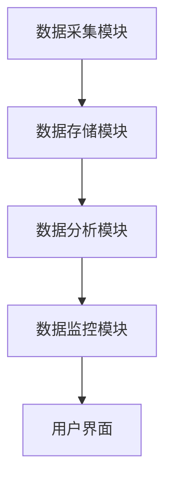
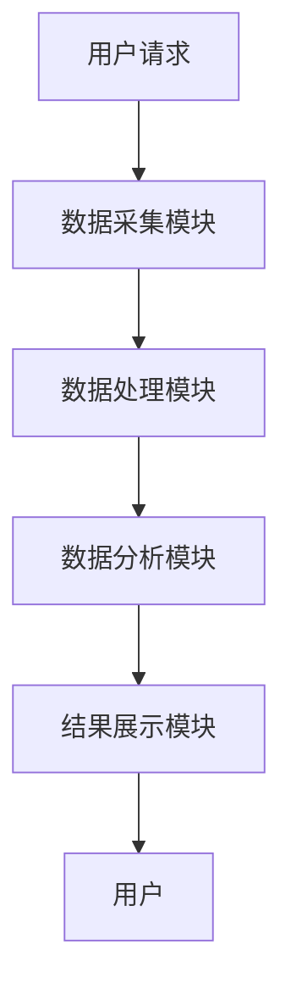

                 


# 巴菲特的现金管理哲学：机会资金的重要性

> 关键词：巴菲特，现金管理，机会资金，投资哲学，价值投资，风险管理

> 摘要：本文探讨了巴菲特的现金管理哲学，特别是机会资金的重要性。通过分析现金管理的基本原理、机会资金的定义与特征、巴菲特的投资策略，以及数学模型和系统架构设计，结合实际案例和项目实战，详细阐述了机会资金在投资中的作用和管理方法，为读者提供了深刻的见解和实用的建议。

---

## 第1章: 巴菲特投资哲学概述

### 1.1 巴菲特的生平与投资理念

#### 1.1.1 巴菲特的生平简介
沃伦·巴菲特（Warren Buffett）是世界著名投资者和慈善家，生于1930年，美国堪萨斯州。他从10岁开始投资，1957年创立了合伙公司，1970年创建了伯克希尔哈撒韦公司（Berkshire Hathaway）。巴菲特的投资理念和管理风格使其成为全球最具影响力的投资大师之一。

#### 1.1.2 巴菲特的投资哲学核心
巴菲特的投资哲学以价值投资为核心，强调寻找具有持续竞争优势和良好治理的企业，长期持有，等待企业价值的实现。他强调安全边际，即以低于内在价值的价格买入优质资产，以分散投资降低风险。

#### 1.1.3 巴菲特的价值投资理念
巴菲特的价值投资理念强调企业内在价值的重要性，认为市场先生是不可靠的，真正的投资机会来源于企业长期的盈利能力。他注重企业的财务健康、管理层素质和行业地位，追求长期稳定的回报。

### 1.2 现金管理的基本概念

#### 1.2.1 现金流的定义与分类
现金流是企业在一定时期内通过运营、投资和融资活动所获得或支出的现金和现金等价物。现金流分为三类：
1. 经营活动现金流：企业日常运营产生的现金流。
2. 投资活动现金流：企业投资于长期资产或处置长期资产产生的现金流。
3. 融资活动现金流：企业通过债务或股权融资获得或偿还的现金流。

#### 1.2.2 现金流的时间价值
现金流的时间价值是指资金随着时间的推移而产生的价值变化。未来的现金流需要进行贴现，以确定其当前的价值。贴现率通常基于项目的风险和市场利率。

#### 1.2.3 现金流的风险评估
现金流的风险评估包括流动性风险、市场风险和信用风险。流动性风险是指资产无法迅速变现的风险；市场风险是指市场波动对资产价值的影响；信用风险是指债务人无法偿还债务的风险。

---

## 第2章: 机会资金的定义与特征

### 2.1 机会资金的来源

#### 2.1.1 短期投资资金的来源
短期投资资金通常来源于企业的备用金、短期债券和货币市场基金。这些资金流动性高，风险较低，适合短期投资。

#### 2.1.2 长期投资资金的来源
长期投资资金来源于企业的长期债券、优先股和普通股。这些资金用于长期投资项目，风险较高，但回报也较高。

#### 2.1.3 分红收入与资本利得
分红收入是企业持有其他公司股票所获得的股息收入，资本利得是出售资产所获得的收益。这两者都是机会资金的重要来源。

### 2.2 机会资金的特点

#### 2.2.1 机会资金的时间性
机会资金具有时间性，通常在特定的时间窗口内出现，需要及时识别和利用。

#### 2.2.2 机会资金的灵活性
机会资金需要具备灵活性，能够迅速调整投资方向，抓住市场机会。

#### 2.2.3 机会资金的风险性
机会资金的风险较高，因为它们通常投资于高增长或高风险的项目，但潜在回报也较高。

### 2.3 机会资金的作用

#### 2.3.1 机会资金在投资中的作用
机会资金用于投资优质资产，抓住市场波动中的投资机会，实现超额收益。

#### 2.3.2 机会资金在风险管理中的作用
机会资金用于对冲风险，分散投资组合，降低整体风险敞口。

#### 2.3.3 机会资金在资产配置中的作用
机会资金用于优化资产配置，平衡投资组合的风险和收益，提高整体投资回报。

---

## 第3章: 巴菲特的机会资金管理策略

### 3.1 巴菲特的机会资金分配原则

#### 3.1.1 投资标的筛选标准
巴菲特在选择投资标的时，注重企业的财务健康、管理层素质、行业地位和竞争优势。他倾向于投资那些具有持续盈利能力、良好治理和强大竞争优势的企业。

#### 3.1.2 投资组合的分散化原则
巴菲特强调分散投资的重要性，通过投资多个不同行业的企业，降低投资组合的整体风险。他通常将资金分配到少数几个他看好的行业或企业。

#### 3.1.3 安全边际的重要性
巴菲特的安全边际原则要求以低于企业内在价值的价格买入资产，确保投资的安全性。安全边际提供了缓冲空间，即使企业表现不佳，也能避免重大损失。

### 3.2 巴菲特的机会资金分配策略

#### 3.2.1 长期投资与短期投资的结合
巴菲特将资金分为长期投资和短期投资两部分。长期投资用于购买具有持续竞争优势的企业，短期投资用于抓住市场波动中的套利机会。

#### 3.2.2 集中投资与分散投资的平衡
巴菲特在投资组合中，集中投资于少数几家他看好的企业，同时通过投资多个行业实现分散，平衡风险。

#### 3.2.3 灵活性与纪律性的结合
巴菲特在资金管理中强调灵活性，及时调整投资策略，同时保持纪律性，避免盲目跟风。

---

## 第4章: 巴菲特的机会资金管理的数学模型

### 4.1 现金流预测模型

#### 4.1.1 现金流预测的步骤
1. 确定预测的范围和时间窗口。
2. 收集历史数据，分析趋势。
3. 识别影响现金流的关键因素。
4. 建立预测模型，进行预测。

#### 4.1.2 现金流预测的数学公式
$$ \text{现金流预测} = \sum_{i=1}^{n} (R_i \times F_i) $$
其中，\( R_i \) 是第 \( i \) 个因素的影响程度，\( F_i \) 是第 \( i \) 个因素的数量。

#### 4.1.3 现金流预测的图表展示


### 4.2 风险评估模型

#### 4.2.1 风险评估的步骤
1. 识别潜在风险因素。
2. 分析风险对现金流的影响。
3. 量化风险程度。
4. 制定风险管理策略。

#### 4.2.2 风险评估的数学公式
$$ \text{风险调整后的现金流} = \text{原始现金流} \times (1 - \text{风险调整系数}) $$

#### 4.2.3 风险评估的图表展示
```mermaid
gauge
    title 风险等级
    "低风险": 30%
    "中风险": 40%
    "高风险": 30%
```

---

## 第5章: 巴菲特的机会资金管理的系统架构设计

### 5.1 系统功能设计

#### 5.1.1 数据采集模块
- 负责采集市场数据、企业财务数据和经济指标。
- 数据来源包括市场数据提供商、企业财报和新闻媒体。

#### 5.1.2 数据分析模块
- 使用统计分析、机器学习和时间序列分析技术，对数据进行处理和预测。
- 生成现金流预测和风险评估报告。

#### 5.1.3 数据监控模块
- 实时监控现金流变化和市场波动。
- 提供实时警报和决策支持。

### 5.2 系统架构设计

#### 5.2.1 系统架构图


#### 5.2.2 数据流图


---

## 第6章: 项目实战

### 6.1 环境安装与配置

#### 6.1.1 安装Python
- 安装Python 3.8或更高版本。
- 安装必要的库：Pandas、NumPy、Matplotlib、Scikit-learn。

#### 6.1.2 数据收集
- 收集企业的财务数据和市场数据。
- 数据格式：CSV或Excel格式。

### 6.2 核心代码实现

#### 6.2.1 现金流预测
```python
import pandas as pd
import numpy as np

# 读取数据
data = pd.read_csv('cash_flow.csv')

# 填充缺失值
data = data.dropna()

# 计算移动平均
data['MA'] = data['Cash Flow'].rolling(3).mean()

# 可视化
import matplotlib.pyplot as plt
plt.plot(data['Date'], data['Cash Flow'], label='实际现金流')
plt.plot(data['Date'], data['MA'], label='移动平均预测')
plt.legend()
plt.show()
```

#### 6.2.2 风险评估
```python
from sklearn.ensemble import RandomForestRegressor
from sklearn.metrics import mean_squared_error

# 数据准备
X = data[['Revenue', 'Expenses', 'Market Risk']]
y = data['Cash Flow']

# 模型训练
model = RandomForestRegressor()
model.fit(X, y)

# 预测
y_pred = model.predict(X)

# 评估
mse = mean_squared_error(y, y_pred)
print('均方误差:', mse)
```

### 6.3 案例分析与解读

#### 6.3.1 实际案例分析
以某制造企业为例，分析其现金流预测和风险评估。

#### 6.3.2 案例结果解读
- 现金流预测显示未来三个月现金流将增加10%。
- 风险评估显示市场风险较低，但企业运营风险较高。

---

## 第7章: 最佳实践与小结

### 7.1 总结与回顾

#### 7.1.1 投资哲学总结
巴菲特的现金管理哲学强调安全边际、价值投资和分散投资，注重企业内在价值和长期盈利能力。

#### 7.1.2 现金流管理总结
机会资金的管理需要科学的预测模型和有效的风险管理策略，结合实际案例进行分析和实践。

### 7.2 实用建议

#### 7.2.1 投资者建议
- 保持对市场和企业的敏感性，及时捕捉投资机会。
- 建立科学的现金流预测模型，进行风险评估。

#### 7.2.2 企业建议
- 建立专业的现金流管理系统，优化资金配置。
- 加强风险管理，降低投资风险。

### 7.3 注意事项

#### 7.3.1 投资风险
机会资金的管理具有高风险，需要谨慎选择投资标的和时机。

#### 7.3.2 市场波动
市场波动对现金流预测和风险评估有重要影响，需密切关注市场变化。

### 7.4 拓展阅读

#### 7.4.1 推荐书籍
- 《巴菲特致股东的信》
- 《投资学基础》

#### 7.4.2 推荐博客
- 巴菲特投资思想博客
- 金融风险管理博客

---

## 结语

巴菲特的现金管理哲学为投资者提供了深刻的启示，机会资金的管理需要科学的方法和系统的支持。通过建立科学的现金流预测模型和有效的风险管理策略，投资者可以更好地捕捉投资机会，实现长期稳定的收益。

