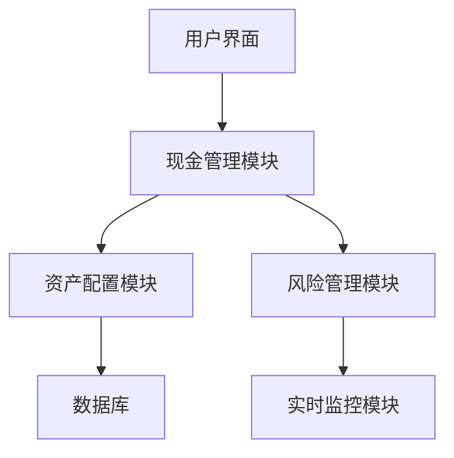
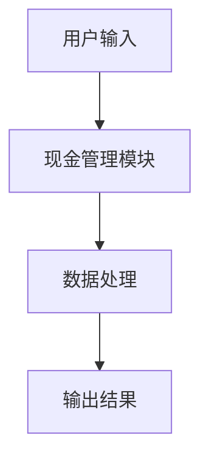

                 


# 巴菲特的现金管理：在负利率时代的新策略

---

## 关键词：
1. 巴菲特
2. 现金管理
3. 负利率
4. 投资策略
5. 资产配置
6. 安全边际

---

## 摘要：
本文深入分析了负利率时代下，巴菲特的现金管理策略及其在投资中的重要性。通过探讨巴菲特的核心理念、现金管理的多维度策略、数学模型与公式、系统架构设计以及实际案例分析，本文为读者提供了在负利率环境下如何有效管理现金和优化资产配置的深度见解。文章结合理论与实践，为投资者提供了实用的策略和工具。

---

# 第一部分: 负利率时代的背景分析

## 第1章: 负利率时代的定义与现状

### 1.1 负利率的定义与成因

#### 1.1.1 利率的基本概念
利率是资金的时间价值的体现，是借款者支付给贷款者的报酬。在经济学中，利率可以分为短期利率和长期利率，其中短期利率通常由中央银行设定，而长期利率则由市场供需决定。

在负利率环境下，中央银行通过降低基准利率，甚至设定负利率，鼓励银行向央行存钱，从而增加市场流动性，刺激经济增长。这种政策通常在经济低迷或通货紧缩时期实施。

#### 1.1.2 负利率的形成机制
负利率的形成机制主要涉及中央银行的货币政策。当经济面临衰退或通货紧缩压力时，中央银行可能会降低基准利率，甚至将其设为负数。这意味着商业银行将钱存入央行账户需要支付费用，从而迫使银行将资金投入市场，以避免成本。

#### 1.1.3 全球负利率时代的现状
近年来，全球多个主要经济体，如日本、欧洲部分国家，都实施了负利率政策。这些政策的目的是为了刺激经济增长，防止通货紧缩，并鼓励企业和个人借贷投资。

---

### 1.2 负利率对个人与企业的影响

#### 1.2.1 负利率对个人理财的影响
在负利率环境下，个人储蓄的收益可能低于通胀率，导致实际购买力下降。此外，负利率可能鼓励个人增加消费和投资，但由于缺乏高收益投资渠道，个人可能面临资产配置的挑战。

#### 1.2.2 负利率对企业财务管理的影响
对企业而言，负利率降低了融资成本，但也可能导致企业过度依赖债务融资，增加财务风险。同时，负利率可能影响企业的利润预期，因为低利率环境通常伴随着较低的债券收益率。

---

### 1.3 巴菲特的现金管理理念

#### 1.3.1 巴菲特投资哲学的核心要素
巴菲特的投资哲学以价值投资为核心，强调长期投资、分散投资和安全边际。他认为，投资的本质是寻找具有持续竞争优势的企业，并以合理的价格买入。

#### 1.3.2 巴菲特的长期投资策略
巴菲特强调长期投资，避免频繁交易。他认为，市场短期波动不可预测，但长期趋势可以通过对企业基本面的深入分析来把握。

#### 1.3.3 巴菲特对安全边际的重视
安全边际是指投资价格低于企业内在价值的部分。巴菲特认为，安全边际是投资成功的关键，它能够降低投资风险，并在市场波动中提供保护。

---

# 第二部分: 现金管理的核心策略

## 第4章: 现金管理的多维度策略

### 4.1 现金管理的基本原则

#### 4.1.1 现金储备的重要性
现金储备是应对突发事件和市场波动的关键。在负利率环境下，虽然现金收益率可能较低，但其流动性高，能够在市场机会出现时迅速投资。

#### 4.1.2 现金流动性管理的技巧
流动性管理需要平衡短期需求和长期投资机会。巴菲特建议保持一定的现金储备，以应对市场恐慌和投资机会。

#### 4.1.3 现金投资的风险控制
在负利率环境下，现金投资需要分散风险，避免过度集中于某一种资产或行业。同时，投资者需要关注通胀风险，选择能够保值或增值的资产。

---

### 4.2 资产配置的优化策略

#### 4.2.1 资产配置的理论基础
资产配置是根据投资者的风险承受能力、投资目标和市场环境，将资金分配到不同资产类别中的过程。在负利率环境下，资产配置需要更加灵活，以应对市场的不确定性。

#### 4.2.2 巴菲特的资产配置模型
巴菲特的资产配置模型以价值投资为核心，强调长期持有优质资产。他认为，资产配置的关键是选择具有持续竞争优势的企业，并在市场恐慌时增加投资。

#### 4.2.3 不同经济周期下的资产配置调整
在经济复苏期，巴菲特倾向于增加股票和房地产投资；在经济衰退期，他倾向于增加现金储备，并寻找被低估的资产。

---

## 第5章: 现金管理的数学模型与公式

### 5.1 现金管理的数学模型

#### 5.1.1 现金需求预测模型
现金需求预测模型用于估算企业在不同情境下的现金需求。公式如下：

$$
\text{现金需求} = \text{经营现金流} - \text{资本支出} - \text{债务偿还}
$$

#### 5.1.2 投资组合优化模型
投资组合优化模型用于在不同资产之间分配资金，以实现收益最大化和风险最小化。公式如下：

$$
\min \sigma^2(w) \quad \text{subject to} \quad \mu^T w = \text{目标收益}
$$

其中，$w$ 是资产权重向量，$\mu$ 是资产收益向量，$\sigma^2$ 是收益的方差。

---

### 5.2 现金管理的公式解析

#### 5.2.1 净现值公式
净现值（NPV）用于评估投资项目的价值。公式如下：

$$
\text{NPV} = \sum_{t=1}^{n} \frac{\text{现金流}_t}{(1 + r)^t} - \text{初始投资}
$$

其中，$r$ 是贴现率。

#### 5.2.2 内部收益率公式
内部收益率（IRR）是使净现值为零的贴现率。公式如下：

$$
\text{NPV} = \sum_{t=1}^{n} \frac{\text{现金流}_t}{(1 + \text{IRR})^t} = 0
$$

---

## 第6章: 现金管理的系统架构设计

### 6.1 现金管理系统的需求分析

#### 6.1.1 系统目标与范围
现金管理系统的目标是帮助投资者实现现金储备、资产配置和风险管理的自动化。系统范围包括现金流入流出管理、资产配置优化和风险管理模块。

#### 6.1.2 用户需求分析
用户包括个人投资者和机构投资者。个人投资者需要简单易用的界面，而机构投资者需要复杂的数据分析功能。

#### 6.1.3 功能需求分析
系统需要具备现金流量预测、资产配置优化、风险评估和实时监控功能。

---

### 6.2 现金管理系统的架构设计

#### 6.2.1 系统架构图


#### 6.2.2 数据流图


---

## 第7章: 现金管理的实战案例分析

### 7.1 巴菲特的现金管理实践

#### 7.1.1 巴菲特的现金储备策略
巴菲特通常保持约10%至15%的现金储备，以应对市场波动和投资机会。

#### 7.1.2 巴菲特的资产配置案例
在伯克希尔哈撒韦的投资组合中，巴菲特倾向于投资于具有强大竞争优势的企业，如苹果、可口可乐和比亚迪。

#### 7.1.3 巴菲特的风险管理经验
巴菲特强调分散投资和避免过度杠杆。他通过长期持有优质资产，降低市场波动带来的风险。

---

# 第三部分: 负利率时代的现金管理趋势

## 第8章: 负利率时代的现金管理新策略

### 8.1 新策略的核心要素
在负利率环境下，现金管理需要更加灵活。投资者需要关注通胀风险，并寻找能够保值或增值的资产。

### 8.2 数字化与智能化的现金管理工具
随着科技的发展，数字化和智能化的现金管理工具将成为主流。投资者可以通过人工智能和大数据分析，优化资产配置和风险管理。

---

## 第9章: 未来现金管理的趋势与挑战

### 9.1 未来现金管理的趋势
未来，现金管理将更加依赖技术手段，如区块链和人工智能，以实现更高效的资产配置和风险控制。

### 9.2 现金管理的挑战
在负利率环境下，投资者需要应对通胀风险和市场波动的双重挑战。此外，政策变化和全球经济不确定性也增加了现金管理的复杂性。

---

## 结语

在负利率时代，巴菲特的现金管理策略为我们提供了宝贵的启示。通过灵活的资产配置、安全边际的重视和长期投资的理念，投资者可以在复杂多变的市场中实现稳健的收益。未来，随着技术的进步和市场的变化，现金管理将继续演变，但其核心仍然是对风险的控制和对机会的把握。

---

# 附录

## 附录A: 现金管理的数学模型代码

```python
def calculate_npv(cash_flows, discount_rate):
    npv = 0
    for t, cash_flow in enumerate(cash_flows):
        npv += cash_flow / (1 + discount_rate)**t
    return npv

cash_flows = [100, 200, 300]
discount_rate = 0.05
print(calculate_npv(cash_flows, discount_rate))
```

---

## 附录B: 现金管理系统的架构代码

```python
class CashManagementSystem:
    def __init__(self):
        self.cash_reserve = 100000
        self.asset_allocation = {}
        self.risk_assessment = {}

    def update_cash_reserve(self, new_reserve):
        self.cash_reserve = new_reserve

    def update_asset_allocation(self, asset, weight):
        self.asset_allocation[asset] = weight

    def assess_risk(self):
        self.risk_assessment = {
            'market_risk': 'low',
            'credit_risk': 'medium'
        }

system = CashManagementSystem()
system.update_cash_reserve(150000)
system.update_asset_allocation('stocks', 0.6)
system.assess_risk()
print(system.risk_assessment)
```

---

## 附录C: 现金管理的案例分析代码

```python
def calculate_irr(cash_flows):
    import numpy as np
    return np.irr(cash_flows)

cash_flows = [-1000, 500, 600, 300]
print(calculate_irr(cash_flows))
```

---

通过以上分析和实践，我们可以看到，巴菲特的现金管理策略在负利率时代依然具有重要的指导意义。投资者需要结合市场环境和自身需求，灵活调整现金管理策略，以实现长期稳健的投资收益。

