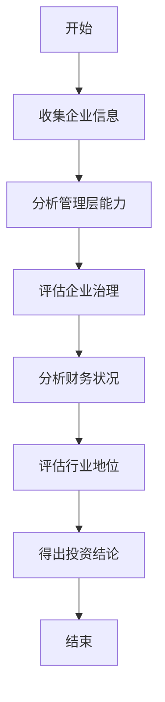
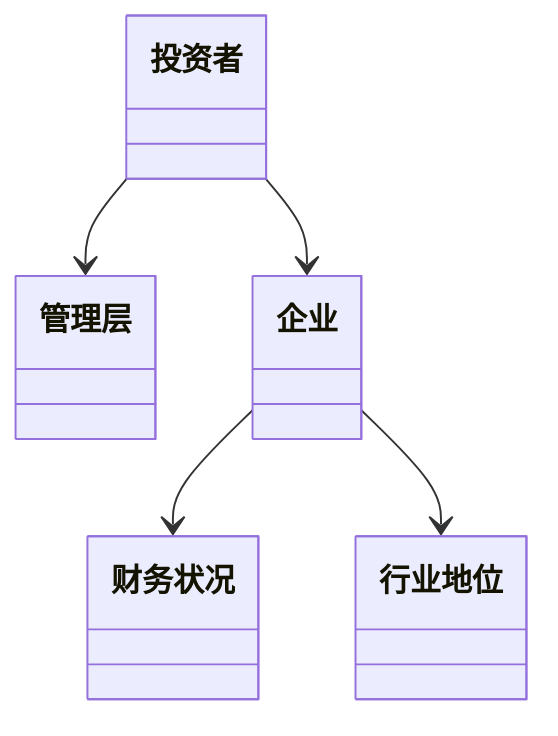

                 


# 巴菲特的看人下注投资理念

## 关键词：巴菲特，投资理念，看人下注，管理层分析，企业治理

## 摘要：  
巴菲特的“看人下注”投资理念是一种以分析企业管理层的能力和企业治理结构为核心的投资方法。本文将从背景、核心概念、算法原理、数学模型、系统架构设计、项目实战等方面详细解读这一投资理念，帮助读者理解其本质和应用场景。

---

## 第一部分: 巴菲特的看人下注投资理念概述

### 第1章: 巴菲特投资理念的背景与核心概念

#### 1.1 巴菲特投资理念的背景

##### 1.1.1 投资领域的传统问题与挑战

在传统投资领域，投资者通常依赖于市场趋势、技术分析或基本面分析来做出决策。然而，这些方法往往忽略了企业的内在价值和长期发展潜力，尤其是在管理层的能力和企业治理结构方面存在较大盲区。

##### 1.1.2 巴菲特投资理念的起源与发展

巴菲特的投资理念起源于他对价值投资的深刻理解。他认为，企业的内在价值是决定股票长期表现的关键因素，而企业的内在价值又取决于管理层的能力、企业治理结构和财务健康状况。

##### 1.1.3 "看人下注"投资理念的核心思想

"看人下注"投资理念的核心思想是，投资不仅仅关注企业的财务数据，更关注企业管理层的能力和诚信。巴菲特认为，一个优秀的管理层能够带领企业不断创造价值，而一个低效或不诚信的管理层可能会导致企业价值的流失。

#### 1.2 "看人下注"投资理念的定义与特点

##### 1.2.1 投资理念的定义

"看人下注"投资理念是一种以分析企业管理层能力和企业治理结构为核心的投资方法。通过评估管理层的能力、诚信和企业治理的健康性，巴菲特能够识别出具有长期价值创造潜力的企业。

##### 1.2.2 核心概念的属性特征对比表格

| 属性 | 描述 |
|------|------|
| 管理层分析 | 分析管理层的能力、诚信和决策能力 |
| 企业治理 | 评估公司治理结构的健康性，包括董事会结构、股权分配等 |
| 财务健康 | 关注企业的财务状况，包括盈利能力、负债水平等 |
| 行业地位 | 评估企业在行业中的竞争地位和竞争优势 |

##### 1.2.3 ER实体关系图（使用 Mermaid）

```mermaid
er
actor 投资者
actor 管理层
actor 企业
actor 财务状况
actor 行业地位
```

---

### 第2章: "看人下注"投资理念的核心要素

#### 2.1 管理层分析

##### 2.1.1 管理层能力评估

巴菲特认为，优秀的管理层应该具备以下特征：  
1. **专注主业**：管理层专注于企业的核心业务，避免盲目扩张。  
2. **长期思维**：管理层关注企业的长期发展，而非短期收益。  
3. **诚实可靠**：管理层诚实守信，避免财务造假或其他不正当行为。

##### 2.1.2 管理层诚信评估

诚信是巴菲特评估管理层的另一重要标准。他认为，一个不诚实的管理层可能会通过财务造假或其他手段欺骗投资者，从而导致投资失败。

#### 2.2 企业治理结构

##### 2.2.1 公司治理的健康性

巴菲特认为，健康的公司治理结构能够确保管理层的利益与股东的利益保持一致。例如，股权激励机制可以有效绑定管理层与股东的利益。

##### 2.2.2 股权结构分析

股权结构是企业治理的重要组成部分。巴菲特倾向于投资那些股权结构合理、大股东持股比例适中、董事会结构健康的公司。

#### 2.3 财务健康状况

##### 2.3.1 财务报表分析

巴菲特通过分析企业的财务报表，评估企业的盈利能力、资产负债情况和现金流状况。例如，他关注企业的ROE（净资产收益率）和ROA（资产回报率）等指标。

##### 2.3.2 财务健康评估标准

巴菲特认为，健康的财务状况应该具备以下特点：  
1. 盈利能力稳定且可持续。  
2. 负债水平合理，避免过度杠杆。  
3. 现金流健康，能够支持企业的持续发展。

#### 2.4 行业地位与竞争优势

##### 2.4.1 行业地位评估

巴菲特关注企业在行业中的竞争地位。他倾向于投资那些在行业内具有竞争优势的企业，例如具备成本优势、品牌优势或技术优势的企业。

##### 2.4.2 竞争优势分析

竞争优势是企业长期盈利能力的关键。巴菲特认为，企业应该具备可持续的竞争优势，例如专利、品牌、网络效应等。

---

### 第3章: "看人下注"投资理念的算法原理

#### 3.1 投资决策的结构化分析

##### 3.1.1 投资决策的流程图（使用 Mermaid）



#### 3.2 投资决策的数学模型

##### 3.2.1 投资价值的计算公式

巴菲特的内在价值计算公式如下：

$$ V = \frac{E}{P/E} $$

其中，V 是内在价值，E 是企业盈利，P/E 是市盈率。

##### 3.2.2 投资风险的评估模型

投资风险的评估模型如下：

$$ R = \sqrt{\sum (P_i - E)^2} $$

其中，R 是投资风险，P_i 是实际收益，E 是预期收益。

---

### 第4章: "看人下注"投资理念的系统架构设计

#### 4.1 系统功能设计

##### 4.1.1 领域模型（使用 Mermaid 类图）



##### 4.1.2 系统架构设计（使用 Mermaid 架构图）

```mermaid
container 投资者
    participant 投资者
    participant 管理层
    participant 企业
    participant 财务状况
    participant 行业地位
```

---

### 第5章: "看人下注"投资理念的项目实战

#### 5.1 环境配置

##### 5.1.1 工具安装

安装所需的工具和库，例如 Python、Pandas、Matplotlib 等。

#### 5.2 核心实现代码

##### 5.2.1 管理层分析代码

```python
import pandas as pd

def analyze_management(管理层数据):
    # 分析管理层能力
    能力评估 = []
    for 管理层成员 in 管理层数据:
        能力 = 管理层成员['能力']  # 假设能力用数值表示
        诚信 = 管理层成员['诚信']
        能力评估.append({'成员': 管理层成员['名称'], '能力': 能力, '诚信': 诚信})
    return 能力评估
```

##### 5.2.2 财务分析代码

```python
import pandas as pd

def analyze_finance(财务数据):
    # 计算内在价值
    内在价值 = 财务数据['盈利'] / 财务数据['P/E']
    return 内在价值
```

##### 5.2.3 行业地位分析代码

```python
import pandas as pd

def analyze_industry(行业数据):
    # 计算行业地位
    竞争优势 = []
    for 企业 in 行业数据:
        企业优势 = 企业['竞争优势']
        竞争优势.append({'企业': 企业['名称'], '竞争优势': 企业优势})
    return 竞争优势
```

#### 5.3 实际案例分析

##### 5.3.1 案例介绍

以一家虚构的公司为例，分析其管理层能力、企业治理、财务状况和行业地位。

##### 5.3.2 代码实现

```python
管理层数据 = [
    {'名称': 'CEO', '能力': 9, '诚信': 9},
    {'名称': 'CFO', '能力': 8, '诚信': 8},
    {'名称': 'COO', '能力': 7, '诚信': 7}
]

财务数据 = {
    '盈利': 100,
    'P/E': 15
}

行业数据 = [
    {'名称': '公司A', '竞争优势': 85},
    {'名称': '公司B', '竞争优势': 70},
    {'名称': '公司C', '竞争优势': 60}
]

# 分析管理层能力
管理层评估 = analyze_management(管理层数据)
print("管理层能力评估:", 管理层评估)

# 计算内在价值
内在价值 = analyze_finance(财务数据)
print("内在价值:", 内在价值)

# 分析行业地位
行业地位 = analyze_industry(行业数据)
print("行业地位:", 行业地位)
```

---

### 第6章: 总结与展望

#### 6.1 总结

巴菲特的“看人下注”投资理念通过分析企业管理层的能力、企业治理结构和财务状况，帮助投资者识别出具有长期价值创造潜力的企业。这一理念不仅适用于传统投资领域，也可以应用于其他需要长期价值创造的领域。

#### 6.2 展望

随着人工智能和大数据技术的发展，未来可以通过建立更复杂的模型来进一步优化“看人下注”的分析过程。例如，利用自然语言处理技术分析管理层的言行，或者利用机器学习算法预测企业的财务状况和行业地位。

---

### 第7章: 最佳实践与注意事项

#### 7.1 最佳实践

1. **持续学习**：投资者需要不断学习和更新自己的知识，以应对不断变化的市场环境。
2. **分散投资**：不要将所有资金投入到单一投资标的中，以降低风险。
3. **长期持有**：避免频繁交易，关注企业的长期价值。

#### 7.2 注意事项

1. **风险评估**：在进行投资决策前，必须充分评估投资风险。
2. **数据质量**：确保使用的数据准确可靠，避免因数据错误导致决策失误。
3. **动态调整**：根据市场变化和企业情况，及时调整投资策略。

---

通过以上分析，我们可以看到，巴菲特的“看人下注”投资理念不仅是一种投资方法，更是一种长期价值创造的思维方式。这种方法的核心在于对企业管理层和企业治理结构的深入分析，从而识别出具有长期价值创造潜力的企业。

