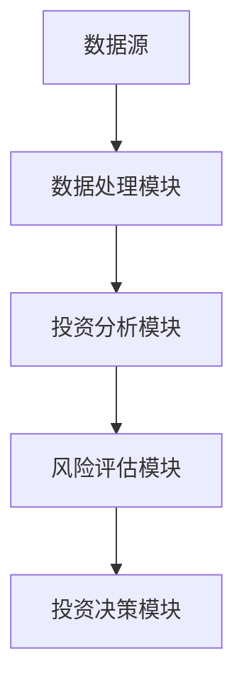

                 


# 巴菲特的石油行业投资：能源领域的机遇

> **关键词**: 巴菲特, 石油行业, 能源, 投资策略, 风险管理, 石油价格, 财务分析

> **摘要**: 本文探讨了巴菲特在石油行业的投资策略，分析了能源领域的机遇与挑战，结合价值投资理念和数学模型，详细解读了巴菲特的投资逻辑，并通过实战案例和系统设计，为投资者提供了深入的指导和启示。

---

## 第1章: 巴菲特的投资理念与石油行业的结合

### 1.1 巴菲特的投资理念

#### 1.1.1 价值投资的定义
价值投资是一种以低于内在价值的价格买入优质资产的投资策略。巴菲特是这一理念的代表人物，他强调寻找那些具有持续竞争优势、良好管理团队和合理估值的企业。

#### 1.1.2 巴菲特的价值投资策略
- **长期投资**: 巴菲特主张长期持有优质资产，避免频繁交易。
- **安全边际**: 以低于内在价值的价格买入，确保投资的安全性。
- **企业基本面分析**: 重点关注企业的盈利能力、财务状况和行业地位。

#### 1.1.3 石油行业与价值投资的结合
石油行业作为全球能源的重要组成部分，具有较高的进入壁垒和稳定的现金流。巴菲特通过价值投资理念，选择那些具有强大竞争优势的石油企业进行投资。

### 1.2 石油行业的现状与挑战

#### 1.2.1 石油行业的基本特点
- **全球需求稳定**: 石油作为能源和化工原料，需求量巨大且稳定。
- **价格波动性高**: 受地缘政治、供需关系和市场情绪影响，石油价格波动剧烈。
- **行业集中度高**: 几家大型跨国公司主导全球石油市场。

#### 1.2.2 当前石油市场的波动与风险
- **地缘政治风险**: 中东地区局势不稳定，影响石油供应。
- **技术进步**: 新能源技术的发展可能对传统石油行业造成冲击。
- **政策风险**: 碳中和目标下的政策变化对石油行业的影响。

#### 1.2.3 石油行业与全球经济的关系
石油是全球经济的血液，其价格波动直接影响全球经济运行。巴菲特选择投资石油行业，正是看中其作为全球经济支柱的稳定性。

---

## 第2章: 石油行业的核心概念与分析框架

### 2.1 石油行业的核心概念

#### 2.1.1 石油行业的定义与分类
石油行业包括上游（勘探和开采）、中游（炼油和运输）和下游（销售和分销）三个主要环节。

#### 2.1.2 石油产业链的构成
- **上游**: 石油勘探和开采。
- **中游**: 石油炼制、运输和储存。
- **下游**: 石油产品的销售和分销。

#### 2.1.3 石油行业的关键指标
- **储量**: 石油企业的储量决定了其未来的生产能力。
- **产量**: 企业的实际产量和增长潜力。
- **成本**: 石油开采和炼制的成本。
- **价格**: 石油产品的市场价格。

### 2.2 巴菲特的投资分析框架

#### 2.2.1 价值投资的核心要素
- **内在价值**: 企业的未来现金流的现值。
- **安全边际**: 购买价格低于内在价值。
- **竞争优势**: 企业的护城河，如品牌、技术、资源等。

#### 2.2.2 石油行业的财务指标分析
- **市盈率（P/E）**: 企业股价与每股收益的比率。
- **市净率（P/B）**: 企业股价与每股净资产的比率。
- **股息率**: 每股股息与股价的比率。

#### 2.2.3 企业竞争优势的评估
- **资源储备**: 企业的储量和地理位置。
- **技术优势**: 石油开采和炼制的技术水平。
- **财务状况**: 企业的负债率和现金流。

---

## 第3章: 巴菲特投资策略的数学模型与公式

### 3.1 价值投资的核心公式

#### 3.1.1 内在价值的计算公式
$$\text{内在价值} = \sum_{t=1}^{n} \frac{CF_t}{(1 + r)^t}$$
其中，$CF_t$ 是第 $t$ 年的现金流，$r$ 是折现率。

#### 3.1.2 市盈率与市净率的比较
- 市盈率（P/E）= 股价 / 每股收益
- 市净率（P/B）= 股价 / 每股净资产

#### 3.1.3 投资组合的优化模型
$$\text{收益最大化} = \sum_{i=1}^{n} w_i r_i$$
$$\text{风险最小化} = \sum_{i=1}^{n} w_i^2 \sigma_i^2$$
其中，$w_i$ 是第 $i$ 只股票的权重，$r_i$ 是预期收益，$\sigma_i$ 是收益的标准差。

### 3.2 石油行业投资的数学模型

#### 3.2.1 石油价格波动的预测模型
$$\text{价格预测} = \alpha + \beta \times \text{历史价格} + \epsilon$$
其中，$\alpha$ 是截距，$\beta$ 是回归系数，$\epsilon$ 是误差项。

#### 3.2.2 企业盈利能力的评估公式
$$\text{净利润率} = \frac{\text{净利润}}{\text{营业收入}} \times 100\%$$

#### 3.2.3 投资风险的量化分析
$$\text{风险值} = \sigma \times \text{投资金额}$$

---

## 第4章: 石油行业投资的系统分析与架构设计

### 4.1 石油投资系统的整体架构

#### 4.1.1 系统功能模块划分
- 数据收集与处理模块
- 投资分析模块
- 风险评估模块
- 投资决策模块

#### 4.1.2 系统数据流图


#### 4.1.3 系统架构的层次化设计
- 数据层：数据的存储和管理。
- 业务逻辑层：投资分析和风险评估。
- 用户界面层：投资决策的展示和操作。

### 4.2 石油投资系统的详细设计

#### 4.2.1 数据收集与处理模块
- 数据源包括历史价格、财务数据和行业报告。
- 使用Python的pandas库进行数据清洗和预处理。

#### 4.2.2 投资分析模块
- 使用回归分析预测石油价格。
- 使用财务指标评估企业的盈利能力。

#### 4.2.3 风险评估模块
- 计算投资组合的风险值（VaR）。
- 使用蒙特卡洛模拟评估价格波动风险。

---

## 第5章: 巴菲特石油投资的项目实战

### 5.1 项目环境与工具安装

#### 5.1.1 投资分析工具的选择
- Python：用于数据分析和建模。
- Pandas：用于数据处理。
- Matplotlib：用于数据可视化。

#### 5.1.2 数据源的获取与处理
- 数据源包括历史石油价格、企业财务数据等。
- 使用网络爬虫获取实时数据。

#### 5.1.3 分析模型的搭建
- 使用回归模型预测石油价格。
- 使用财务指标评估企业价值。

### 5.2 核心投资模型的实现

#### 5.2.1 价值评估模型的代码实现
```python
import pandas as pd
import numpy as np

# 示例数据
data = {'价格': [100, 90, 80, 70, 60], '收益': [10, 9, 8, 7, 6]}
df = pd.DataFrame(data)

# 计算内在价值
def calculate_intrinsic_value(df):
    # 假设使用简单模型计算
    return df['收益'].mean()

iv = calculate_intrinsic_value(df)
print(f"内在价值: {iv}")
```

#### 5.2.2 投资组合优化的算法实现
```python
import numpy as np

def portfolio_optimization(returns, weights):
    # 计算收益
    portfolio_return = np.sum(returns * weights)
    # 计算风险
    portfolio_risk = np.sqrt(np.dot(weights.T, np.dot(returns.cov(), weights)))
    return portfolio_return, portfolio_risk

returns = np.array([0.1, 0.2, 0.15])
weights = np.array([0.3, 0.5, 0.2])

portfolio_return, portfolio_risk = portfolio_optimization(returns, weights)
print(f"预期收益: {portfolio_return}, 风险: {portfolio_risk}")
```

#### 5.2.3 风险评估模块的代码实现
```python
import pandas as pd
import numpy as np

# 示例数据
data = {'价格': [100, 90, 80, 70, 60]}
df = pd.DataFrame(data)

# 计算波动率
def calculate_vola(df):
    returns = df.pct_change().dropna()
    vola = returns.std() * np.sqrt(252)  # 年化波动率
    return vola

vola = calculate_vola(df)
print(f"波动率: {vola}")
```

### 5.3 实际案例分析与解读
以巴菲特投资的石油公司为例，分析其财务状况、竞争优势和市场地位。通过数学模型评估其内在价值和投资风险。

---

## 第6章: 投资策略的最佳实践与注意事项

### 6.1 投资策略的总结与反思

#### 6.1.1 巴菲特策略的成功经验
- 长期投资，避免短期波动。
- 选择具有强大竞争优势的企业。

#### 6.1.2 石油行业投资的风险管理
- 严格评估企业的财务状况。
- 保持投资组合的分散化。

#### 6.1.3 投资策略的持续优化
- 根据市场变化调整投资组合。
- 不断学习新的投资知识和技能。

### 6.2 投资中的注意事项

#### 6.2.1 石油行业的周期性风险
- 石油行业的周期性波动较大，需注意市场周期。

#### 6.2.2 市场波动对投资的影响
- 短期波动可能影响投资决策，需保持冷静。

#### 6.2.3 投资策略的持续优化
- 定期评估投资组合的表现。
- 根据市场变化调整投资策略。

### 6.3 最佳实践 tips

#### 6.3.1 投资前的准备工作
- 了解企业的基本面。
- 分析行业的发展趋势。

#### 6.3.2 投资中的注意事项
- 保持耐心，避免盲目跟风。
- 控制风险，分散投资。

#### 6.3.3 投资后的反思
- 定期评估投资结果。
- 总结经验，优化策略。

---

## 结语

巴菲特的石油行业投资为我们提供了宝贵的经验和启示。通过价值投资理念和数学模型的结合，我们可以更好地分析石油行业的投资机会和风险。希望本文能为投资者提供实用的指导，并帮助他们在能源领域取得成功。

