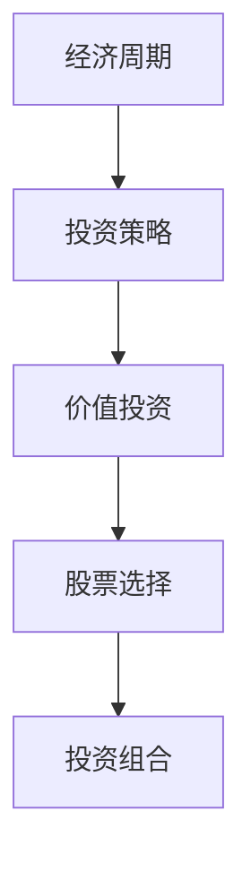
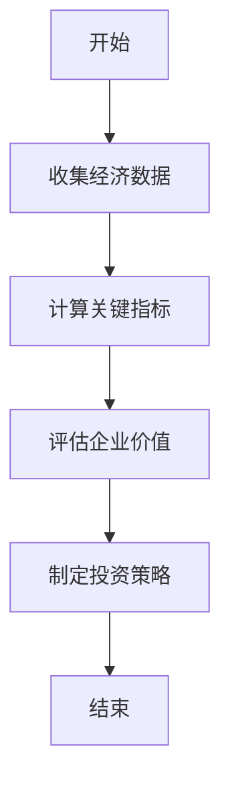

                 


```markdown
# 巴菲特的经济周期投资策略

> 关键词：经济周期，巴菲特，价值投资，投资策略，投资系统，投资算法

> 摘要：本文系统地分析了巴菲特的经济周期投资策略，从经济周期的基本概念到巴菲特的投资哲学，再到具体的策略实施和数学模型，最后通过实际案例和系统架构设计，详细阐述了如何在不同经济周期阶段应用巴菲特的投资策略。文章结合了理论与实践，为读者提供了全面的投资指导。

---

## 第1章 经济周期的定义与特征

### 1.1 经济周期的定义与内涵
经济周期是指经济活动在时间上的波动，通常分为扩张期和收缩期。扩张期包括复苏和繁荣阶段，而收缩期则包括衰退和萧条阶段。理解经济周期的特征和阶段对投资者制定策略至关重要。

### 1.2 巴菲特投资策略的核心理念
巴菲特的投资哲学以价值投资为核心，强调购买低于内在价值的股票，并长期持有。他的策略注重企业的基本面分析，而非市场的短期波动。

### 1.3 经济周期与投资策略的关系
经济周期对投资决策有直接影响。在不同的经济周期阶段，巴菲特的策略有所调整。例如，在牛市中，他倾向于增加进攻性投资；而在熊市中，他则注重防御性投资。

---

## 第2章 巴菲特投资策略的核心概念与联系

### 2.1 核心概念原理
价值投资的核心要素包括内在价值、安全边际和长期视角。巴菲特的策略通过分析企业的盈利能力、财务状况和行业地位，寻找具有长期竞争优势的企业。

### 2.2 核心概念属性特征对比
| 比较维度       | 价值投资             | 其他投资策略           |
|----------------|----------------------|------------------------|
| 投资目标       | 寻找被低估的企业     | 短期收益或趋势交易     |
| 分析方法       | 基本面分析           | 技术分析或市场情绪分析  |
| 风险管理       | 低风险，注重安全边际 | 高风险，追求高收益     |

### 2.3 ER实体关系图架构


---

## 第3章 巴菲特经济周期投资策略的算法原理

### 3.1 算法原理概述
巴菲特的策略基于对企业内在价值的计算。算法包括数据收集、分析、决策步骤，确保在不同经济周期阶段做出合理投资决策。

### 3.2 算法原理的数学模型与公式
经济周期分析的关键指标包括GDP增长率、失业率和通胀率。巴菲特使用的公式：
$$\text{内在价值} = \frac{\text{现金流}}{\text{折现率}}$$
$$\text{市盈率} = \frac{\text{股价}}{\text{每股收益}}$$

### 3.3 算法原理的Mermaid流程图


---

## 第4章 巴菲特经济周期投资策略的系统分析与架构设计

### 4.1 系统分析与架构设计方案
系统功能模块包括数据采集、分析模块和决策模块。架构采用分层设计，确保各模块独立运行。

### 4.2 系统分析与架构设计的详细解读
- 数据采集模块负责收集经济指标和企业数据。
- 分析模块使用数学模型计算内在价值。
- 决策模块根据分析结果制定投资策略。

---

## 项目实战

### 环境安装与核心实现
安装Python和Pandas库，准备经济数据和股票数据。

### 代码实现与解读
```python
import pandas as pd

def calculate_intrinsic_value(enterprise, interest_rate):
    return enterprise.cash_flow / (1 + interest_rate)

# 示例数据
enterprise_data = {
    '现金流': [100, 200, 300],
    '折现率': [0.05, 0.06, 0.07]
}
df = pd.DataFrame(enterprise_data)
```

### 案例分析与详细解读
通过分析2008年金融危机期间的数据，展示巴菲特如何在经济衰退中调整策略，寻找低估企业进行投资。

---

## 最佳实践、小结、注意事项和拓展阅读

### 最佳实践 tips
- 长期投资，避免频繁交易。
- 保持分散投资，降低风险。
- 定期评估投资组合，及时调整。

### 小结
巴菲特的经济周期投资策略通过基本面分析和长期视角，帮助投资者在不同经济周期中做出明智决策。

### 注意事项
- 风险管理是投资成功的关键。
- 避免过度依赖单一指标，结合多种因素进行分析。

### 拓展阅读
- 《巴菲特致股东的信》
- 《价值投资入门》

---

通过本文的详细分析，读者可以全面理解巴菲特的经济周期投资策略，并在实际投资中灵活应用。希望本文能为投资者提供有价值的指导和启示。
```

