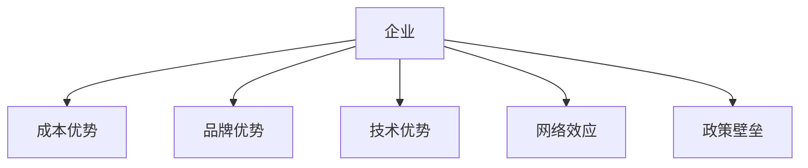
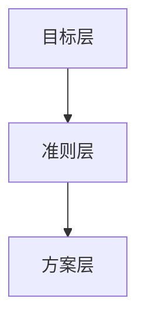
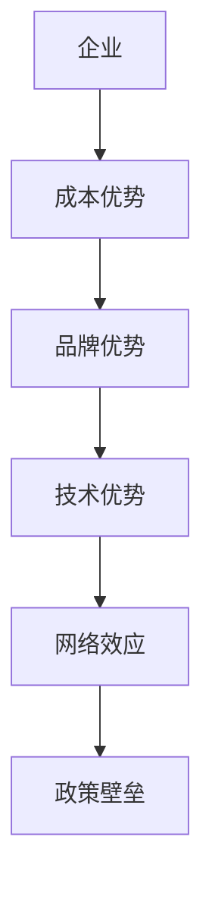
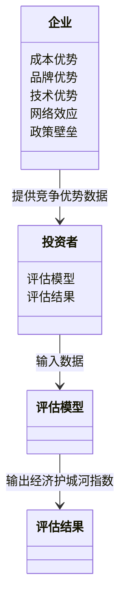
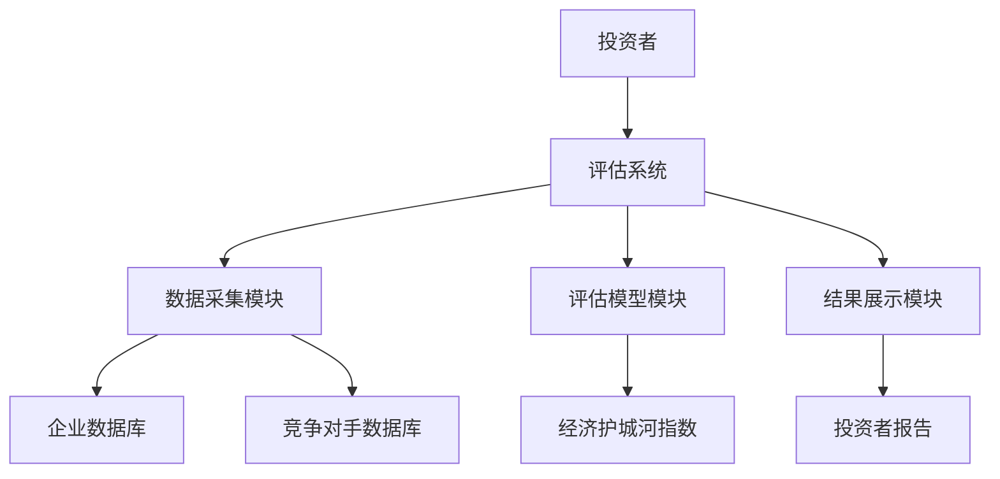
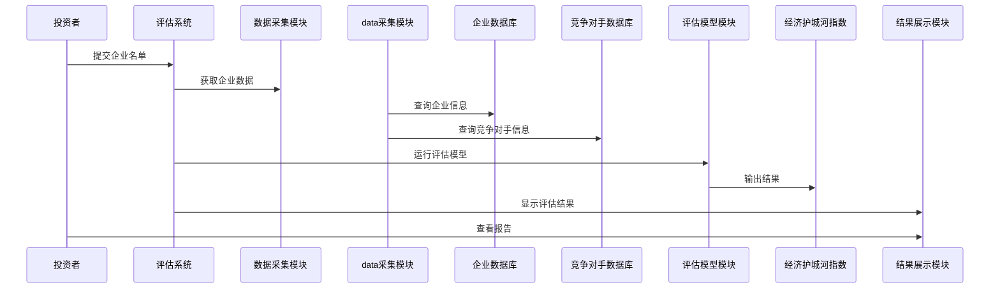

                 


# 巴菲特的经济护城河概念及其识别

> 关键词：巴菲特，经济护城河，竞争优势，投资策略，企业分析

> 摘要：本文深入探讨巴菲特提出的经济护城河概念，分析其核心要素、分类及其识别方法。通过详细讲解经济护城河的背景、识别与评估方法，结合实际案例，帮助读者掌握如何在投资决策中识别和评估企业的经济护城河，从而做出更明智的投资选择。

---

# 第一部分：经济护城河的概念基础

## 第1章：经济护城河的起源与基本概念

### 1.1 经济护城河的起源

#### 1.1.1 巴菲特投资理念的形成
巴菲特的投资理念植根于价值投资，他强调企业内在价值的重要性。经济护城河作为价值投资的核心概念之一，最早出现在他的投资实践中，用于评估企业的长期竞争优势。

#### 1.1.2 经济护城河概念的提出
在1999年的《巴菲特致股东的信》中，巴菲特首次系统地提出了“经济护城河”的概念，将其定义为企业竞争优势的持久性。他认为，拥有强大经济护城河的企业能够在长期竞争中立于不败之地。

#### 1.1.3 经济护城河的核心思想
经济护城河的核心思想是，企业通过构建可持续的竞争优势，能够在市场中抵御竞争对手的侵蚀，从而为股东创造持续的价值。这种优势可以是成本优势、品牌影响力、技术壁垒或网络效应等。

### 1.2 经济护城河的定义与特征

#### 1.2.1 经济护城河的定义
经济护城河是指企业在市场中由于某种独特优势而形成的难以被竞争对手复制或超越的壁垒。这种壁垒可以是资源、技术、品牌、网络效应或政策支持等。

#### 1.2.2 经济护城河的核心特征
- **可持续性**：能够长期存在的竞争优势。
- **防御性**：能够有效抵御竞争对手的进攻。
- **经济性**：能够为企业创造持续的经济价值。

#### 1.2.3 经济护城河与企业竞争优势的关系
经济护城河是企业竞争优势的外在表现，是企业在市场中占据优势地位的核心因素。竞争优势越强，经济护城河越坚固。

### 1.3 经济护城河的重要性

#### 1.3.1 经济护城河对企业长期价值的影响
强大的经济护城河能够确保企业在长期内保持较高的利润率和市场地位，从而为股东创造持续的回报。

#### 1.3.2 经济护城河对投资者决策的意义
对于投资者来说，识别和评估企业的经济护城河是做出明智投资决策的关键。拥有强大经济护城河的企业更具投资价值。

#### 1.3.3 经济护城河在经济周期中的表现
在经济繁荣时期，经济护城河能够帮助企业扩大市场份额；在经济衰退时期，它能够帮助企业抵御外部冲击，保持竞争优势。

### 1.4 经济护城河的分析框架

#### 1.4.1 经济护城河的分析维度
- **行业分析**：分析企业的行业地位和竞争环境。
- **竞争优势分析**：识别企业的核心竞争优势。
- **财务数据分析**：通过财务数据评估企业的盈利能力和发展潜力。

#### 1.4.2 经济护城河的评估指标
- 市场占有率
- 净利润率
- 研发投入占比
- 品牌价值
- 网络效应

#### 1.4.3 经济护城河的动态变化
经济护城河并非一成不变，企业需要不断创新和调整，以应对市场环境的变化，保持竞争优势。

### 1.5 本章小结
本章从巴菲特的投资理念出发，详细介绍了经济护城河的定义、核心思想和重要性，并提出了经济护城河的分析框架，为后续章节的深入分析奠定了基础。

---

## 第2章：经济护城河的核心要素与分类

### 2.1 经济护城河的核心要素

#### 2.1.1 成本优势
成本优势是指企业在生产或运营过程中，由于规模效应、流程优化或资源禀赋等原因，能够以更低的成本提供产品或服务。

#### 2.1.2 品牌优势
品牌优势是指企业通过长期的品牌建设，赢得了消费者的信任和忠诚，从而在市场竞争中占据优势。

#### 2.1.3 技术优势
技术优势是指企业在技术研发和创新方面具有领先地位，能够通过技术壁垒阻止竞争对手的模仿。

#### 2.1.4 网络效应
网络效应是指随着用户数量的增加，产品或服务的价值也随之增加，从而形成自我强化的正反馈循环。

#### 2.1.5 政策壁垒
政策壁垒是指由于政府政策的保护或支持，企业在特定行业或市场中享有竞争优势。

### 2.2 经济护城河的分类

#### 2.2.1 可持续竞争优势的分类
- **成本优势**：如制造业中的规模经济。
- **品牌优势**：如高端消费品的品牌影响力。
- **技术优势**：如高科技企业的专利和技术储备。

#### 2.2.2 不可持续竞争优势的分类
- **市场垄断**：如某些行业的自然垄断。
- **短期政策支持**：如政府在特定时期的补贴或税收优惠。

#### 2.2.3 综合竞争优势的分类
- **综合成本和技术优势**：如高端制造业。
- **品牌和技术双优势**：如高科技品牌企业。

### 2.3 经济护城河的属性特征对比

#### 2.3.1 成本优势 vs 品牌优势
- **成本优势**：注重效率和价格竞争力。
- **品牌优势**：注重形象和消费者信任。

#### 2.3.2 技术优势 vs 网络效应
- **技术优势**：依赖技术创新和专利保护。
- **网络效应**：依赖用户数量和互动频率。

#### 2.3.3 政策壁垒 vs 综合竞争优势
- **政策壁垒**：依赖政府政策保护，可能不稳定。
- **综合竞争优势**：依靠多方面的优势，更加稳固。

### 2.4 经济护城河的ER实体关系图


### 2.5 本章小结
本章详细分析了经济护城河的核心要素，并通过对比和ER图展示了它们之间的关系，为后续的识别与评估提供了理论基础。

---

## 第3章：经济护城河的识别与评估方法

### 3.1 经济护城河的识别方法

#### 3.1.1 宏观视角的识别方法
- **行业分析**：研究行业趋势和竞争格局。
- **政策分析**：关注政府政策对企业的影响。

#### 3.1.2 微观视角的识别方法
- **企业分析**：研究企业的财务数据、竞争优势和市场地位。
- **竞争对手分析**：分析竞争对手的优劣势，识别企业的相对优势。

#### 3.1.3 行业分析法
通过分析行业的市场集中度、进入壁垒和竞争结构，识别企业的经济护城河。

#### 3.1.4 财务数据分析法
通过分析企业的财务报表，识别企业的盈利能力、成本控制和资产质量等指标。

### 3.2 经济护城河的评估模型

#### 3.2.1 层次分析法（AHP）
层次分析法是一种常用的决策分析方法，适用于多因素决策问题。



#### 3.2.2 经济护城河指数模型
通过对企业各项竞争优势的量化评估，构建经济护城河指数，用于衡量企业的综合竞争优势。



### 3.3 经济护城河的评估流程

#### 3.3.1 确定评估目标
明确评估的目的和范围，选择合适的评估方法。

#### 3.3.2 收集相关数据
收集企业的财务数据、市场数据和竞争数据，为评估提供依据。

#### 3.3.3 构建评估模型
根据评估目标，选择合适的评估模型，并进行参数设置。

#### 3.3.4 进行评估和分析
通过模型计算出企业的经济护城河指数，分析其优势和劣势。

#### 3.3.5 提出改进建议
根据评估结果，提出针对性的改进建议，帮助企业增强经济护城河。

### 3.4 经济护城河的Python代码实现

#### 3.4.1 代码示例
```python
import pandas as pd

def calculate_economic_moat(enterprise_data):
    # 竞争优势评分（1-10分）
    cost_advantage = enterprise_data['cost_advantage']
    brand_advantage = enterprise_data['brand_advantage']
    technology_advantage = enterprise_data['technology_advantage']
    network_effect = enterprise_data['network_effect']
    policy_barricade = enterprise_data['policy_barricade']

    # 经济护城河指数计算
    economic_moat_index = (cost_advantage + brand_advantage + 
                            technology_advantage + network_effect + 
                            policy_barricade) / 5

    return economic_moat_index

# 示例数据
data = {
    'cost_advantage': 8,
    'brand_advantage': 7,
    'technology_advantage': 9,
    'network_effect': 6,
    'policy_barricade': 5
}

# 计算经济护城河指数
economic_moat_index = calculate_economic_moat(data)
print(f"经济护城河指数：{economic_moat_index}")
```

#### 3.4.2 代码解读
上述代码示例展示了如何通过Python程序计算企业的经济护城河指数。程序首先定义了一个计算函数，然后通过输入企业的各项竞争优势评分，计算出经济护城河指数，帮助投资者和企业管理者直观了解企业的竞争优势。

### 3.5 经济护城河的实际案例分析

#### 3.5.1 亚马逊的经济护城河分析
亚马逊凭借其强大的网络效应、成本优势和技术创新，构建了坚固的经济护城河，使其在电子商务领域占据领先地位。

#### 3.5.2 苹果公司的经济护城河分析
苹果公司依靠其品牌优势、技术优势和生态系统建设，形成了强大的经济护城河，确保了其在科技行业的领先地位。

### 3.6 本章小结
本章通过介绍经济护城河的识别方法和评估模型，结合实际案例分析，展示了如何在投资决策中识别和评估企业的经济护城河，为投资者和企业管理者提供了实用的工具和方法。

---

## 第4章：经济护城河的系统分析与架构设计

### 4.1 系统分析

#### 4.1.1 问题场景介绍
在投资决策中，如何系统地识别和评估企业的经济护城河是一个复杂的系统工程，需要综合考虑多方面的因素。

#### 4.1.2 项目介绍
以某高科技企业为例，分析其经济护城河的构建和表现。

### 4.2 系统功能设计

#### 4.2.1 领域模型设计


#### 4.2.2 系统架构设计


#### 4.2.3 系统接口设计
- 数据接口：与企业数据库和竞争对手数据库的接口。
- 用户接口：投资者与评估系统的交互界面。

#### 4.2.4 系统交互设计


### 4.3 系统实现与代码

#### 4.3.1 环境安装
需要安装Python、Pandas、Mermaid等工具。

#### 4.3.2 核心实现代码
```python
import pandas as pd

def calculate_economic_moat(enterprise_data):
    cost_advantage = enterprise_data['cost_advantage']
    brand_advantage = enterprise_data['brand_advantage']
    technology_advantage = enterprise_data['technology_advantage']
    network_effect = enterprise_data['network_effect']
    policy_barricade = enterprise_data['policy_barricade']

    economic_moat_index = (cost_advantage + brand_advantage + 
                            technology_advantage + network_effect + 
                            policy_barricade) / 5

    return economic_moat_index

# 示例数据
data = pd.DataFrame({
    '企业': ['企业A', '企业B', '企业C'],
    'cost_advantage': [8, 6, 7],
    'brand_advantage': [7, 5, 6],
    'technology_advantage': [9, 8, 8],
    'network_effect': [6, 4, 5],
    'policy_barricade': [5, 7, 4]
})

# 计算经济护城河指数
data['economic_moat_index'] = data.apply(lambda x: calculate_economic_moat(x.to_dict()), axis=1)

print(data)
```

### 4.4 本章小结
本章通过系统分析和架构设计，展示了如何通过技术手段实现经济护城河的识别和评估，为投资者和企业管理者提供了技术支持。

---

## 第5章：经济护城河识别的最佳实践与注意事项

### 5.1 最佳实践

#### 5.1.1 理解企业的商业模式
在识别经济护城河时，首先要理解企业的商业模式和盈利模式。

#### 5.1.2 关注企业的财务数据
通过分析企业的财务数据，识别其成本优势和盈利能力。

#### 5.1.3 评估企业的竞争优势
从成本、品牌、技术、网络效应和政策壁垒等多个维度，全面评估企业的竞争优势。

#### 5.1.4 考虑经济环境的变化
经济环境的变化可能影响企业的经济护城河，需要持续关注和调整。

### 5.2 注意事项

#### 5.2.1 避免过度简化
经济护城河的识别是一个复杂的过程，不能简单化处理。

#### 5.2.2 防止片面性
在识别经济护城河时，要全面考虑各种因素，避免片面性。

#### 5.2.3 保持动态评估
经济护城河是一个动态变化的过程，需要持续评估和调整。

### 5.3 拓展阅读

#### 5.3.1 巴菲特的其他投资理念
进一步阅读巴菲特的其他投资理念，如安全边际、价值投资等。

#### 5.3.2 经济护城河的最新研究
了解经济护城河的最新研究和应用，保持知识的更新。

### 5.4 本章小结
本章总结了经济护城河识别的最佳实践和注意事项，并提供了拓展阅读的方向，帮助读者进一步深入学习和应用。

---

## 第6章：经济护城河识别的总结与展望

### 6.1 本章总结
本文从巴菲特的经济护城河概念出发，详细分析了其核心要素、分类及其识别方法，并通过实际案例和系统设计展示了如何在投资决策中应用这些方法。

### 6.2 未来展望
随着经济环境的变化和技术的进步，经济护城河的概念和识别方法也将不断发展和创新。未来的研究可以进一步探索经济护城河的动态变化和全球化背景下的竞争优势。

### 6.3 结语
经济护城河是企业长期竞争优势的核心，也是投资者决策的重要依据。通过系统地识别和评估经济护城河，投资者可以更好地把握投资机会，实现长期价值增长。

---

# 附录：经济护城河识别的Python代码库

## 附录A：代码库介绍

### 附录B：代码实现细节

## 附录C：经济护城河指数计算公式
$$ \text{经济护城河指数} = \frac{\text{成本优势} + \text{品牌优势} + \text{技术优势} + \text{网络效应} + \text{政策壁垒}}{5} $$

---

通过本文的系统分析和详细讲解，读者可以全面理解巴菲特的经济护城河概念，并掌握其识别方法，为投资决策提供有力支持。

