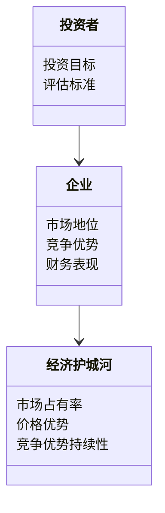
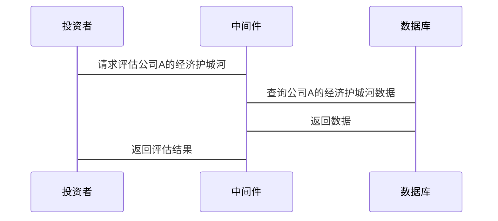

                 


# 巴菲特的经济护城河概念详解

> 关键词：巴菲特，经济护城河，投资策略，竞争优势，企业价值

> 摘要：本文深入解析巴菲特提出的“经济护城河”概念，分析其在投资决策中的应用和重要性，探讨不同类型经济护城河的特点及其对企业发展和投资策略的影响。

---

## 第一章 巴菲特投资理念概述

### 1.1 巴菲特的投资哲学

#### 1.1.1 价值投资的定义与核心思想
价值投资是一种以基本面分析为基础的投资策略，强调以低于内在价值的价格购买优质资产。巴菲特是这一理念的代表人物，他主张长期持有优质股票，关注企业的内在价值而非市场波动。

#### 1.1.2 巴菲特的投资策略与成功案例
巴菲特的投资策略主要包括寻找具有持续竞争优势的企业，关注企业的财务健康状况和管理层质量。他的成功案例包括可口可乐、吉列和富国银行等，这些企业具有强大的市场地位和盈利能力。

#### 1.1.3 经济护城河在巴菲特投资中的重要性
经济护城河是巴菲特判断企业竞争优势的关键指标。他认为，拥有宽宽的经济护城河的企业能够在长期内抵御竞争对手，保持持续的盈利能力，从而为股东创造长期价值。

### 1.2 经济护城河的定义与分类

#### 1.2.1 经济护城河的核心概念
经济护城河是指企业在市场中相对于竞争对手的持续竞争优势。这种优势可以是成本优势、网络效应、品牌优势或技术壁垒，能够保护企业免受竞争对手的侵蚀。

#### 1.2.2 经济护城河的四种类型
| 类型               | 描述                                         | 示例企业                     |
|--------------------|----------------------------------------------|------------------------------|
| 成本优势           | 企业能够以更低的成本提供产品或服务         | 沃尔玛、亚马逊             |
| 网络效应           | 用户数量的增加会增强产品的价值               | 微软Windows、Facebook       |
| 品牌优势           | 强大的品牌认知度和忠诚度                     | 可口可乐、苹果             |
| 技术壁垒           | 拥有独特的技术或专利，难以被竞争对手复制   | 英特尔、强生               |

#### 1.2.3 经济护城河的边界与外延
经济护城河的边界是指企业竞争优势的范围，外延则是指随着市场变化而扩展的竞争优势领域。企业需要不断巩固和扩展其经济护城河，以应对市场的变化和竞争对手的挑战。

### 1.3 经济护城河的核心要素

#### 1.3.1 企业的竞争优势分析
竞争优势是企业能够在市场中胜出的关键因素。包括成本控制、技术创新、市场进入壁垒等。

#### 1.3.2 市场地位与定价能力
市场地位高、定价能力强的企业通常具有较强的经济护城河。例如，苹果通过其品牌和技术壁垒，能够在市场上以较高价格销售产品。

#### 1.3.3 财务表现与持续盈利能力
企业的财务健康状况和持续盈利能力是经济护城河的重要组成部分。健康的财务状况能够支持企业在市场波动中维持运营，并进行必要的投资。

---

## 第二章 经济护城河的理论基础

### 2.1 经济护城河的理论模型

#### 2.1.1 经济护城河的概念属性对比表
| 属性         | 描述                                         |
|--------------|----------------------------------------------|
| 宽度         | 竞争优势的强弱                               |
| 深度         | 竞争优势的持久性                             |
| 类型         | 成本优势、网络效应、品牌优势、技术壁垒       |
| 可扩展性     | 竞争优势能否扩展到其他市场或产品             |

#### 2.1.2 经济护城河的ER实体关系图

```mermaid
er
  actor 投资者
  actor 竞争对手
  actor 消费者
  actor 企业
  entity 经济护城河
  entity 市场地位
  entity 竞争优势
  entity 财务表现
  relation 评估 (投资者 --> 经济护城河)
  relation 影响 (经济护城河 --> 市场地位)
  relation 影响 (经济护城河 --> 竞争优势)
  relation 影响 (经济护城河 --> 财务表现)
```

### 2.2 经济护城河的类型分析

#### 2.2.1 成本优势型护城河
成本优势型护城河是指企业能够以低于竞争对手的成本提供相似的产品或服务。例如，沃尔玛通过高效的供应链管理和规模经济，降低了运营成本，形成了成本优势。

#### 2.2.2 网络效应型护城河
网络效应型护城河是指用户数量的增加会增强产品的价值。例如，微软的Windows操作系统通过广泛的用户基础，形成了强大的网络效应，竞争对手难以轻易替代。

#### 2.2.3 品牌优势型护城河
品牌优势型护城河是指企业通过强大的品牌认知度和忠诚度，吸引并留住客户。例如，苹果通过其品牌和技术创新，形成了强大的品牌优势。

#### 2.2.4 技术壁垒型护城河
技术壁垒型护城河是指企业通过独特的技术或专利，形成难以被竞争对手复制的竞争优势。例如，强生公司通过其在医疗技术领域的专利，形成了强大的技术壁垒。

---

## 第三章 经济护城河的数学模型与算法原理

### 3.1 经济护城河的评估指标

#### 3.1.1 市场占有率（Market Share）的计算公式
市场占有率是指企业在某个市场中的销售额占整个市场的比例。计算公式为：
$$ \text{市场占有率} = \frac{\text{企业销售额}}{\text{市场总销售额}} $$

#### 3.1.2 价格优势（Price Advantage）的衡量方法
价格优势可以通过比较企业的平均售价与行业平均售价来衡量。公式为：
$$ \text{价格优势} = \frac{\text{企业平均售价}}{\text{行业平均售价}} $$

#### 3.1.3 竞争优势的持续性分析模型
竞争优势的持续性可以通过对企业未来盈利能力和市场地位的预测来评估。公式为：
$$ \text{竞争优势持续性} = \frac{\text{未来5年平均净利润增长率}}{\text{行业平均净利润增长率}} $$

### 3.2 经济护城河的算法实现

#### 3.2.1 使用Python计算市场占有率

```python
import pandas as pd

# 假设我们有如下数据
data = {
    '企业': ['公司A', '公司B', '公司C'],
    '销售额': [100, 150, 90],
    '市场总销售额': [400, 450, 360]
}

df = pd.DataFrame(data)

# 计算市场占有率
df['市场占有率'] = df['销售额'] / df['市场总销售额']

print(df)
```

#### 3.2.2 绘制市场占有率的柱状图

```python
import matplotlib.pyplot as plt

# 数据
companies = ['公司A', '公司B', '公司C']
market_share = [0.25, 0.33, 0.25]

# 绘制柱状图
plt.figure(figsize=(10, 6))
plt.bar(companies, market_share)
plt.title('市场占有率')
plt.ylabel('占有率')
plt.show()
```

---

## 第四章 系统分析与架构设计方案

### 4.1 问题场景介绍
在投资决策中，评估企业的经济护城河需要考虑企业的市场地位、竞争优势、财务表现等多个因素。为了系统化地分析这些因素，我们可以设计一个基于经济护城河的评估系统。

### 4.2 系统功能设计

#### 4.2.1 领域模型类图



#### 4.2.2 系统架构设计


### 4.3 系统接口设计

#### 4.3.1 HTTP接口设计
```http
GET /api/economic-moat
Headers: { "Content-Type": "application/json" }
Body: {
    "company": "公司A"
}
```

#### 4.3.2 返回数据结构
```json
{
    "市场占有率": 0.25,
    "价格优势": 1.2,
    "竞争优势持续性": 0.8
}
```

### 4.4 系统交互序列图



---

## 第五章 项目实战

### 5.1 环境安装
为了运行本项目，需要安装以下工具：
- Python 3.8+
- Pandas、Matplotlib、Mermaid等库

### 5.2 核心实现源代码

#### 5.2.1 计算市场占有率

```python
import pandas as pd

# 数据
data = {
    '公司': ['公司A', '公司B', '公司C'],
    '销售额': [100, 150, 90],
    '市场总销售额': [400, 450, 360]
}

df = pd.DataFrame(data)

# 计算市场占有率
df['市场占有率'] = df['销售额'] / df['市场总销售额']

print(df)
```

#### 5.2.2 绘制市场占有率柱状图

```python
import matplotlib.pyplot as plt

# 数据
companies = ['公司A', '公司B', '公司C']
market_share = [0.25, 0.33, 0.25]

# 绘制柱状图
plt.figure(figsize=(10, 6))
plt.bar(companies, market_share)
plt.title('市场占有率')
plt.ylabel('占有率')
plt.show()
```

### 5.3 实际案例分析

#### 5.3.1 苹果公司的经济护城河分析
苹果公司拥有强大的品牌优势和技术壁垒，其产品生态系统具有高度的网络效应，形成了宽宽的经济护城河。

#### 5.3.2 亚马逊的经济护城河分析
亚马逊通过成本优势和网络效应，建立了强大的经济护城河，成为电子商务领域的领导者。

---

## 第六章 总结与展望

### 6.1 本章小结
经济护城河是巴菲特投资理念中的核心概念，能够帮助投资者识别具有持续竞争优势的企业，从而做出更明智的投资决策。

### 6.2 投资建议与注意事项
- 选择具有宽宽的经济护城河的企业进行投资。
- 定期评估企业的经济护城河，确保其持续性。
- 结合企业的财务表现和市场地位，全面分析其投资价值。

### 6.3 拓展阅读
- 巴菲特的其他投资理念，如安全边际、价值陷阱等。
- 其他投资者对企业护城河的分析和应用。

---

通过本文的详细分析，读者可以深入了解巴菲特的经济护城河概念，并能够将其应用于实际投资决策中，从而提高投资的成功率。

