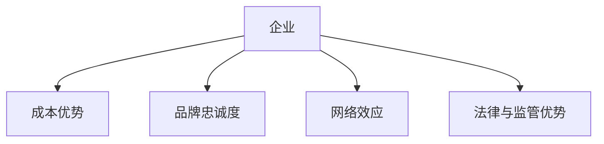
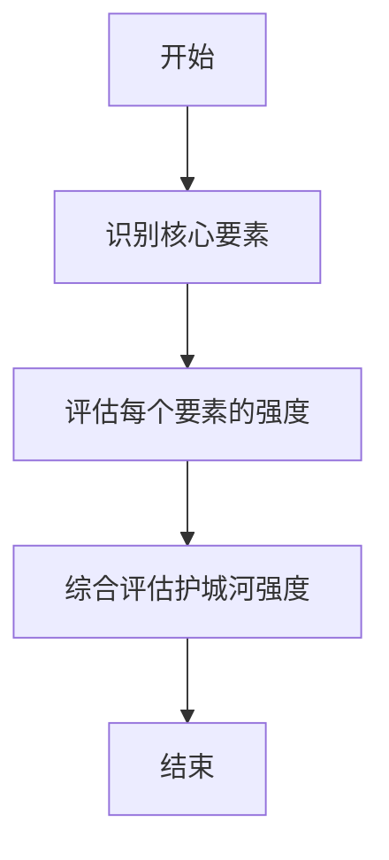
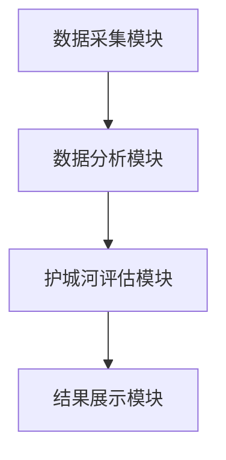
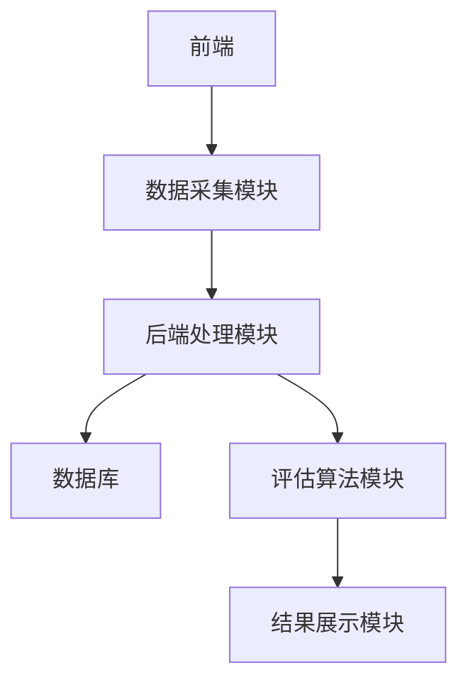
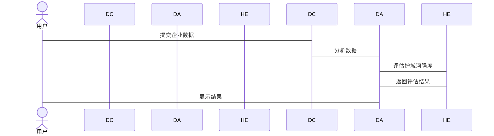

                 


# 巴菲特的经济护城河概念：寻找持久竞争优势

---

## 关键词：经济护城河，持久竞争优势，巴菲特投资理念，企业核心竞争力，竞争优势分析

---

## 摘要：  
巴菲特的经济护城河概念是投资学中的经典理论，强调企业通过构建持久的竞争优势来确保长期成功。本文从技术视角出发，详细分析经济护城河的核心要素、评估方法、系统架构设计以及实际案例，帮助读者理解如何在商业和技术领域中应用这一概念。通过一步步的分析和推理，本文将深入探讨如何识别和构建企业的持久竞争优势。

---

## 第一部分：经济护城河的背景与核心概念

### 第1章：经济护城河的起源与定义

#### 1.1 巴菲特投资理念的形成  
巴菲特的投资理念源于对价值投资的深刻理解，他强调企业必须具备持久的竞争优势，这些优势能够抵御竞争对手的侵蚀，并为公司创造超额利润。  

#### 1.2 经济护城河的定义  
经济护城河是指企业在市场上形成的竞争优势，这些优势难以被竞争对手复制，从而为企业提供长期的保护。  

#### 1.3 经济护城河的核心要素  
经济护城河的核心要素包括：  
1. **成本优势**：企业通过规模经济或独特的生产方式降低成本，使竞争对手难以模仿。  
2. **品牌忠诚度**：强大的品牌影响力能够吸引并留住客户，形成客户粘性。  
3. **网络效应**：产品或服务的使用价值随着用户数量的增加而增强，形成正反馈循环。  
4. **法律与监管优势**：通过专利、许可证或其他法律手段，构建行业壁垒。  

#### 1.4 护城河与竞争优势的关系  
竞争优势是企业短期的市场地位，而经济护城河则是竞争优势的长期保障。护城河使企业能够在竞争中持续保持优势，从而实现长期价值增长。  

---

### 第2章：经济护城河的核心概念与联系

#### 2.1 经济护城河的原理  
经济护城河的形成依赖于企业的独特资源、能力和市场定位。这些要素共同作用，形成企业的市场壁垒，防止竞争对手的侵蚀。  

#### 2.2 核心要素对比分析  
以下是经济护城河核心要素的对比表格：

| 要素                | 描述                                                                 |
|---------------------|----------------------------------------------------------------------|
| 成本优势            | 企业通过规模经济或技术优势降低成本，形成价格竞争力。                   |
| 品牌忠诚度          | 强大的品牌影响力使客户更倾向于选择该品牌，形成客户粘性。               |
| 网络效应            | 用户数量增加时，产品或服务的价值也随之增加，形成正反馈循环。           |
| 法律与监管优势      | 通过专利、许可证等法律手段，构建行业壁垒，防止竞争对手进入。           |

#### 2.3 实体关系图  
以下是经济护城河核心要素的实体关系图：



---

## 第二部分：经济护城河的评估与算法

### 第3章：经济护城河的评估方法

#### 3.1 评估模型概述  
经济护城河的评估模型主要关注以下几个方面：  
1. 护城河的宽度：企业竞争优势的广度。  
2. 护城河的深度：竞争优势的强度。  
3. 护城河的可持续性：竞争优势的长期性。  

#### 3.2 评估算法流程  
以下是经济护城河评估的流程图：



#### 3.3 代码实现  
以下是一个简单的经济护城河强度评估算法的Python代码示例：

```python
def calculate_huochenghe_intensity(core_elements):
    intensity = 0
    for element in core_elements:
        intensity += element['强度']
    return intensity / len(core_elements)

# 示例：评估一家公司的护城河强度
company_elements = [
    {'成本优势': 80, '品牌忠诚度': 70, '网络效应': 90, '法律优势': 60}
]
huochenghe_intensity = calculate_huochenghe_intensity(company_elements)
print(f"护城河强度：{huochenghe_intensity}%")
```

---

### 第4章：经济护城河的数学模型

#### 4.1 数学模型概述  
经济护城河的强度可以通过以下公式进行量化：

$$ \text{护城河强度} = \frac{\sum (\text{各要素强度})}{\text{要素数量}} $$

其中，各要素强度的取值范围为 0 到 100，表示企业各要素的相对强度。  

#### 4.2 示例计算  
假设某企业的核心要素强度如下：  
- 成本优势：80  
- 品牌忠诚度：70  
- 网络效应：90  
- 法律优势：60  

计算护城河强度：

$$ \text{护城河强度} = \frac{80 + 70 + 90 + 60}{4} = 75\% $$

---

## 第三部分：经济护城河的系统架构与设计

### 第5章：经济护城河的系统分析

#### 5.1 问题场景介绍  
在商业和技术领域，企业需要通过构建经济护城河来确保长期竞争优势。本文将从系统架构的角度，分析如何设计一个经济护城河评估系统。  

#### 5.2 系统功能设计  
以下是经济护城河评估系统的功能模块设计：



#### 5.3 系统架构设计  
以下是经济护城河评估系统的架构图：



#### 5.4 系统接口设计  
系统接口设计主要包含以下部分：  
1. 数据输入接口：接收企业核心要素数据。  
2. 数据处理接口：对数据进行清洗和分析。  
3. 结果输出接口：展示评估结果。  

#### 5.5 系统交互设计  
以下是系统交互的序列图：



---

## 第四部分：经济护城河的项目实战

### 第6章：经济护城河的项目实战

#### 6.1 环境安装  
要运行经济护城河评估系统，需要以下环境：  
- Python 3.8 或更高版本  
- 数据库：MySQL 或 PostgreSQL  
- 开发工具：PyCharm 或 VS Code  

#### 6.2 核心实现代码  
以下是护城河评估算法的核心代码：

```python
def calculate_huochenghe_intensity(core_elements):
    intensity = 0
    for element in core_elements:
        intensity += element['强度']
    return intensity / len(core_elements)

# 数据库连接示例
import pymysql

db = pymysql.connect(host='localhost', user='root', password='password', database='huochenghe')
cursor = db.cursor()

# 插入数据
cursor.execute("INSERT INTO company_elements VALUES (%s, %s, %s, %s)", (80, 70, 90, 60))
db.commit()
db.close()
```

#### 6.3 代码应用解读  
上述代码实现了以下功能：  
1. 数据库连接与数据插入：将企业的核心要素数据存储到数据库中。  
2. 护城河强度计算：根据核心要素的强度，计算出企业的护城河强度。  

#### 6.4 实际案例分析  
以亚马逊为例，分析其经济护城河：  
1. 成本优势：亚马逊通过规模经济和全球物流网络降低成本。  
2. 网络效应：亚马逊的平台模式形成了强大的网络效应，用户数量的增加进一步增强了平台价值。  

---

## 第五部分：经济护城河的最佳实践

### 第7章：最佳实践

#### 7.1 小结  
经济护城河是企业长期竞争优势的核心，企业需要通过持续创新和优化，构建强大的市场壁垒。  

#### 7.2 注意事项  
1. 企业需要定期评估护城河的强度，及时调整战略。  
2. 在技术领域，企业应注重技术研发和创新能力的培养。  

#### 7.3 拓展阅读  
建议读者进一步阅读巴菲特的《投资实务》和迈克尔·波特的《竞争优势》一书，深入了解经济护城河的理论与实践。

---

## 总结  
经济护城河是企业长期成功的关键，通过构建持久的竞争优势，企业可以在激烈的市场竞争中立于不败之地。本文从技术视角出发，详细分析了经济护城河的核心要素、评估方法、系统架构设计以及实际案例，为读者提供了全面的指导。

